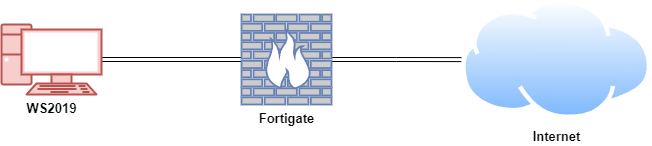
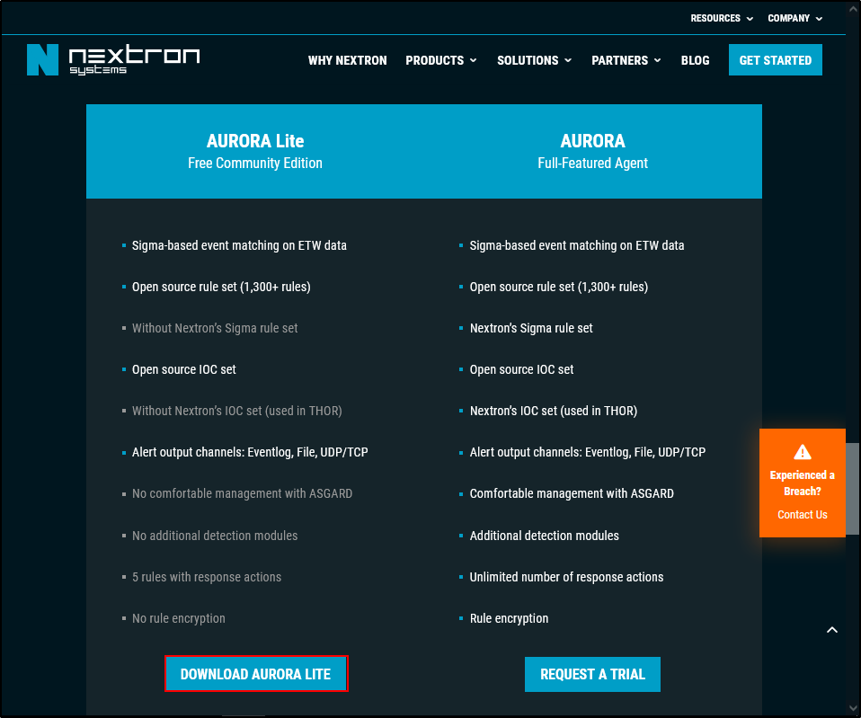

# **Aurora Lite**

Aurora Lite is a free Endpoint Detection and Response (EDR) tool that uses Sigma rules and Indicators of Compromise (IOCs) to detect and respond to threats in real time. It monitors system events through Windows Event Tracing (ETW) and can take automated actions, like suspending harmful processes. Though limited in advanced features, Aurora Lite is a powerful, cost-free solution for basic threat detection and response. Learn more at [Nextron Systems](https://www.nextron-systems.com/aurora).

<iframe width="560" height="315" src="https://www.youtube.com/embed/RWyqJ1ulxOM?si=iMVqr7s8a8ipIKKq" title="YouTube video player" frameborder="0" allow="accelerometer; autoplay; clipboard-write; encrypted-media; gyroscope; picture-in-picture; web-share" referrerpolicy="strict-origin-when-cross-origin" allowfullscreen></iframe>

## **Lab Setup for Proof of Concept**

In this proof of concept, an attack simulation was conducted on a Windows Virtual Machine (VM) using live WannaCry ransomware within a secure and controlled environment. Aurora Lite was installed on the Windows VM to detect and respond to the attack.

**Note: Only use malware samples on systems you own and can restore, such as VMs with snapshots. Never execute malware on unauthorised systems. Always follow strict malware handling protocols and ensure simulations are conducted in secure, isolated environments. Do not attempt such activities without proper training and authorisation to avoid legal consequences and potential system damage.**

| **Host** | **OS** | **Role** | **IP Address** |
| --- | --- | --- | --- |
| Fortigate | Fortios 7.6.0 | Firewall/Router | 192.168.1.111 (WAN) / 10.0.0.1 (LAN) |
| WS2019 | Windows Server 2019 | Aurora Lite | 10.0.0.140 |



## **Download Aurora Lite**

Navigate to [https://www.nextron-systems.com/aurora/](https://www.nextron-systems.com/aurora/) and download Aurora Lite.



Submit your name and email address. It does not have to be your personal email address. 


Check your inbox and confirm you email address.


Download your license and Aurora Lite. Note you will have to temporarily disable Windows defender to download Aurora Lite. 


## **System Requirements**

Aurora is compatible with Windows 7 and later versions, but it requires administrator-level permissions to operate.

It does not support alternative operating systems like Linux or macOS.

### **Supported Platforms**

- Windows 7 (32-bit and 64-bit)
- Windows Server 2008 R2 (64-bit)
- Windows 8.1
- Windows Server 2012
- Windows Server 2012 R2
- Windows 10
- Windows 11
- Windows Server 2016
- Windows Server 2019
- Windows Server 2022

## **Update Servers**

An active internet connection is required to download the latest updates for Aurora and its signatures. The endpoint performing the update must have access to our update servers.

For the most current and comprehensive list of our update and licensing servers, please visit: [https://www.nextron-systems.com/resources/hosts/](https://www.nextron-systems.com/resources/hosts/).

## **Setting an Antivirus / EDR Exclusion**

It is advisable to configure your Antivirus or EDR solution to exclude Aurora. The exclusion paths will depend on your system architecture and whether Aurora was installed or executed interactively from a temporary directory.

For an installed version of Aurora:

```
C:\Program Files\Aurora-Agent\aurora-agent-64.exe
C:\Program Files\Aurora-Agent\aurora-agent.exe
```

For an interactively started Aurora, exclude the directory where it was extracted. For instance:

```
C:\aurora\aurora-agent-64.exe
C:\aurora\aurora-agent.exe
```

## **Running Aurora**

You can run Aurora from your terminal using default values for each flag without requiring a dedicated configuration file:

```yaml
aurora-agent-64.exe  
```

Alternatively, in the directory where Aurora Lite is extracted (e.g. `C:\aurora`), double-click `aurora-agent-64` 


Open PowerShell and run `whoami /groups`

Verify that Aurora generates alert `Sigma match found` with the title `Group Membership Reconnaissance via Whoami.EXE`


To use a specific configuration preset, include the respective flag:

```yaml
aurora-agent-64.exe -c agent-config-reduced.yml  
```

A typical command to run Aurora, which prints messages and matches to the terminal and the Windows Application Event Log, is:

```yaml
aurora-agent-64.exe --minimum-level low  
```

## **Running Aurora as a Service**

To install Aurora as a service, use the `--install` flag. An example installation on systems with limited hardware resources (i.e. installing Aurora with the reduced preset) looks like this:

```yaml
aurora-agent-64.exe --install -c agent-config-reduced.yml  
```

Aurora includes four configuration presets to suit various needs:

1. **Standard:** `agent-config-standard.yml`
2. **Reduced:** `agent-config-reduced.yml`
3. **Minimal:** `agent-config-minimal.yml`
4. **Intense:** `agent-config-intense.yml`

The configuration presets have the following settings:

| **Affected Setting** | **Minimal** | **Reduced** | **Standard** | **Intense** |
| --- | --- | --- | --- | --- |
| **Deactivated Sources** | Registry,
Raw Disk Access,
Kernel Handles,
Create Remote Thread,
Process Access,
Image Loads | Registry,
Raw Disk Access,
Kernel Handles,
Create Remote Thread,
Process Access | Registry,
Raw Disk Access,
Kernel Handles,
Create Remote Thread |  |
| **CPU Limit** | 20 % | 30 % | 35 % | 100 % |
| **Process Priority** | Low | Normal | Normal | Normal |
| **Minimum Reporting Level** | High | High | Medium | Low |
| **Deactivated Modules** | LSASS Dump Detector,
BeaconHunter | LSASS Dump Detector |  |  |

**Warning:** The **Intense** preset consumes significant system resources and may heavily burden the system, particularly when a process rapidly accesses numerous registry keys.

It is recommended to use this preset sparingly, either on a carefully chosen set of systems or in scenarios where maximum detection capability is essential.

## **Installing Aurora**

Extract the program package into a temporary folder (e.g., `C:\aurora`).

Place the license file (`.lic`) into the extracted folder.

Open Command Prompt as an Administrator.

Navigate to the extracted folder:

```
cd C:\aurora
```

Run one of the following commands to install Aurora (with or without the GUI):

```python
aurora-agent.exe --install 
aurora-agent.exe --install --dashboard 
```

After installation, the agent, configuration files, and rules will be located in:

```
C:\Program Files\Aurora Agent\
```

All rule files in the `signatures\sigma-rules` and `custom-signatures` subfolders are automatically copied.

- The `signatures\sigma-rules` folder contains the latest open-source rules from the Sigma repository.
- The `custom-signatures` folder can be used to add your own Sigma rules.

Check the local Application Event Log to verify the presence of new events related to the Aurora Agent.


Navigate to Aurora dashboard `http://localhost:17494/ui/dashboard/overview` on a web browser and confirm that the Aurora dashboard is accessible. 


To check the current status of the agent, run the following commands:

```python
aurora-agent.exe --status
aurora-agent.exe --status --trace
```

For testing Aurora’s functionality, refer to the **Function Tests** section for ideas on validating its performance.

## **Custom Settings**

For instructions on adding your own Sigma rules or Indicators of Compromise (IOCs), refer to the **Manual Signature Management** section. The recommended approach is to place these custom rules in the `custom-signatures` folder before installing Aurora.

All flags used during installation (following `--install`) are saved in the configuration file named `agent-config.yml`, located in:

```
C:\Program Files\Aurora Agent\
```

These settings are then applied by the Aurora service.

A typical installation command with custom settings might look like this:

```
aurora-agent.exe --install --activate-responses
```

## **Manual Signature Management**

Signatures can be defined when starting Aurora by using the `--rules-path` and `--ioc-path` parameters. By default, these parameters point to:

- Built-in rules and IOCs: `signatures\sigma-rules` and `signatures\iocs`
- Custom rules and IOCs: `custom-signatures\sigma-rules` and `custom-signatures\iocs`

Aurora will recursively traverse the specified directories and load all signature files it finds.

To add new Sigma rules or IOCs, you can either:

1. Place them in the appropriate subfolder within `custom-signatures`.
2. Specify their location directly using the `-rules-path` or `-ioc-path` parameters.

**Warning:** When using `--rules-path` or `--ioc-path`, if you wish to include Aurora’s built-in rules and IOCs, you must explicitly add their paths as well. For example:

```
aurora-agent.exe --install --rules-path .\signatures\sigma-rules --rules-path .\my-rules
```

If custom paths are configured, **only the specified paths will be used.**

## **Uninstalling Aurora**

To uninstall the Aurora agent, simply execute the following command in an administrative terminal:

```
aurora-agent.exe --uninstall
```

If the uninstaller encounters errors and fails, you can manually remove Aurora using these commands:

1. Stop the Aurora service:
    
    ```
    sc stop aurora-agent
    ```
    
2. Delete the service:
    
    ```
    sc delete aurora-agent
    ```
    
3. Remove the program files:
    
    ```
    rmdir /s /q "C:\Program Files\Aurora-Agent"
    ```
    
4. Delete scheduled tasks:
    
    ```
    schtasks /Delete /F /TN aurora-agent-program-update
    schtasks /Delete /F /TN aurora-agent-signature-update
    ```
    

## **Responses**

Responses in Aurora agents are an enhancement to the Sigma standard. They enable the agent to take specific actions when a Sigma rule is matched, providing an immediate response to identified events. This functionality can be effective in containing threats or minimising potential damage. However, improper use can cause significant issues.

**Caution:**

Responses should only be applied in scenarios where you are completely confident that the rule will not trigger false positives. Custom actions must be thoroughly tested before deployment.

**Intended Use Cases:**

- Containing worm outbreaks
- Ransomware mitigation
- Enforcing strict blocking of specific tool usage (for broader control, consider using AppLocker).

### **Types of Actions**

The Aurora agent supports two categories of responses:

- **Predefined**
- **Custom**

Actions can include a predefined set of responses or custom commands, as illustrated below.

### **Predefined Responses**

- `suspend`: Temporarily suspends the target process.
- `kill`: Terminates the target process.
- `dump`: Generates a dump file in the folder specified by the `dump-path` configuration.

### **Response Flags**

Responses in Aurora can be customised using various flags defined in the YAML configuration as key-value pairs. The available response flags are as follows:

**Simulate**

The `simulate` flag ensures that no response is triggered upon a match. Instead, a log entry is created to indicate which response would have been executed. This mimics the behaviour when `--activate-responses` is not set.

- Supported for all responses.

**Recursive**

The `recursive` flag extends the response to include all child and descendant processes of the targeted process.

- Supported for predefined responses.
- Default value: `true`.

**Low Privilege Only**

The `lowprivonly` flag ensures that a response is triggered only if the target process is not running as `LOCAL SYSTEM` or another elevated privilege.

- Supported for predefined responses.
- Default value: `true`.

**Ancestor**

The `ancestors` flag allows the response to target an ancestor of the process instead of the process itself.

- `ancestors: 1` targets the parent process.
- `ancestors: 2` targets the grandparent process, and so on.
- `ancestors: all` applies the response to all ancestors up to the first invalid ancestor (determined by the `lowprivonly` flag).
- Supported for predefined responses.
- Default value: `0` (no ancestor targeted).

**Process ID Field**

The `processidfield` flag specifies the field containing the process ID of the target process.

- Supported for predefined responses.
- Default value: `ProcessId`.

### **Specifying a Response for a Sigma Rule**

Aurora allows responses to be defined for Sigma rules in two ways, each with its own benefits and drawbacks.

### **Inline Responses**

Responses can be embedded directly within a Sigma rule.

- **Advantages:**
    - Useful for testing purposes.
    - Keeps the response and rule in a single file for simplicity.
- **Disadvantages:**
    - Less flexible since the same response will be active on all systems where the rule is deployed.
    - Difficult to list all active responses.

**Example of a Sigma Rule with Inline Response:**

```yaml
title: Example rule with inline response  
logsource:  
   product: windows  
   category: process_creation  
detection:  
   selection:  
      Image|endswith: '\example.exe'  
   condition: selection  
response:  
   type: predefined  
   action: kill  
```

### **Response Sets**

Responses can also be defined in a separate **response set file**.

- **Advantages:**
    - Allows centralised management of responses.
    - Responses can be customised for specific systems or environments.
    - Easier to update and track active responses.
- **Usage:**
    - A response set file includes a response definition and a list of rule IDs to which the response applies.
    - Multiple response set files can be provided during startup using the `-response-set` option.
- **Priority:**
    - If a rule has responses defined inline and in response sets, the response from the last-specified response set takes precedence.

**Example of a Response Set File:**

```yaml
description: My example response set  
response:  
   type: predefined  
   action: kill  
   lowprivonly: true  
   ancestors: all  
rule-ids:  
   - '87df9ee1-5416-453a-8a08-e8d4a51e9ce1'  # Delete Volume Shadow Copies Via WMI  
   - 'ae9c6a7c-9521-42a6-915e-5aaa8689d529'  # CobaltStrike Load by Rundll32  
```

## **Introduction to Aurora Lite**

## **Performing Function Tests**

There are straightforward methods to test Aurora and confirm its ability to detect suspicious or malicious events.

### **Sigma Matching - Process Creation**

Included in profiles: Minimal, Reduced, Standard, Intense

This should create a `warning` level message for a Sigma rule with level `high`.

```python
whoami /priv
```


This should create a `warning` level message for a Sigma rule with level `high`.

```python
certutil.exe -urlcache http://test.com
```

This actually created a `notice` level message with level `medium` on Windows Server 2019


### **Sigma Matching - Network Communication**

Included in profiles: Minimal, Reduced, Standard, Intense

This should create an `alert` level message for a Sigma rule with level `critical`.

```python
ping aaa.stage.123456.test.com
```


### **Sigma Matching - File Creation**

Included in profiles: Minimal, Reduced, Standard, Intense

This should create a `warning` level message for a Sigma rule with level `high`.

```python
echo "test" > %temp%\lsass.dmp
```


### **Sigma Matching - Process Access**

Included in profiles: Standard, Intense

This should create a `warning` level message for a Sigma rule with level `high`.

```python
#PowerShell
$id = Get-Process lsass; rundll32.exe C:\Windows\System32\comsvcs.dll , MiniDump $id.Id $env:temp\lsass.dmp full
```


Cleanup:

```python
Remove-Item "$env:temp\lsass.dmp" -Force
```

### **Sigma Matching - Registry**

Included in profiles: Intense

This should create a `warning` level message for a Sigma rule with level `high`.

```python
reg add "HKCU\SOFTWARE\Microsoft\Windows\CurrentVersion\AuroraTest" /V "AuroraTest" /t REG_SZ /F /D "vbscript"
```

**This did not generate any alert on Windows Server 2019 despite using the Intense preset.**

Cleanup:

```python
reg delete "HKCU\SOFTWARE\Microsoft\Windows\CurrentVersion\AuroraTest" /F
```

### **IOC Matching - Filenames**

This should create a `notice` level message for a Sigma rule with the name filename IOC match found. 

```python
echo "test" > "$env:TEMP\loader.ps1"
```


Cleanup:

```python
del $env:TEMP\loader.ps1
```

### **IOC Matching - C2**

This should create a `alert` level message for a Sigma rule with the name C2 IOC match found. 

```python
ping drivers-update.info
```


### **IOC Matching - Named Pipe**

Start a named pipe using the following PowerShell commands:

```python
$npipeServer = New-Object System.IO.Pipes.NamedPipeServerStream('testPipe', [System.IO.Pipes.PipeDirection]::InOut)
$npipeServer.Close()
```

This should create a `alert` level message for a Sigma rule with the title Malicious Named Pipe Created. 


Included in profiles: Intense

### **IOC Matching - Mutex**

Create a mutex using the following PowerShell commands:

```python
$mtx = New-Object System.Threading.Mutex($true, "agony")
```

Matching might take some time (outside of the Intense profile) since mutexes are polled.

This did not generate any alert on Windows Server 2019 despite using the Intense preset. ****

Note: The Aurora Lite version uses only a very limited set of IOCs.

### **Living Off the Land Binaries and Scripts (LOLBAS)**

[LOLBAS](https://lolbas-project.github.io/#) (Living Off the Land Binaries and Scripts) refers to using legitimate, pre-installed tools and utilities on a system to perform potentially malicious actions while evading detection by security systems. 

In this case, [`Scriptrunner.exe`](https://lolbas-project.github.io/lolbas/Binaries/Scriptrunner/) is a legitimate utility that is being used as a "proxy" to indirectly execute another program (`calc.exe`). This technique helps bypass security measures that might flag or block direct execution of certain programs, as the execution appears to originate from a trusted utility. This approach requires only basic user privileges and works on various versions of Windows.

Run the following command: 

```python
Scriptrunner.exe -appvscript calc.exe
```

This should create a `notice` level message for a Sigma rule with level `medium`.


## **Activating Response Sets**

### **Suspending Notepad Process**

The objective is to verify that Aurora Lite can suspend a simple process.

Create a simple Sigma rule to detect Notepad. Save the following Sigma rule as `proc_creation_notepad.yml` in `C:\aurora\custom-signatures\sigma-rules`:

```yaml
title: Detect Notepad Execution
id: test-notepad-rule
status: test
description: Detects when notepad.exe is started.
tags:
    - testing
logsource:
    category: process_creation
    product: windows
detection:
    selection:
        Image|endswith: '\notepad.exe'
    condition: selection
falsepositives:
    - None
level: medium
```

Create a response set to suspend the Notepad process. Save the following response set as `test_notepad.yml` in `C:\aurora\response-sets`:

```yaml
description: Suspend Notepad process for testing
response:
    type: predefined
    action: suspend
    lowprivonly: false
    ancestors: 0
    recursive: false
rule-ids:
    - 'test-notepad-rule'
```

Install and activate your `test_notepad.yml` response set using Aurora Lite:

```yaml
aurora-agent.exe --install --response-set c:\aurora\response-sets\test_notepad.yml --activate-responses
```


Ensure `test_notepad.yml` is located in `C:\Program Files\Aurora-Agent\response-sets` and `proc_creation_notepad.yml` is in `C:\Program Files\Aurora-Agent\custom-signatures\sigma-rules`.

Next, open Task Manager and Notepad. Verify that Notepad (notepad.exe) is instantly suspended.


### **Detonating WannaCry Ransomware**

The WannaCry Ransomware sample is available from [this GitHub repository](https://github.com/HuskyHacks/PMAT-labs), which hosts live malware samples designed for the Practical Malware Analysis & Triage (PMAT) course.

The repository includes both real-world malware captured in the wild and samples crafted to mimic typical malware behaviour. These are highly dangerous and require careful handling.

**Important precautions**:

- Only download or run these samples on machines you own.
- Always use a virtual machine with snapshots to ensure the system can be restored to a clean state.
- Follow strict malware safety protocols while working with these samples.

Create a snapshot of the system in its pre-detonation state, ensuring the internet connection is disabled. Copy the file `cosmo.jpeg` to the desktop before proceeding. Execute the WannaCry ransomware and monitor its behaviour.

Initially, you will observe processes such as `Ransomware.wannacry.exe`, `taskhsvc.exe`, and `tasksche.exe` running in Task Manager. After a short time, the process `@WanaDecryptor@.exe` will also appear. Key symptoms of the infection include:

- The desktop wallpaper changes.
- A program window opens, displaying a countdown timer, ransom demand, and payment options.
- Files on the system are encrypted with the `.WNCRY` extension.
- Two new files appear on the desktop: `@WanaDecryptor@` (executable) and `@Please_Read_Me@` (text file).

After completing your observations, revert the system to its pre-detonation snapshot to restore its original state.


### **Suspending WannaCry Processes**

**Create a Sigma Rule and Response Set for WannaCry**

Create a Sigma rule to detect the WannaCry Ransomware. Save the following Sigma rule as `proc_creation_wannacry.yml` in `C:\aurora\custom-signatures\sigma-rules`:

```yaml
title: Detect WannaCry Processes
id: wannacry-detection-rule
status: test
description: Detects processes associated with WannaCry ransomware.
tags:
    - ransomware
    - wannacry
logsource:
    category: process_creation
    product: windows
detection:
    selection:
        Image|endswith:
            - '\taskhsvc.exe'
            - '\tasksche.exe'
    condition: selection
falsepositives:
    - None
level: high
```

Create a response set to suspend WannaCry processes. Save the following response set as `suspend_wannacry.yml` in `C:\aurora\response-sets`:

```yaml
description: Suspend WannaCry processes for testing and containment
response:
    type: predefined
    action: suspend
    lowprivonly: false
    ancestors: 0
    recursive: false
rule-ids:
    - 'wannacry-detection-rule'
```

**Note:** The suspend action temporarily halts the targeted process, while the kill action terminates it. For demonstration purposes, we used suspend since it allows you to visually verify the process status in Task Manager. In a real-world scenario, the kill action would typically be more appropriate to immediately neutralise the threat.

Use the Aurora Lite agent to install and activate the response set with the following command:

```yaml
aurora-agent.exe --install --response-set c:\aurora\response-sets\suspend_wannacry.yml --activate-responses
```

Ensure the following:

- `suspend_wannacry.yml` is located in `C:\Program Files\Aurora-Agent\response-sets`.
- `proc_creation_wannacry.yml` is located in `C:\Program Files\Aurora-Agent\custom-signatures\sigma-rules`.

Execute the WannaCry ransomware, ensuring the internet is disconnected. 

Open Task Manager and verify that the `tasksche.exe` process is suspended. Please note that it may take some time for the `tasksche.exe` process to appear as suspended in Task Manager.


Verify that a Sigma rule match is identified for WannaCry ransomware activity in the Windows Event Log under the Application category.


Revert the VM to its pre-detonation snapshot to remove any changes made by WannaCry ransomware.

## **References**

- https://aurora-agent-manual.nextron-systems.com/en/latest/index.html
- https://youtu.be/R3fFzYXKn3c?si=ztsyE9ee99DWL0MQ
- https://youtu.be/ExVpIwvEihA?si=tGiE90181bGSfXI-
- https://github.com/SigmaHQ/sigma
- https://github.com/HuskyHacks/PMAT-labs