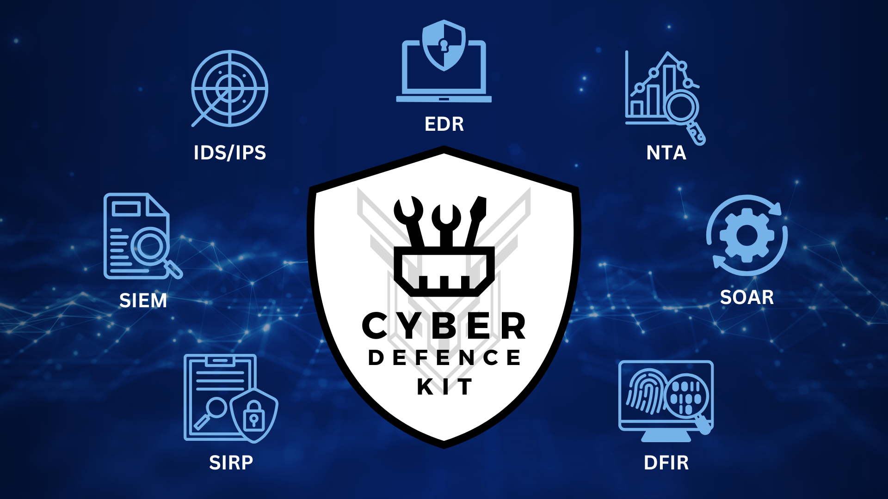

# **Welcome to the Cyber Defence Kit**

## **Introduction**

The Cyber Defence Kit was born from a personal journey of exploring open-source cybersecurity tools. What began as experiments in a home lab evolved into a valuable learning experience. Every step was documented—proof-of-concept videos, detailed notes, lessons learned, and practical tips—all shared online to make these tools more accessible and encourage learning. This project aims to inspire others to explore, implement, and understand the potential of open-source cybersecurity solutions.

## **Getting Started**

To begin leveraging the Cyber Defence Kit:

1. **Understand the Toolkit:**
    - Familiarise yourself with the components of the kit.
2. **Set Up Your Environment:**
    - Ensure you have the necessary hardware and software prerequisites.
    - Prepare your systems for installation (e.g., air-gapped environment considerations).
3. **Learn and Explore:**
    - Explore proof of concept videos and documentation on attack simulation.

## **Important Notes**

- **Security First:** Always follow security best practices when installing and configuring tools.
- **Air-Gapped Environments:** Special considerations are required for installations without internet access.
- **Legal Compliance:** Ensure all activities comply with legal and regulatory requirements.