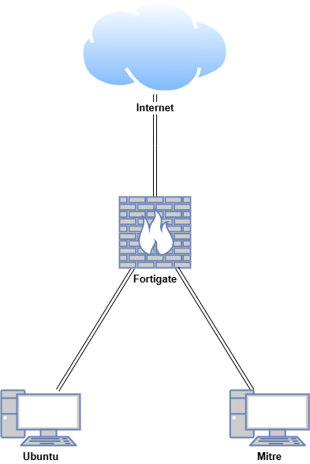
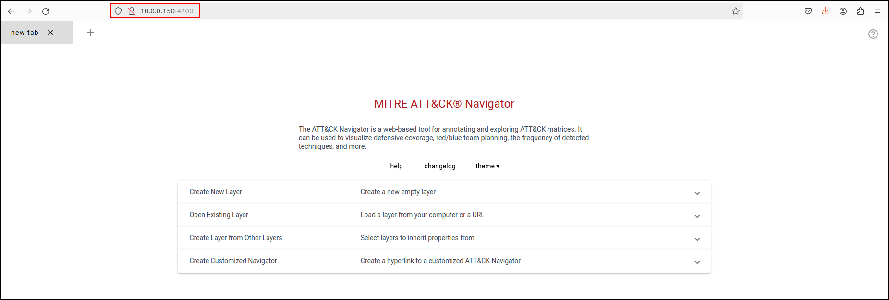

# **MITRE ATT&CK Navigator**

The ATT&CK Navigator is a simple, flexible tool for exploring and annotating ATT&CK matrices, replacing manual methods like spreadsheets. It helps users map defensive coverage, plan red/blue team activities, track detected techniques, and more. With features like colour coding, comments, and numerical values, it makes ATT&CK more accessible through intuitive visualisation.

A key feature is customisable "layers," allowing users to focus on specific platforms, highlight adversary techniques, or filter data. Layers can be created interactively or generated programmatically for later use.

<iframe width="560" height="315" src="https://www.youtube.com/embed/pm-RsF_7kA4?si=rcj84YnEF_bOW2yF" title="YouTube video player" frameborder="0" allow="accelerometer; autoplay; clipboard-write; encrypted-media; gyroscope; picture-in-picture; web-share" referrerpolicy="strict-origin-when-cross-origin" allowfullscreen></iframe>

## **Lab Setup for Proof of Concept**

In this proof of concept, MITRE ATT&CK Navigator was installed and configured in an air-gapped Ubuntu environment. Layers were created using the Tactics, Techniques, and Procedures (TTPs) of well-known Advanced Persistent Threats (APTs). These layers were rendered in different colours and combined to demonstrate how MITRE ATT&CK Navigator can be used for both red team and blue team planning.

| **Host** | **OS** | **Role** | **IP Address** |
| --- | --- | --- | --- |
| Fortigate | Fortios 7.6.0 | Firewall/Router | 192.168.1.10 (WAN) / 10.0.0.1 (LAN) |
| Ubuntu | Ubuntu 24.04 | Internet-Connected VM | 10.0.0.200 |
| Mitre | Ubuntu 24.04  | Air-gapped VM | 10.0.0.150 |



## **Requirements**

- [**Node.js v18**](https://nodejs.org/) – Ensure you have this version installed to support compatibility.
- [**Angular CLI v17**](https://cli.angular.io/) – Needed for managing Angular projects and dependencies.

## **Installing MITRE ATT&CK Navigator Offline**

### **On an Internet-Connected Machine**

On an internet-connected Ubuntu VM, refresh the package lists from the repositories and create a structured directory for downloading dependencies:

```bash
sudo apt-get update
mkdir -p ~/mitre-offline/{vmtools,git,libre,nodejs,angular-cli}
```

Download and install VM tools (this will enable copy and pasting and dynamic resolution). 

```bash
cd ~/mitre-offline/vmtools
apt-get download \
  libatkmm-1.6-1v5 \
  libcairomm-1.0-1v5 \
  libglibmm-2.4-1t64 \
  libgtkmm-3.0-1t64 \
  libmspack0t64 \
  libpangomm-1.4-1v5 \
  libsigc++-2.0-0v5 \
  libxmlsec1t64 \
  libxmlsec1t64-openssl \
  open-vm-tools \
  open-vm-tools-desktop \
  zerofree
sudo dpkg -i *.deb
```

After installing VM tools, you may need to reboot the VM if copy and pasting does not work. 

Download and install Git. Verify the installation.

```bash
cd ~/mitre-offline/git
sudo apt-get download git git-man liberror-perl
sudo dpkg -i *.deb
git --version
```

Download LibreOffice.

```bash
cd ~/mitre-offline/libre
sudo apt-get -o Dir::Cache::archives="/home/cyber/mitre-offline/libre" --download-only install libreoffice
```

Download and install Node.js v18. Verify the installation.

```bash
cd ~/mitre-offline/nodejs
wget https://nodejs.org/dist/v18.20.6/node-v18.20.6-linux-x64.tar.xz
tar -xvf node-v18.20.6-linux-x64.tar.xz 
sudo mv node-v18.20.6-linux-x64 /usr/local/nodejs
echo 'export PATH=/usr/local/nodejs/bin:$PATH' >> ~/.bashrc
source ~/.bashrc
node --version
npm --version
```

Use `npm install` to download all Angular CLI v17 dependencies into the `node_modules` directory. This process may take some time.

```bash
cd ~/mitre-offline/angular-cli 
npm install @angular/cli@17
```

Clone MITRE ATT&CK Navigator repository. This process may take some time.

```bash
cd ~/mitre-offline
git clone https://github.com/mitre-attack/attack-navigator.git
```

Use `npm install` to download all dependencies into the `node_modules` directory:

```bash
cd ~/mitre-offline/attack-navigator/nav-app
npm install
```

Download the latest MITRE ATT&CK data files into the `nav-app/src/assets` directory.

```bash
cd ~/mitre-offline/attack-navigator/nav-app/src/assets
wget https://raw.githubusercontent.com/mitre-attack/attack-stix-data/master/enterprise-attack/enterprise-attack.json
wget https://raw.githubusercontent.com/mitre-attack/attack-stix-data/master/mobile-attack/mobile-attack.json
wget https://raw.githubusercontent.com/mitre-attack/attack-stix-data/master/ics-attack/ics-attack.json
```

Create `index.json` in the `nav-app/src/assets` with the following content.

```bash
nano ~/mitre-offline/attack-navigator/nav-app/src/assets/index.json
```

```bash
{
    "id": "10296991-439b-4202-90a3-e38812613ad4",
    "name": "MITRE ATT&CK",
    "description": "MITRE ATT&CK is a globally-accessible knowledge base of adversary tactics and techniques based on real-world observations. The ATT&CK knowledge base is used as a foundation for the development of specific threat models and methodologies in the private sector, in government, and in the cybersecurity product and service community.",
    "created": "2018-01-17T12:56:55.080Z",
    "modified": "2024-11-12T14:00:00.188Z",
    "collections": [
        {
            "id": "x-mitre-collection--1f5f1533-f617-4ca8-9ab4-6a02367fa019",
            "created": "2018-01-17T12:56:55.080Z",
            "versions": [
                {
                    "version": "16.1",
                    "url": "assets/enterprise-attack.json",
                    "modified": "2024-11-12T14:00:00.188Z"
                }
            ],
            "name": "Enterprise ATT&CK",
            "description": "ATT&CK for Enterprise provides a knowledge base of real-world adversary behavior targeting traditional enterprise networks. ATT&CK for Enterprise covers the following platforms: Windows, macOS, Linux, PRE, Office 365, Google Workspace, IaaS, Network, and Containers."
        },
        {
            "id": "x-mitre-collection--dac0d2d7-8653-445c-9bff-82f934c1e858",
            "created": "2018-01-17T12:56:55.080Z",
            "versions": [
                {
                    "version": "16.1",
                    "url": "assets/mobile-attack.json",
                    "modified": "2024-11-12T14:00:00.188Z"
                }
            ],
            "name": "Mobile ATT&CK",
            "description": "ATT&CK for Mobile is a matrix of adversary behavior against mobile devices (smartphones and tablets running the Android or iOS/iPadOS operating systems). ATT&CK for Mobile builds upon NIST's Mobile Threat Catalogue and also contains a separate matrix of network-based effects, which are techniques that an adversary can employ without access to the mobile device itself."
        },
        {
            "id": "x-mitre-collection--90c00720-636b-4485-b342-8751d232bf09",
            "created": "2020-10-27T14:49:39.188Z",
            "versions": [
                {
                    "version": "16.1",
                    "url": "assets/ics-attack.json",
                    "modified": "2024-11-12T14:00:00.188Z"
                }
            ],
            "name": "ICS ATT&CK",
            "description": "The ATT&CK for Industrial Control Systems (ICS) knowledge base categorizes the unique set of tactics, techniques, and procedures (TTPs) used by threat actors in the ICS technology domain. ATT&CK for ICS outlines the portions of an ICS attack that are out of scope of Enterprise and reflects the various phases of an adversary\u2019s attack life cycle and the assets and systems they are known to target."
        }
    ]
}
```

Using the `json.tool` module, which is already installed on the Ubuntu VM, validate all JSON files to ensure they are syntactically correct.

```bash
python3 -m json.tool ~/mitre-offline/attack-navigator/nav-app/src/assets/index.json
python3 -m json.tool ~/mitre-offline/attack-navigator/nav-app/src/assets/enterprise-attack.json
python3 -m json.tool ~/mitre-offline/attack-navigator/nav-app/src/assets/mobile-attack.json
python3 -m json.tool ~/mitre-offline/attack-navigator/nav-app/src/assets/ics-attack.json
```

If the file is valid, this command will output the JSON content. If there are syntax errors, it will display an error message.

Modify the `config.json` file in `nav-app/src/assets` with following contents (change enabled to true, and `collection_index_url` and `data` values to `assets/index.json` and `assets/enterprise-attack.json` files).

```bash
nano ~/mitre-offline/attack-navigator/nav-app/src/assets/config.json
```

```bash
{
	"collection_index_url": "assets/index.json",

    "versions": {
		"enabled": true,
		"entries": [
			{
				"name": "Custom Data v14",
				"version": "14",
				"domains": [
					{
						"name": "Enterprise",
						"identifier": "enterprise-attack",
						"data": ["assets/enterprise-attack.json"]
					}
				]
			}
		]
	},
<SNIP>
```

Compress the mitre-offline folder for transfer.

```bash
cd ~/mitre-offline
tar -czvf mitre-offline.tar.gz *
```

Transfer `mitre-offline.tar.gz` to the air-gapped Ubuntu VM using a USB drive.

### **On the Air-Gapped Environment**

On the air-gapped Ubuntu VM, make a directory called mitre-offline and extract the transferred archive.

```bash
mkdir ~/mitre-offline && cd ~/mitre-offline
tar -xzvf ~/mitre-offline.tar.gz
```

Install LibreOffice and verify installation.

```bash
cd ~/mitre-offline/libre
sudo dpkg -i *.deb
libreoffice
```

Install Node.js v18 and verify the installation.

```bash
cd ~/mitre-offline/nodejs
tar -xvf node-v18.20.6-linux-x64.tar.xz 
sudo mv node-v18.20.6-linux-x64 /usr/local/nodejs
echo 'export PATH=/usr/local/nodejs/bin:$PATH' >> ~/.bashrc
source ~/.bashrc
node --version
npm --version
```

Install Angular CLI globally by linking it to the `npm` directory. This will create a global symlink for the Angular CLI, allowing you to use the `ng` command from anywhere. This process may take some time.

```bash
cd ~/mitre-offline/angular-cli/node_modules/@angular/cli
npm link
```

Verify that Angular CLI is installed correctly. This should display Angular CLI version 17 along with other related information.

```bash
ng version
```

```bash
     _                      _                 ____ _     ___
    / \   _ __   __ _ _   _| | __ _ _ __     / ___| |   |_ _|
   / △ \ | '_ \ / _` | | | | |/ _` | '__|   | |   | |    | |
  / ___ \| | | | (_| | |_| | | (_| | |      | |___| |___ | |
 /_/   \_\_| |_|\__, |\__,_|_|\__,_|_|       \____|_____|___|
                |___/
    

Angular CLI: 17.3.11
Node: 18.20.6
Package Manager: npm 10.8.2
OS: linux x64

Angular: undefined
... 

Package                      Version
------------------------------------------------------
@angular-devkit/architect    0.1703.11
@angular-devkit/core         17.3.11
@angular-devkit/schematics   17.3.11
@schematics/angular          17.3.11

```

### **Run MITRE ATT&CK Navigator**

Navigate to the `nav-app` directory and run the application.

```bash
cd ~/mitre-offline/attack-navigator/nav-app
ng serve --host 0.0.0.0
```

Open `http://<IP ADDRESS>:4200` in your browser. 



Verify that creating new layer loads locally hosted JSON files (enterprise-attack, mobile-attack and ics-attack). 

Enterprise ATT&CK (enterprise-attack.json)


Mobile ATT&CK (mobile-attack.json)


ICS ATT&CK (ics-attack.json)


Verify that you can also access the Navigator from the Ubuntu VM using the MITRE VM's IP address. Verify access to locally hosted JSON files.

## **Introduction to MITRE ATT&CK Navigator**

### **Creating a New Layer**

Navigate to the MITRE ATT&CK Navigator at `http://<IP Address>:4200`. Select Create New Layer, then choose Enterprise ATT&CK.


Select Layer Controls, then "Settings." Change the Layer name to "APT38.”


Click Selection Controls, then select "Search & Multiselect." Search for APT38. Expand the Threat Groups section and click Select next to APT38. This will automatically select the techniques used by APT38.


### **Manually Setting Colours**

Navigate to Technique Controls, select 'Background Colour,' and choose a colour that is easily identifiable (e.g., red).


To expand the subtechniques, navigate to Layer Controls, then click "Expand Subtechniques.”


### **Manually Adding a TTP**

First navigate to Selection Controls and click “deselect 43 techniques.”


To manually add a Tactic, Technique, or Procedure (TTP), click on the TTP (e.g., Scheduled Task/Job) and select the orange colour.


### **Creating an Adversary Profile**

Create a new layer using Enterprise ATT&CK. Name the layer the Red Haast Eagle (or name of your own choice). 


While holding down the control key, select multiple TTP’s that your adversary profile will be using. You can copy the TTPs shown in the image, or choose your own. 


While the TTPs are selected, navigate to Layer Controls, then Colour Setup. Set High Value to 3 and leave presets set to red to green.


### **Setting Colours by Assigning Scores (Red Team)**

Navigate to Technique Controls, then Scores. Set the Score value to 0. The score can be defined and interpreted in many different ways. In this scenario, we will be looking at scores from the red team’s planning perspective. A score of 0 means the red team wasn’t successful in executing the following TTPs (shown in red), whereas a score of 3 means the red team was successful in executing the TTPs.


Select Compromise Accounts and Email Accounts, and set the score to 3. This means the red team was successful in executing the TTPs. This will render these specific TTPs in green.


Select Command and Scripting Interpreter and PowerShell and assign the score of 1. This implies the TTPs were executed and there were technical errors or TTPs were partially executed. This will render the TTPs in orange.


### **Setting Colours by Assigning Scores (Blue Team)**

Create a new layer using Enterprise ATT&CK. Name the layer "APT41" and apply the TTPs used by APT41. Navigate to Layer Controls, then Colour Setup. Set High Value to 3 and set Presets to green to red.


With APT41’s TTPs selected, assign a score of 0. This will render the TTPs in green, indicating that the red team was not successful in executing these TTPs.


Select Impersonation and File and Directory Discovery and assign the score of 3. This will render the TTPs in red, indicating that the red team was successful in executing these TTPs without being detected by the blue team. 


There are many ways to implement colour coding, and it is up to you to define and interpret it.

### **Combining Multiple Layers**

Close all layers. Create a new layer using Enterprise ATT&CK. Name the layer "APT38" and apply the TTPs used by APT38. In the Colour Setup in Layer Controls, set the Low value to 1 and the High value to 3. Set the Presets to red to green.


While the APT38’s TTPs are selected, assign the Score value of 1.


Create a second layer using Enterprise ATT&CK. Name the layer "APT41" and apply the TTPs used by APT41. **Set the Low value to 1 and High value to 3. Set the Presets to red to green. Assign the Score value of 1.** 


Create a third layer using Enterprise ATT&CK. Name the layer "APT28" and apply the TTPs used by APT28. **Set the Low value to 1 and High value to 3. Set the Presets to red to green. Assign the Score value of 1.** 


Create a new layer to combine the three layers. Select "Create Layer from Other Layers." For Domain, select "Enterprise ATT&CK MITRE ATT&CK v16." For Score Expression, enter "a+b+c," which will combine the scores from the three layers. For Gradient and Colouring, select "APT38" (noting that they all use the same gradient and colouring). Click "Create Layer."


This generates a combined layer. Red indicates a score of 1, meaning that only one APT uses the TTPs in red. Yellow indicates a score of 2, meaning that two APTs use the TTPs in yellow. Green indicates a score of 3, meaning that all three APTs use the TTPs in green.


### **Exporting Layer**

Within the Layer Controls tab, select "Export." Selecting Code Blocks will download the layer as a JSON file. Table View will export all layers to Excel, and the Camera icon will render the layer as an SVG.


### **Exporting Layer to Code Blocks**

Within the Layer Controls tab, select "Export” then “Code Blocks.” This will automatically download the layer as JSON file. 


Open a new tab and select Open Existing Layer. Select Upload from local and select the downloaded JSON file. 


This loads the combined layer we created earlier. 


### **Exporting Layer to Table View**

Within the Layer Controls tab, select "Export” then “Table View.” This will automatically download the layer as XLSX file. 


Open the XLSX file in LibreOffice. This will display the three APT layers and the combined layer with the same colour rendering.


### **Exporting Layer to SVG**

Within the Layer Controls tab, select "Export” then camera icon” This will render layer to  Scalable Vector Graphics **(**SVG) file. An SVG file is a type of image that uses XML code to create two-dimensional graphics. Unlike PNG or JPG images, which can become blurry when resized, SVG images stay clear and sharp at any size. This makes them great for things like websites, logos, and diagrams. Click “Download SVG” button.


This will automatically download the SVG file.


Double-click the downloaded SVG file. This will open the SVG file in a new tab in your web browser.


## **References**

- [https://attack.mitre.org/](https://attack.mitre.org/)
- [https://github.com/mitre-attack/attack-navigator](https://github.com/mitre-attack/attack-navigator)
- [https://www.youtube.com/watch?v=78RIsFqo9pM](https://www.youtube.com/watch?v=78RIsFqo9pM)
- [https://youtu.be/hN_r3JW6xsY?si=xer1ygx-pGLIJnI6](https://youtu.be/hN_r3JW6xsY?si=xer1ygx-pGLIJnI6)