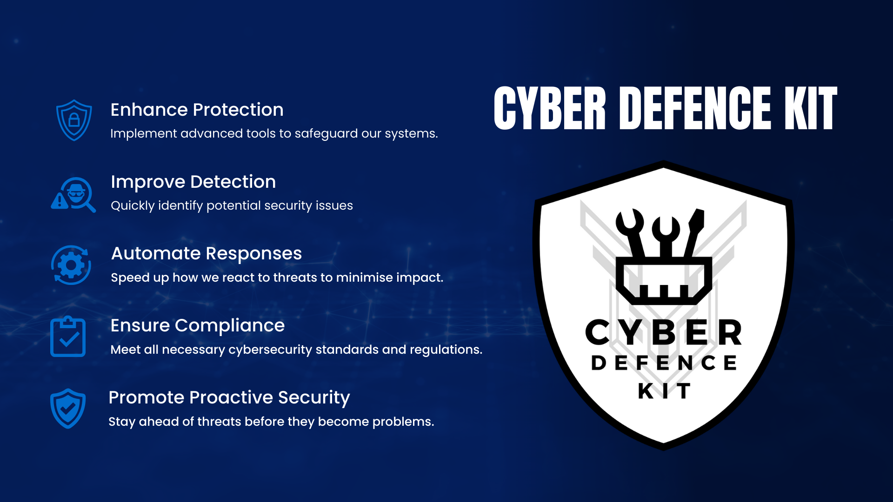
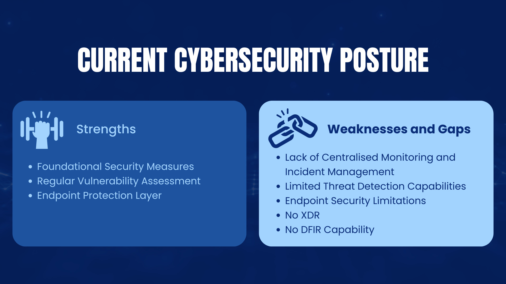

# Project Overview

[https://youtu.be/sjBiYWebI6M](https://youtu.be/sjBiYWebI6M)

## 1. Executive Summary

### 1.1 Purpose of Cyber Defence Kit

The main purpose of project **Cyber Defence Kit** is to enhance the cybersecurity infrastructure of our organisation. By researching and implementing cybersecurity tools in a phased approach—starting with Security Information and Event Management (SIEM) tools, specifically **Splunk** and **Wazuh**—the project aims to:

- Enhance Protection
- Improve Detection
- Automate Responses
- Ensure Compliance
- Promote Proactive Security

This phased implementation allows us to focus on establishing a strong foundation with SIEM solutions before gradually introducing additional tools like Security Orchestration, Automation, and Response (SOAR), Security Incident Response Platform (SIRP), Intrusion Detection and Prevention Systems (IDS/IPS), Endpoint Detection and Response (EDR), Extended Detection and Response (XDR), and Digital Forensics and Incident Response (DFIR).

This project aligns with our strategic goal of protecting our assets and developing a small Security Operations Center (SOC) within our organisation. By integrating these tools and practices gradually, we will enhance our ability to proactively detect, respond to, and mitigate cybersecurity threats.

## 2. Background and Introduction

### 2.1 Current Cybersecurity Posture

Understanding our current cybersecurity posture is crucial for identifying gaps and areas for improvement as we implement the Cyber Defence Kit. Presently, our organisation's cybersecurity infrastructure includes the following components

- **Vulnerability Management**
    - **Nessus Vulnerability Scanner**
        - **Function:** Performs periodic scans to identify known vulnerabilities and misconfigurations.
        - **Strength:** Provides comprehensive reports to prioritise remediation efforts.
- **Endpoint Protection**
    - **Trend Micro Endpoint Detection and Response (EDR)**
        - **Function:** Detects and blocks malware and monitors endpoint activities for suspicious behavior.
        - **Strength:** Leverages threat intelligence for up-to-date protection.
    - **Windows Defender (EDR)**
        - **Function:** Offers basic real-time protection against common threats on Windows devices.
        - **Strength:** Integrates seamlessly with Windows OS and provides regular updates.

### **Strengths**

- **Foundational Security Measures:** Basic protection against common cyber threats is in place.
- **Regular Vulnerability Assessments:** Nessus helps identify and address known vulnerabilities.
- **Endpoint Protection Layer:** Trend Micro EDR and Windows Defender offer a layer of defence at the endpoint level.

### **Weaknesses and Gaps**

1. **Lack of Centralised Monitoring and Incident Management**
    - **No SIEM Solution:** Limited visibility into security events across the network.
    - **No SOAR Capabilities:** Incident response processes are manual and slow.
    - **No SIRP Solution:** Inefficient handling of security incidents.
2. **Limited Threat Detection Capabilities**
    - **No IDS/IPS Deployment:** Absence of real-time network traffic analysis.
    - **No Network Traffic Analyser:** Limited insight into network behaviors and anomalies.
3. **Endpoint Security Limitations**
    - **Inconsistent EDR Deployment:** Potential security policy inconsistencies.
    - **Lack of Advanced Features:** Current EDR solutions may not detect sophisticated threats.
4. **No Extended Detection and Response (XDR)**
    - **Limited Cross-Platform Detection:** Cannot correlate threats across multiple security layers.
5. **No Digital Forensics and Incident Response (DFIR) Capability**
    - **Inability to Investigate Incidents Thoroughly:** Hinders in-depth incident analysis.
    - **Compliance Risks:** Potential non-compliance due to inadequate incident response processes.

### **Recommendations**

1. **Phase 1: Implement SIEM Solution**
    - **Deploy SIEM Platforms:** Begin with Splunk and Wazuh for centralised event monitoring.
    - **Integrate XDR Capabilities:** Through Wazuh, explore XDR solutions for cross-platform threat detection.
2. **Subsequent Phases: Gradually Introduce Additional Tools**
    - **Adopt SOAR Technology:** Introduce SOAR tools such as Shuffle to automate and orchestrate security workflows.
    - **Deploy IDS/IPS and Network Traffic Analysis Tools:** Use tools like Suricata, Snort and Zeek for real-time network monitoring.
    - **Deploy SIRP:** Implement a SIRP like TheHive for managing security incidents.
    - **Develop DFIR Capabilities:** Introduce tools such as Velociraptor for digital forensics and incident response.

By focusing on SIEM implementation first, we address the most critical gap in our cybersecurity posture—lack of centralised monitoring—and lay the groundwork for future enhancements.

### **2.2 Introduction to Project Cyber Defence Kit**

By addressing these gaps through a phased approach in Project Cyber Defence Kit, we aim to:

- **Mitigate Risks:** Reduce the likelihood and impact of security incidents.
- **Enhance Compliance:** Meet industry and military cybersecurity standards.
- **Improve Operational Efficiency:** Automate processes and improve response times.
- **Support Strategic Goals:** Protect critical assets and ensure mission success.

## 3. Project Objectives

- **Phase 1:** Research and implement SIEM tools (**Splunk** and **Wazuh**) to enhance security infrastructure.
- **Subsequent Phases:** Gradually research and implement additional cybersecurity tools (SOAR, Incident Response and Case Management, IDS/IPS, EDR, DFIR).
- **Integrate** solutions for streamlined operations.
- **Improve** threat detection and response times.
- **Comply** with military cybersecurity standards.

## 4. Project Scope

### **4.1 In-Scope**

**Phase 1:**

- SIEM Tools: Splunk and Wazuh
- Research and implementation of the SIEM solutions.
- Introductory Training Sessions: We will offer beginner-level training to help you get started with the SIEM tools and understand the basics of configuring and using them.
- Documentation and proof-of-concept videos for the SIEM tools.

**Future Phases:**

- Introduction of additional tools like Shuffle, TheHive, Zeek, Snort,Suricata and Velociraptor.

### **4.2 Out-of-Scope**

- **Phase 1:**
    - In-depth staff training for SIEM tools: Comprehensive training beyond the introductory sessions is not included. Free training materials are available online; assistance can be provided if required.
    - Upgrades to unrelated IT infrastructure.
- **Future Phases:**
    - Implementation and training for additional tools (to be addressed in subsequent project iterations).

## 5. Methodology and Approach

### **5.1 Phase 1: SIEM Implementation**

### **Research and Selection**

- **Conduct Research:** Investigate SIEM tools, focusing on Splunk and Wazuh.
- **Evaluate Tools:** Determine the best fit for our organisational needs.

### **Implementation**

- **Install and Configure:** Set up Splunk and Wazuh in a testing environment.
- **Design Proof of Concepts:** Demonstrate SIEM capabilities and integration potential.

### **Testing and Validation**

- **Deploy on Production Systems:** Carefully roll out SIEM tools to live environments.
- **Functional Testing:** Ensure tools operate as intended and meet security requirements.

### **Documentation**

- **Create User Manuals:** Develop comprehensive guides for SIEM tools.
- **Expert Review:** Have documentation reviewed by cybersecurity experts.

### **Implementation Support and Feedback**

- **Assist Operators:** Support the implementation of SIEM tools into daily operations.
- **Feedback Loop:** Update tools based on operational feedback.

### **5.2 Future Phases**

- **Plan Subsequent Implementations:** Develop detailed methodologies for introducing additional tools.
- **Iterative Approach:** Apply lessons learned from Phase 1 to future phases.

## 6. Draft Project Timeline

### **Phase 1: SIEM Implementation**

- **Phase 1.1:** Research and Selection
- **Phase 1.2:** Implementation
- **Phase 1.3:** Testing and Validation
- **Phase 1.4:** Documentation
- **Phase 1.5:** Implementation Support and Feedback

### **Future Phases**

- **To Be Scheduled:** Timelines for introducing additional tools will be planned after the successful completion of Phase 1.

## 7. Budget Estimate

**Phase 1: SIEM Implementation**

- **Splunk Licensing:**
    - **Free Trial Version:** Limited capabilities suitable for initial testing.
    - **Enterprise Licence:** Costs based on data ingestion rates; necessary for full functionality. Our company currently has access to Enterprise Licence.
- **Wazuh:**
    - **Open-Source:** Free to use with community support.
    - **Paid Support (Optional):** For additional features and professional support services.

**Documentation:**

- Use open-source documentation platforms compatible with an air-gapped environment.
- Consider paid documentation platforms for advanced features if needed.

**Contingency Fund:**

- Allocate funds to address potential cost increases or the need for additional resources.

**Future Phases:**

- **Budget Planning:** Costs for additional tools and training will be estimated in subsequent proposals.

## 8. Risk Assessment and Mitigation

Identify potential risks and mitigation strategies for **Phase 1**:

| **Risk** | **Likelihood** | **Impact** | **Mitigation Strategy** |
| --- | --- | --- | --- |
| Integration challenges with existing systems | High | Medium | Conduct compatibility assessments beforehand |
| Cost changes for Splunk licensing | Medium | Medium | Explore alternative SIEM solutions or adjust usage levels |
| Staff unfamiliarity with SIEM tools | Medium | Medium | Provide training resources and ongoing support |
| Version changes to open-source tools | High | Low | Regularly monitor for updates and apply patches as needed |
| Data privacy concerns | Low | High | Ensure compliance with data protection regulations |

## 9. Conclusion

**Cyber Defence Kit** is essential for our organisation's security, starting with the implementation of SIEM tools in Phase 1. This phased approach will:

- **Strengthen cybersecurity defences** by implementing advanced SIEM solutions to detect and respond to threats effectively.
- **Enhance compliance with cybersecurity standards**, ensuring we meet all regulatory and operational requirements.
- **Reduce the risk of cyber incidents**, minimising potential operational disruptions and losses.
- **Improve operational efficiency through automation**, allowing our team to focus on strategic initiatives.
- **Elevate trust with stakeholders and partners**, reinforcing our reputation for security and reliability.

By successfully implementing SIEM tools in the initial phase, the Cyber Defence Kit project not only fortifies our cyber defences but also sets the stage for introducing additional tools in future phases. This strategic, phased approach aligns with our mission to protect critical CIS assets and develop a Security Operations Centre (SOC) capability. By undertaking this initiative, we are taking essential steps to protect our organisation's future, improve operational readiness, and close the gap in our cybersecurity posture.