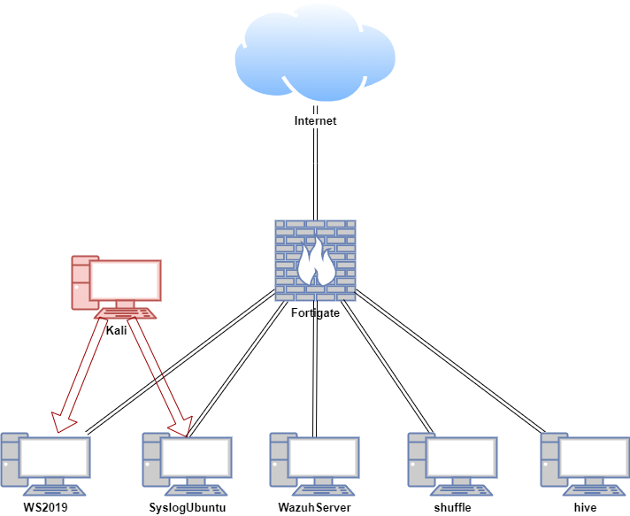
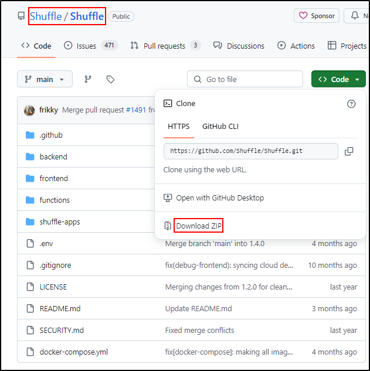

# **Shuffle**

<iframe width="560" height="315" src="https://www.youtube.com/embed/toqzkIN1urA?si=rqZTpP_4flYw_cFz" title="YouTube video player" frameborder="0" allow="accelerometer; autoplay; clipboard-write; encrypted-media; gyroscope; picture-in-picture; web-share" referrerpolicy="strict-origin-when-cross-origin" allowfullscreen></iframe>

## **Lab Setup for Proof of Concept**

In this proof of concept, Shuffle is installed on an Ubuntu VM. Automated workflows were created using Shuffle, Wazuh, and TheHive. An attack simulation was conducted on the Windows and Ubuntu hosts in a safe and controlled environment.

| **Host** | **OS** | **Role** | **IP Address** |
| --- | --- | --- | --- |
| Fortigate | Fortios 7.6.0 | Firewall/Router | 192.168.1.111 (WAN) / 10.0.0.1 (LAN) |
| shuffle | Ubuntu 22.04 LTS | Shuffle (SOAR) | 10.0.0.28 |
| WazuhServer | Centos Stream 9 | Wazuh server (SIEM server) | 10.0.0.20 |
| hive | Ubuntu 22.04 LTS | TheHive (IR) | 10.0.0.40 |
| WS2019 | Windows Server 2019 | Wazuh agent (SIEM client) | 10.0.0.24 |
| SyslogUbuntu | Ubuntu 22.04 LTS | Wazuh agent, rsyslog server | 10.0.0.26 |
| Kali | Kali Linux 2024.2 | Attacker machine | 192.168.1.161, 10.0.0.29 |



## **Install Shuffle online**

### **Install Docker using the apt repository (Ubuntu)**

Before you install Docker Engine for the first time on a new host machine, you need to set up the Docker repository. Afterward, you can install and update Docker from the repository.

Set up Docker's apt repository.

```python
# Add Docker's official GPG key:
sudo apt-get update
sudo apt-get install ca-certificates curl
sudo install -m 0755 -d /etc/apt/keyrings
sudo curl -fsSL https://download.docker.com/linux/ubuntu/gpg -o /etc/apt/keyrings/docker.asc
sudo chmod a+r /etc/apt/keyrings/docker.asc

# Add the repository to Apt sources:
echo \
  "deb [arch=$(dpkg --print-architecture) signed-by=/etc/apt/keyrings/docker.asc] https://download.docker.com/linux/ubuntu \
  $(. /etc/os-release && echo "$VERSION_CODENAME") stable" | \
  sudo tee /etc/apt/sources.list.d/docker.list > /dev/null
sudo apt-get update
```

Install the Docker packages.

```python
sudo apt-get install docker-ce docker-ce-cli containerd.io docker-buildx-plugin docker-compose-plugin
```

Verify that the Docker Engine installation is successful by running the `hello-world` image.

```python
sudo docker run hello-world
```

### **Install Docker Engine manually (Ubuntu)**

*All the required deb files for Docker Engine have been downloaded and put together in the folder called **docker**. For your reference, the steps for downloading the required deb files for Docker Engine are documented below.*

**On Ubuntu host with internet connection:**

**Option 1**

Run the following command:

```python
curl -L https://get.docker.com | sh
```

**Option 2**

You will need to [download](https://download.docker.com/linux/ubuntu/dists/) a new file each time you want to upgrade Docker Engine.
Select your Ubuntu version in the list.

Go to `pool/stable/` and select the applicable architecture (`amd64`, `armhf`, `arm64`, or `s390x`).

Download the following `deb` files for the Docker Engine, CLI, containerd, and Docker Compose packages:

- `containerd.io_<version>_<arch>.deb`
- `docker-ce_<version>_<arch>.deb`
- `docker-ce-cli_<version>_<arch>.deb`
- `docker-buildx-plugin_<version>_<arch>.deb`
- `docker-compose-plugin_<version>_<arch>.deb`

Install the `.deb` packages. Change directory into the docker folder and run:

```python
cd docker
sudo dpkg -i *
```

Run `sudo service docker start`

### **Install Docker Engine manually (CentOS)**

*All the required deb files for Docker Engine have been downloaded and put together in the folder called **docker**. For your reference, the steps for downloading the required deb files for Docker Engine are documented below.*

**On CentOS host with internet connection:**

If you can't use Docker's rpm repository to install Docker Engine, you can download the .rpm file for your release and install it manually. You need to download a new file each time you want to upgrade Docker Engine.

Go to [https://download.docker.com/linux/centos/](https://download.docker.com/linux/centos/) and choose your version of CentOS. Then browse to x86_64/stable/Packages/ and download the .rpm file for the Docker version you want to install.

Go to `pool/stable/` and select the applicable architecture (`amd64`, `armhf`, `arm64`, or `s390x`).

Download the following rpm files for the Docker Engine, CLI, containerd, and Docker Compose packages:

- `containerd.io_<version>_<arch>.rpm`
- `docker-ce_<version>_<arch>.rpm`
- `docker-ce-cli_<version>_<arch>.rpm`
- `docker-buildx-plugin_<version>_<arch>.rpm`
- `docker-compose-plugin_<version>_<arch>.rpm`

Install the `.rpm` packages. Change directory into the docker folder and run:

```python
cd docker
sudo yum install *
```

Start the docker

```bash
sudo service docker start
```

### **Download Shuffle GitHub Repository**

Clone or download the Shuffle repository as a zip archive from the [Shuffle GitHub](https://github.com/Shuffle/Shuffle) page. If git command cannot be installed, download the zip.

```python
sudo apt install git
cd /opt
sudo git clone https://github.com/Shuffle/Shuffle
cd Shuffle
```



If Shuffle-main.zip is downloaded, unzip  to the /opt directory 

```python
sudo unzip Shuffle-main.zip -d /opt
sudo unzip python-apps-master.zip -d /opt/Shuffle-main/shuffle-apps
```

Change into /opt/Shuffle directory

Fix prerequisites for the Opensearch database (Elasticsearch):

```python
cd /opt/Shuffle-main
mkdir shuffle-database                    # Create a database folder
sudo chown -R 1000:1000 shuffle-database  # IF you get an error using 'chown', add the user first with 'sudo useradd opensearch'

sudo swapoff -a                           # Disable swap
```

Run docker-compose.

```python
cd 
docker compose up -d
```

Recommended for Opensearch to work well

```python
sudo sysctl -w vm.max_map_count=262144             
# https://www.elastic.co/guide/en/elasticsearch/reference/current/vm-max-map-count.html
```

## **Install Shuffle offline**

This procedure will help you export what you need to run Shuffle on a no internet host.

### **Pre-requisite**

- Both machines has Docker and Docker Compose installed already
- Your host machine already needs the images on it to make them exportable

### **Pull images on original machine**

Shuffle need a few base images to work:

- shuffle-frontend
- shuffle-backend
- shuffle-orborus
- shuffle-worker
- shuffle:app_sdk
- opensearch
- shuffle-subflow

```python
docker pull ghcr.io/shuffle/shuffle-backend
docker pull ghcr.io/shuffle/shuffle-frontend 
docker pull ghcr.io/shuffle/shuffle-orborus
docker pull ghcr.io/shuffle/shuffle-app_sdk:latest
docker pull ghcr.io/shuffle/shuffle-worker:latest
docker pull opensearchproject/opensearch:2.14.0
docker pull frikky/shuffle-subflow
docker pull frikky/shuffle:shuffle-tools_1.2.0
docker pull frikky/shuffle:wazuh_1.0.0
docker pull frikky/shuffle:thehive_1.1.3
```

Be careful with the versioning for opensearch, all other are going to use the tag "latest". You will also need to download and transfer ALL the apps you want to use. These can be discovered as such:

```python
docker images | grep -i shuffle
```

Save images and archive them

```
mkdir shuffle-export
cd shuffle-export

docker save ghcr.io/shuffle/shuffle-backend:latest > backend.tar
docker save ghcr.io/shuffle/shuffle-frontend:latest > frontend.tar
docker save ghcr.io/shuffle/shuffle-orborus:latest > orborus.tar
docker save ghcr.io/shuffle/shuffle-app_sdk:latest > app_sdk.tar
##docker save frikky/shuffle:app_sdk > app_sdk.tar
##docker save ghcr.io/frikky/shuffle-worker:latest > worker.tar
docker save ghcr.io/shuffle/shuffle-worker:latest > worker.tar
docker save opensearchproject/opensearch:2.14.0 > opensearch.tar
docker save frikky/shuffle-subflow:latest > sublow.tar
docker save frikky/shuffle:shuffle-tools_1.2.0 > shuffle-tools.tar
docker save frikky/shuffle:wazuh_1.0.0 > wazuh.tar
docker save frikky/shuffle:thehive_1.1.3 > thehive.tar

git clone https://github.com/Shuffle/python-apps.git

wget https://raw.githubusercontent.com/Shuffle/Shuffle/master/.env
wget https://raw.githubusercontent.com/Shuffle/Shuffle/master/docker-compose.yml

cd .. 
tar cvf shuffle-export.tar.gz shuffle-export

```

Export shuffle-export.tar.gz to the host without internet connection

Import docker images to host without internet

```python
tar xvf shuffle-export.tar.gz -C /opt
cd /opt/shuffle-export
find -type f -name "*.tar" -exec docker load --input "{}" \;
```

Create folders to add the python apps

```python
mkdir shuffle-apps
cp -r python-apps/* shuffle-apps/
```

Create a folder called shuffle-database and change the ownership.

If you get an error using 'chown', add the user first with 'sudo useradd opensearch'

Disable swap

Set the `vm.max_map_count` kernel parameter to 262144. This is often needed for applications like Elasticsearch or Opensearch that require a higher limit for the number of virtual memory areas a process can have.

```python
mkdir shuffle-database  
sudo chown -R 1000:1000 shuffle-database  
sudo swapoff -a                          
sudo sysctl -w vm.max_map_count=262144
```

Run `docker images` 

Edit the image names in docker-compose.yml to align it with the output from `docker images`

```python
docker images
REPOSITORY                               TAG                     IMAGE ID       CREATED         SIZE
registry.hub.docker.com/frikky/shuffle   shuffle-subflow_1.0.0   5ed48be6f649   33 hours ago    293MB
frikky/shuffle                           app_sdk                 1dde46cd09da   10 days ago     291MB
ghcr.io/frikky/shuffle-worker            latest                  adb137fa1718   15 months ago   44.4MB
opensearchproject/opensearch             2.5.0                   5a030d679ac7   18 months ago   1.17GB
ghcr.io/frikky/shuffle-backend           latest                  2e3d97ae8e30   21 months ago   57.9MB
ghcr.io/frikky/shuffle-frontend          latest                  be49fe2395d3   21 months ago   191MB
ghcr.io/frikky/shuffle-orborus           latest                  068b942b0302   21 months ago   29.9MB

```

```python
services:
  frontend:
    image: ghcr.io/frikky/shuffle-frontend:latest
   
  backend:
    image: ghcr.io/frikky/shuffle-backend:latest
  
  orborus:
    image: ghcr.io/frikky/shuffle-orborus:latest
   
  opensearch:
    image: opensearchproject/opensearch:2.5.0 
```

Run docker-compose.

```python
docker compose up -d
```

### **Troubleshooting**

Verify that there are no major errors in the logs and all containers are up and running 

Check docker processes

```python
docker ps 

CONTAINER ID   IMAGE                                    COMMAND                  CREATED         STATUS         PORTS                                                                                NAMES
6304c903bdde   ghcr.io/frikky/shuffle-frontend:latest   "/entrypoint.sh ngin…"   3 minutes ago   Up 3 minutes   0.0.0.0:3001->80/tcp, [::]:3001->80/tcp, 0.0.0.0:3443->443/tcp, [::]:3443->443/tcp   shuffle-frontend
899ab92ccdd5   ghcr.io/frikky/shuffle-backend:latest    "./webapp"               3 minutes ago   Up 3 minutes   0.0.0.0:5001->5001/tcp, :::5001->5001/tcp                                            shuffle-backend
cccd0236ead3   ghcr.io/frikky/shuffle-orborus:latest    "./orborus"              3 minutes ago   Up 3 minutes                                                                                        shuffle-orborus
faa724f843ad   opensearchproject/opensearch:2.5.0       "./opensearch-docker…"   3 minutes ago   Up 3 minutes   9300/tcp, 9600/tcp, 0.0.0.0:9200->9200/tcp, :::9200->9200/tcp, 9650/tcp              shuffle-opensearch
```

Check docker container logs

```python
docker logs shuffle-backend
docker logs shuffle-frontend
docker logs shuffle-orborus
docker logs shuffle-opensearch
```

Check loaded docker images

```python
root@shuffleoffline:/opt/shuffle-exp# docker images
REPOSITORY                               TAG                                        IMAGE ID       CREATED        SIZE
frikky/shuffle                           TheHive-244ac27f71490576f2152f1a478763dd   04651821b9a9   11 hours ago   292MB
frikky/shuffle                           thehive_1.1.0                              04651821b9a9   11 hours ago   292MB
frikky/shuffle                           Wazuh-2f5945bb5a582a6b676ba7c212412cdb     c6e36c51b505   11 hours ago   292MB
frikky/shuffle                           wazuh_1.1.0                                c6e36c51b505   11 hours ago   292MB
<none>                                   <none>                                     15951f6d8452   25 hours ago   291MB
<none>                                   <none>                                     b99fc014293d   25 hours ago   291MB
<none>                                   <none>                                     5e2ccf369d65   25 hours ago   291MB
<none>                                   <none>                                     dafc616bc131   25 hours ago   291MB
<none>                                   <none>                                     71fa350d234f   25 hours ago   291MB
frikky/shuffle                           shuffle-tools_1.2.0                        4159398549c0   3 days ago     387MB
frikky/shuffle                           shuffle-tools_1.1.0                        5712b5ea194b   3 days ago     362MB
registry.hub.docker.com/frikky/shuffle   shuffle-tools_1.1.0                        5712b5ea194b   3 days ago     362MB
frikky/shuffle-subflow                   latest                                     5ed48be6f649   3 days ago     293MB
frikky/shuffle                           thehive_1.1.3                              9b1209a0ba38   3 days ago     297MB
frikky/shuffle                           app_sdk                                    1dde46cd09da   12 days ago    291MB
ghcr.io/shuffle/shuffle-frontend         latest                                     30c4090d085c   3 weeks ago    196MB
ghcr.io/shuffle/shuffle-worker           latest                                     9f7c39d5fb1e   3 weeks ago    79MB
ghcr.io/shuffle/shuffle-backend          latest                                     59613e03c036   3 weeks ago    93.4MB
ghcr.io/shuffle/shuffle-app_sdk          latest                                     3ac4837de611   3 weeks ago    291MB
opensearchproject/opensearch             2.14.0                                     bf1e1cd1fa30   2 months ago   1.33GB
ghcr.io/shuffle/shuffle-orborus          latest                                     7457cc8b6210   3 months ago   67.7MB
frikky/shuffle                           wazuh_1.0.0                                8a72f12273c6   3 years ago    66MB
```

If the orborus logs shows that it is trying to pull the images from the internet, tag your locally loaded images by running docker tag <Image ID> <Image name>

```python
docker logs shuffle-orborus
...
2024/09/07 23:36:59 [DEBUG] Pulling image ghcr.io/shuffle/shuffle-app_sdk:latest
2024/09/07 23:37:39 [ERROR] Failed getting image ghcr.io/shuffle/shuffle-app_sdk:latest: Error response from daemon: Get "https://ghcr.io/v2/": dial tcp: lookup ghcr.io on 127.0.0.53:53: read udp 127.0.0.1:58367->127.0.0.53:53: i/o timeout

```

```python
docker tag 3ac4837de611 ghcr.io/shuffle/shuffle-app_sdk:latest
```

If you are using older version of opensearch (< 2.14.0), you may encounter authentication issues as shown by the opensearch logs:

```python
docker logs shuffle-opensearch
...
Authentication finally failed for admin from 172.18.0.4:51382
```

If this is the case, access the opensearch, navigate to /config/opensearch-security and edit the configuration file:

```python
docker exec -it shuffle-opensearch /bin/bash
[opensearch@shuffle-opensearch config]$ cd config/opensearch-security/
```

```python
[opensearch@shuffle-opensearch opensearch-security]$ cat internal_users.yml 
---
# This is the internal user database
# The hash value is a bcrypt hash and can be generated with plugin/tools/hash.sh

_meta:
  type: "internalusers"
  config_version: 2

# Define your internal users here

## Demo users

admin:
  hash: "$2a$12$VcCDgh2NDk07JGN0rjGbM.Ad41qVR/YFJcgHp0UGns5JDymv..TOG"
  reserved: true
  backend_roles:
  - "admin"
  description: "Demo admin user"

```

There admin hash does not match with admin password defined in .env file

```python
# DATABASE CONFIGURATIONS
...
SHUFFLE_OPENSEARCH_USERNAME="admin"
SHUFFLE_OPENSEARCH_PASSWORD="StrongShufflePassword321!"
```

The bcrypt hash for the password should be:

```python
#htpasswd -bnBC 12 "" StrongShufflePassword321!
$2y$12$5juqU2/ybhsBB4H928meCO4ZHtzTFSfDRO87AlAF43fhZOWgDlX1W
```

Replace the current hash for the `admin` user in the `internal_users.yml` file with the newly generated hash. 
After editing the `internal_users.yml`, apply the changes to OpenSearch by running the `securityadmin_demo.sh` script inside the OpenSearch container:

```python
[opensearch@shuffle-opensearch opensearch-security]$ vi internal_users.yml
# "i" for insert, copy and paste theh hash, "Esc" then ":wq" 
[opensearch@shuffle-opensearch opensearch-security]$ cd ../../
[opensearch@shuffle-opensearch ~]$ pwd
/usr/share/opensearch
[opensearch@shuffle-opensearch ~]$ ./securityadmin_demo.sh 
[opensearch@shuffle-opensearch ~]$ exit
```

Change the file permission for *.pem in `/usr/share/opensearch/config` 

```python
cd /usr/share/opensearch/config
chmod 0600 *.pem
```

Restart the shuffle-opensearch and shuffle-backend container 

```python
docker restart shuffle-opensearch
docker restart shuffle-backend
```

### **Pull and Save Docker images**

*All the required Docker images have been pulled as saved as **shuffle_images.tar**. For your reference, the steps for pulling and saving the required Docker images are documented below.*

For this step, we are preparing images from a Ubuntu host with internet connection and Docker installed. The prepared images will then be transferred to the air-gapped environment.

**On Ubuntu host with internet connection and Docker Engine installed:**

Open `docker-compose.yml` file from [Shuffle GitHub](https://github.com/Shuffle/Shuffle/blob/main/docker-compose.yml) to identify the images you need. 
Look for the `image` key under each service.

```python
services:
  frontend:
    image: ghcr.io/shuffle/shuffle-frontend:latest
  backend:
    image:ghcr.io/shuffle/shuffle-backend:latest
  orborus:
    image: ghcr.io/shuffle/shuffle-orborus:latest
    ghcr.io/shuffle/shuffle-app_sdk:latest
    ghcr.io/shuffle/shuffle-worker:latest
  opensearch:
    image: opensearchproject/opensearch:2.14.0
```

Pull the Images using `docker pull:`

```python
docker pull ghcr.io/shuffle/shuffle-frontend:latest
docker pull ghcr.io/shuffle/shuffle-backend:latest
docker pull ghcr.io/shuffle/shuffle-orborus:latest
docker pull opensearchproject/opensearch:2.14.0
docker pull ghcr.io/shuffle/shuffle-app_sdk:latest
docker pull ghcr.io/shuffle/shuffle-worker:latest
```

Verify the Images are pulled by running `docker images`

Save the docker images for a transfer to an air-gapped environment

```python
docker save -o shuffle_images.tar ghcr.io/shuffle/shuffle-frontend:latest ghcr.io/shuffle/shuffle-backend:latest ghcr.io/shuffle/shuffle-orborus:latest opensearchproject/opensearch:2.14.0 ghcr.io/shuffle/shuffle-app_sdk:latest ghcr.io/shuffle/shuffle-worker:latest
```

### **Download GitHub repositories as a zip archives**

*All the required GitHub repositories are downloaded as **Shuffle-main.zip** and **python-apps-master.zip**. For your reference, the steps for downloading the required GitHub repositories are documented below.* 

**On Ubuntu host with internet connection and Docker installed:**

Download two repositories as zip archives from the [Shuffle GitHub](https://github.com/Shuffle/Shuffle) and [Shuffle Python Apps GitHub](https://github.com/Shuffle/python-apps) page.


Transfer the docker folder, shuffle_images.tar, Shuffle.zip and python-apps.zip to the Ubuntu host without internet connection. 

**Repeat the steps above to install Docker Engine.** 

Load the Docker images:

```
sudo docker load -i shuffle_images.tar
```

Unzip Shuffle.zip to the /opt directory and python-apps.zip to the /opt/Shuffle-main/shuffle-apps directory

```python
sudo unzip Shuffle-main.zip -d /opt
sudo unzip python-apps.zip -d /opt/Shuffle/shuffle-apps
```

Change into /opt/Shuffle-main directory

Create “shuffle-database” folder

Run prerequisites for the Opensearch database (Elasticsearch):

```python
cd /opt/Shuffle
sudo mkdir shuffle-database
# IF you get an error using 'chown', add the user first with 'sudo useradd opensearch'                    
sudo chown -R 1000:1000 shuffle-database  
# Disable swap
sudo swapoff -a                          
```

In the /opt/Shuffle-main folder, run docker-compose.

```python
sudo docker compose up -d
```

Recommended for Opensearch to work well

```python
sudo sysctl -w vm.max_map_count=262144             
# https://www.elastic.co/guide/en/elasticsearch/reference/current/vm-max-map-count.html
```

## **Creating Automated Workflows**

## **Workflow Zero**

After installation, go to http://(IP address):3001

Create administrator account.

Sign in with the same Username and Password. 


Select New to Shuffle


Click Apps

Verify there are activated apps

If there are issues with loading the apps, click refresh or download from GitHub (internet required) 


Create a new workflow on Shuffle titled “Wazuh integration test.”


Click on the **Triggers** tab in the bottom left and drag the **Webhook** to the workspace.


Click on the webhook and rename it to **Wazuh alerts**. Copy and save the webhook URI and start the webhook. The webhook URI looks like the following: `http://10.0.0.27:3001/api/v1/hooks/webhook_d5c7de34-7dcd-4360-994f-4a134cde3d67`


### **Wazuh server**

Download the custom integration script [custom-shuffle](https://github.com/Shuffle/Shuffle/blob/main/functions/extensions/wazuh/custom-shuffle) and [custom-shuffle.py](https://github.com/Shuffle/Shuffle/blob/main/functions/extensions/wazuh/custom-shuffle.py) from the Shuffle GitHub page. Save it as custom-shuffle and custom-shuffle.py in /var/ossec/integrations directory of Wazuh manager.

```python
[root@Centos integrations]# ls
**custom-shuffle  custom-shuffle.py**  maltiverse  maltiverse.py  pagerduty  pagerduty.py  shuffle  shuffle.py  slack  slack.py  virustotal  virustotal.py
```

The script must contain execution permissions and belong to the `root` user of the `wazuh` group. The commands below assign permissions and ownership to the `/var/ossec/integrations/custom-script` script.

```python
chmod 750 /var/ossec/integrations/custom-shuffle*
chown root:wazuh /var/ossec/integrations/custom-shuffle*
```

Copy the content from [ossec.conf](https://github.com/Shuffle/Shuffle/blob/main/functions/extensions/wazuh/ossec.conf) from the Shuffle GitHub page.

```python
<integration>
  <name>custom-shuffle</name>
  <level>9</level>
  <hook_url>http://<IP>:<PORT>/api/v1/hooks/webhook_hookid</hook_url>
  <alert_format>json</alert_format>
</integration>
```

Paste it into /var/ossec/etc/ossec.conf and edit it

```python
 <integration>
      <name>custom-shuffle</name>
      <level>3</level>
      <hook_url>http://10.0.0.27:3001/api/v1/hooks/webhook_d5c7de34-7dcd-4360-994f-4a134cde3d67</hook_url>
      <alert_format>json</alert_format>
  </integration>
```

Where:

- `<name>`: This is the name of the integration and must match with your custom-shuffle downloaded from GitHub.
- `<hook_url>`: This is the webhook URI copied from the Shuffle webhook. Note: `https://` can be used but it is not recommended as it causes a certificate mismatch error with the author’s self-signed certificate.
- `<level>`: This is used to forward a specific alert level.
- `<alert_format>`: This forwards alerts to Shuffle in JSON format.

Restart the Wazuh manager service to apply changes:

```python
sudo systemctl restart wazuh-manager
```

Verify that there are no errors in the ossec and integrations logs

```python
tail /var/ossec/logs/ossec.log 
tail /var/ossec/logs/integrations.log
```

### **Shuffle**

Click on the Shuffle Tools app named “**Change me**” and rename it to **Receive_Wazuh_alerts**. Set the call option to “`$exec`”, and save the workflow. This Shuffle app now repeats the events that are received by the **Wazuh alerts** webhook. This allows us to test that Shuffle can receive Wazuh alerts.


Click on the **show executions** button.


Select any execution and expand it for details. You should see a Wazuh alert in the output.


**Note:** You may need to wait for a duration of time for Wazuh alerts to appear in Shuffle. This is dependent on the number of events generated in your environment. To manually trigger alerts, restart the Wazuh manager service on the Wazuh server.

This shows that Wazuh is sending alerts to Shuffle and the integration is successful. 

## **Workflow One**

### **Configure Wazuh**

### **Configure Wazuh Windows Client**

Add Administrator’s Download folder to exclusion in the Windows Security setting.


Download and transfer mimikatz.exe. Mimikatz is a tool that can steal passwords and other login information from a Windows computer's memory, often used by attackers or penetration testers to gain access to more secure areas of the system.

Open PowerShell as Administrator. Execute mimikatz.exe


### **Configure Wazuh Manager**

On Wazuh Manager, verify that there are entries related to Mimikatz in the archives file

```python
cat /var/ossec/logs/archives/archives.json | grep -i mimikatz
```

Verify that searching for “mimikatz.exe” in wazuh-archive-* index returns a result


Add a custom rule in /var/ossec/etc/rules/local_rules.xml

Make sure indentation aligns with other rules

`nano /var/ossec/etc/rules/local_rules.xml`

```python
<rule id="100200" level="15">
  <if_group>sysmon_event1</if_group>
  <field name="win.eventdata.originalFileName" type="pcre2">(?i)mimikatz</field>
  <description>Mimikatz Usage Detected</description>
  <mitre>
    <id>T1003</id>
  </mitre>
</rule>
```


Restart Wazuh Manager

```python
systemctl restart wazuh-manager
```

### **Configure Windows Client**

Rename mimikatz.exe to something else (e.g. justanexe)


Open PowerShell as Administrator and execute mimikatz (justanexe)


### **Configure Wazuh Manager**

On Wazuh Manager, verify that there are entries related to ruld id 10020 Mimikatz Usage Detected


### **Configure Shuffle**

### **Upload the required Apps**

On a machine with internet connection:

Search for Wazuh, TheHive and VirusTotal in [https://shuffler.io/search](https://shuffler.io/search)

Download the OpenAPIs (JSON file)


Transfer the JSON files to the air-gapped environement.

Navigate to Shuffle web UI and into Apps.

Select Generate from Open API


Upload the Wazuh JSON file


Scroll to the bottom and click save.


Repeat the same proccess for TheHive


Verify that Wazuh, TheHive and Virustotal appear in the Activated Apps 


To ensure that the new app is recognized by Shuffle, restart the Shuffle backend and frontend containers:

```python
docker restart shuffle-backend
docker restart shuffle-frontend
```

### **Create a Workflow**

Repeat the steps covered in Introduction to Shuffle.

Create a new workflow called SOC Automation Example. 

Click on the **Triggers** tab in the bottom left and drag the **Webhook** to the workspace.

Click on the webhook and rename it to **Wazuh alerts**. Copy and save the webhook URI and start the webhook. The webhook URI looks like the following: 

`http://10.0.0.28:3001/api/v1/hooks/webhook_6f32bbd0-9ca9-498c-9abe-c55b1f573d09`


### **Configure Wazuh server**

Download the custom integration script [custom-shuffle](https://github.com/Shuffle/Shuffle/blob/main/functions/extensions/wazuh/custom-shuffle) and [custom-shuffle.py](https://github.com/Shuffle/Shuffle/blob/main/functions/extensions/wazuh/custom-shuffle.py). Save it as custom-shuffle and custom-shuffle.py in /var/ossec/integrations directory. The script must contain execution permissions and belong to the `root` user of the `wazuh` group: 

```python
chmod 750 /var/ossec/integrations/custom-shuffle*
chown root:wazuh /var/ossec/integrations/custom-shuffle*
```

Copy and paste the following into /var/ossec/etc/ossec.conf

This is the rule id for Mimikatz Usage Detected that we defined in the Wazuh Manager

```python
 <integration>
      <name>custom-shuffle</name>
      <rule_id>100200</rule_id>
      <hook_url>http://10.0.0.28:3001/api/v1/hooks/webhook_6f32bbd0-9ca9-498c-9abe-c55b1f573d09</hook_url>
      <alert_format>json</alert_format>
  </integration>
```

Restart the Wazuh manager service to apply changes:

```python
sudo systemctl restart wazuh-manager
```

Verify that there are no errors in the ossec and integrations logs

```python
tail /var/ossec/logs/ossec.log 
tail /var/ossec/logs/integrations.log
```

### **Configure Shuffle**

Click on the Shuffle Tools app named “**Change me**” and rename it to **Receive_Wazuh_alerts**. Set the call option to “`$exec`”, and save the workflow. This Shuffle app now repeats the events that are received by the **Wazuh alerts** webhook. This allows us to test that Shuffle can receive Wazuh alerts.


On Windows host, open PowerShell as Administrator and execute mimikatz (justanexe)


On Wazuh server, verify logs related to Mimikatz are generated 

```python
tail /var/ossec/logs/integrations.log
```

Verify Shuffle is receiving alerts without any errors 

Alerts should be green indicating status is FINISHED


The results displays a SHA1, MD5 and SHA256 hashes


```python
SHA1=E3B6EA8C46FA831CEC6F235A5CF48B38A4AE8D69,MD5=29EFD64DD3C7FE1E2B022B7AD73A1BA5,SHA256=61C0810A23580CF492A6BA4F7654566108331E7A4134C968C2D6A05261B2D8A1,IMPHASH=55EE500BB4BDFC49F27A98AE456D8EDF
```

Create a regular expression to specifically extract the SHA256 hash from the string.

```python
SHA256=([A-Fa-f0-9]{64})
```

Click Shuffle Tools icon. Change the Name to Capture_SHA256_HASH, Find Actions to Regex Capture group, Input data to $exec.text.win.eventdata.hashes and Regex to SHA256=([A-Fa-f0-9]{64})


Save the workflow. Trigger the rule id 100200 by running mimikatz (justanexe) from Windows host.

You should see SHA256 hash returned in the results. If you are not seeing the SHA256 hash, try restarting your Shuffle by running `docker compose down`  and `docker compose up -d`


Drag and drop Virustotal app. Change the Name to Virustotal, set Find Actions to Get a has report.

Click Authenticate VirusTotal V3 and copy and paste your VirusTotal API key. You must create an account in VirusTotal to obtain the API key. **Note: Internet connection was enabled from this point.**


For ID, select Capture_SHA256_Hash list


Save the workflow. Restart Shuffle if required.

Verify that Virustotal get_a_hash_report returns SHA256 hash of mimikatz with status code 200.

Expand the last_analysis_stats. Malicious: 65 indicates that 65 scanners have detected this executable as malicious. 


### **Configure TheHive**

Login to TheHive web UI

Create a new organisation called Cyber and click Confirm


Click Cyber organisation

Add a new user with following details

- Type: Normal
- Login: cyber@test.com
- Name: cyber
- Profile: analyst

Save and add another user


Add the second user with following details

- Type: Service
- Login: shuffle@test.com
- Name: SOAR
- Profile: analyst


Click Preview on the cyber user and set a new password


Click Preview on the SOAR user and create an API key

Copy the API key `Gq9gm4G4Vx2/Hajy0ezbwNbKVozXCgzR`


Log out of the web UI as admin and login as the cyber user.


### **Configure Shuffle**

Drag and drop TheHive app to the Workflow.

Click TheHive App and click Authenticate TheHive.


Copy and paste the API key `Gq9gm4G4Vx2/Hajy0ezbwNbKVozXCgzR`

Enter the url for TheHive `http://10.0.0.40:9000`

Click Submit.


Set Find Actions to Create alert


Connect Virustotal App to TheHive app

There seems to be a bug with how TheHive app handles some of its parameters at the backend.

To bypass the error, set the values for Flag and Pap in JSON first.

Uncheck Show Body textbox. You should see Hide Body. Click Expand Window icon.


Manually set the Flag to false and Pap to 2. Click Submit.

```python
{
  "description": "{{ '''${description}''' | replace: '\n', '\\r\\n' }}",
  "externallink": "${externallink}",
  "flag": false,
  "pap": 2,
  "severity": "${severity}",
  "source": "${source}",
  "sourceRef": "${sourceref}",
  "status": "${status}",
  "summary": "${summary}",
  "tags": "${tags}",
  "title": "${title}",
  "tlp": ${tlp},
  "type": "${type}"
}
```


Check the Show Body and this will allow you to edit the app in GUI.


Set the values to the following.

**Note: the values in brackets indicate the Execution Argument. Add the execution argument by clicking the `+` icon.** 

| **Name** | Create_Alert |
| --- | --- |
| **Severity** | 2 |
| **Summary** | Mimikatz detected on host: (computer) and the processID: (processID) and commandLine: (commandLine)  |
| **Tags** | [”T1003”] |
| **Title** | (title) |
| **Description** | (rule description) |
| **Flag** | false |
| **Pap** | 2 |
| **Source** | Wazuh |
| **Sourceref** | Incident-(timestamp) |
| **Status** | New |
| **Tlp** | 2 |
| **Type** | Internal |

Save the workflow. Click Show Execution (person icon) then rerun the workflow (refresh icon).


Verify status code from TheHive is 201


Verify that the Mimikatz Usage Detected alert is generated on TheHive UI.


Click on the alert to view the details.


Drag and drop the Email app to the workflow.

Edit the Email app with following details:

**Note: the values in brackets indicate the Execution Argument. Add the execution argument by clicking the `+` icon.** 

| **Name** | Email |
| --- | --- |
| **Find Actions** | Send email shuffle |
| **Apikey** | (Create account on [https://shuffler.io/](https://shuffler.io/) to obtain API key)  |
| **Recipients** | (Email address receiving the alert) |
| **Subject** | Mimikatz detected |
| **Body** | Time: (utcTime) 
Title: (title)
Host: (computer)
Malicious: (malicious)*

*Select VirusTotal metadata instead of the Execution Argument |


Save and rerun the workflow. If you want to get status code 201 from TheHive, you must delete existing alert. Verify that the results are successful and you received the email. 


Duplicate TheHive app in the workflow. 

Edit the TheHive app with following details:

**Note: the values in brackets indicate the metadata from Create_Alert. Add the data by clicking the `+` icon.** 

| **Name** | Create_Case |
| --- | --- |
| Alertid | (body id) |


Save and rerun the workflow. You may need to delete existing alert in TheHive. 

Verify that results return status code 201.


Verify that the case has been created in TheHive.


## **Workflow Two**

### **Configure Shuffle**

### **Create a Workflow**

Repeat the steps covered in Introduction to Shuffle.

Create a new workflow called SOC Automation Example Two. 

Click on the **Triggers** tab in the bottom left and drag the **Webhook** to the workspace.

Click on the webhook and rename it to **Wazuh alerts**. Copy and save the webhook URI and start the webhook. The webhook URI looks like the following: 

`http://10.0.0.28:3001/api/v1/hooks/webhook_d8fde57c-5501-4063-8954-00af9f3056d3`


### **Configure Wazuh server**

Download the custom integration script [custom-shuffle](https://github.com/Shuffle/Shuffle/blob/main/functions/extensions/wazuh/custom-shuffle) and [custom-shuffle.py](https://github.com/Shuffle/Shuffle/blob/main/functions/extensions/wazuh/custom-shuffle.py). Save it as custom-shuffle and custom-shuffle.py in /var/ossec/integrations directory. The script must contain execution permissions and belong to the `root` user of the `wazuh` group: 

```python
chmod 750 /var/ossec/integrations/custom-shuffle*
chown root:wazuh /var/ossec/integrations/custom-shuffle*
```

Copy and paste the following into /var/ossec/etc/ossec.conf

The rule id 100100 has been configured to use Wazuh’s active response to block malicious IP address. Refer to Blocking a known malicious actor (testing custom active response) from Introduction to Wazh. 

```python
 <integration>
      <name>custom-shuffle</name>
      <rule_id>**100100**</rule_id>
      <hook_url>**http://10.0.0.28:3001/api/v1/hooks/webhook_d8fde57c-5501-4063-8954-00af9f3056d3**</hook_url>
      <alert_format>json</alert_format>
  </integration>
```

Restart the Wazuh manager service to apply changes:

```python
sudo systemctl restart wazuh-manager
```

Verify that there are no errors in the ossec and integrations logs

```python
tail /var/ossec/logs/ossec.log 
tail /var/ossec/logs/integrations.log
```

### **Configure Shuffle**

Click on the Shuffle Tools app named “**Change me**” and rename it to **Receive_Wazuh_alerts**. Set the call option to “`$exec`”, and save the workflow. This Shuffle app now repeats the events that are received by the **Wazuh alerts** webhook. This allows us to test that Shuffle can receive Wazuh alerts.


Save the workflow.

On kali machine, run curl command to access http://10.0.0.26

```python
curl http://10.0.0.26 
```

On Wazuh manager, verify that this has triggered an alert by checking integrations log 

```python
tail /var/ossec/logs/integrations.log
```

On Shuffle, click Show Executions and verify that there is a successful result.


Drag and Drop HTTP app to the workflow.

Edit the app with following detals:

For Statement, use your wazuh API user’s credentials.

| **Name** | Get-Wazuh-API |
| --- | --- |
| **Find Actions** | Curl |
| **Statement** | curl -u wazuh-wui:"password" -k -X GET "https://10.0.0.20:55000/security/user/authenticate?raw=true" |


Drag and Drop Virustotal, Email and Wazuh apps to the workflow. Connect the apps in the order shown below:


Edit the Wazuh app with following details:

Note: Arguments must be an array format `["value1"]`

| **Name** | Wazuh |
| --- | --- |
| **Find Actions** | Run Command |
| **Apikey** | (Get-Wazuh-API) |
| **Url** | https://10.0.0.20:55000 |
| **Agents list** | (agent id) |
| **Wait for complete** | true |
| **Arguments** | [”(srcip)”]  |
| **Commnad** | firewall-drop60 |

If you get an error with retrieving Wazuh API key, manually authenticate Wazuh App by providing Wazuh API key and Wazuh URL. Obtain API key from Get-Wazuh-API app (you will need to run your workflow to get the result):


On Wazuh Manager, verify that active response is configured in **ossec.conf**

The `firewall-drop` command integrates with the Ubuntu local iptables firewall and drops incoming network connection from the attacker endpoint for 60 seconds:

```python
<ossec_config>
  <active-response>
    <command>firewall-drop</command>
    <location>local</location>
    <rules_id>100100</rules_id>
    <timeout>60</timeout>
  </active-response>
</ossec_config>
```

When using the API, use the active-response command appended with timeout value. For example:

```python
firewall-drop60
```

You can verify the command name to use with API by running `agent-control -L` located in /var/ossec/bin/

```python
[root@Centos siem]# cd /var/ossec/bin
[root@Centos bin]# ./agent_control -L

Wazuh agent_control. Available active responses:

   Response name: firewall-drop60, command: firewall-drop
```

Edit the Virustotal app with following details:

Note: the values in brackets indicate the Execution Argument. Add the execution argument by clicking the `+` icon. 

Authenticate with your VirusTotal API key (you will need to create an account).

| **Name** | Virustotal |
| --- | --- |
| **Find Actions** | Gen an IP address report |
| **IP** | (srcip) |


Save the workflow. Make sure webhook has been started. 

Trigger alert by running curl command from Kali machine:

Note: for demonstration purposes, two network adapters have been assigned to both Ubuntu and Kali hosts. The network 192.168.1.0/24 belongs to Bridged network (Adapter #1) and 10.0.0.0/24 belongs to LAN segment (Adapter #2).  

```python
curl http://10.0.0.26
curl http://192.168.1.111
```

Edit the Email app with following details:

Note: the values in brackets indicate the Execution Argument. Add the execution argument by clicking the `+` icon. 

| **Name** | Email |
| --- | --- |
| **Find Actions** | Send email shuffle |
| **Apikey** | (Create account on [https://shuffler.io/](https://shuffler.io/) to obtain API key)  |
| **Recipients** | (Email address receiving the alert) |
| **Subject** | Malicious activity detected |
| **Body** | Title: (title)
Timestamp: (timestamp)
Source IP: (srcip)
Malicious: (malicious)* 
VirusTotal Result: (result)*

*These metadata are obtained from Virustotal instead of Execution Argument |


Save workflow. Trigger alert by accessing [http://192.168.1.111](http://192.168.1.111) from Kali machine multiple times in a row.

```python
curl http://192.168.1.111
```

Verify that workflow returns successful result. Verify status code 200 is returned by Virustotal and Wazuh. 


Verify that active response blocks Kali machine:


Verify that you received an email from Shuffle:


## **References**

- https://medium.com/shuffle-automation/introducing-shuffle-an-open-source-soar-platform-part-1-58a529de7d12
- https://github.com/Shuffle/Shuffle/blob/main/.github/install-guide.md
- https://docs.docker.com/desktop/install/ubuntu/
- https://shuffler.io/docs/configuration#servers
- https://docs.docker.com/engine/install/ubuntu/#install-using-the-repository
- https://wazuh.com/blog/integrating-wazuh-with-shuffle/
- https://documentation.wazuh.com/current/user-manual/manager/integration-with-external-apis.html
- https://youtu.be/GNXK00QapjQ?si=OHCAyUO2IAMzZF0U
- https://youtu.be/FBISHA7V15c?si=26Qe8BxiPxJVx7FP