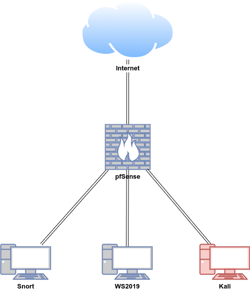
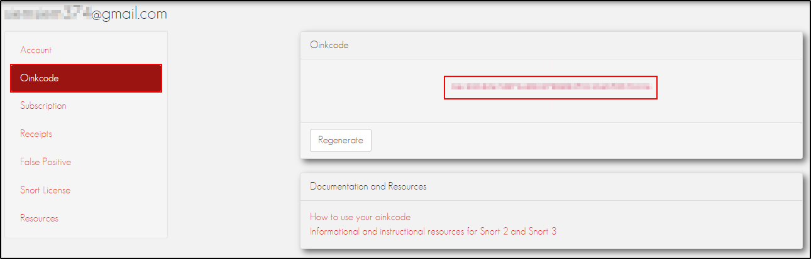
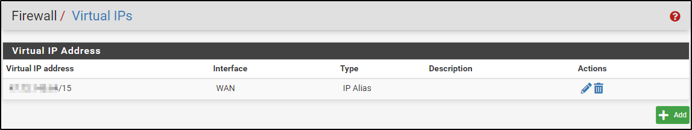

# **Snort**

Snort is an open-source network intrusion detection and prevention system (IDS/IPS) maintained by Cisco Systems. It is designed to monitor network traffic in real-time, analysing packets for signs of malicious activity, such as attacks, probes, or scans. Snort uses a combination of protocol analysis, content searching, and various preprocessors to detect and prevent intrusions.

<iframe width="560" height="315" src="https://www.youtube.com/embed/myel5Xb6ihg?si=-w9i3xlHjrXo6tj5" title="YouTube video player" frameborder="0" allow="accelerometer; autoplay; clipboard-write; encrypted-media; gyroscope; picture-in-picture; web-share" referrerpolicy="strict-origin-when-cross-origin" allowfullscreen></iframe>

## **Install Snort3 on Host**

In this demonstration, we will be installing Snort3 on an Ubuntu virtual machine. We will be simulating install in an air-gapped environment but note that some parts of the step requires internet connection.

## **Lab Setup for Proof of Concept**

In this proof of concept, attack simulation was conducted on the Kali machine in a safe and controlled setting. 

**Note: Do not attempt to replicate the attack simulation demonstrated here unless you are properly trained and it is safe to do so. Unauthorised attack simulation can lead to legal consequences and unintended damage to systems. Always ensure that such activities are conducted by qualified professionals in a secure, isolated environment.**

| **Host** | **OS** | **Role** | **IP Address** |
| --- | --- | --- | --- |
| pfsense | FreeBSD (pfSense v2.7.2) | Firewall/Router (Gateway IDS/IPS) | 192.168.1.200 (WAN) / 10.0.0.2 (LAN) |
| Snort | Ubuntu 22.04 LTS | Host IDS/IPS | 10.0.0.22 |
| WS2019 | Windows Server 2019 | Windows client | 10.0.0.24 |
| Kali | Kali Linux 2024.2 | Attacker machine | 10.0.0.29 |



### **Download Pre-requisites**

On a machine with internet connection:

Make a folder called /snort/pre-reqs and cd into it.

```python
mkdir snort/pre-reqs
cd snort/pre-reqs
```

Update the package lists and upgrade all the installed packages on your system to the latest available versions.

```python
sudo apt-get update && sudo apt-get upgrade -y
```

Download the required packages and their dependencies as a root user:

```python
apt-get install -y --download-only build-essential autotools-dev libdumbnet-dev libluajit-5.1-dev \
libpcap-dev zlib1g-dev pkg-config libhwloc-dev cmake liblzma-dev openssl libssl-dev cpputest \
libsqlite3-dev libtool uuid-dev git autoconf bison flex libcmocka-dev libnetfilter-queue-dev \
libunwind-dev libmnl-dev ethtool libjemalloc-dev libpcre3-dev libpcre16-3 libpcre32-3 libpcrecpp0v5 -o Dir::Cache::archives="/home/cyber/snort/pre-reqs"

#apt-get download libpcre3-dev libpcre16-3 libpcre32-3 libpcrecpp0v5

```

If you get permission error, change the directory’s permission

Error message:

```python
W: Download is performed unsandboxed as root as file '/home/cyber/snort/pre-reqs/libpcre16-3_2%3a8.39-13ubuntu0.22.04.1_amd64.deb' couldn't be accessed by user '_apt'. - pkgAcquire::Run (13: Permission denied)
```

Change the directory permission:

```python
sudo chmod 755 /home/cyber/snort/pre-reqs
```

### **Download Dependencies and Snort3**

Change directory into snort

```python
cd ~/snort
```

Download dependencies (pcre, gperftools, ragel, boost, hyperscan, flatbuffers, libdaq, pulledpork3) and Snort by running:

```python
wget https://github.com/PCRE2Project/pcre2/releases/download/pcre2-10.44/pcre2-10.44.tar.gz
wget https://github.com/gperftools/gperftools/releases/download/gperftools-2.15/gperftools-2.15.tar.gz
wget https://www.colm.net/files/ragel/ragel-6.10.tar.gz
wget https://boostorg.jfrog.io/artifactory/main/release/1.86.0/source/boost_1_86_0.tar.gz
wget [https://github.com/intel/hyperscan/archive/refs/tags/v5.4.2.tar.gz](https://github.com/intel/hyperscan/archive/refs/tags/v5.4.2.tar.gz) -O hyperscan-v5.4.2.tar.gz
wget https://github.com/google/flatbuffers/archive/refs/tags/v2.0.0.tar.gz -O flatbuffers-v2.0.0.tar.gz
wget https://github.com/snort3/libdaq/archive/refs/tags/v3.0.16.tar.gz -O libdaq-v3.0.16.tar.gz
wget [https://github.com/snort3/snort3/archive/refs/tags/3.3.5.0.tar.gz](https://github.com/snort3/snort3/archive/refs/tags/3.3.5.0.tar.gz) -O snort3-3.3.5.0.tar.gz
git clone https://github.com/shirkdog/pulledpork3.git
```

### **Install Pre-requisites**

Transfer the snort folder to your air-gapped host. 

Change directory into pre-reqs and install the downloaded `.deb` files using `dpkg`:

```python
sudo dpkg -i *.deb
```

### **Install Dependencies**

Change directory into snort folder and untar pcre2-10.44.tar.gz

Change directory into pcre2-10.44 and run configure.

Run make and then sudo make install.

```python
tar -xzvf pcre2-10.44.tar.gz
cd pcre2-10.44/
./configure
make
sudo make install
```

Repeat the same process for gperftools-2.15.tar.gz

```python
tar -xzvf gperftools-2.15.tar.gz
cd gperftools-2.15/
./configure
make
sudo make install
```

Repeat the same process for ragel

```python
tar -xzvf ragel-6.10.tar.gz
cd ragel-6.10
./configure
make
sudo make install
```

Untar Boost C++ Libraries:

```python
tar -xvzf boost_1_86_0.tar.gz
```

For installing hyerperscan, run:

```python
tar -xvzf hyperscan-v5.4.2.tar.gz
mkdir ~/snort/hyperscan-5.4.2-build
cd hyperscan-5.4.2-build/
cmake -DCMAKE_INSTALL_PREFIX=/usr/local -DBOOST_ROOT=~/snort/boost_1_86_0/ ../hyperscan-5.4.2
make
sudo make install
```

Install flatbuffers:

```python
tar -xzvf flatbuffers-v2.0.0.tar.gz
mkdir flatbuffers-build
cd flatbuffers-build
cmake ../flatbuffers-2.0.0
make
sudo make install
```

Install Data Acquistion (DAQ) from Snort

```python
tar -xzvf libdaq-v3.0.16.tar.gz
cd libdaq-3.0.16
./bootstrap
./configure
make
sudo make install
```

Update the system's dynamic linker run-time bindings (shared libraries)

```python
sudo ldconfig
```

Install the latest version of Snort 3

```python
tar -xzvf snort3-3.3.5.0.tar.gz
cd snort3-3.3.5.0/
./configure_cmake.sh --prefix=/usr/local --enable-jemalloc
cd build
make
sudo make install
```

Verify Snort3 is installed by running:

```python
/usr/local/bin/snort -V

   ,,_     -*> Snort++ <*-
  o"  )~   Version 3.3.5.0
   ''''    By Martin Roesch & The Snort Team
           http://snort.org/contact#team
           Copyright (C) 2014-2024 Cisco and/or its affiliates. All rights reserved.
           Copyright (C) 1998-2013 Sourcefire, Inc., et al.
           Using DAQ version 3.0.16
           Using Hyperscan version 5.4.2 2024-09-10
           Using Jemalloc version 5.2.1-0-gea6b3e973b477b8061e0076bb257dbd7f3faa756
           Using libpcap version 1.10.1 (with TPACKET_V3)
           Using LuaJIT version 2.1.0-beta3
           Using LZMA version 5.2.5
           Using OpenSSL 3.0.2 15 Mar 2022
           Using PCRE version 8.39 2016-06-14
           Using ZLIB version 1.2.11
```

Test snort by using its default config file:

```python
snort -c /usr/local/etc/snort/snort.lua
...
Snort successfully validated the configuration (with 0 warnings).
```

Find your network interface by running `ip a`

```python
ip a
...
2: ens32: <BROADCAST,MULTICAST,UP,LOWER_UP> mtu 1500 qdisc fq_codel state UNKNOWN group default qlen 1000
    link/ether 00:0c:29:86:08:64 brd ff:ff:ff:ff:ff:ff
    altname enp2s0
    inet 10.0.0.22/24 brd 10.0.0.255 scope global dynamic noprefixroute ens32
```

Run following:

```python
sudo ethtool -k ens32 | grep receive-offload
...
generic-receive-offload: on
large-receive-offload: off [fixed]
```

Create a service to disable Large Receive Offload (LRO)

```python
sudo nano /lib/systemd/system/ethtool.service
```

Copy and paste following:

Put your network interface 

```python
[Unit]
Description=Ethtool Configration for Network Interface

[Service]
Requires=network.target
Type=oneshot
ExecStart=/sbin/ethtool -K ens32 gro off
ExecStart=/sbin/ethtool -K ens32 lro off

[Install]
WantedBy=multi-user.target
```

Enable and start the service

```python
sudo systemctl enable ethtool
sudo service ethtool start
```

Verify that LRO is disabled by running

```python
sudo ethtool -k ens32 | grep receive-offload
...
generic-receive-offload: off
large-receive-offload: off [fixed]
```

## **Test IDS with local rules**

Create a folder called rules in the following directory

```python
sudo mkdir /usr/local/etc/rules
```

Create a file called local.rules

```python
sudo nano /usr/local/etc/rules/local.rules
```

Copy and paste following

First alert detects any ICMP Ping traffic and second alert detects any SSH Authentication Attempt to our internal network 

```python
alert icmp any any -> $HOME_NET any (msg:"ICMP Ping Detected"; sid:1000001; rev:1;)
alert tcp any any -> $HOME_NET 22 (msg:"SSH Authentication Attempt"; sid:1000002; rev:1;)
```

Run snort with configuration file to test the rule

```python
snort -c /usr/local/etc/snort/snort.lua -R /usr/local/etc/rules/local.rules
...
Snort successfully validated the configuration (with 0 warnings).
```

Run snort to generate alert in a single line

Snort will be listening on ens32 for any icmp traffic

```python
sudo snort -c /usr/local/etc/snort/snort.lua -R /usr/local/etc/rules/local.rules -i ens32 -A alert_fast
```

From another Linux host, execute ping and attempt ssh to 10.0.0.22. This will generate alerts on terminal verifying that the rule works:

```python
09/11-22:01:05.659667 [**] [1:1000002:1] "SSH Authentication Attempt" [**] [Priority: 0] {TCP} 10.0.0.21:36708 -> 10.0.0.22:22
09/11-22:01:19.086427 [**] [1:1000001:1] "ICMP Ping Detected" [**] [Priority: 0] {ICMP} 10.0.0.21 -> 10.0.0.22
```

Edit Snort’s configuration 

```python
sudo nano /usr/local/etc/snort/snort.lua
```

For HOME_NET, setup the network addresses you are protecting.

For EXTERNAL_NET, leave as any.

In the ips section, uncomment enable_builtin_rules = true and add include = “/usr/local/etc/rules/local.rules”, (include comma)

In the configure ourputs section uncomment alert_fast = {file=true} to enable logging for the alerts

```python
-- HOME_NET and EXTERNAL_NET must be set now
-- setup the network addresses you are protecting
HOME_NET = '10.0.0.0/24'

-- set up the external network addresses.
-- (leave as "any" in most situations)
EXTERNAL_NET = 'any'
...
ips =
{
    -- use this to enable decoder and inspector alerts
    enable_builtin_rules = true,

    -- use include for rules files; be sure to set your path
    -- note that rules files can include other rules files
    -- (see also related path vars at the top of snort_defaults.lua)
    include = "/usr/local/etc/rules/local.rules",
    variables = default_variables
}
...
---------------------------------------------------------------------------
-- 7. configure outputs
---------------------------------------------------------------------------
-- event logging
-- you can enable with defaults from the command line with -A <alert_type>
-- uncomment below to set non-default configs
--alert_csv = { }
alert_fast = {file=true}
```

Run snort to generate alert in a single line but exclude entry for local rules.

Snort will be listening on ens32 for any icmp traffic

```python
sudo snort -c /usr/local/etc/snort/snort.lua -i ens32 -A alert_fast
```

Verify that alerts are generated from ping

```python
09/11-21:41:15.522160 [**] [1:1000001:1] "ICMP Ping Detected" [**] [Priority: 0] {ICMP} 10.0.0.24 -> 10.0.0.22
09/11-21:41:15.522206 [**] [1:1000001:1] "ICMP Ping Detected" [**] [Priority: 0] {ICMP} 10.0.0.22 -> 10.0.0.24
```

To output alert_fast as a text log file, run

```python
mkdir /var/log/snort
sudo chown -R 1000:1000 /var/log/snort
...
sudo snort -c /usr/local/etc/snort/snort.lua -i ens32 -A alert_fast -l /var/log/snort
```

Verify that alert_fast.txt file is generated

```python
ls /var/log/snort
...
cat /var/log/snort/alert_fast.txt
...
09/11-23:16:18.831740 [**] [1:1000001:1] "ICMP Ping Detected" [**] [Priority: 0] {ICMP} 10.0.0.21 -> 10.0.0.22
09/11-23:16:37.707792 [**] [1:1000002:1] "SSH Authentication Attempt" [**] [Priority: 0] {TCP} 10.0.0.21:60514 -> 10.0.0.22:22
```

### **Install Pulledpork3**

Note `git clone https://github.com/shirkdog/pulledpork3.git` command was run when downloading dependencies.

```python
cd ~/snort/pulledpork3
sudo mkdir /usr/local/bin/pulledpork3
sudo cp pulledpork.py /usr/local/bin/pulledpork3
sudo cp -r lib/ /usr/local/bin/pulledpork3
sudo chmod +x /usr/local/bin/pulledpork3/pulledpork.py
sudo mkdir /usr/local/etc/pulledpork3
sudo cp etc/pulledpork.conf /usr/local/etc/pulledpork3/
```

Verify that pulled pork is running

```python
/usr/local/bin/pulledpork3/pulledpork.py -V

PulledPork v3.0.0.5

    https://github.com/shirkdog/pulledpork3
      _____ ____
     `----,\    )   PulledPork v3.0.0.5
      `--==\\  /    Lowcountry yellow mustard bbq sauce is the best bbq sauce. Fight me.
       `--==\\/
     .-~~~~-.Y|\\_  Copyright (C) 2021 Noah Dietrich, Colin Grady, Michael Shirk
  @_/        /  66\_  and the PulledPork Team!
    |    \   \   _(")
     \   /-| ||'--'   Rules give me wings!
      \_\  \_\\
~~~~~~~~~~~~~~~~~~~~~~~~~~~~~~~~~~~~~~~~~~~~~~~~~~~~~~~~~~~~~~
```

Edit pulledpork.conf 

```python
sudo nano /usr/local/etc/pulledpork3/pulledpork.conf
```

Change the community ruleset value to true.

*Yon can select registered ruleset but due to incompatibility between registered ruleset version (3.1.7.0) and the snort version (3.3.5.0), selecting registered ruleset will give you an error. Either install Snort v 3.1.X.X or wait for registered ruleset version (3.3.X.X) to get released or use the community ruleset in the meantime.* 

Copy and paste your Oinkcode (API Key). This step is optional.

Comment out blocklist_path

Uncomment snort_path and make sure it is set to the right path

Uncomment local_rules and make sure it is set to the right path

Comment sorule_path (optional but if uncommented, make a directory /usr/local/etc/so_rules/)

```python
# Which Snort/Talos rulesets do you want to download (recomended: choose only one)
community_ruleset = true
registered_ruleset = false
LightSPD_ruleset = false

# Your Snort oinkcode is required for snort/talos Subscription, Light_SPD, and Registered rules>
oinkcode = 

# Where to write the blocklist file (single file containing all blocklists downloaded)
#blocklist_path = /usr/local/etc/lists/default.blocklist

# Where is the Snort Executable located (if not on the system path)
snort_path = /usr/local/bin/snort

# Local Rules files
# Specify local rules files, comma-separated
local_rules = /usr/local/etc/rules/local.rules  

# where should so rules be saved
# so rules will only be processed if this is uncommented
sorule_path = /usr/local/etc/so_rules/

```

To obtain the Oinkcode, create an account in Snort3.



Run Pulledpork3 

```python
sudo /usr/local/bin/pulledpork3/pulledpork.py -c /usr/local/etc/pulledpork3/pulledpork.conf
```

If you receive error below, make a directory called so_rules

```python
ERROR: `sorule_path` is configured but is not a directory:  /usr/local/etc/so_rules/
...
sudo mkdir /usr/local/etc/so_rules/
```

### **Troubleshooting for Registered Ruleset**

If you have selected registered ruleset and receive the error below, edit snort rules version number in pulledpork.py

```python
WARNING: Unable to load rules archive:  422 Client Error: Unprocessable Content for url: https://snort.org/rules/snortrules-snapshot-3350.tar.gz?oinkcode=<hidden>
```

Make a backup copy of pulledpork.py and edit pulledpork.py

```python
sudo cp /usr/local/bin/pulledpork3/pulledpork.py /usr/local/bin/pulledpork3/oldpulledpork.py
sudo nano /usr/local/bin/pulledpork3/pulledpork.py
```

Edit RULESET_URL_SNORT_REGISTERED

The snortrules-snapshot version number can be found on [https://www.snort.org/downloads](https://www.snort.org/downloads)

The numbers indicate version number so 31730 (v3.1.7.0) is the latest registered Snort rulest. 

Community rules are free and maintained by the Snort community. Registered rules are available for free but require you to create an account on the Snort website and obtain an Oinkcode. Subscriber rules required a paid subscription and provides immediate access to the most up-to-date rules. 

```python
RULESET_URL_SNORT_REGISTERED = 'https://snort.org/rules/snortrules-snapshot-31470.tar.gz'
```

### **Test IDS with Community Ruleset**

Rerun Pulledpork:

```python
sudo /usr/local/bin/pulledpork3/pulledpork.py -c /usr/local/etc/pulledpork3/pulledpork.conf
...
Writing rules to:  /usr/local/etc/rules/pulledpork.rules
Program execution complete.
```

Edit snort’s config to point to Pulledpork’s rules

```python
sudo nano /usr/local/etc/snort/snort.lua
```

Change the include path to point to pulledpork.rules

```python
ips =
{
    -- use this to enable decoder and inspector alerts
    enable_builtin_rules = true,

    -- use include for rules files; be sure to set your path
    -- note that rules files can include other rules files
    -- (see also related path vars at the top of snort_defaults.lua)
    include = "/usr/local/etc/rules/pulledpork.rules",
    variables = default_variables
}

```

You can see what the rules look like

```python
cat /usr/local/etc/rules/pulledpork.rules | less
```

Test Snort

```python
snort -c /usr/local/etc/snort/snort.lua --plugin-path /usr/local/etc/so_rules/
...
Snort successfully validated the configuration (with 0 warnings).
```

Trigger alert by running:

```python
curl http://testmyids.com
```

Verify that alerts are generated by the community rules

```python
tail alert_fast.txt 
```

```python
09/16-23:11:10.392572 [**] [1:498:11] "INDICATOR-COMPROMISE id check returned root" [**] [Classification: Potentially Bad Traffic] [Priority: 2] {TCP} 217.160.0.187:80 -> 10.0.0.22:36062
09/16-23:11:12.926837 [**] [1:498:11] "INDICATOR-COMPROMISE id check returned root" [**] [Classification: Potentially Bad Traffic] [Priority: 2] {TCP} 217.160.0.187:80 -> 10.0.0.22:36076
```

## **Test IPS**

Start Snort in IPS mode using DAQ AFPacket by running:

```python
sudo snort -c /usr/local/etc/snort/snort.lua --daq afpacket -A alert_fast -l /var/log/snort -i ens32
```

Note to run Snort in IPS mode using DAQ NFQueue, run: 

```python
sudo snort -Q --daq nfq --daq-var device=ens32 --daq-var queue=1 -c /usr/local/etc/snort/snort.lua -A alert_fast -l /var/log/snort
```

Create the queue. To send traffic for the interface `ens32` to NFQ, for incoming and outgoing traffic on the `ens32` interface:

```python
sudo iptables -I INPUT -i ens32 -j NFQUEUE --queue-num 1
sudo iptables -I OUTPUT -o ens32 -j NFQUEUE --queue-num 1
```

For forwarded traffic (if Snort is installed at the gateway):

```python
sudo iptables -I FORWARD -i ens32 -j NFQUEUE --queue-num 1
```

Verify iptables configuration by running:

```python
sudo iptables -L -v -n
```

To determine the line numbers for your `NFQUEUE` rules, run:

```python
sudo iptables -L --line-numbers
```

This will output a list of all the rules in your iptables with their corresponding line numbers. You should look for the rules in the `INPUT` and `OUTPUT` chains that mention `NFQUEUE`, and note their line numbers. Once you have the line numbers, you can delete the rules using:

```python
sudo iptables -D INPUT <line_number>
sudo iptables -D OUTPUT <line_number>
```

Change verb in the local.rules from `alert` to `drop` 

```python
nano /usr/local/etc/rules/local.rules
```

```python
drop icmp any any -> $HOME_NET any (msg:"ICMP Ping Detected"; sid:1000001; rev:1;)
drop tcp any any -> $HOME_NET 22 (msg:"SSH Authentication Attempt"; sid:1000002; rev:1;)
```

From another internal host, run ping to Snort virtual machine. Ping should not go through.

```python
ping 10.0.0.22
```

Verify that alerts have been generated in alert_fast.txt

```python
tail /var/log/snort/alert_fast.txt
```

Note: running Snort in IPS mode using DAQ NFQueue is ideal in this scenario but this does not generate logs in alert_fast.txt. For demonstration purposes, Snort was run in IPS mode using DAQ AFPacket.

### **Install Snort Ruleset Offline**

**On a machine with internet connection,** download snort3-community-rules.tar.gz from [https://www.snort.org/downloads](https://www.snort.org/downloads)

**Transfer the tarball to the air-gapped environment.** 

Make a folder called snort-rules

Untar the tarball to snort-rules folder

```python
mkdir ~/snort/snort-rules
tar -xvzf snort3-community-rules.tar.gz -C /home/cyber/snort/snort-rules/
```

Merge all `.rules` into single rule file:

```python
cat *.rules > merged.rules
```

Move the Merged File to the pulledpork.rules in the Snort Rules Directory:

```python
sudo mv merged.rules /etc/snort/rules/pulledpork.rules
```

### **Malware traffic analysis - reading pcap with Snort**

Make a directory called test and cd into it.

Download a sample pcap from https://www.malware-traffic-analysis.net

```python
mkdir ~/test
cd ~/test
wget https://www.malware-traffic-analysis.net/2024/02/08/2024-02-08-TA577-Pikabot-infection-traffic.pcap.zip
unzip 2024-02-08-TA577-Pikabot-infection-traffic.pcap.zip 
```

Read the pcap with Snort and focus on signatures generated

```python
snort -c /usr/local/etc/snort/snort.lua --plugin-path /usr/local/etc/so_rules/ -r 2024-02-08-TA577-Pikabot-infection-traffic.pcap -A alert_fast -q > pcap-signatures_pikabot.txt
```

Cat out or grep out pcap-signatures_pikabot.txt

```python
cyber@Snort:~/test$ cat pcap-signatures_pikabot.txt | cut -d "]" -f 3 | cut -d "[" -f 1 |  cut -d '"' -f 2 | sort | uniq -c | sort -nr
    110 (arp_spoof) unicast ARP request
      4 PROTOCOL-DNS SPOOF query response with TTL of 1 min. and no authority
      4 INDICATOR-SCAN UPnP service discover attempt
      1 (http_inspect) URI path contains consecutive slash characters
      1 (http_inspect) Content-Transfer-Encoding used as HTTP header
```

```python
grep -i spoof pcap-signatures_pikabot.txt 
02/09-05:25:59.548577 [**] [1:254:17] "PROTOCOL-DNS SPOOF query response with TTL of 1 min. and no authority" [**] [Classification: Potentially Bad Traffic] [Priority: 2] {UDP} 10.2.8.1:53 -> 10.2.8.101:64560
02/09-05:29:14.405544 [**] [112:1:1] "(arp_spoof) unicast ARP request" [**] [Priority: 3] {ARP}  -> 

```

## **Install Snort on Gateway**

While Suricata can be installed on a host, it can also be installed on a gateway such as **pfSense**. The pfSense is a free and open source firewall and router. For installing and configuring pfSense, refer to pfSense [documentation](https://docs.netgate.com/pfsense/en/latest/) and instruction [video](https://youtu.be/Ayr_av2EX_U?si=c4k5XdMjTvNpqRa4). pfSense can be downloaded from [here.](https://www.pfsense.org/download/)

Full demonstration video on configuring Suricata on pfSense can be found [here](https://youtu.be/SapAcfHbQSE?si=PWCVnzLmpqgTVvh1). 

After competing basic configuration on pfSense, navigate to System > Package Manager > Available Packages on pfSense web UI.

Search for `snort` and click install (confirm when prompted). Internet connection is required.


Navigate to Services > Snort > Global Settings tab. 

### **Test IDS and IPS with open source rules**

In this demonstration, we are running Snort on the **WAN** interface. Full demonstration video can be found [here](https://youtu.be/TvQfD5oUN5o?si=-Wx0jDCGnpeXz-8M). 

Select Enable Snort VRT. Copy and paste your Snort Oinkmaster Code (you will need to create an account in [https://www.snort.org/](https://www.snort.org/)).

Enable Snort GPLv2, and ET Open.


Enable OpenAppID, AppID Open Text Rules, and FEODO Tracker Botnet C2 IP Rules.

Set Rule Update Interval to 1 Day and select Hide Deprecated Rules Categories.


Select Remove Blocked Hosts interval to your preferred time. Click save.


Navigate to the Updates tab and click Update Rules.


Once the update is complete, you will see timestamps of when the update is completed.


Navigate to Interfaces tab and add a WAN interface. Enable Interface and name it **WAN**.


Select Block Offenders. Set IPS Mode to Legacy Mode and select SRC IP to Block. Click Save.


Navigate to WAN Categories. Select Use IPS Policy and set IPS Policy to Security. Click Save.


Navigate to WAN Rules. Select IPS Policy-Security and click Apply.


Navigate to WAN IP Rep and select Enable IP Reputation. Click Save.


Make sure the WAN interface is up and running. If not, click the play button.


Navigate to Firewall > NAT and add 1:1 NAT for Windows host. 


Navigate to Firewall > Virtual IPs and add Public IP for Windows host.



From Kali machine, run `nmap (public IP)`  

Navigate to Alerts and verify that alerts have been generated.


Navigate to Blocked and verify that the Kali machine is being blocked


### **Test IDS and IPS with custom rules**

In this demonstration, we are running Snort on the **LAN** interface. 

Navigate to Snort Interfaces > WAN Settings. In this demonstration, we have changed the WAN to LAN. Enable interface and name it as the **LAN** interface. 


Save and Edit the LAN interface. Note instead of WAN Settings it now displays LAN Settings.

Navigate to LAN Rules and select custom.rules. Copy and paste the following rule to detect ping from internal to external network.

```python
alert icmp $HOME_NET any -> [8.8.8.8] any (msg:"ICMP Ping Detected to EXTERNAL IP"; sid:1000001; rev:1;)
```


Turn on the LAN interface by clicking the play button.


From the Windows host that is connect to an internal network, run ping to 8.8.8.8

```python
ping 8.8.8.8
```

Navigate to Alerts and verify that Alerts have been generated.


Navigate to Snort Interfaces > LAN Settings. 

Select Block Offenders. Set IPS Mode to Inline Mode and click Save.


Navigate to LAN Rules. Select custom.rules. Change the rule verb from `alert` to `drop` 

```python
drop icmp $HOME_NET any -> [8.8.8.8] any (msg:"ICMP Ping Detected to EXTERNAL IP"; sid:1000001; rev:1;)
```


From the Windows host that is connect to an internal network, run ping to 8.8.8.8

```python
ping 8.8.8.8
```

Verify that pings were dropped.


## **References**

- https://docs.snort.org/start/
- https://github.com/snort3/snort3
- https://youtu.be/j7Wapw3Gxvg?si=cVRojAePvL7z5rMx
- https://youtu.be/TvQfD5oUN5o?si=-Wx0jDCGnpeXz-8M
- https://youtu.be/SapAcfHbQSE?si=LPiMoqLVnZ5D2Lqx