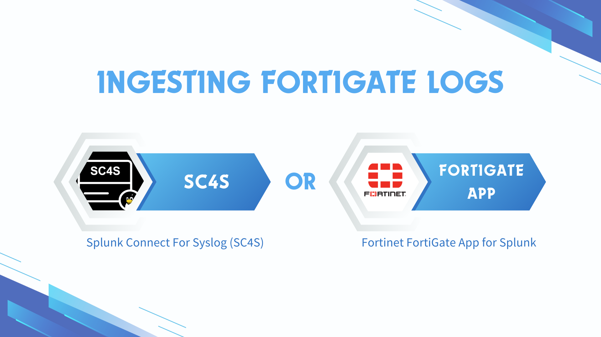
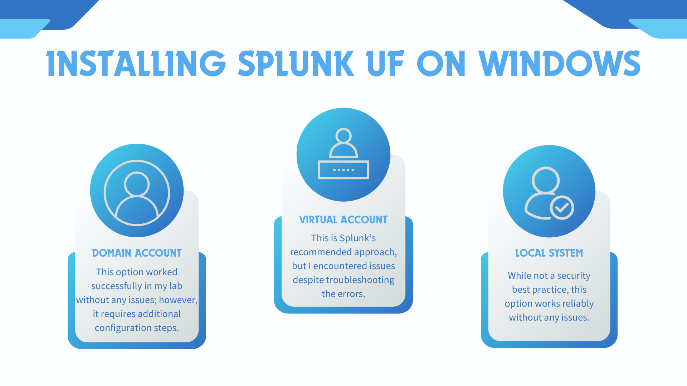

# **Splunk**

Splunk Enterprise is a Security Information and Event Management (SIEM) tool usually installed on the server. It is designed for searching, analysing, and visualising data. It allows users to collect and ingest data, and search across various data types. Splunk Universal Forwarders are usually installed on clients to provide reliable, secure data collection and forward that data into Splunk Enterprise for indexing. This part of documentation focuses on installing and configuring Splunk. For Splunk, the main focus will be installing Splunk Enterprise and Universal Forwarder. 

<iframe width="560" height="315" src="https://www.youtube.com/embed/tDib15f07zs?si=OTP0a6Fne4B5TdKq" title="YouTube video player" frameborder="0" allow="accelerometer; autoplay; clipboard-write; encrypted-media; gyroscope; picture-in-picture; web-share" referrerpolicy="strict-origin-when-cross-origin" allowfullscreen></iframe>

## **Lab Setup for Proof of Concept**

In this proof of concept, Splunk Enterprise was installed on an Ubuntu VM (Virtual Machine), and the Splunk Universal Forwarder was installed on both Ubuntu and Windows VMs. An attack emulation was conducted on the FortiGate VM in a safe and controlled environment.

**Note: Do not attempt to replicate the attack emulation demonstrated here unless you are properly trained and it is safe to do so. Unauthorised attack emulation can lead to legal consequences and unintended damage to systems. Always ensure that such activities are conducted by qualified professionals in a secure, isolated environment.**

**For Documentation:**

| **Hostname** | **OS** | **Role** | **IP Address** |
| --- | --- | --- | --- |
| Fortigate | Fortios 7.6.0 | Firewall/Router | 192.168.1.10 (WAN) / 
10.0.0.1 (LAN) |
| Splunk | Ubuntu 24.04  | Splunk Enterprise (server), SC4S | 10.0.0.100 |
| Ubuntu | Ubuntu 24.04  | Splunk Universal Forwarder (Linux client) | 10.0.0.200 |
| WS2019 | Windows Server 2019 | Splunk Universal Forwarder (Windows client) | 10.0.0.50 |
| Kali | Kali Linux 2025.1 | Attacker machine | 10.0.0.22 |


## **Installing Splunk Enterprise Offline**

This documentation explains how to install Splunk Enterprise offline on Ubuntu or CentOS virtual machines (VMs).


### **On an Internet-Connected Machine (Ubuntu)**

On an internet-connected **Ubuntu VM**, refresh the package lists from the repositories and create a structured directory for downloading dependencies:

```bash
sudo apt-get update
mkdir -p ~/splunk-offline/{vmtools,nettools,docker,sc4s,apps}
```

Download and install VM tools and its dependencies (this will enable copy and pasting and dynamic resolution). After installing VM tools, reboot the VM. 

```bash
cd ~/splunk-offline/vmtools
apt-get download \
  libatkmm-1.6-1v5 \
  libcairomm-1.0-1v5 \
  libglibmm-2.4-1t64 \
  libgtkmm-3.0-1t64 \
  libmspack0t64 \
  libpangomm-1.4-1v5 \
  libsigc++-2.0-0v5 \
  libxmlsec1t64 \
  libxmlsec1t64-openssl \
  open-vm-tools \
  open-vm-tools-desktop \
  zerofree
sudo dpkg -i *.deb
```

Register on the Splunk website for a free trial and download [Splunk Enterprise](https://www.splunk.com/en_us/download/splunk-enterprise.html) for Linux. There are options for `.tgz`, `.deb`, and `.rpm`. Use `wget` and copy and paste the wget link in the `splunk-offline` directory. 

```bash
cd ~/splunk-offline
wget -O splunk-9.4.1-linux-amd64.tgz "https://download.splunk.com/products/splunk/releases/9.4.1/linux/splunk-9.4.1-<SNIP>-linux-amd64.tgz"
```

Download Docker Engine and its dependencies. If you are using **CentOS**, skip this step as Podman is already installed.

```bash
#Ubuntu 22.04
cd ~/splunk-offline/docker
wget https://download.docker.com/linux/ubuntu/dists/jammy/pool/stable/amd64/containerd.io_1.7.25-1_amd64.deb
wget https://download.docker.com/linux/ubuntu/dists/jammy/pool/stable/amd64/docker-ce_28.0.0-1~ubuntu.22.04~jammy_amd64.deb
wget https://download.docker.com/linux/ubuntu/dists/jammy/pool/stable/amd64/docker-ce-cli_28.0.0-1~ubuntu.22.04~jammy_amd64.deb
wget https://download.docker.com/linux/ubuntu/dists/jammy/pool/stable/amd64/docker-buildx-plugin_0.21.0-1~ubuntu.22.04~jammy_amd64.deb
wget https://download.docker.com/linux/ubuntu/dists/jammy/pool/stable/amd64/docker-compose-plugin_2.33.0-1~ubuntu.22.04~jammy_amd64.deb
```

```bash
#Ubuntu 24.04
cd ~/splunk-offline/docker
wget https://download.docker.com/linux/ubuntu/dists/noble/pool/stable/amd64/containerd.io_1.7.25-1_amd64.deb
wget https://download.docker.com/linux/ubuntu/dists/noble/pool/stable/amd64/docker-ce_28.0.0-1~ubuntu.24.04~noble_amd64.deb
wget https://download.docker.com/linux/ubuntu/dists/noble/pool/stable/amd64/docker-ce-cli_28.0.0-1~ubuntu.24.04~noble_amd64.deb
wget https://download.docker.com/linux/ubuntu/dists/noble/pool/stable/amd64/docker-buildx-plugin_0.21.0-1~ubuntu.24.04~noble_amd64.deb
wget https://download.docker.com/linux/ubuntu/dists/noble/pool/stable/amd64/docker-compose-plugin_2.33.0-1~ubuntu.24.04~noble_amd64.deb

```

Download net-tools. 

```python
cd ~/splunk-offline/nettools
apt-get download net-tools
```

Download the latest SC4S container image `oci_container.tgz` from [SC4S GitHub](https://github.com/splunk/splunk-connect-for-syslog/releases) page.

```bash
cd ~/splunk-offline/sc4s
wget https://github.com/splunk/splunk-connect-for-syslog/releases/download/v3.34.3/oci_container.tar.gz
```

Download the following Splunk Apps (tar archive files). You will need to login using the registered credential.

- [Splunk Add-on for MS Windows](https://splunkbase.splunk.com/app/742)
- [Splunk Add-on for Sysmon](https://splunkbase.splunk.com/app/5709)
- [Fortinet FortiGate Add-On for Splunk](https://splunkbase.splunk.com/app/2846) (optional: required if ingesting FortiGate logs through this App)
- [Splunk Add-on for Unix and Linux](https://splunkbase.splunk.com/app/833)

Copy the Splunk Apps to `~/splunk-offline/apps/` directory. Verify that the apps have been copied.

```bash
cp ~/Downloads/*.tgz ~/splunk-offline/apps/
cd ~/splunk-offline/apps/
ls
```

Compress all dependencies with `sudo` privileges before transferring them. This process may take some time.

```bash
cd ~/splunk-offline
sudo tar -czvf splunk-offline.tar.gz *
```

Change the ownership of `splunk-offline.tar.gz` to your standard user and group, then verify the change.

```bash
sudo chown $(whoami):$(id -g -n) splunk-offline.tar.gz
ls -la
```

Transfer `splunk-offline.tar.gz` to the air-gapped Ubuntu VM using a USB drive.

### **On the Air-Gapped Environment**

On the air-gapped VM, make a directory called `splunk-offline` and extract the transferred archive. This process may take some time.

```bash
mkdir ~/splunk-offline && cd ~/splunk-offline
tar -xzvf ~/splunk-offline.tar.gz
```

Install VM tools and its dependencies (this will enable copy and pasting and dynamic resolution). After installing VM tools, reboot the VM. 

```bash
cd ~/splunk-offline/vmtools
sudo dpkg -i *deb
```

Install Docker and its dependencies. Verify Installation.

```python
cd ~/splunk-offline/docker
sudo dpkg -i *
docker --version
```

Run `sudo service docker start`

```python
sudo service docker start
```

Run the following command to add your user to the `docker` group:

```python
sudo usermod -aG docker $(whoami)
```

Reload the group membership for your current session with the following command:

```python
newgrp docker
```

Check if you can run Docker commands without `sudo`:

```python
docker ps
```

Install net-tools and verify installation.

```python
cd ~/splunk-offline/nettools
sudo dpkg -i *.deb
ifconfig
```

In a new tab as the standard user, set the host OS kernel to match the default receiver buffer of SC4S, which is set to 16MB. Add the following content to `/etc/sysctl.conf`:

```python
sudo nano /etc/sysctl.conf
```

```python
net.core.rmem_default = 17039360
net.core.rmem_max = 17039360
```

Apply to the kernel by running the command  `sysctl -p`

```python
sudo sysctl -p
```

Ensure the kernel is not dropping packets. Please note that you may see some packet receive errors due to the air-gapped environment. These errors can be ignored.

```python
netstat -su | grep "receive errors" 
```

Extract the `splunk-offline` tar archive to the `/opt` directory.

```bash
cd ~/splunk-offline
sudo tar xvzf splunk*.tgz -C /opt
```

Create user `splunk` and change ownership of `/opt/splunk` directory to the `splunk` user. Enter password and user information for the `splunk` user (use default values by pressing `enter` ). 

```python
sudo adduser splunk
```

If you are using **CentOS**, after adding user, go to settings > Users. Unlock to Change Settings. Set password for the `splunk` user. Make the `splunk` user the owner of the `/opt/splunk` directory and verify the ownership.

```bash
sudo chown -R splunk:splunk /opt/splunk
cd /opt
ls -la
```

```python
#Example output
total 12
drwxr-xr-x  3 root   root   4096 Sep 18 15:36 .
drwxr-xr-x 20 root   root   4096 Sep 18 15:21 ..
drwxr-xr-x 11 **splunk splunk** 4096 Sep  6 05:58 splunk
```

Switch to `splunk` user and start Splunk Enterprise. When prompted, create admin credentials.

```bash
su splunk
```

```bash
cd /opt/splunk/bin
./splunk start --accept-license
```

```bash
This appears to be your first time running this version of Splunk.

Splunk software must create an administrator account during startup. Otherwise, you cannot log in.
Create credentials for the administrator account.
Characters do not appear on the screen when you type in credentials.

Please enter an administrator username: splunk #Create your username
Password must contain at least: #Create your password
   * 8 total printable ASCII character(s).
Please enter a new password: 
Please confirm new password: 
```

In the `/opt/splunk/bin/` directory, configure Splunk to listen on port 9997

```bash
./splunk enable listen 9997
```

```bash
#Example Output
Listening for Splunk data on TCP port 9997.
```

Navigate to `http://<IP address>:8000`on a web browser. Enter Splunk admin credentials. Verify that you can navigate the Splunk web interface.


### **Configuring Firewall (Optional)**

On Ubuntu, run the following command as a standard user in a new tab. This will configure and enable Firewall. In this lab, however, we will disable the firewall.

```bash
sudo ufw allow 514/tcp  # syslog TCP
sudo ufw allow 514/udp  # syslog UDP
sudo ufw allow 6514/tcp # syslog TLS
sudo ufw allow 5425/tcp # syslog
sudo ufw allow 601/tcp  # syslog
sudo ufw allow 8000/tcp # Web UI Port
sudo ufw allow 8080/tcp # HEC Port
sudo ufw allow 8088/tcp # HEC Port
sudo ufw allow 8089/tcp # Management Port
sudo ufw allow 9997/tcp # Data flow
sudo ufw allow 8065/tcp # Appserver
sudo ufw allow 8191/tcp # KVstore
sudo ufw enable
sudo ufw reload
```

Alternatively, if you are on CentOS, run the following command to configure and enable Firewall:

```bash
sudo firewall-cmd --zone=public --add-port=514/tcp --permanent # syslog TCP
sudo firewall-cmd --zone=public --add-port=514/udp --permanent # syslog UDP
sudo firewall-cmd --zone=public --add-port=5514/udp --permanent # syslog UDP
sudo firewall-cmd --zone=public --add-port=6514/tcp --permanent # syslog TLS
sudo firewall-cmd --zone=public --add-port=5425/tcp --permanent # syslog
sudo firewall-cmd --zone=public --add-port=601/tcp --permanent # syslog
sudo firewall-cmd --zone=public --add-port=8000/tcp --permanent # Web UI Port
sudo firewall-cmd --zone=public --add-port=8080/tcp --permanent # HEC port
sudo firewall-cmd --zone=public --add-port=8088/tcp --permanent # HEC port
sudo firewall-cmd --zone=public --add-port=8089/tcp --permanent # Managment Port
sudo firewall-cmd --zone=public --add-port=9997/tcp --permanent # Data flow
sudo firewall-cmd --zone=public --add-port=8065/tcp --permanent # appserver
sudo firewall-cmd --zone=public --add-port=8191/tcp --permanent # kvstore
sudo firewall-cmd --reload
sudo firewall-cmd --list-all
```

## **Configuring FortiGate**

Configure Port 1 as WAN interface and Port 2 as LAN interface. Set up DHCP to automatically assign IP addresses to clients connecting to the LAN.


Create a Firewall Policy to allow LAN to WAN. To simulate an air-gapped environment without internet access, the policy has been disabled.


## **Configuring Syslog Logging on FortiGate**

On FortiGate Command-Line Interface (CLI), run the following commands to configure Syslog Server Settings:

```bash
config log syslogd setting
    set status enable
    set server <syslog-ng IP>
    set source-ip <FortiGate IP>
    # set port <port number>  (Default port is 514)
    # Verify settings by running "show"
end
```

Configure Log Memory Filter:

```bash
config log memory filter
    set forward-traffic enable
    set local-traffic enable
    set sniffer-traffic disable
    set anomaly enable
    set voip disable
    set multicast-traffic enable
    # Verify settings by running "show full-configuration"
end
```

Configure Global System Settings:

```bash
config system global
    set cli-audit-log enable
    # Verify settings by running "show"
    # Ensure the timezone is correct, e.g., "Pacific/Auckland"
end
```

Enable Logging for Neighbour Events:

```bash
config log setting
    set neighbor-event enable
end
```

## **Configuring Syslog Logging on Cisco ISR (Optional)**

On Cisco Integrated Services Router’s (ISR) CLI, run the following command to verify Clock and Configure NTP

```bash
show clock
ntp server <FortiGate IP>
```

Enable Syslog Logging:

```bash
conf t
logging on
logging <Syslog Server IP>
logging trap 6
# Use "?" to see available options
exit
```

Verify Logging:

```bash
show logging
# Port 514/UDP is used by default
```

Check Current Logging Configuration:

```bash
sh run | inc logging
# Multiple syslog servers can be configured
```

Set IP Address for VLAN 1 and Test Connectivity:

```bash
conf t
interface vlan 1
ip address <IP Address> <Subnet Mask>
no shutdown
exit

# Test connectivity to the syslog server
ping <Syslog Server IP>
```

Enable Log Sequence Numbers:

```bash
conf t
service sequence-numbers
# Assigns sequence numbers to syslog messages in the order events occur
```

Configure Console Logging:

```bash
conf t
line console 0
logging synchronous
# Ensures syslog messages are displayed properly after configuration
end
```

## **Ingesting FortiGate Logs**

To ingest FortiGate logs into Splunk, you have two options:

Option 1: Ingest FortiGate logs through SC4S.
Option 2: Ingest FortiGate logs through Splunk’s FortiGate App.

Please select one option, as using both options simultaneously is not recommended. However, for demonstration purposes, we will first go through Option 1, followed by Option 2.



## **Ingesting FortiGate Logs through SC4S (Option 1)**

SC4S is an open source packaged solution for getting data into Splunk. It is based on the syslog-ng Open Source Edition (Syslog-NG OSE) and transports data to Splunk via the Splunk HTTP event Collector (HEC) rather than writing events to disk for collection by a Universal Forwarder.

### **Creating Indexes for SC4S**

On the **Splunk VM**, as the `splunk` user, create an `indexes.conf` in the `/opt/splunk/etc/system/local` directory. Copy and paste the following content. This step will create the default indexes that are used by SC4S. It is important that you **do not edit** `/opt/splunk/etc/system/default/indexes.conf`

```python
nano /opt/splunk/etc/system/local/indexes.conf
```

```python
[default]
lastChanceIndex = main

[email]
homePath   = $SPLUNK_DB/email/db
coldPath   = $SPLUNK_DB/email/colddb
thawedPath = $SPLUNK_DB/email/thaweddb

[epav]
homePath   = $SPLUNK_DB/epav/db
coldPath   = $SPLUNK_DB/epav/colddb
thawedPath = $SPLUNK_DB/epav/thaweddb

[epintel]
homePath   = $SPLUNK_DB/epintel/db
coldPath   = $SPLUNK_DB/epintel/colddb
thawedPath = $SPLUNK_DB/epintel/thaweddb

[_metrics]
datatype=metric
homePath   = $SPLUNK_DB/_metrics/db
coldPath   = $SPLUNK_DB/_metrics/colddb
thawedPath = $SPLUNK_DB/_metrics/thaweddb

[syslogng_fallback]
homePath   = $SPLUNK_DB/syslogng_fallback/db
coldPath   = $SPLUNK_DB/syslogng_fallback/colddb
thawedPath = $SPLUNK_DB/syslogng_fallback/thaweddb

[test]
homePath   = $SPLUNK_DB/test/db
coldPath   = $SPLUNK_DB/test/colddb
thawedPath = $SPLUNK_DB/test/thaweddb

[test2]
homePath   = $SPLUNK_DB/test2/db
coldPath   = $SPLUNK_DB/test2/colddb
thawedPath = $SPLUNK_DB/test2/thaweddb

[infraops]
homePath   = $SPLUNK_DB/infraops/db
coldPath   = $SPLUNK_DB/infraops/colddb
thawedPath = $SPLUNK_DB/infraops/thaweddb

[osnix]
homePath   = $SPLUNK_DB/osnix/db
coldPath   = $SPLUNK_DB/osnix/colddb
thawedPath = $SPLUNK_DB/osnix/thaweddb

[oswin]
homePath   = $SPLUNK_DB/oswin/db
coldPath   = $SPLUNK_DB/oswin/colddb
thawedPath = $SPLUNK_DB/oswin/thaweddb

[oswinsec]
homePath   = $SPLUNK_DB/oswinsec/db
coldPath   = $SPLUNK_DB/oswinsec/colddb
thawedPath = $SPLUNK_DB/oswinsec/thaweddb

[netauth]
homePath   = $SPLUNK_DB/netauth/db
coldPath   = $SPLUNK_DB/netauth/colddb
thawedPath = $SPLUNK_DB/netauth/thaweddb

[netdlp]
homePath   = $SPLUNK_DB/netdlp/db
coldPath   = $SPLUNK_DB/netdlp/colddb
thawedPath = $SPLUNK_DB/netdlp/thaweddb

[netdns]
homePath   = $SPLUNK_DB/netdns/db
coldPath   = $SPLUNK_DB/netdns/colddb
thawedPath = $SPLUNK_DB/netdns/thaweddb

[netfw]
homePath   = $SPLUNK_DB/netfw/db
coldPath   = $SPLUNK_DB/netfw/colddb
thawedPath = $SPLUNK_DB/netfw/thaweddb

[netids]
homePath   = $SPLUNK_DB/netids/db
coldPath   = $SPLUNK_DB/netids/colddb
thawedPath = $SPLUNK_DB/netids/thaweddb

[netipam]
homePath   = $SPLUNK_DB/netipam/db
coldPath   = $SPLUNK_DB/netipam/colddb
thawedPath = $SPLUNK_DB/netipam/thaweddb

[netops]
homePath   = $SPLUNK_DB/netops/db
coldPath   = $SPLUNK_DB/netops/colddb
thawedPath = $SPLUNK_DB/netops/thaweddb

[netproxy]
homePath   = $SPLUNK_DB/netproxy/db
coldPath   = $SPLUNK_DB/netproxy/colddb
thawedPath = $SPLUNK_DB/netproxy/thaweddb

[netwaf]
homePath   = $SPLUNK_DB/netwaf/db
coldPath   = $SPLUNK_DB/netwaf/colddb
thawedPath = $SPLUNK_DB/netwaf/thaweddb

[email]
homePath   = $SPLUNK_DB/email/db
coldPath   = $SPLUNK_DB/email/colddb
thawedPath = $SPLUNK_DB/email/thaweddb

[netlb]
homePath   = $SPLUNK_DB/netlb/db
coldPath   = $SPLUNK_DB/netlb/colddb
thawedPath = $SPLUNK_DB/netlb/thaweddb
```

In the`/opt/splunk/bin` directory, restart Splunk Enterprise as the `splunk` user.

```bash
./splunk restart
```

On the Splunk web interface, navigate to Settings, then Indexes. Verify that the SC4S default indexes have been created. Use the filter search bar to find indexes if needed.


### **Creating a HEC Token**

On the Splunk Web UI, navigate to Settings > Data Inputs > HTTP Event Collector > Global Settings. Select Enabled for All Tokens. Set main as the Default Index. Uncheck Enable SSL. Leave the HTTP Port Number as 8088. Click Save.


Click New Token, name it 'sc4s_token', and click Next.


Leave Source Type as Automatic. Leave Selected Allowed Indexes blank. Select main as the Default Index. Click Review, then Submit.


Copy your Token Value and save it in a notepad (you will need this later). You can also find your token value under Settings > Data Inputs > HTTP Event Collector.


### Loading SC4S Container Image

In a tab, as a standard user, use Docker to load the SC4S container image. Make a note of the container ID and image name. If you are using CentOS, replace `docker` with `podman`

```python
cd ~/splunk-offline/sc4s
sudo docker load < oci_container.tar.gz
```

```python
#Example output
Loaded image: ghcr.io/splunk/splunk-connect-for-syslog/container3:3.34.3
```

Use the container ID to create a local label using docker. 

```python
sudo docker tag ghcr.io/splunk/splunk-connect-for-syslog/container3:3.34.3 sc4slocal:latest
```

Create the systemd unit file `/lib/systemd/system/sc4s.service` and copy and paste the following content:

```python
sudo nano /lib/systemd/system/sc4s.service
```

```bash
[Unit]
Description=SC4S Container
Wants=NetworkManager.service network-online.target docker.service
After=NetworkManager.service network-online.target docker.service
Requires=docker.service

[Install]
WantedBy=multi-user.target

[Service]
Environment="SC4S_IMAGE=sc4slocal:latest"

# Required mount point for syslog-ng persist data (including disk buffer)
Environment="SC4S_PERSIST_MOUNT=splunk-sc4s-var:/var/lib/syslog-ng"

# Optional mount point for local overrides and configurations; see notes in docs
Environment="SC4S_LOCAL_MOUNT=/opt/sc4s/local:/etc/syslog-ng/conf.d/local:z"

# Optional mount point for local disk archive (EWMM output) files
Environment="SC4S_ARCHIVE_MOUNT=/opt/sc4s/archive:/var/lib/syslog-ng/archive:z"

# Map location of TLS custom TLS
Environment="SC4S_TLS_MOUNT=/opt/sc4s/tls:/etc/syslog-ng/tls:z"

TimeoutStartSec=0

#ExecStartPre=/usr/bin/docker pull $SC4S_IMAGE

# Note: /usr/bin/bash will not be valid path for all OS
# when startup fails on running bash check if the path is correct
ExecStartPre=/usr/bin/bash -c "/usr/bin/systemctl set-environment SC4SHOST=$(hostname -s)"

# Note: Prevent the error 'The container name "/SC4S" is already in use by container <container_id>. You have to remove (or rename) that container to be able to reuse that name.'
ExecStartPre=/usr/bin/bash -c "/usr/bin/docker rm SC4S > /dev/null 2>&1 || true"
ExecStart=/usr/bin/docker run \
        -e "SC4S_CONTAINER_HOST=${SC4SHOST}" \
        -v "$SC4S_PERSIST_MOUNT" \
        -v "$SC4S_LOCAL_MOUNT" \
        -v "$SC4S_ARCHIVE_MOUNT" \
        -v "$SC4S_TLS_MOUNT" \
        --env-file=/opt/sc4s/env_file \
        --network host \
        --name SC4S \
        --rm $SC4S_IMAGE

Restart=on-failure
```

### **Configuring IPv4 forwarding**

IPv4 forwarding is not enabled by default. IPv4 forwarding must be enabled for container networking.

To check that IPv4 forwarding is enabled: 

```python
sudo sysctl net.ipv4.ip_forward
```

To enable IPv4 forwarding: 

```python
sudo sysctl net.ipv4.ip_forward=1
```

To ensure your changes persist upon reboot, define sysctl settings through files in `/usr/lib/sysctl.d/` and `/etc/sysctl.d/`. To override only specific settings, either add a file with a lexically later name in `/etc/sysctl.d/` and put following setting there or find this specific setting in one of the existing configuration files and set the value to `1`. 

```bash
cd /usr/lib/sysctl.d/
sudo nano 100-custom.conf
```

```bash
net.ipv4.ip_forward=1
```

```bash
cyber@Splunk:/usr/lib/sysctl.d$ ls
100-custom.conf  10-apparmor.conf  30-tracker.conf  50-bubblewrap.conf  50-pid-max.conf  99-protect-links.conf
```

Repeat the same steps for `/etc/sysctl.d/`.

```bash
cd /etc/sysctl.d/
sudo nano 100-custom.conf
```

```python
net.ipv4.ip_forward=1
```

```python
cyber@Splunk:/etc/sysctl.d$ ls
100-custom.conf           10-ipv6-privacy.conf      10-magic-sysrq.conf  10-network-security.conf  10-zeropage.conf  README.sysctl
10-console-messages.conf  10-kernel-hardening.conf  10-map-count.conf    10-ptrace.conf            99-sysctl.conf
```

Create a Docker volume for SC4S disk buffer and state files.

```python
sudo docker volume create splunk-sc4s-var
```

Create directories to be used as a mount point for local overrides and configurations:

```python
sudo mkdir -p /opt/sc4s/local
sudo mkdir -p /opt/sc4s/archive
sudo mkdir -p /opt/sc4s/tls
```

Create the environment file `/opt/sc4s/env_file` and replace the HEC_URL and HEC_TOKEN as necessary:

```python
sudo nano /opt/sc4s/env_file
```

```python
SC4S_DEST_SPLUNK_HEC_DEFAULT_URL=http://10.0.0.100:8088
SC4S_DEST_SPLUNK_HEC_DEFAULT_TOKEN=(HEC_Token_value)
#Uncomment the following line if using untrusted SSL certificates
SC4S_DEST_SPLUNK_HEC_DEFAULT_TLS_VERIFY=no
```

### **Testing SC4S**

Enable and start SC4S. Verify SC4S is active and running (exit with `q`).

```python
sudo systemctl daemon-reload
sudo systemctl enable sc4s
sudo systemctl start sc4s
sudo systemctl status sc4s
```

Check Docker logs for errors:

```python
sudo docker logs SC4S
```

```python
#Example Output
SC4S_ENV_CHECK_HEC: Splunk HEC connection test successful to index=main for sourcetype=sc4s:fallback...
SC4S_ENV_CHECK_HEC: Splunk HEC connection test successful to index=main for sourcetype=sc4s:events...
syslog-ng checking config
sc4s version=3.30.0
starting goss
starting syslog-ng
```

Search on Splunk for successful installation of SC4S. Make sure to select “All time.”

```bash
index=* sourcetype=sc4s:events "starting up"
```


Send sample data to UDP port 514: 

```bash
echo "Hello SC4S" > /dev/udp/10.0.0.100/514
```

Search in Splunk to verify successful receipt of sample data on UDP port 514:

```bash
index=* "Hello SC4S"
```


Earlier, we configured FortiGate to send logs on UDP port 514. Since SC4S is configured to receive logs on UDP port 514, we should now see FortiGate logs. Verify that SC4S is receiving FortiGate event and traffic logs with source `sc4s`. It may take some time for the logs to appear.

```bash
index=* sourcetype=fgt_event
```


```bash
index=* sourcetype=fgt_traffic
```


## **Ingesting FortiGate Logs through FortiGate App (Option 2)**

If SC4S does not work for your environment, another option to ingest FortiGate logs on Splunk is through FortiGate App. On Splunk web UI, navigate to Manage Apps, then Install from file. Upload the FortiGate App (tar archive) from `~/splunk-offline/apps` directory. Check the upgrade box. 


### **Adding UDP Data Input**

Navigate to Settings, Data Inputs, then UDP on Splunk Web UI. Click New Local UDP. For Port, enter `5514` and leave other parameters as is. We are using port 5514 for demonstration purposes as port 514 is being used by SC4S. If you are not using SC4S, you can put port 514 here.


For Source type, search and select `fortigate_log` .


Click Review and Submit. If you get the error `UDP 514 is not available` use other UDP port (e.g. `5514`). Restart Splunk Enterprise as the `splunk` user for the change to take effect.

```bash
cd /opt/splunk/bin
./splunk restart
```

### **Configuring Syslog Logging on FortiGate (UDP 5514)**

Configure **FortiGate** to send syslog to port 5514 by running the following command. Ensure you enter the correct port number. When prompted, confirm the port number.

```bash
FGVMEVMBF57GNJF3 # config log syslogd setting

FGVMEVMBF57GNJF3 (setting) # set port 5514

FGVMEVMBF57GNJF3 (setting) # show
config log syslogd setting
    set status enable
    set server "10.0.0.100"
    set port 5514
    set source-ip "10.0.0.1"
end

FGVMEVMBF57GNJF3 (setting) # end
Port 5514 is different from default port 514.
Confirm to use port 5514 instead?
Do you want to continue? (y/n)y

Port set to 5514

FGVMEVMBF57GNJF3 # 
```

### **Testing FortiGate App**

Navigate to Search & Reporting on Splunk web UI. Search for `index=*` and verify that you can see `fortigate_traffic` and `fortigate_event` as source type. Verify that most recent log’s source is `udp 5514`. If the source is still pointing to `sc4s`, restart the Splunk. 


Search for `index=* sourcetype=fortigate_traffic` and `index=* sourcetype=fortigate_traffic`. Verify that most recent log’s source is `udp 5514` .


## **Installing Sysmon on Windows**

Download [Sysmon](https://learn.microsoft.com/en-us/sysinternals/downloads/sysmon) and [sysmonconfig.xml](https://github.com/olafhartong/sysmon-modular/blob/master/sysmonconfig.xml). Extract Sysmon.zip and move sysmonconfig.xml into the Sysmon folder where Sysmon.exe is located. Run PowerShell as Administrator and change directory to path where extracted Sysmon is located. Install Symon by running the following command:

```bash
.\Sysmon64.exe -accepteula -i sysmonconfig.xml
```

```bash
#Example output

PS C:\Users\Administrator\Downloads\Sysmon\Sysmon> ls

    Directory: C:\Users\Administrator\Downloads\Sysmon\Sysmon

Mode                LastWriteTime         Length Name
----                -------------         ------ ----
------        7/23/2024   2:08 PM           7490 Eula.txt
------        7/23/2024   2:08 PM        8480560 Sysmon.exe
------        7/23/2024   2:08 PM        4563248 Sysmon64.exe
------        7/23/2024   2:08 PM        4993440 Sysmon64a.exe
-a----        8/26/2024   7:31 PM         123257 sysmonconfig.xml

PS C:\Users\Administrator\Downloads\Sysmon\Sysmon> .\Sysmon64.exe -accepteula -i .\sysmonconfig.xml

System Monitor v15.15 - System activity monitor
By Mark Russinovich and Thomas Garnier
Copyright (C) 2014-2024 Microsoft Corporation
Using libxml2. libxml2 is Copyright (C) 1998-2012 Daniel Veillard. All Rights Reserved.
Sysinternals - www.sysinternals.com

Loading configuration file with schema version 4.50
Sysmon schema version: 4.90
Configuration file validated.
Sysmon64 installed.
SysmonDrv installed.
Starting SysmonDrv.
SysmonDrv started.
Starting Sysmon64..
Sysmon64 started.
```

Verify that Sysmon is installed by checking Services (Sysmon64) and Windows Event Viewer (Applications and Services Logs > Microsoft > Windows > Sysmon). 


## **Installing Splunk UF on Windows**

For installing the Splunk Universal Forwarder (UF) on Windows, there are three options:

**Option 1:** Install with a Domain Account

This option worked successfully in my lab without any issues; however, it requires additional configuration steps.

**Option 2:** Install with a Virtual Account (Annex 1)

This is Splunk’s recommended approach, but I encountered issues despite troubleshooting the errors.

**Option 3:** Install with the Local System Account

While not a security best practice, this option works reliably without any issues.

This documentation covers **Options 1 and 2**, as Option 3 follows a similar process. Please choose the option that works best for your requirements.



## **Installing Splunk UF with a Domain Account (Option 1)**

### **Creating a Domain Account**

In this lab, WS2019 host is joined to a domain called `cyber.local` and promoted as a domain controller. This step is applicable to a domain-joined environment. Create a domain user called `splunk` and assign it as a member of `Event Log Readers Group`. This account will be used to run Splunk Forwarder. 

- Go to Active Directory Users and Computers > domain > Users
- Right-click Users > New > User
- First name: splunk
- Last name: (blank)
- Full name: splunk
- User logon name: splunk
- Right-click splunk user > Properties > Member of > Add > put `Event Log Readers` and click Check Names > OK > Apply and OK


### **Configuring RDP (Optional)**

In this lab, RDP configuration was required for the `splunk` user to login to WS2019 host. This step is optional. Open Local Group Policy Editor by clicking Run > type `gpedit.msc` . In the Local Group Policy Editor, navigate to Windows Settings > Security Settings > Local Policies > User Rights Assignment > Allow log on through Remote Desktop Services. Add user `splunk`.


In the Local Group Policy Editor, navigate to Computer configuration > Administrative Templates > Windows Components > Remote Desktop Services > Remote Desktop Session Host > Connections > Allow users to connect remotely by using Remote Desktop Services >Enabled.


Navigate to Remote Desktop Session Host > Security > Require user authentication for remote connections by using Network Level Authentication > Enabled.


In Server Manager, go to Local Server. Make sure Remote Desktop is Enabled. Click `Enabled` next to Remote Desktop.  Click Select Users. Add user `splunk`.


Enable inbound firewall rules related to Remote Desktop.


RDP into `WS2019` host as the `splunk` user from another internal host.

### **Configuring Splunk UF on Windows**

Download and transfer the [Splunk Universal Forwarder (UF) (msi) for Windows](https://www.splunk.com/en_us/download/universal-forwarder.html). Run Universal Forwarder (msi), accept license, select on-premise Splunk Enterprise instance, and click Customize Options.


Leave Path as default and click Next


Leave Certificate Password empty and click Next


Select Domain Account.  


Specify domain\splunk and password for the account.


Leave permissions as default.


Leave everything unchecked and click Next.


Create credentials for the administrator account. 


Enter IP address of Deployment Server (Splunk server) and port 8089. Note the IP address in the screenshot is different to the lab setup. 


Enter IP address of Receiving Indexer (Splunk server) and port 9997.


Click Install. Click Finish after install is complete.


### **Creating a New Outbound Firewall Rule**

Navigate to Windows Defender Firewall with Advanced Security. Right-click on Outbound Rules and select New Rule. Select Program as Rule Type.


For program path, browse to C:\Program Files\SplunkUniversalForwarder\bin\splunkd.exe


Select Allow the Connection.


Check all boxes for Domain, Private and Public.


Name the rule as Splunk outbound


### **Verifying Agent Connection on Windows**

Verify that yours Windows host is connected to the Deployment Server. On the Splunk Enterprise web UI, go to Settings > Forwarder Management. You should be able to see your Windows client. 


## **Installing Splunk UF on Linux**

Download and transfer [Splunk UF (tar archive) for Linux](https://www.splunk.com/en_us/download/universal-forwarder.html). Unpack the tar archive to /opt directory as a standard user.

```bash
sudo tar xvzf splunkforwarder*.tgz -C /opt
```

Create a user called `splunk` and change the ownership of `/opt/splunkforwarder` to the `splunk` user.

```bash
sudo adduser splunk
```

```bash
sudo chown -R splunk:splunk /opt/splunkforwarder/
cd /opt
ls -la
```

```bash
#Example output
total 12
drwxr-xr-x  3 root   root   4096 Feb 27 11:00 .
drwxr-xr-x 23 root   root   4096 Feb  1 03:42 ..
drwxr-xr-x  9 splunk splunk 4096 Feb 21 07:30 splunkforwarder
```

### **Configuring Splunk UF on Linux**

Switch to `splunk` user and start Splunk UF. When prompted, create admin credentials.

```bash
su splunk
```

```bash
cd /opt/splunkforwarder/bin
./splunk start --accept-license
```

In the `/opt/splunkforwarder/bin` directory, as the `splunk` user, run the following command to connect to Linux client (UF) the deployment server (Splunk Enterprise). 

```bash
./splunk set deploy-poll 10.0.0.100:8089
```

Verify that the deployment server's IP address in `deploymentclient.conf` (located in `/opt/splunkforwarder/etc/system/local/`) is correct.

```bash
cat /opt/splunkforwarder/etc/system/local/deploymentclient.conf
```

```bash
#Example output
[target-broker:deploymentServer]
targetUri = 10.0.0.100:8089
```

Run the following command to add the forward-server as the Splunk Enterprise. We are essentially configuring UF to send logs to the listening port of Splunk Enterprise.

```bash
./splunk add forward-server 10.0.0.100:9997
```

Verify that the tcpout server’s IP address in `outputs.conf` (located in `/opt/splunkforwarder/etc/system/local`) is correct.

```bash
cat /opt/splunkforwarder/etc/system/local/outputs.conf
```

```bash
#Example output
[tcpout]
defaultGroup = default-autolb-group

[tcpout:default-autolb-group]
server = 10.0.0.100:9997

[tcpout-server://10.0.0.100:9997]
```

Restart Splunk Forwarder for changes to take effect.

```bash
./splunk restart
```

### **Verifying Agent Connection on Linux**

On web UI of Splunk Enterprise, go to settings, forwarder management. We should be able to see our Linux client (UF). If Linux client doesn’t appear, try refreshing the web browser or restart Splunk Enterprise.


## **Installing Splunk Apps**

Earlier, we downloaded the following Splunk Apps (tar archive files)

- [Splunk Add-on for MS Windows](https://splunkbase.splunk.com/app/742)
- [Splunk Add-on for Sysmon](https://splunkbase.splunk.com/app/5709)
- [Fortinet FortiGate Add-on for Splunk](https://splunkbase.splunk.com/app/2846) (optional: required if ingesting FortiGate logs through this app)
- [Splunk Add-on for Unix and Linux](https://splunkbase.splunk.com/app/833)


Install the add-ons (apps) on Splunk Enterprise web UI. Go to Apps > Manage Apps > Install app from file > Upload the tar archive files. Check Upgrade app. 


If prompted to set up the apps, click set up later.


On terminal of the **Splunk VM** where **Splunk Enterprise** is installed, verify that there are Windows, Sysmon, Linux and FortiGate Apps in the `/opt/splunk/etc/apps` directory. Copy the apps to `/opt/splunk/etc/deployment-apps` directory.

```bash
cd /opt/splunk/etc/apps
cp -r Splunk_TA_* /opt/splunk/etc/deployment-apps/
```

Verify that the apps are shown in the Splunk Enterprise web UI. Go to Settings > Forwarder Management > Configurations.


## **Creating Indexes for Apps**

Create indexes on the web UI. Your index name must match with index name in `inputs.conf` in each app. Go to settings > indexes > New Index. 

| **Index Name** | wineventlog | sysmonlog | unixlog (optional) |
| --- | --- | --- | --- |
| **Index Data Type** | Events | Events | Events |
| **Max Size of entire Index** | 1 GB (Default is 500 GB so adjust accordingly) | 1 GB (Default is 500 GB so adjust accordingly) | 1 GB (Default is 500 GB so adjust accordingly) |
| **Enable Reduction** | Enable (optional) | Enable (optional) | Enable (optional) |
| **Reduce tisdx files older than** |  90 days |  90 days |  90 days |

Verify that indexes have been created and enabled.


## **Configuring Linux App**

### **For Splunk UF v9.4.0 and above:**

Navigate to Groups / Server Classes > New server class. Add a new server class called nix and click Save.


Click the nix server class. Navigate to Agents > Edit agent assignment.


Put * in Include, and filter by linux-x86_64. Click Preview and make sure you can see a tick next to the hostname of the client. Click Save.


Navigate to nix server class configurations > Edit configurations.


Select Splunk_TA_nix, add to Assigned Applications, then click Save.


On the nix server class configurations page, click Splunk_TA_nix.


Click on the toggle switch for Restart Agent.


Navigate back to the nix server class configurations page. Verify that the Deployment Status for Linux app shows as successful. This process may take some time, so try refreshing the page periodically.


### **For older versions of Splunk UF:**

On the Forwarder Management page of the web UI, click Edit under Actions for Splunk_TA_nix. Select Restart Splunkd After Installation, create a New Server Class called nix, and click Save


Click Add Apps and select Splunk_TA_nix. Click Save.


Click Add Clients. Put * in include, and filter by linux-x86_64. Click Preview and Save. 


You should see Restart Splunkd in the After installation column. If only Enable App is shown, Edit each app and select Restart Splunkd. Verify the configuration in the Forwarder Management.


If the settings are not applied try reloading the deployment server.

```bash

./splunk reload deploy-server
```

## **Editing Config Files for Linux App**

On the Splunk VM where **Splunk Enterprise** is installed, change into `/opt/splunk/etc/deployment-apps/Splunk_TA_nix/local` ****directory. Copy `app.conf`, `inputs.conf` and `props.conf` from `/opt/splunk/etc/deployment-apps/Splunk_TA_nix/default` ****directory.

```bash
cd /opt/splunk/etc/deployment-apps/Splunk_TA_nix/local
cp /opt/splunk/etc/deployment-apps/Splunk_TA_nix/default/app.conf .
cp /opt/splunk/etc/deployment-apps/Splunk_TA_nix/default/inputs.conf .
cp /opt/splunk/etc/deployment-apps/Splunk_TA_nix/default/props.conf .
```

Make the following changes to inputs.conf: 

```bash
nano inputs.conf
```

```bash
[default]
index = unixlog
...
[monitor:///var/log]
whitelist=(\.log|log$|messages|secure|auth|mesg$|cron$|acpid$|\.out)
blacklist=(lastlog|anaconda\.syslog)
disabled = 0
...
```

On the **Ubuntu VM** where **Splunk UF** is installed, navigate to `/opt/splunkforwarder/etc/apps/Splunk_TA_nix/local` directory. Copy app.conf, inputs.conf and props.conf from `/opt/splunkforwarder/etc/apps/Splunk_TA_nix/default` directory.

```bash
cd /opt/splunkforwarder/etc/apps/Splunk_TA_nix/local
cp /opt/splunkforwarder/etc/apps/Splunk_TA_nix/default/app.conf .
cp /opt/splunkforwarder/etc/apps/Splunk_TA_nix/default/inputs.conf .
cp /opt/splunkforwarder/etc/apps/Splunk_TA_nix/default/props.conf .
```

Edit inputs.conf (same as above). Make the following changes to inputs.conf: 

```bash
nano inputs.conf
```

```bash
[default]
index = unixlog
...
[monitor:///var/log]
whitelist=(\.log|log$|messages|secure|auth|mesg$|cron$|acpid$|\.out)
blacklist=(lastlog|anaconda\.syslog)
disabled = 0
...
```

Restart Splunk Universal Forwarder.

```bash
cd /opt/splunkforwarder/bin
./splunk restart
```

On the **Ubuntu VM** where **Splunk UF** is installed, recursively change the ownership of `/var/log` directory to `splunk:splunk` 

```bash
sudo chown -R splunk:splunk /var/log
```

On the Splunk Enterprise web interface, verify that data is being indexed on **unixlog**.

```bash
index="unixlog"
```


## **Configuring Windows and Sysmon Apps**

### **For Splunk v 9.4.0 and above:**

Navigate to Groups / Server Classes > New server class. Add a new server class called win and click Save.


Click the win server class. Navigate to Agents > Edit agent assignment.


Put * in Include, and filter by windows-x64. Click Preview and make sure you can see a tick next to the hostname of the client. Click Save.


Navigate to win server class configurations > Edit configurations.


Add Apps and select Splunk_TA_windows and Splunk_TA_micorsoft_sysmon. Click Save.


On the win server class configurations page, click Splunk_TA_windows.


Click on the toggle switch for Restart Agent.


Navigate back to the win server class configurations page and repeat the same process for Splunk_TA_micorsoft_sysmon. 


Navigate back to the win server class Configurations page. Verify that the Deployment Status for both the Windows and Sysmon apps shows as successful. This process may take some time, so try refreshing the page periodically.


### **For older versions of Splunk:**

On the Forwarder Management page of the web UI, click Edit under Actions for Splunk_TA_windows. Select Restart Splunkd After Installation, add New Server Class called win, and click Save


Click Add Apps and select Splunk_TA_windows and Splunk_TA_micorsoft_sysmon. Click Save.


Click Add Clients. Put * in Include, and filter by windows-x64. Click Preview and Save.


You should see Restart Splunkd in the After installation column. If only Enable App is shown, Edit each app and select Restart Splunkd.


Verify the configuration in the Forwarder Management.


If the configuration is not applied, try reloading the deployment-server

```bash
./splunk reload deploy-server
```

Verify that `/opt/splunk/etc/system/local/serverclass.conf` aligns with our configuration so far

```python
cat /opt/splunk/etc/system/local/serverclass.conf
```

```bash
[serverClass:win:app:Splunk_TA_microsoft_sysmon]
restartSplunkWeb = 0
restartSplunkd = 1
stateOnClient = enabled

[serverClass:win:app:Splunk_TA_windows]
restartSplunkWeb = 0
restartSplunkd = 1
stateOnClient = enabled

[serverClass:win]
machineTypesFilter = windows-x64
whitelist.0 = *
```

## **Editing Config Files for Windows App**

On the **Splunk VM** where **Splunk Enterprise** is installed, change into `opt/splunk/etc/deployment-apps/Splunk_TA_windows/local` directory

Copy `app.conf` ****and `inputs.conf` from `/opt/splunk/etc/deployment-apps/Splunk_TA_windows/default` ****directory

```bash
cd /opt/splunk/etc/deployment-apps/Splunk_TA_windows/local
cp /opt/splunk/etc/deployment-apps/Splunk_TA_windows/default/app.conf .
cp /opt/splunk/etc/deployment-apps/Splunk_TA_windows/default/inputs.conf .
```

Make the following changes to `inputs.conf`

```python
nano inputs.conf
```

```bash
[default]
index = wineventlog

###### OS Logs ######
[WinEventLog://Application]
disabled = 0
start_from = oldest
current_only = 0
checkpointInterval = 5
renderXml=false 

[WinEventLog://Security]
disabled = 0
start_from = oldest
current_only = 0
evt_resolve_ad_obj = 1
checkpointInterval = 5
blacklist1 = EventCode="4662" Message="Object Type:(?!\s*groupPolicyContainer)"
blacklist2 = EventCode="566" Message="Object Type:(?!\s*groupPolicyContainer)"
renderXml=false 

[WinEventLog://System]
disabled = 0
start_from = oldest
current_only = 0
checkpointInterval = 5
renderXml=false
```

On WS2019 host where Splunk Universal Forwarder is configured, navigate to `C:\Program Files\SplunkUniversalForwarder\etc\apps\Splunk_TA_windows\local` . Copy `app.conf` and `inputs.conf` from `C:\Program Files\SplunkUniversalForwarder\etc\apps\Splunk_TA_windows\default` . Edit `inputs.conf` (same as above). Open the Notepad or Wordpad as administrator and edit the inputs.conf file.


Restart Splunk Universal Forwarder. On PowerShell, change directory into `C:\program files\SplunkUniversalForwarder\bin` . Run `./splunk restart`

```powershell
cd "C:\program files\SplunkUniversalForwarder\bin"
./splunk restart
```

```powershell
#Example output
PS C:\Users\Administrator> cd "C:\program files\SplunkUniversalForwarder\bin"
PS C:\program files\SplunkUniversalForwarder\bin> ./splunk restart
SplunkForwarder: Stopped

Splunk> Another one.

Checking prerequisites...
        Checking mgmt port [8089]: open
        Checking conf files for problems...
        Done
        Checking default conf files for edits...
        Validating installed files against hashes from 'C:\program files\SplunkUniversalForwarder\splunkforwarder-9.3.0-51ccf43db5bd-windows-64-manifest'
        All installed files intact.
        Done
All preliminary checks passed.

Starting splunk server daemon (splunkd)...

SplunkForwarder: Starting (pid 2328)
Done
```

Verify that data is being forwarded on **wineventlog** index. On web UI, navigate to Settings > Indexes and refresh the page. Go to Apps > Search & Reporting > Search for `index=wineventlog` .

```bash
index="wineventlog"
```


If the logs are not being indexed, try refreshing the web UI. 

## **Editing Config Files for Sysmon App**

On the **Splunk VM** where **Splunk Enterprise** is installed, change into `/opt/splunk/etc/deployment-apps/Splunk_TA_microsoft_sysmon/local` ****directory. Copy `app.conf` and `inputs.conf` from `/opt/splunk/etc/deployment-apps/Splunk_TA_microsoft_sysmon/default` directory.

```bash
cd /opt/splunk/etc/deployment-apps/Splunk_TA_microsoft_sysmon/local
cp /opt/splunk/etc/deployment-apps/Splunk_TA_microsoft_sysmon/default/app.conf .
cp /opt/splunk/etc/deployment-apps/Splunk_TA_microsoft_sysmon/default/inputs.conf .
```

Make the following changes to `inputs.conf` . Your index name must match with the index name you created earlier

```python
nano inputs.conf
```

```bash
[default]
index = sysmonlog

[WinEventLog://Microsoft-Windows-Sysmon/Operational]
disabled = false
renderXml = 1
source = XmlWinEventLog:Microsoft-Windows-Sysmon/Operational

[WinEventLog://WEC-Sysmon]
disabled = true
renderXml = 1
source = XmlWinEventLog:Microsoft-Windows-Sysmon/Operational
sourcetype = XmlWinEventLog:WEC-Sysmon
host = WinEventLogForwardHost
```

On WS2019 host where Splunk Universal Forwarder is configured, navigate to 

`C:\Program Files\SplunkUniversalForwarder\etc\apps\Splunk_TA_microsoft_sysmon\local` . Copy `app.conf` and `inputs.conf` from `C:\Program Files\SplunkUniversalForwarder\etc\apps\Splunk_TA_microsoft_sysmon\default` . Edit `inputs.conf` (same as above) 


Restart Splunk Universal Forwarder. On PowerShell, change directory into `C:\program files\SplunkUniversalForwarder\bin` . Run `./splunk restart` .

```powershell
cd "C:\program files\SplunkUniversalForwarder\bin"
./splunk restart
```

```powershell
#Example output
PS C:\program files\SplunkUniversalForwarder\bin> ./splunk restart
SplunkForwarder: Stopped

Splunk> Another one.

Checking prerequisites...
        Checking mgmt port [8089]: open
        Checking conf files for problems...
        Done
        Checking default conf files for edits...
        Validating installed files against hashes from 'C:\program files\SplunkUniversalForwarder\splunkforwarder-9.3.0-51ccf43db5bd-windows-64-manifest'
        All installed files intact.
        Done
All preliminary checks passed.

Starting splunk server daemon (splunkd)...

SplunkForwarder: Starting (pid 4824)
Done

PS C:\program files\SplunkUniversalForwarder\bin>
```

Verify that Sysmon logs are being indexed. 


Search for `index=sysmonlog source=XmlWinEventLog:Microsoft-Windows-Sysmon/Operational`

```bash
index=sysmonlog source=XmlWinEventLog:Microsoft-Windows-Sysmon/Operational
```


## **Annex: Installing Splunk UF on Windows with a Virtual Account**

Selecting Virtual Account will create a service account called `NT SERVICE\SplunkForwarder`. For Sysmon Log Forwarding to work, `NT SERVCIE\SplunkForwarder` must be assigned as a member of Event Log Readers group through Group Policy. If your Windows host is not joined to a domain and you have technical issues with the Virtual Account, use Local System but note that this is not best security practice. 


Leave the values as default and click Next


Leave the values as default and click Next (Windows Event Logs forwarding will be configured later).


Create admin credentials.


Enter IP address of your Deployment Server (Splunk server) and port 8089.


Enter IP address of your Receiving Indexer (Splunk server) and port 9997.


Click Next and finish install. Navigate to C:\Program Files\SplunkUniversalForwarder. Right-click and select properties. Verify that Splunk Universal Forwarder is configured to run by virtual account SplunkForwarder.


Open Group Policy Management. Right click on domain name and select Create a GPO in this domain and link it here.


Name it as Restricted Groups.


Right click on Restricted Groups and click Edit.


Navigate to Restricted Groups and Add Group.


Click Browse.


Type event log readers and click Check Names. Make sure that the names is underlined. Click OK.


Add NT SERVICE\SplunkForwarder as a member of this group. Click OK. Click Apply and OK.


Verify the configuration.


On Command Prompt as Administrator run the following command to update Group Policy:

```powershell
gpupdate /force
```

```powershell
#Example output
C:\Users\Administrator>gpupdate /force
Updating policy...

Computer Policy update has completed successfully.
User Policy update has completed successfully.
```

Restart Splunk UF. If Sysmon logs are not being ingested by Splunk, check Channel Access setting for Sysmon. It is likely that SplunkForwarder is not added to the Channel Access.

```powershell
wevtutil gl "Microsoft-Windows-Sysmon/Operational"
```

Get SecurityIdentifier(sid) of SplunkForwarder by running this PowerShell script.

```powershell
$user = [System.Security.Principal.NTAccount]"NT SERVICE\SplunkForwarder"
$sid = $user.Translate([System.Security.Principal.SecurityIdentifier])
Write-Output $sid.Value
```

Add SplunkForwarder to Channel Access by running the command below. Add your sid of SplunkForwarder

```python
wevtutil sl "Microsoft-Windows-Sysmon/Operational" /ca:"O:BAG:SYD:(A;;0x2;;;S-1-15-2-1)(A;;0x2;;;S-1-5-80-972488765-139171986-783781252-3188962990-3730692313)(A;;0xf0007;;;SY)(A;;0x7;;;BA)(A;;0x1;;;BO)(A;;0x1;;;SO)(A;;0x1;;;S-1-5-32-573)"
```

Restart Splunk UF.

## **Introduction to Splunk**

Splunk offers free training. You will need to create a user account to access [free training materials](https://www.splunk.com/en_us/training/course-catalog.html?sort=Newest&filters=filterGroup1FreeCourses). The following content is available from the free course “Introduction to Splunk.” Alternatively, same contents are available from [SplunkHowTo YouTube channel](https://www.youtube.com/@SplunkHowTo).

**Refer to Ingesting FortiGate Logs through SC4S and configure Syslog Logging on FortiGate on port 514.** 

### **Attack Simulation**

Run nmap scan against FortiGate VM’s internal IP address. From the nmap scan result, we can see that port 22 for ssh is open and belongs to FortiGate. 

```bash
nmap -sC -sV 10.0.0.1 -v
```

```bash
#Example output
PORT    STATE  SERVICE   VERSION
22/tcp  open   ssh       FortiSSH (protocol 2.0)
| ssh-hostkey: 
|   256 63:3a:d1:25:e2:97:c3:52:e8:00:77:b5:0f:db:2d:9a (ECDSA)
|   384 41:0d:b6:d0:af:43:08:fe:5b:64:e3:de:7f:80:6c:82 (ECDSA)
|   521 1f:ac:5e:96:a2:70:a5:ea:f2:3f:e4:12:fd:23:aa:94 (ECDSA)
|_  256 45:77:22:18:b8:13:bb:6d:60:bf:87:91:95:f3:d9:02 (ED25519)
113/tcp closed ident
443/tcp open   ssl/https
| ssl-cert: Subject: commonName=FortiGate/organizationName=Fortinet Ltd./stateOrProvinceName=California/countryName=US
| Subject Alternative Name: IP Address:192.168.1.10, IP Address:10.0.0.1
| Issuer: commonName=FGVMEVMBF57GNJF3/organizationName=Fortinet/stateOrProvinceName=California/countryName=US
| Public Key type: rsa
| Public Key bits: 2048
| Signature Algorithm: sha256WithRSAEncryption
| Not valid before: 2025-02-25T22:28:01
| Not valid after:  2027-05-31T22:28:01
| MD5:   1757:d25d:ec8e:5eae:92ef:1b01:91a6:9fb1
|_SHA-1: 9246:9b61:fbab:1a64:aeac:da55:7ebf:277f:05e5:65ec
<SNIP>
```

Create a usernames text file containing default usernames for FortiGate. Create a passwords text file containing passwords.

```bash
nano usernames.txt
```

```bash
admin
administrator
adm
fortigate
```

```bash
nano passwords.txt
```

```bash
P@ssw0rd
password
password123
qwerty
admin
```

Using the usernames and passwords text file, run Hydra to perform a brute-force attack on FortiGate's SSH service.

```bash
hydra -L usernames.txt -P passwords.txt ssh://10.0.0.1 
```

```bash
#Example output
└─$ hydra -L usernames.txt -P passwords.txt ssh://10.0.0.1 

Hydra v9.5 (c) 2023 by van Hauser/THC & David Maciejak - Please do not use in military or secret service organizations, or for illegal purposes (this is non-binding, these *** ignore laws and ethics anyway).

Hydra (https://github.com/vanhauser-thc/thc-hydra) starting at 2025-02-27 14:25:56
[WARNING] Many SSH configurations limit the number of parallel tasks, it is recommended to reduce the tasks: use -t 4
[DATA] max 16 tasks per 1 server, overall 16 tasks, 24 login tries (l:4/p:6), ~2 tries per task
[DATA] attacking ssh://10.0.0.1:22/
[22][ssh] host: 10.0.0.1   login: admin   password: admin
[ERROR] ssh target does not support password auth
[ERROR] ssh target does not support password auth
[ERROR] ssh target does not support password auth
[ERROR] ssh target does not support password auth
[ERROR] ssh target does not support password auth
[ERROR] ssh target does not support password auth
[ERROR] ssh target does not support password auth
[ERROR] ssh target does not support password auth
[ERROR] ssh target does not support password auth
[ERROR] ssh target does not support password auth
[ERROR] all children were disabled due too many connection errors
0 of 1 target successfully completed, 1 valid password found
[INFO] Writing restore file because 2 server scans could not be completed
[ERROR] 1 target was disabled because of too many errors
[ERROR] 1 targets did not complete
Hydra (https://github.com/vanhauser-thc/thc-hydra) finished at 2025-02-27 14:25:57
```

To generate failed login events from multiple different hosts, SSH into the FortiGate using a valid username but a random password. 

From Splunk and Ubuntu VM:

```bash
ssh admin@10.0.0.1
```

```bash
#Example output
The authenticity of host '10.0.0.1 (10.0.0.1)' can't be established.
ED25519 key fingerprint is SHA256:zuocT3kebXHrIVyokxu2EKQTKhuxG/ikAQb2K+uZY54.
This key is not known by any other names.
Are you sure you want to continue connecting (yes/no/[fingerprint])? yes
Warning: Permanently added '10.0.0.1' (ED25519) to the list of known hosts.
admin@10.0.0.1's password: 
Permission denied, please try again.
admin@10.0.0.1's password: 
Permission denied, please try again.
admin@10.0.0.1's password: 
Received disconnect from 10.0.0.1 port 22:2: Too many authentication failures
Disconnected from 10.0.0.1 port 22
```

To generate login successful events, SSH into FortiGate using a valid credentials. You will need to wait until the connection is reset by FortiGate.

From Splunk and Ubuntu VM:

```bash
ssh admin@10.0.0.1
```

```bash
WARNING: File System Check Recommended! An unsafe reboot may have caused an inconsistency in the disk drive.
It is strongly recommended that you check the file system consistency before proceeding.
Please run 'execute disk list' and then 'execute disk scan <ref#>'.
Note: The device will reboot and scan the disk during startup. This may take up to an hour.
FGVMEVMBF57GNJF3 # exit
Connection to 10.0.0.1 closed.
```

### **Creating Reports**

On Splunk Enterprise web UI, search for login failed events on FortiGate.

```python
index=* sourcetype="fortigate_event" login failed
```

Select **srcip** from Interesting Fields, then select Top values.


This will visualise data as a bar chart. Save As Report.


Set Title as **Security_Report_Failed_SSH_Login_Attempts.** Set Content as Bar Chart. Select Yes for Time Range Picker. Click Save.


Select View


Select Time Range as All time and click Reports.


Edit Permissions for Security_Report_Failed_SSH_Login_Attempts.


Select following options:

- Display For App
- Run As User
- Assign Read to Everyone

Click Save


Edit Schedule (optional). Scheduling Report can reduce strain on your environment caused by repeatedly running new ad-hoc searches. Select Schedule and Time Range of your preference (leave as default). Click Save.


### **Creating Alerts**

On Splunk Enterprise web UI, search for Admin login failed events on FortiGate.

```bash
index=* sourcetype="fortigate_event" login failed
```

Save As Alert


Set Title as FortiGate Login Failures. Set Permissions to Private. Set Alert type as Schedules to Run every hours and Expire after 24 hours. Set Trigger Conditions to trigger alert when Number of Results is greater than 10 and trigger Once. Select Throttle (after an alert is triggered, subsequent alerts will not be triggered until after the throttle period). Suppress trigger for 60 seconds. Set Trigger Actions to Add to Trigger Alerts with High Severity. Click Save. 


Click Permissions


Select Display For App. Assign Read access to Everyone. Click Save.


Select Edit Alert again


Change Alert type to Real-time. Suppress all fields containing field value by entering a asterisk. Click Save.


Click Triggered Alerts.


Alternatively, Triggered Alerts can be viewed on the Activity tab (Activity > Triggered Alerts). If you don’t see your alerts, manually trigger alerts by running Hydra on Kali VM. 


Alerts and Reports can also be viewed from Setting > Searches, reports, and alerts


### **Creating Dashboards**

On Splunk Enterprise web UI, search for login failed events on FortiGate.

```python
index=* sourcetype="fortigate_event" login failed
```


From the Interesting Fields panel, Select more fields. 


Search for user and select user_name, then close the window.


The selected **user_name** field should now appear in the selected fields. Select **user_name** then top values. 


This will generate a Visualisation that is most suitable for our data.


Select Bar Chart and select Pie Chart.


Select Save As, then New Dashboard.


Set Dashboard Title as “FortiGate Logins” and leave Permissions as Private. Select Classic Dashboards (we will explore Dashboard Studio later). Set Panel Title as “Failed Logins by User.” Set Visualization Type as Pie Chart. Save to Dashboard. 


View Dashboard


Go back to Search and search for FortiGate login events (not login failed). 

```bash
index=* sourcetype="fortigate_event" login
```

In the Interesting Fields panel, select logdesc, then Top values by time


This shows the login trends over time as a line chart.


Select Format, then Legend. Select Legend Position as Left. This positions the legend to the left. 


Select General. Select Min/Max in Show Data Values. This shows data values on the peak of the graph.


Save As Existing Dashboard. Select FortiGate Logins. Save to Dashboard.


View Dashboard


Click Edit on top right. Add Panel. Select New from Report. Select Security_Report_Failed_SSH_Login_Attempts. Select Add to Dashboard


Drag and Drop Bar Chart next to the Pie Chart. Edit Drilldown on the Pie Chart.


Set Drilldown Action On click to Link to Search. Click Apply.


Save the Dashboard.


Since we configured Link to Search, clicking 'admin' on the pie chart will redirect you to the Search and Reporting page with the search query automatically populated.


### **Cloning in Dashboard Studio**

While the FortiGate Logins Dashboard is open, select Clone in Dashboard Studio.


Set Title as FortiGate Logins - Dashboard Studio. Select Grid layout. Click Convert & Save.


Click Save. If Save button is greyed out, toggle Add submit button then click Save. Click View. We have successfully cloned the dashboard in dashboard studio.


# References

- https://youtu.be/gNeF_mT6Eng?si=No3aBK1EDt_LuK80
- https://youtu.be/Wze0yXsMKVM?si=N6Y4iW3m5ewxD1Hv
- https://youtu.be/Iol1CHyv23A?si=ZWXFI-QOZVA8BUaa
- https://youtu.be/zFosqdAadJg?si=mn5HtZHhud3jkcPR
- https://docs.splunk.com/Documentation/Splunk/9.3.0/Installation/Whatsinthismanual
- https://community.splunk.com/t5/Getting-Data-In/Sysmon-events-not-getting-indexed/m-p/688793?lightbox-message-images-688793=31015i33DABC9A02E482CD#M114683
- https://youtu.be/1Ur3xDNaE4s?si=Dfh4-4PDkOccbnTR
- https://splunk.github.io/splunk-connect-for-syslog/main/
- https://gitlab.com/J-C-B/community-splunk-scripts/-/tree/master/
- https://youtu.be/zWkGVnsNY8M?si=9iNqCFLlktpQq6qQ
- https://youtu.be/Xepw_Xk9HX8?si=-D53cGVAs7Ckcrp6
- https://youtu.be/8jvEmAmQNug?si=tc2tzJh4uOG9I62V
- https://youtu.be/uQUAvY5M3RU?si=JKk_M_60LLsvk0w6
- https://youtu.be/2kU1ZTAZphY?si=H3zP0QD9m8MmL2bG