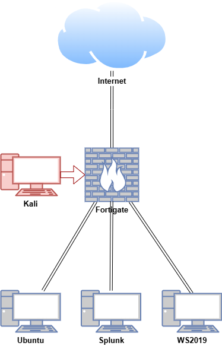
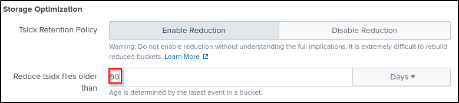
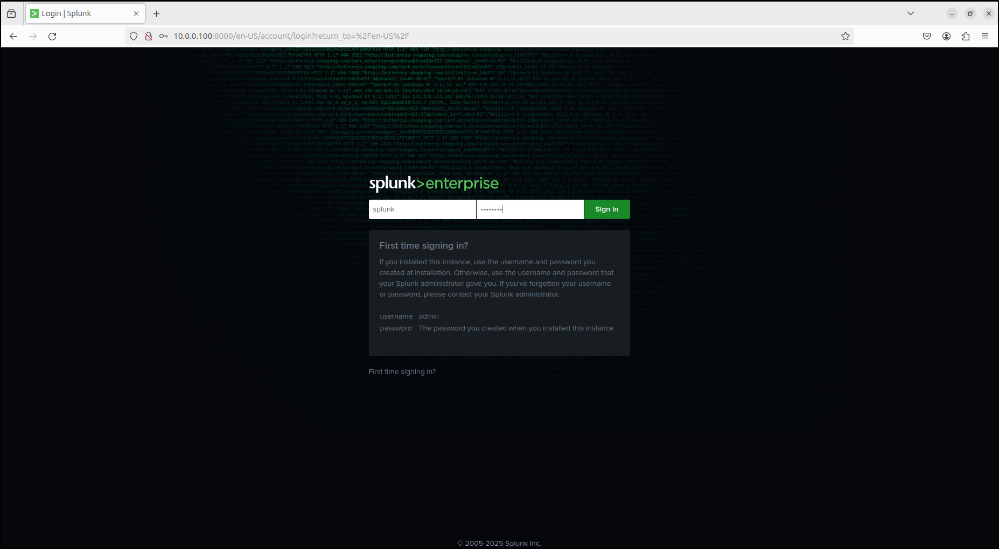

# Splunk

Splunk Enterprise is a Security Information and Event Management (SIEM) tool usually installed on the server. It is designed for searching, analysing, and visualising data. It allows users to collect and ingest data, and search across various data types. Splunk Universal Forwarders are usually installed on clients to provide reliable, secure data collection and forward that data into Splunk Enterprise for indexing. This part of documentation focuses on installing and configuring Splunk. For Splunk, the main focus will be installing Splunk Enterprise and Universal Forwarder. 

<iframe width="560" height="315" src="https://www.youtube.com/embed/p4Ta4ZvWsnY?si=Jcx5y8GqPmhBBldQ" title="YouTube video player" frameborder="0" allow="accelerometer; autoplay; clipboard-write; encrypted-media; gyroscope; picture-in-picture; web-share" referrerpolicy="strict-origin-when-cross-origin" allowfullscreen></iframe>

## Lab Setup for Proof of Concept

A virtual lab in an Unclassified environment is used as a proof of concept. Internet access was disabled during the installation to simulate an air-gapped environment. For a testing purpose, a free trial version was used for Splunk Enterprise and Universal Forwarder. Attack emulation was conducted on a FortiGate VM in a safe and controlled setting. 

Note: Do not attempt to replicate the attack emulation demonstrated here unless you are properly trained and it is safe to do so. Unauthorised attack emulation can lead to legal consequences and unintended damage to systems. Always ensure that such activities are conducted by qualified professionals in a secure, isolated environment.

| **Hostname** | **OS** | **Role** | **IP Address** |
| --- | --- | --- | --- |
| Fortigate | Fortios 7.6.0 | Firewall/Router | 192.168.1.111 (WAN)/10.0.0.1 (LAN) |
| SplunkEnt | Centos Stream 9 | Splunk Enterprise (server), syslog server | 10.0.0.120 |
| WS2019-2 | Windows Server 2019 | Splunk Universal Forwarder (client) | 10.0.0.140 |
| Kali | Kali Linux 2024.2 | Attacker machine | 192.168.1.161, 10.0.0.29 |



## Splunk Enterprise

## Configure Firewall

On Ubuntu, run the following command:

```jsx
sudo ufw allow 514/tcp  # syslog TCP
sudo ufw allow 514/udp  # syslog UDP
sudo ufw allow 6514/tcp # syslog TLS
sudo ufw allow 5425/tcp # syslog
sudo ufw allow 601/tcp  # syslog

sudo ufw allow 8000/tcp # Web UI Port
sudo ufw allow 8080/tcp # HEC Port
sudo ufw allow 8088/tcp # HEC Port
sudo ufw allow 8089/tcp # Management Port
sudo ufw allow 9997/tcp # Data flow
sudo ufw allow 8065/tcp # Appserver
sudo ufw allow 8191/tcp # KVstore

#Apply changes
sudo ufw reload

#Enable Firewall
#sudo ufw enable

#Apply changes
sudo ufw status numbered
```

On CentOS, run the following command:

```python
#Show original state
sudo firewall-cmd --list-all

#Syslog ports
sudo firewall-cmd --zone=public --add-port=514/tcp --permanent # syslog TCP
sudo firewall-cmd --zone=public --add-port=514/udp --permanent # syslog UDP
sudo firewall-cmd --zone=public --add-port=5514/udp --permanent # syslog UDP
sudo firewall-cmd --zone=public --add-port=6514/tcp --permanent # syslog TLS
sudo firewall-cmd --zone=public --add-port=5425/tcp --permanent # syslog
sudo firewall-cmd --zone=public --add-port=601/tcp --permanent # syslog

#Splunk ports
sudo firewall-cmd --zone=public --add-port=8000/tcp --permanent # Web UI Port
sudo firewall-cmd --zone=public --add-port=8080/tcp --permanent # HEC port
sudo firewall-cmd --zone=public --add-port=8088/tcp --permanent # HEC port
sudo firewall-cmd --zone=public --add-port=8089/tcp --permanent # Management Port
sudo firewall-cmd --zone=public --add-port=9997/tcp --permanent # Data flow
sudo firewall-cmd --zone=public --add-port=8065/tcp --permanent # appserver
sudo firewall-cmd --zone=public --add-port=8191/tcp --permanent # kvstore

#Apply changes
sudo firewall-cmd --reload

#Check applied
sudo firewall-cmd --list-all
```

## Install and Configure Splunk Enterprise

Splunk Enterprise enables you to search, analyze and visualise your data to quickly act on insights from across your technology landscape. This step focuses on installing and configuring Splunk Enterprise. 

Note: Linux, 4.X, 5.10, 5.14,5.15 and 5.4.X kernels are ideal so Ubuntu 20.04 LTS or CentOS Stream 9 are recommended. As internet is required to register the system, RHEL is not recommended in an air-gapped environment. 

Download [Splunk Enterprise](https://www.splunk.com/en_us/download/splunk-enterprise.html) for Linux (.tgz).

Untar (unzip) the tar archive to /opt directory

```bash
sudo tar xvzf splunk-9.3.1-0b8d769cb912-Linux-x86_64.tgz -C /opt
```

Create user splunk and change ownership of /opt/splunk directory to the splunk user 

On CentOS, after adding user, go to settings > Users. Unlock to Change Settings. Set password for the `splunk` user

On Ubuntu, enter password and user information for the `splunk` user (use default values by pressing `enter` ). 

```python
sudo adduser splunk
```

Make the splunk user the owner of the splunk directory. Change permissions and verify the ownership.

```bash
sudo chown -R splunk:splunk /opt/splunk
cd /opt
ls -la
```

```python
#Example output
total 12
drwxr-xr-x  3 root   root   4096 Sep 18 15:36 .
drwxr-xr-x 20 root   root   4096 Sep 18 15:21 ..
drwxr-xr-x 11 splunk splunk 4096 Sep  6 05:58 splunk
```

Switch to splunk user and start splunk. When prompted, create admin credentials.

```bash
su splunk
cd splunk/bin
./splunk start --accept-license
```

Wait for web server at `http://127.0.0.1:8000` to be available. Navigate to `http://<IP address>:8000`or `http://localhost:8000` on web browser.  

Enter in splunk admin credentials you created when installing Splunk Enterprise

Setup Splunk to listen on port 9997

```bash
# in /opt/splunk/bin/
./splunk enable listen 9997
```

Alternatively this can be done on the web UI

Settings > Forwarding and Receiving > Add new under Receive Data > Listen on this port: 9997 > Save > Verify the listen on port 9997 is enabled under Receive Data and Configure receiving




## Ingesting FortiGate Logs through SC4S (Option 1)

SC4S is an open source packaged solution for getting data into Splunk. It is based on the syslog-ng Open Source Edition (Syslog-NG OSE) and transports data to Splunk via the Splunk HTTP event Collector (HEC) rather than writing events to disk for collection by a Universal Forwarder.

### Create indexes for SC4S

Copy indexes.conf from here:

```python
[default]
lastChanceIndex = main

[email]
homePath   = $SPLUNK_DB/email/db
coldPath   = $SPLUNK_DB/email/colddb
thawedPath = $SPLUNK_DB/email/thaweddb

[epav]
homePath   = $SPLUNK_DB/epav/db
coldPath   = $SPLUNK_DB/epav/colddb
thawedPath = $SPLUNK_DB/epav/thaweddb

[epintel]
homePath   = $SPLUNK_DB/epintel/db
coldPath   = $SPLUNK_DB/epintel/colddb
thawedPath = $SPLUNK_DB/epintel/thaweddb

[fireeye]
homePath   = $SPLUNK_DB/fireeye/db
coldPath   = $SPLUNK_DB/fireeye/colddb
thawedPath = $SPLUNK_DB/fireeye/thaweddb

[gitops]
homePath   = $SPLUNK_DB/gitops/db
coldPath   = $SPLUNK_DB/gitops/colddb
thawedPath = $SPLUNK_DB/gitops/thaweddb

[infraops]
homePath   = $SPLUNK_DB/infraops/db
coldPath   = $SPLUNK_DB/infraops/colddb
thawedPath = $SPLUNK_DB/infraops/thaweddb

[netauth]
homePath   = $SPLUNK_DB/netauth/db
coldPath   = $SPLUNK_DB/netauth/colddb
thawedPath = $SPLUNK_DB/netauth/thaweddb

[netdlp]
homePath   = $SPLUNK_DB/netdlp/db
coldPath   = $SPLUNK_DB/netdlp/colddb
thawedPath = $SPLUNK_DB/netdlp/thaweddb

[netdns]
homePath   = $SPLUNK_DB/netdns/db
coldPath   = $SPLUNK_DB/netdns/colddb
thawedPath = $SPLUNK_DB/netdns/thaweddb

[netfw]
homePath   = $SPLUNK_DB/netfw/db
coldPath   = $SPLUNK_DB/netfw/colddb
thawedPath = $SPLUNK_DB/netfw/thaweddb

[netids]
homePath   = $SPLUNK_DB/netids/db
coldPath   = $SPLUNK_DB/netids/colddb
thawedPath = $SPLUNK_DB/netids/thaweddb

[netlb]
homePath   = $SPLUNK_DB/netlb/db
coldPath   = $SPLUNK_DB/netlb/colddb
thawedPath = $SPLUNK_DB/netlb/thaweddb

[netops]
homePath   = $SPLUNK_DB/netops/db
coldPath   = $SPLUNK_DB/netops/colddb
thawedPath = $SPLUNK_DB/netops/thaweddb

[netwaf]
homePath   = $SPLUNK_DB/netwaf/db
coldPath   = $SPLUNK_DB/netwaf/colddb
thawedPath = $SPLUNK_DB/netwaf/thaweddb

[netproxy]
homePath   = $SPLUNK_DB/netproxy/db
coldPath   = $SPLUNK_DB/netproxy/colddb
thawedPath = $SPLUNK_DB/netproxy/thaweddb

[netipam]
homePath   = $SPLUNK_DB/netipam/db
coldPath   = $SPLUNK_DB/netipam/colddb
thawedPath = $SPLUNK_DB/netipam/thaweddb

[oswinsec]
homePath   = $SPLUNK_DB/oswinsec/db
coldPath   = $SPLUNK_DB/oswinsec/colddb
thawedPath = $SPLUNK_DB/oswinsec/thaweddb

[osnix]
homePath   = $SPLUNK_DB/osnix/db
coldPath   = $SPLUNK_DB/osnix/colddb
thawedPath = $SPLUNK_DB/osnix/thaweddb

[oswin]
homePath   = $SPLUNK_DB/oswin/db
coldPath   = $SPLUNK_DB/oswin/colddb
thawedPath = $SPLUNK_DB/oswin/thaweddb

[syslogng_fallback]
homePath   = $SPLUNK_DB/syslogng_fallback/db
coldPath   = $SPLUNK_DB/syslogng_fallback/colddb
thawedPath = $SPLUNK_DB/syslogng_fallback/thaweddb

[_metrics]
datatype=metric
homePath   = $SPLUNK_DB/_metrics/db
coldPath   = $SPLUNK_DB/_metrics/colddb
thawedPath = $SPLUNK_DB/_metrics/thaweddb
```

Save indexes.conf to `/opt/splunk/etc/system/local` 

Note: execute this command as root or your standard user (not `splunk`)

```python
sudo nano /opt/splunk/etc/system/local/indexes.conf
```

Change into `/opt/splunk/bin` and restart Splunk Enterprise as the `splunk` user.

```bash
./splunk restart
```

Note: do not edit `/opt/splunk/etc/system/default/indexes.conf`
This step will create the following default indexes that are used by SC4S:

- `email`
- `epav`
- `fireeye`
- `gitops`
- `infraops`
- `netauth`
- `netdlp`
- `netdns`
- `netfw`
- `netids`
- `netops`
- `netwaf`
- `netproxy`
- `netipam`
- `oswinsec`
- `osnix`
- `_metrics` (Optional opt-in for SC4S operational metrics; ensure this is created as a metrics index)

Verify that the SC4S default indexes are created on web UI (Settings > Indexes).

### Create a HTTP Event Collector (HEC) token for SC4S

On Splunk Web UI, go to Settings > Data Inputs > HTTP Event Collector > Global Settings

Select Enabled for All Tokens

Set Default Index as main

Uncheck Enable SSL 

Leave HTTP Port Number as 8088

Save



Click New Token. Name your token and click Next.


Leave Source type as Automatic. Click add all for Allowed Indexes. Select main for Default Index.

Click Review and Submit.


Copy your Token Value and save it on a notepad (we will need this later)

You can also find your token value on Settings > Data Inputs > HTTP Event Collector


### Configure Linux for SC4S

Set the host OS kernel to match the default receiver buffer of SC4S, which is set to 16MB.

Add the following to `/etc/sysctl.conf`:

```python
sudo nano /etc/sysctl.conf
```

```python
net.core.rmem_default = 17039360
net.core.rmem_max = 17039360
```

Apply to the kernel by running the command  `sysctl -p`

```python
sudo sysctl -p
```

Ensure the kernel is not dropping packets (optional)

```python
netstat -su | grep "receive errors" 
```

For Ubuntu, download net-tools on Ubuntu VM with internet connection. Transfer it over to Ubuntu VM without internet connection and install net-tools (optional)

```python
#On Ubuntu VM with internet connection
mkdir net-tools-offline
cd net-tools-offline
sudo chmod -R 755 /home/cyber/net-tools-offline
sudo apt-get download net-tools
```

```python
#On Ubuntu VM without internet connection
cd net-tools-offline
sudo dpkg -i net-tools_1.60+git20181103.0eebece-1ubuntu5_amd64.deb
```

### Install Podman offline on Ubuntu

By default, Podman is installed on CentOS Stream 9 but it is not installed on Ubuntu. 

On a Ubuntu machine with internet connection:

```jsx
mkdir podman-offline
cd podman-offline
sudo chmod -R 755 /home/cyber/podman-offline
sudo apt-get install --download-only podman -o Dir::Cache=/home/cyber/podman-offline
```

If you get permission denied error, run the `sudo apt-get install --download-only` command again.

Transfer `podman-offline` to the Ubuntu host without internet connection.

To install Podman (note archives directory should have been automatically created)

```jsx
cd podman-offline/archives
sudo dpkg -i *.deb
```

### Install SC4S container while offline

You can stage SC4S by downloading the image so that it can be loaded on a host machine, for example on an airgapped system, without internet connectivity.

Download the latest container image `oci_container.tgz` from [SC4S GitHub](https://github.com/splunk/splunk-connect-for-syslog/releases) page.

Transfer the container image to your host machine.

Execute the following command using Podman.

Make a note of the container ID for the resulting load

```python
sudo podman load < oci_container.tar.gz
```

```python
#Example output
Loaded image: ghcr.io/splunk/splunk-connect-for-syslog/container3:3.30.1
```

Use the container ID to create a local label: 

`podman tag <container ID> sc4slocal:latest`

```python
sudo podman tag ghcr.io/splunk/splunk-connect-for-syslog/container3:3.30.1 sc4slocal:latest
```

Create the systemd unit file `/lib/systemd/system/sc4s.service`

```python
sudo nano /lib/systemd/system/sc4s.service
```

Copy and paste the following - note that this is the edited version of SC4S sample unit file for Podman

```python
[Unit]
Description=SC4S Container
Wants=NetworkManager.service network-online.target
After=NetworkManager.service network-online.target

[Install]
WantedBy=multi-user.target

[Service]
# Select the locally loaded image
Environment="SC4S_IMAGE=sc4slocal:latest"

# Required mount point for syslog-ng persist data (including disk buffer)
Environment="SC4S_PERSIST_MOUNT=splunk-sc4s-var:/var/lib/syslog-ng"

# Optional mount point for local overrides and configurations; see notes in docs
Environment="SC4S_LOCAL_MOUNT=/opt/sc4s/local:/etc/syslog-ng/conf.d/local:z"

# Optional mount point for local disk archive (EWMM output) files
Environment="SC4S_ARCHIVE_MOUNT=/opt/sc4s/archive:/var/lib/syslog-ng/archive:z"

# Map location of TLS custom TLS
Environment="SC4S_TLS_MOUNT=/opt/sc4s/tls:/etc/syslog-ng/tls:z"

TimeoutStartSec=0

#ExecStartPre=/usr/bin/podman pull $SC4S_IMAGE

# Note: /usr/bin/bash will not be valid path for all OS
# when startup fails on running bash check if the path is correct
ExecStartPre=/usr/bin/bash -c "/usr/bin/systemctl set-environment SC4SHOST=$(hostname -s)"

ExecStart=/usr/bin/podman run \
        -e "SC4S_CONTAINER_HOST=${SC4SHOST}" \
        -v "$SC4S_PERSIST_MOUNT" \
        -v "$SC4S_LOCAL_MOUNT" \
        -v "$SC4S_ARCHIVE_MOUNT" \
        -v "$SC4S_TLS_MOUNT" \
        --env-file=/opt/sc4s/env_file \
        --health-cmd="/healthcheck.sh" \
        --health-interval=10s --health-retries=6 --health-timeout=6s \
        --network host \
        --name SC4S \
        --rm $SC4S_IMAGE

Restart=on-abnormal
```

### Configure IPv4 forwarding

IPv4 forwarding is not enabled by default. IPv4 forwarding must be enabled for container networking.

To check that IPv4 forwarding is enabled: 

```python
sudo sysctl net.ipv4.ip_forward
```

To enable IPv4 forwarding: 

```python
sudo sysctl net.ipv4.ip_forward=1
```

To ensure your changes persist upon reboot:

- Define sysctl settings through files in `/usr/lib/sysctl.d/`and `/etc/sysctl.d/`.
- To override only specific settings, either add a file with a lexically later name in `/etc/sysctl.d/` and put following setting there or find this specific setting in one of the existing configuration files and set the value to `1`.

```python
cd /usr/lib/sysctl.d/
```

```python
sudo nano 100-custom.conf
```

```python
net.ipv4.ip_forward=1
```

- Repeat the same steps for `/etc/sysctl.d/`.
- For example, in the `/usr/lib/sysctl.d/` directory, there are few config files. The naming convention is XX-name.conf with XX being a number. Create a custom.conf with a higher number e.g. `100-custom.conf` with the content `net.ipv4.ip_forward=1` .

```python
cyber@SplunkEnt:/usr/lib/sysctl.d$ ls
100-custom.conf  50-bubblewrap.conf  50-pid-max.conf
30-tracker.conf  50-default.conf     99-protect-links.conf
```

Create a Podman/Docker local volume that will contain the disk buffer files and other SC4S state files:

```python
sudo podman volume create splunk-sc4s-var
```

Create directories to be used as a mount point for local overrides and configurations:

```python
sudo mkdir -p /opt/sc4s/local
sudo mkdir -p /opt/sc4s/archive
sudo mkdir -p /opt/sc4s/tls
```

Create the environment file `/opt/sc4s/env_file` and replace the HEC_URL and HEC_TOKEN as necessary:

```python
sudo nano /opt/sc4s/env_file
```

```python
SC4S_DEST_SPLUNK_HEC_DEFAULT_URL=https://your.splunk.instance:8088
SC4S_DEST_SPLUNK_HEC_DEFAULT_TOKEN=xxxxxxxx-xxxx-xxxx-xxxx-xxxxxxxxxxxx
#Uncomment the following line if using untrusted SSL certificates
SC4S_DEST_SPLUNK_HEC_DEFAULT_TLS_VERIFY=no
```

For example:

```python
SC4S_DEST_SPLUNK_HEC_DEFAULT_URL=http://10.0.0.120:8088
SC4S_DEST_SPLUNK_HEC_DEFAULT_TOKEN=8be8e3f3-49fc-4158-a20c-bcf82be93dda
#Uncomment the following line if using untrusted SSL certificates
SC4S_DEST_SPLUNK_HEC_DEFAULT_TLS_VERIFY=no
```

Configure SC4S for systemd and start SC4S. Verify sc4s is active and running (exit with `q`)

```python
sudo systemctl daemon-reload
sudo systemctl enable sc4s
sudo systemctl start sc4s
sudo systemctl status sc4s
```

Check podman/docker logs for errors:

```python
sudo podman logs SC4S
```

```python
#Example Output
SC4S_ENV_CHECK_HEC: Splunk HEC connection test successful to index=main for sourcetype=sc4s:fallback...
SC4S_ENV_CHECK_HEC: Splunk HEC connection test successful to index=main for sourcetype=sc4s:events...
syslog-ng checking config
sc4s version=3.30.0
starting goss
starting syslog-ng
```

Search on Splunk for successful installation of SC4S:

```python
index=* sourcetype=sc4s:events "starting up"
```


Send sample data to default udp port 514 of SC4S host: `echo “Hello SC4S” > /dev/udp/<SC4S_ip>/514` 

```python
echo “Hello SC4S” > /dev/udp/10.0.0.120/514
```

Search for `index=* "Hello SC4S"`


Verify that SC4S is receiving Fortigate logs


## Ingesting FortiGate Logs through FortiGate App (Option 2)

If SC4S does not work for your environment, another option to ingest FortiGate logs on Splunk is through FortiGate App.

Install from file on Splunk web UI: Manage Apps->Install from file->Upload the .tgz file which is downloaded from [https://splunkbase.splunk.com/app/2846](https://splunkbase.splunk.com/app/2846) ->check the upgrade box-> click restart splunk service.


### Add data input on Splunk server:

Note: From version 1.2, the Splunk TA(Add-on) for fortigate no longer match wildcard source or sourcetype to extract fortigate log data, a default sourcetype fortigate_log is specified in default/props.conf instead, please follow the instruction below to configure your input and props.conf for the App and TA(Add-on).

Navigate to Settings->Data Input->UDP on Splunk Web UI. Click New Local UDP.

For Port, enter `514` and leave other parameters as is.


For Source type, select `fortigate_log` (search for `fortigate_log` in the search bar)


Click Review and Submit. If you get the error `UDP 514 is not available` use other UDP port (e.g. `5514`). Restart Splunk service for the change to take effect.

```python
/opt/splunk/bin/splunk restart
```

Configure FortiGate to send syslog by following the steps below.

Navigate to Search & Reporting on Splunk web UI. 

Search for `fortigate` and verify that FortiGate logs are being ingested.  


## Configure FortiGate

Configure Port 1 as WAN interface 

Configure Port 2 as LAN interface. 

Configure DHCP to automatically assign IP addresses to clients connecting to LAN


Create a new firewall policy to allow LAN to WAN

To simulate an air-gapped environment without internet access, disable the policy for now. 


## Configure FortiGate to send syslog

Refer to the admin manual for specific details of configuration to send Reliable syslog using RFC 3195 format, a typical logging configuration will include the following features.

```python
config log syslogd setting 

set status enable
set server (syslog-ng ip)
set source-ip (fortigate ip)
#set port (port number) (default port is 514)
#Verify settings by running "show"
end 

config log memory filter
set forward-traffic enable
set local-traffic enable
set sniffer-traffic disable
set anomaly enable
set voip disable
set multicast-traffic enable
#Verify settings by running "show full-configuration"
end

config system global
set cli-audit-log enable
#Verify settings by running "show"
#Make sure timezone is correct e.g. "Pacific/Auckland"
end

config log setting
set neighbor-event enable
end
```

## Configure Cisco ISR to send syslog

Note: this step needs to be verified with a Cisco device in a testing environment. 

```python
show clock
ntp server (IP address of Fortigate)

conf f
logging on
logging (IP address of Syslog server)
logging trap 6
#Use "?" to see what options are available
exit

#Turn on interface by no shut

show logging
#port 514 udp by default

sh run | inc logging
#we can set multiple syslog servers

#Set IP address for int vlan 1
#Test ping to syslog server
conf t

service sequence-numbers
#Assign sequence-numbers to syslogs in order that events occurred on

conf t
line console 0
logging synchronous
#Force Syslog messages to be displayed once configuration has been completed.

```

*Note: in this scenario, we are sending syslogs from network devices to a containerised syslog-ng server using HTTP/HTTPS. This is Splunk team’s recommended method when using Splunk products. Alternatively, you can send syslogs from network devices to a rsyslog server and rotate the logs. This method is used by other SIEMs like Wazuh. For more details, refer to the Wazuh documentation.*  

## Splunk Universal Forwarder

## Install Sysmon on Windows

Download [Sysmon](https://learn.microsoft.com/en-us/sysinternals/downloads/sysmon) and [sysmonconfig.xml](https://github.com/olafhartong/sysmon-modular/blob/master/sysmonconfig.xml)

Extract Sysmon.zip and move sysmonconfig.xml into the Sysmon folder where Sysmon.exe is located.

Run PowerShell as Administrator and change directory to path where extracted Sysmon is located

Move sysmonconfig.xml to the same directory

Install Symon by running `.\Sysmon64.exe -accepteula -i sysmonconfig.xml`

```bash
PS C:\Users\Administrator\Downloads\Sysmon\Sysmon> ls

    Directory: C:\Users\Administrator\Downloads\Sysmon\Sysmon

Mode                LastWriteTime         Length Name
----                -------------         ------ ----
------        7/23/2024   2:08 PM           7490 Eula.txt
------        7/23/2024   2:08 PM        8480560 Sysmon.exe
------        7/23/2024   2:08 PM        4563248 Sysmon64.exe
------        7/23/2024   2:08 PM        4993440 Sysmon64a.exe
-a----        8/26/2024   7:31 PM         123257 sysmonconfig.xml

PS C:\Users\Administrator\Downloads\Sysmon\Sysmon> .\Sysmon64.exe -accepteula -i .\sysmonconfig.xml

System Monitor v15.15 - System activity monitor
By Mark Russinovich and Thomas Garnier
Copyright (C) 2014-2024 Microsoft Corporation
Using libxml2. libxml2 is Copyright (C) 1998-2012 Daniel Veillard. All Rights Reserved.
Sysinternals - www.sysinternals.com

Loading configuration file with schema version 4.50
Sysmon schema version: 4.90
Configuration file validated.
Sysmon64 installed.
SysmonDrv installed.
Starting SysmonDrv.
SysmonDrv started.
Starting Sysmon64..
Sysmon64 started.
```

Verify that Sysmon is installed by checking Services (Sysmon64) and Windows EventViewer (Applications and Services Logs > Microsoft > Windows > Sysmon)


## Create a Domain Account

Note: in this lab, WS2019 host was joined to a domain called cyber.local and promoted as a domain controller. This step is applicable to a domain-joined environment. 

Create a domain user called `splunk` and assign it as a member of `Event Log Readers Group`.

This account will be used to run Splunk Forwarder. 

- Go to Active Directory Users and Computers > domain > Users
- Right Users > New > User
- Right-click splunk user > Properties > Member of > Add > Type Event Log Readers and click Check Names > OK > Apply and OK


## Configure RDP for domain user splunk (optional)

Note: in this lab, RDP configuration was required for the `splunk` user to login to WS2019 host. This step is optional. 

If RDP needs to be configured and there is an error after configuring firewall and enabling RDP, edit group policy.

Open Local Group Policy Editor by clicking Run > type `gpedit.msc`

In the Local Group Policy Editor, navigate to Windows Settings > Security Settings > Local Policies > User Rights Assignment > Allow log on through Remote Desktop Services

Add user splunk


In the Local Group Policy Editor, navigate to Computer configuration > Windows Settings > Administrative Templates > Windows Components > Remote Desktop Services > Remote Desktop Session Host > Connections > Allow users to connect remotely by using Remote Desktop Services >Enabled 


Navigate to Remote Desktop Session Host > Security > Require user authentication for remote connections by using Network Level Authentication > Enabled


In Server Manager, go to Local Server. Make sure Remote Desktop is Enabled. Add user `splunk`.


Enable inbound firewall rules related to Remote Desktop


RDP into WS2019 host as the splunk user from another internal host.

## Configure Splunk Universal Forwarder on Windows

[Download](https://www.splunk.com/en_us/download/universal-forwarder.html) and transfer the Splunk Universal Forwarder msi for Windows.

Run Universal Forwarder msi, accept license, select on-premise Splunk Enterprise instance, and click Customize Options


Leave Path as default and click Next


Leave Certificate Password empty and click Next


Select Domain Account

Note: using Virtual Account is recommended but you may encounter errors with the Virtual Account. Test your install with the Virtual Account before selecting Domain Account. 

Refer to Annex 1. 


Specify DOMAIN\splunk and password for the account


Leave permissions as default


Leave everything unchecked and click Next


Create credentials for the administrator account.

Note: in this lab, the administrator account for Splunk Universal Forwarder is also configured as splunk but this is different to the domain account splunk that has been created earlier.


Enter IP address of your Deployment Server (Splunk server) and port 8089. Note the IP address in the screenshot points to the previous version of lab where Splunk server's IP address was 10.0.0.20.


Enter IP address of your Receiving Indexer (Splunk server) and port 9997


Click Install. Click Finish after install is complete.


## Create a new outbound Firewall rule

Navigate to Windows Defender Firewall with Advanced Security 

Right-click on Outbound Rules and select New Rule

Select Program as Rule Type


For program path, browse to C:\Program Files\SplunkUniversalForwarder\bin\splund.exe


Select Allow the Connection


Check all boxes for Domain, Private and Public


Name the rule as Splunk outbound


Verify that yours Windows host is connected to the Deployment Server.

On the Splunk Enterprise web UI (CentOS), go to Settings > Forwarder Management > Clients

You should be able to see your Windows host


## Install Splunk Apps

Download the following Splunk Apps (tar archive files)

- [Splunk Add-on for MS Windows](https://splunkbase.splunk.com/app/742)
- [Splunk Add-on for Sysmon](https://splunkbase.splunk.com/app/5709)
- [Splunk Add-on for Unix and Linux](https://splunkbase.splunk.com/app/833) (optional: applicable to Linux clients)

Install the add-ons (apps) on Splunk Enterprise web UI

Go to Apps > Manage Apps > Install app from file > Upload the tar archive files


If there is an error while uploading the file, try uploading it again. 

If prompted to set up the apps, click set up later.


Make sure Splunk Add-ons for Microsoft Windows and Sysmon are enabled.

On terminal of the host where Splunk Enterprise is installed, verify that there are `Splunk_TA_microsoft_sysmon` and `Splunk_TA_windows` in `/opt/splunk/etc/apps` directory

Copy the apps to `/opt/splunk/etc/deployment-apps` directory

```bash
cd /opt/splunk/etc/apps
sudo cp -r Splunk_TA_* /opt/splunk/etc/deployment-apps/
```

Verify that the apps are shown in the Splunk Enterprise web UI

Go to Settings > Forwarder Management > Apps

Search for Splunk


## Configure Unix app and create unix server class (optional)

Note: this step is applicable if you installed Splunk_TA_nix app.

On the same page, next to the apps, click Edit under Actions for Splunk_TA_nix.

Select Restart Splunkd After Installation, create New Server Class called nix,  and click Save


Add Apps


Select Splunk_TA_nix and click Save


Add Clients


In the Include, put *, and in filter by Machine Type, add linux-x86_64

Click Preview

You should see a tick next to your Linux host and your Linux host should appear under Matched

Click Save


Go to Forwarder Management and verify that your Linux host is connected to Splunk_TA_nix Apps and nix Server Class


If the settings are not applied try reloading the deployment server 

On the terminal of the host where Splunk Enterprise is installed, run the command

```bash

splunk@siem:/opt/splunk/bin# ./splunk reload deploy-server
```

## Configure Windows and Sysmon apps and create windows server class

To avoid permission denied error, change ownership and adjust directory permissions for the `/opt/splunk/etc/deployment-apps` 

```python
sudo chown -R splunk:splunk /opt/splunk/etc/deployment-apps
sudo chmod -R 755 /opt/splunk/etc/deployment-apps
```

On the Forwarder Management page of the web UI, click Edit under Actions for Splunk_TA_windows

Select Restart Splunkd After Installation, add New Server Class called win, and click Save


Click Add Apps and select Splunk_TA_windows and Splunk_TA_micorsoft_sysmon. Click Save


Click Add Clients. Put * in Include, and filter by windows-x64.

Click Preview

Click Save


You should see Restart Splunkd in the After installation column. 

If only Enable App is shown, Edit each app and select Restart Splunkd.


Verify the configuration in the Forwarder Management


If the configuration is not applied, try reloading the deployment-server

```bash
splunk@siem:/opt/splunk/bin# ./splunk reload deploy-server
```

Verify that `/opt/splunk/etc/system/local/serverclass.conf` aligns with our configuration so far

```python
sudo cat /opt/splunk/etc/system/local/serverclass.conf
```

```bash
[serverClass:win:app:Splunk_TA_microsoft_sysmon]
restartSplunkWeb = 0
restartSplunkd = 1
stateOnClient = enabled

[serverClass:win:app:Splunk_TA_windows]
restartSplunkWeb = 0
restartSplunkd = 1
stateOnClient = enabled

[serverClass:win]
machineTypesFilter = windows-x64
whitelist.0 = *
```

## Create Indexes

Create indexes on the web UI.

Note: your index name must match with index name in inputs.conf in each app.

Go to settings > indexes > New Index

| **Index Name** | wineventlog | sysmonlog | unixlog (optional) |
| --- | --- | --- | --- |
| **Index Data Type** | Events | Events | Events |
| **Max Size of entire Index** | 1 GB (Default is 500 GB so adjust accordingly) | 1 GB (Default is 500 GB so adjust accordingly) | 1 GB (Default is 500 GB so adjust accordingly) |
| **Enable Reduction** | Enable (optional) | Enable (optional) | Enable (optional) |
| **Reduce tisdx files older than** |  90 days |  90 days |  90 days |

Verify that indexes have been created and enabled


## Edit config files for Windows app

On the Linux host where Splunk Enterprise is installed, change into `opt/splunk/etc/deployment-apps/Splunk_TA_windows/local` directory

Copy `app.conf` and `inputs.conf` from `/opt/splunk/etc/deployment-apps/Splunk_TA_windows/default` directory

```bash
cd /opt/splunk/etc/deployment-apps/Splunk_TA_windows/local
cp /opt/splunk/etc/deployment-apps/Splunk_TA_windows/default/app.conf .
cp /opt/splunk/etc/deployment-apps/Splunk_TA_windows/default/inputs.conf .
```

Make the following changes to `inputs.conf`

```python
nano inputs.conf
```

```bash
[default]
index = wineventlog

###### OS Logs ######
[WinEventLog://Application]
disabled = 0
start_from = oldest
current_only = 0
checkpointInterval = 5
renderXml=false

[WinEventLog://Security]
disabled = 0
start_from = oldest
current_only = 0
evt_resolve_ad_obj = 1
checkpointInterval = 5
blacklist1 = EventCode="4662" Message="Object Type:(?!\s*groupPolicyContainer)"
blacklist2 = EventCode="566" Message="Object Type:(?!\s*groupPolicyContainer)"
renderXml=false

[WinEventLog://System]
disabled = 0
start_from = oldest
current_only = 0
checkpointInterval = 5
renderXml=false
```

On WS2019 host where Splunk Universal Forwarder is configured, navigate to 

`C:\Program Files\SplunkUniversalForwarder\etc\apps\Splunk_TA_windows\local`

Copy `app.conf` and `inputs.conf` from `C:\Program Files\SplunkUniversalForwarder\etc\apps\Splunk_TA_windows\default`

Edit `inputs.conf` (same as above)


Restart Splunk Universal Forwarder

On PowerShell, change directory into `C:\program files\SplunkUniversalForwarder\bin`

Run `./splunk restart`

```python
PS C:\Users\Administrator> cd "C:\program files\SplunkUniversalForwarder\bin"
PS C:\program files\SplunkUniversalForwarder\bin> ./splunk restart
SplunkForwarder: Stopped

Splunk> Another one.

Checking prerequisites...
        Checking mgmt port [8089]: open
        Checking conf files for problems...
        Done
        Checking default conf files for edits...
        Validating installed files against hashes from 'C:\program files\SplunkUniversalForwarder\splunkforwarder-9.3.0-51ccf43db5bd-windows-64-manifest'
        All installed files intact.
        Done
All preliminary checks passed.

Starting splunk server daemon (splunkd)...

SplunkForwarder: Starting (pid 2328)
Done
```

Verify that data is being forwarded on wineventlog index

On web UI, navigate to Settings > Indexes and refresh the page

Go to Apps > Search & Reporting > Search for index=wineventlog


If the logs are not being indexed, try refreshing the web UI. 

If searching for `index=wineventlog` does not return any result, try searching All time instead of Last 24 hours.

## Edit config files for Sysmon app

On CentOS host where Splunk Enterprise is installed, change into `/opt/splunk/etc/deployment-apps/Splunk_TA_microsoft_sysmon/local` directory

Copy `app.conf` and `inputs.conf` from `/opt/splunk/etc/deployment-apps/Splunk_TA_microsoft_sysmon/default` directory

```bash
cd /opt/splunk/etc/deployment-apps/Splunk_TA_microsoft_sysmon/local
cp /opt/splunk/etc/deployment-apps/Splunk_TA_microsoft_sysmon/default/app.conf .
cp /opt/splunk/etc/deployment-apps/Splunk_TA_microsoft_sysmon/default/inputs.conf .
```

Make the following changes to `inputs.conf`

```python
nano inputs.conf
```

Note: your index name must match with the index name you created earlier

```bash
[default]
index = sysmonlog

[WinEventLog://Microsoft-Windows-Sysmon/Operational]
disabled = false
renderXml = 1
source = XmlWinEventLog:Microsoft-Windows-Sysmon/Operational

[WinEventLog://WEC-Sysmon]
disabled = true
renderXml = 1
source = XmlWinEventLog:Microsoft-Windows-Sysmon/Operational
sourcetype = XmlWinEventLog:WEC-Sysmon
host = WinEventLogForwardHost
```

On WS2019 host where Splunk Universal Forwarder is configured, navigate to 

`C:\Program Files\SplunkUniversalForwarder\etc\apps\Splunk_TA_microsoft_sysmon\local`

Copy `app.conf` and `inputs.conf` from `C:\Program Files\SplunkUniversalForwarder\etc\apps\Splunk_TA_microsoft_sysmon\default`

Edit `inputs.conf` (same as above) 


Restart Splunk Universal Forwarder

On PowerShell, change directory into `C:\program files\SplunkUniversalForwarder\bin`

Run `./splunk restart`

```python
PS C:\program files\SplunkUniversalForwarder\bin> ./splunk restart
SplunkForwarder: Stopped

Splunk> Another one.

Checking prerequisites...
        Checking mgmt port [8089]: open
        Checking conf files for problems...
        Done
        Checking default conf files for edits...
        Validating installed files against hashes from 'C:\program files\SplunkUniversalForwarder\splunkforwarder-9.3.0-51ccf43db5bd-windows-64-manifest'
        All installed files intact.
        Done
All preliminary checks passed.

Starting splunk server daemon (splunkd)...

SplunkForwarder: Starting (pid 4824)
Done

PS C:\program files\SplunkUniversalForwarder\bin>
```

Verify that Sysmon logs are being indexed


Search for `index=sysmonlog source=XmlWinEventLog:Microsoft-Windows-Sysmon/Operational`


## Edit config files for Unix app (optional)

On a Linux host where Splunk Enterprise is installed, change into /opt/splunk/etc/deployment-apps/Splunk_TA_nix/local*directory

Copy app.conf, inputs.conf and props.conf from /opt/splunk/etc/deployment-apps/Splunk_TA_nix/default directory

```bash
splunk@siem:/opt/splunk/etc/deployment-apps/Splunk_TA_nix/local$ cp /opt/splunk/etc/deployment-apps/Splunk_TA_nix/default/app.conf .
splunk@siem:/opt/splunk/etc/deployment-apps/Splunk_TA_nix/local$ cp /opt/splunk/etc/deployment-apps/Splunk_TA_nix/default/inputs.conf .
splunk@siem:/opt/splunk/etc/deployment-apps/Splunk_TA_nix/local$ cp /opt/splunk/etc/deployment-apps/Splunk_TA_nix/default/props.conf .

```

Make the following changes to inputs.conf

Add your index name

```bash
[default]
index = unixlog
...
[monitor:///var/log]
whitelist=(\.log|log$|messages|secure|auth|mesg$|cron$|acpid$|\.out)
blacklist=(lastlog|anaconda\.syslog)
disabled = 0
...
```

On CentOShost where UF is configured, navigate to /opt/splunkforwarder/etc/apps/Splunk_TA_nix/local directory

Copy app.conf, inputs.conf and props.conf from /opt/splunkforwarder/etc/apps/Splunk_TA_nix/default directory

```python
splunk@siem3:/opt/splunkforwarder/etc/apps/Splunk_TA_nix/local$ cp /opt/splunkforwarder/etc/apps/Splunk_TA_nix/default/app.conf .
splunk@siem3:/opt/splunkforwarder/etc/apps/Splunk_TA_nix/local$ cp /opt/splunkforwarder/etc/apps/Splunk_TA_nix/default/inputs.conf .
splunk@siem3:/opt/splunkforwarder/etc/apps/Splunk_TA_nix/local$ cp /opt/splunkforwarder/etc/apps/Splunk_TA_nix/default/props.conf .
```

Edit inputs.conf (same as above)

Restart Splunk Universal Forwarder

```bash
cd /opt/splunkuniversalforwarder/bin
./splunk restart
```

Verify data being indexed


## Annex 1: Using Virtual Account to install Universal Forwarder (Windows)

Selecting Virtual Account will create a service account called NT SERVICE\SplunkForwarder. For Sysmon Log Forwarding to work, NT SERVCIE\SplunkForwarder must be assigned as a member of Event Log Readers group through Group Policy. If your Windows host is not joined to a domain and you have technical issues with the Virtual Account, use Local System but note that this is not best security practice. 


Leave the values as default and click Next


Leave the values as default and click Next (Windows Event Logs forwarding will be configured later)


Create admin credentials


Enter IP address of your Deployment Server (Splunk server) and port 8089


Enter IP address of your Receiving Indexer (Splunk server) and port 9997


Click Next and finish install. 

Navigate to C:\Program Files\SplunkUniversalForwarder

Right-click and select properties

Verify that Splunk Universal Forwarder is configured to run by virtual account SplunkForwarder


Open Group Policy Management

Right click on domain name and select Create a GPO in this domain and link it here


Name it as Restricted Groups


Right click on Restricted Groups and click Edit


Navigate to Restricted Groups and Add Group


Click Browse


Type event log readers and click Check Names

Make sure that the names is underlined. Click OK


Add NT SERVICE\SplunkForwarder as a member of this group

Click OK. Click Apply and OK


Verify the configuration


On Command Prompt as Administrator run gpupdate /force

```python
C:\Users\Administrator>gpupdate /force
Updating policy...

Computer Policy update has completed successfully.
User Policy update has completed successfully.
```

Restart SplunkForwarder service. 

Go to Services > SplunkForwarder > Right-click and select restart


If Sysmon logs are not being ingested by Splunk, check Channel Access setting for Sysmon.

It is likely that SplunkForwarder is not added to the Channel Access.

```python
wevtutil gl "Microsoft-Windows-Sysmon/Operational"
```

Get SecurityIdentifier(sid) of SplunkForwarder by running this PowerShell script

```python
$user = [System.Security.Principal.NTAccount]"NT SERVICE\SplunkForwarder"
$sid = $user.Translate([System.Security.Principal.SecurityIdentifier])
Write-Output $sid.Value
```

Add SplunkForwarder to Channel Access bu running the command below

Note: add your sid of SplunkForwarder

```python
wevtutil sl "Microsoft-Windows-Sysmon/Operational" /ca:"O:BAG:SYD:(A;;0x2;;;S-1-15-2-1)(A;;0x2;;;S-1-5-80-972488765-139171986-783781252-3188962990-3730692313)(A;;0xf0007;;;SY)(A;;0x7;;;BA)(A;;0x1;;;BO)(A;;0x1;;;SO)(A;;0x1;;;S-1-5-32-573)"
```

Restart SplunkForwarder Service

## Annex 2: Configure Splunk Universal Forwarder on Linux (optional)

Note: this step is optional and is only applicable to Linux host. In this demonstration, Ubuntu was used for two hosts. Splunk Enterprise was configured in one host and Splunk Universal Forwarder was configured in another host. 

Demonstration Setup

| **Hostname** | **OS** | **Role** | **IP Address** |
| --- | --- | --- | --- |
| siem | Ubuntu 22.04 LTS | Splunk Enterprise (server) | 192.168.1.217 |
| siem3 | Ubuntu 22.04 LTS | Splunk Universal Forwarder (client) | 192.168.1.117 |

Download or transfer Splunk Universal Forwarder (tar archive)

Unpack the tar archive to /opt directory as a non-root user

```bash
sudo tar xvzf Splunk_UF_package_name.tgz -C /opt
```

Create a user called splunk and change the ownership of /opt/splunkforwarder/bin to splunk user

```bash
#Create user splunk 
sudo su -
root@siem3:~# adduser splunk
Adding user `splunk' ...
Adding new group `splunk' (1001) ...
Adding new user `splunk' (1001) with group `splunk' ...
Creating home directory `/home/splunk' ...
Copying files from `/etc/skel' ...
New password: 
Retype new password: 
passwd: password updated successfully
Changing the user information for splunk
Enter the new value, or press ENTER for the default
	Full Name []: 
	Room Number []: 
	Work Phone []: 
	Home Phone []: 
	Other []: 
Is the information correct? [Y/n] Y 

#make the splunk user the owner of the splunk directory and verify
siem@siem3:~$ sudo chown -R splunk:splunk /opt/splunkforwarder/
siem@siem3:~$ cd /opt
siem@siem3:/opt$ ls -la
total 12
drwxr-xr-x  3 root   root   4096 Aug 13 10:05 .
drwxr-xr-x 20 root   root   4096 Aug 13 07:48 ..
drwxr-xr-x  9 splunk splunk 4096 Jul 20 10:23 splunkforwarder

siem@siem3:/opt$ su splunk
Password: 
splunk@siem3:/opt$ cd splunkforwarder/bin
splunk@siem3:/opt/splunkforwarder/bin$ ./splunk start --accept-license
#Create admin credentials (i.e. user account for UF, e.g. splunk:password)

#At some point after the setup, enable boot-start by running
siem@siem3:/opt/splunkforwarder/bin$ sudo ./splunk enable boot-start
```

Connect to the deployment server

Deployment server allows engineers/system admins to push out apps to multiple splunk instances and apps is easier way to handle changes (e.g. changes in config)

```bash
splunk@siem3:/opt/splunkforwarder/bin$ ./splunk set deploy-poll 192.168.1.217:8089
#Enter admin credentials
```

Verify that there is deploymentclient.conf in /opt/splunkforwarder/etc/system/local

```bash
cat /opt/splunkforwarder/etc/system/local/deploymentclient.conf
...
targetUri = 192.168.1.217:8089
```

Setup Splunk to send logs to another location by adding forward server

```bash
splunk@siem3:/opt/splunkforwarder/bin$ ./splunk add forward-server 192.168.1.217:9997
```

Verify that there is outputs.conf in /opt/splunkforwarder/etc/system/local

```bash
cat /opt/splunkforwarder/etc/system/local/outputs.conf
...
server = 192.168.1.217:9997
```

Restart Splunk Forwarder for changes to take effect

```bash
splunk@siem3:/opt/splunkforwarder/bin$ ./splunk restart
```

On web UI of Splunk Enterprise, go to settings, forwarder management.

You should be able to see your host machine that has been connected to your deployment server.

Try refreshing the web browser or restart Splunk Enterprise

```bash
splunk@siem:/opt/splunk/bin$ ./splunk restart
```


## Annex 3: Manual configuration of data input on Linux host

Note: this step is optional and is only applicable to Linux host. In this demonstration, apache2 have been started on siem3 host and apache logs are being forwarded.

Demonstration Setup

| **Hostname** | **OS** | **Role** | **IP Address** |
| --- | --- | --- | --- |
| siem | Ubuntu 22.04 LTS | Splunk Enterprise (server) | 192.168.1.217 |
| siem3 | Ubuntu 22.04 LTS | Splunk Universal Forwarder (client) | 192.168.1.117 |

Add data that you want to forward to the UF using add monitor command

```bash
./splunk add monitor -auth splunk:password /var/log/apache2
```

Verify that data is being indexed (i.e. forwarded) on Splunk Enterprise

Navigate to Splunk Enterprise web UI > Search & Reporting > Data Summary

## Introduction to Splunk

Splunk offers free training. You will need to create a user account to access [free training materials](https://www.splunk.com/en_us/training/course-catalog.html?sort=Newest&filters=filterGroup1FreeCourses). The following content is available from the free course “Introduction to Splunk.” Alternatively, same contents are available from [SplunkHowTo YouTube channel](https://www.youtube.com/@SplunkHowTo).

### Creating Reports

For demonstration, SSH Brute Force attack was simulated from Kali machine to FortiGate. Also SSH login attempts were made from other internal hosts to FortiGate. 

On Splunk Enterprise web UI, search for Admin login failed on FortiGate

```python
index=* sourcetype=fgt_event “Admin login failed”
```

Select srcip form Interesting Fields, then select Top values


This will visualise data as a bar chart. Save As Report


Set Title as Security_Report_Failed_SSH_Login_Attempts

Set Content as Bar Chart

Select Yes for Time Range Picker

Save


Select View


Note Time Range Picker can be adjusted to your preference (e.g. All time or Last 24 hours)

Select Reports


Navigate to Reports tab. Edit Permissions for Security_Report_Failed_SSH_Login_Attempts.


Select following options:

- Display For App
- Run As User
- Assign Read to Everyone

Click Save


Edit Schedule (optional)

Scheduling Report can reduce strain on your environment caused by repeatedly running new ad-hoc searches

Select Schedule and Time Range of your preference

click Save


### Creating Alerts

On Splunk Enterprise web UI, search for Admin login failed on FortiGate.

```python
index=* sourcetype=fgt_event "Admin login failed"
```

Save As Alert


Set Title as FortiGate Login Failures

Set Permissions to Private

Set Alert type as Schedules to Run every hours and Expire after 24 hours

Set Trigger Conditions to trigger alert when Number of Results is greater than 10 and trigger Once.

Select Throttle (after an alert is triggered, subsequent alerts will not be triggered until after the throttle period).

Suppress trigger for 60 seconds

Set Trigger Actions to Add to Trigger Alerts with High Severity.

Click Save. 


Click Permissions


Select Display For App

Assign Read access to Everyone

Click Save


Select Edit Alert again


Change Alert type to Real-time

Suppress all fields containing field value by entering a wildcard


Click Save

View Triggered Alerts


Alternatively, Triggered Alerts can be viewed on the Activity tab


Alerts and Reports can be viewed from Setting > Searches, reports, and alerts


Alerts can also be viewed from the Alerts tab


### Creating Dashboards

On Splunk Enterprise web UI, search for Admin login failed events are generated on FortiGate

```python
index=* sourcetype=fgt_event "Admin login failed"
```


From the Interesting Fields panel, Select user and Top values. Alternatively, you can filter on srcip Top values if there are multiple source IP addresses.


This will generate a Visualisation that is most suitable for our data


Select Bar Chart and select Pie Chart


Click Save As and select New Dashboard


Set Dashboard Title and Permissions.

Select Classic Dashboards (we will explore Dashboard Studio later)

Set Panel Title 

Set Visualization Type as Pie Chart

Save to Dashboard


View Dashboard


Go back to Search and search for `index=* sourcetype=fgt_event “Admin login”`

In the Interesting Fields panel, select logdesc, then Top values by time


This allows us to see login trends over time as a line chart (select Last 24 hours)


Select Format

Select Legend, then Legend Position as Left


Select General

Select Min/Max in Show Data Values


Save As Existing Dashboard

Select FortiGate Logins

Save to Dashboard


View Dashboard


Click Edit on top right

Add Panel

Select New from Report 

Select Security_Report_Failed_SSH_Login_Attempts


Select Add to Dashboard


Drag and Drop Bar Chart next to the Pie Chart

Edit Drilldown on the Pie Chart


Set Drilldown Action On click to Link to Search 

click Apply


Save the Dashboard


### Dashboard Studio

Make sure FortiGate Logins Dashboard is opened

Select Clone in Dashboard Studio


Set Title as FortiGate Logins - Dashboard Studio

Select Grid layout

Click Convert & Save


Click Save

If Save button is greyed out, toggle Add submit button then click Save.

Revert the changes then click Save. 

Click View


## References

- https://youtu.be/gNeF_mT6Eng?si=No3aBK1EDt_LuK80
- https://youtu.be/Wze0yXsMKVM?si=N6Y4iW3m5ewxD1Hv
- https://youtu.be/Iol1CHyv23A?si=ZWXFI-QOZVA8BUaa
- https://youtu.be/zFosqdAadJg?si=mn5HtZHhud3jkcPR
- https://docs.splunk.com/Documentation/Splunk/9.3.0/Installation/Whatsinthismanual
- https://community.splunk.com/t5/Getting-Data-In/Sysmon-events-not-getting-indexed/m-p/688793?lightbox-message-images-688793=31015i33DABC9A02E482CD#M114683
- https://youtu.be/1Ur3xDNaE4s?si=Dfh4-4PDkOccbnTR
- https://splunk.github.io/splunk-connect-for-syslog/main/
- https://gitlab.com/J-C-B/community-splunk-scripts/-/tree/master/
- https://youtu.be/zWkGVnsNY8M?si=9iNqCFLlktpQq6qQ
- https://youtu.be/Xepw_Xk9HX8?si=-D53cGVAs7Ckcrp6
- https://youtu.be/8jvEmAmQNug?si=tc2tzJh4uOG9I62V
- https://youtu.be/uQUAvY5M3RU?si=JKk_M_60LLsvk0w6
- https://youtu.be/2kU1ZTAZphY?si=H3zP0QD9m8MmL2bG