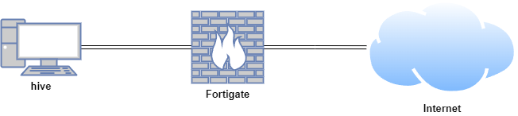

# TheHive

TheHive is an open-source security incident response platform designed to help organisations efficiently manage and respond to cybersecurity incidents. Developed to facilitate collaboration among security teams, it provides a centralised system for tracking and investigating security events, alerts, and cases.

## Lab Setup for Proof of Concept

In this proof of concept, TheHive was installed on an Ubuntu Virtual Machine (VM). 

| **Host** | **OS** | **Role** | **IP Address** |
| --- | --- | --- | --- |
| Fortigate | Fortios 7.6.0 | Firewall/Router | 192.168.1.111 (WAN) / 10.0.0.1 (LAN) |
| hive | Ubuntu 22.04 LTS | TheHive VM | 10.0.0.40 |



## Install TheHive Offline

### Download the dependencies

On an internet-connected Ubuntu machine, make a folder called the hive-package

```python
mkdir hive-package
cd hive-package
```

Download openjdk 11

```python
#wget http://archive.ubuntu.com/ubuntu/pool/main/o/openjdk-lts/openjdk-11-jdk_11.0.24+8-1ubuntu3~22.04_amd64.deb
```

Add the Cassandra, StrangeBee and Elasticsearch repositories and its GPG keys:

```python
wget -qO - https://downloads.apache.org/cassandra/KEYS | sudo gpg --dearmor  -o /usr/share/keyrings/cassandra-archive.gpg
echo "deb [signed-by=/usr/share/keyrings/cassandra-archive.gpg] https://debian.cassandra.apache.org 40x main" | sudo tee -a /etc/apt/sources.list.d/cassandra.sources.list
wget -O- https://archives.strangebee.com/keys/strangebee.gpg | sudo gpg --dearmor -o /usr/share/keyrings/strangebee-archive-keyring.gpg
echo 'deb [signed-by=/usr/share/keyrings/strangebee-archive-keyring.gpg] https://deb.strangebee.com thehive-5.2 main' | sudo tee -a /etc/apt/sources.list.d/strangebee.list
wget -qO - https://artifacts.elastic.co/GPG-KEY-elasticsearch |  sudo gpg --dearmor -o /usr/share/keyrings/elasticsearch-keyring.gpg
sudo apt-get install apt-transport-https
echo "deb [signed-by=/usr/share/keyrings/elasticsearch-keyring.gpg] https://artifacts.elastic.co/packages/8.x/apt stable main" |  sudo tee /etc/apt/sources.list.d/elastic-8.x.list
```

Update and download the required packages without installing:
This will download all packages into the cache `/var/cache/apt/archives/`

```python
sudo apt update
sudo apt-get install -y --download-only cassandra
sudo apt-get install -y --download-only thehive
sudo apt-get install -y --download-only elasticsearch
```

Run the following command to copy the required files and dependencies to the `hive-package` 

```python
cd /var/cache/apt/archives
cp openjdk-11-jre-headless_11.0.24+8-1ubuntu3~22.04_amd64.deb cassandra_4.0.13_all.deb java-common_0.72build2_all.deb ca-certificates-java_20190909ubuntu1.2_all.deb thehive_5.2.14-1_all.deb elasticsearch_8.15.1_amd64.deb ~/hive-package/

```

Compress the hive-package directory

```python
cd ..
tar -czvf hive-package.tar.gz hive-package
```

Transfer and extract the hive-package on the air-gapped machine

Install the deb packages

```python
tar -xzvf thehive_packages.tar.gz
sudo dpkg -i *
```

### Configure TheHive

Edit /etc/cassandra/cassandra.yaml

Leave cluster names as ‘Test Cluster’

Change the listen_address, rpc_address and the seeds to your IP address

```python
cluster_name: 'Test Cluster'
...
listen_address: 10.0.0.40
...
rpc_address: 10.0.0.40
...
seed_provider:
    # Addresses of hosts that are deemed contact points. 
    # Cassandra nodes use this list of hosts to find each other and learn
    # the topology of the ring.  You must change this if you are running
    # multiple nodes!
    - class_name: org.apache.cassandra.locator.SimpleSeedProvider
      parameters:
          # seeds is actually a comma-delimited list of addresses.
          # Ex: "<ip1>,<ip2>,<ip3>"
          - seeds: "10.0.0.40:7000"
```

Stop cassandra, remove the system keyspace data and then start cassandra. \

Verify that cassandra service is active and running.

```python
systemctl stop cassandra
rm -rf /var/lib/cassandra/data/system/*
systemctl start cassandra.service
systemctl status cassandra.service
```

Edit /etc/elasticsearch/elasticsearch.yml

Uncomment the cluster name and change it to thehive

Uncomment the node name and leave it as node-1

Uncomment the network host and change it to your IP address

Uncomment the http port: 92000

Uncomment the cluster initial master nodes and remove node-2

Comment the cluster initial master nodes “hive”

```python
cluster.name: thehive
...
node.name: node-1
...
network.host: 10.0.0.40
...
http.port: 9200
...
cluster.initial_master_nodes: ["node-1"]
...
# Enable security features
xpack.security.enabled: false
xpack.security.enrollment.enabled: false
...
#cluster.initial_master_nodes: ["hive"]
```

Start and enable elasticsearch. Verify elasticsearch service is active and running.

```python
systemctl start elasticsearch
systemctl enable elasticsearch
systemctl status elasticsearch.service
```

Change the ownership of the /opt/thp directory to thehive user and group.

Verify the ownership

```python
chown -R thehive:thehive /opt/thp

ls -la /opt/thp
total 12
drwxr-xr-x 3 thehive thehive 4096 Sep  7 17:12 .
drwxr-xr-x 4 root    root    4096 Sep  7 17:12 ..
drwxr-xr-x 5 thehive thehive 4096 Sep  7 17:12 thehive
```

Edit /etc/thehive/application.conf

Change the host name and application baseURL to your IP address

Make sure cluster-name matches with the cluster name defined in cassandra.yaml

To ensure TheHive is listening on the correct IP address and port, add the following lines under the service configuration:

```python
db.janusgraph {
  storage {
    backend = cql
    hostname = ["10.0.0.40"]
    # Cassandra authentication (if configured)
    # username = "thehive"
    # password = "password"
    cql {
      cluster-name = "Test Cluster"
      keyspace = thehive
    }
  }
  index.search {
    backend = elasticsearch
    hostname = ["10.0.0.40"]
    index-name = thehive
  }
}
...
# Service configuration
application.baseUrl = "http://10.0.0.40:9000"
play.http.context = "/"
play {
  http {
    address = "0.0.0.0"  # Listen on all interfaces or set to "10.0.0.40" to bind to that IP
    port = 9000
  }
}
```

Start and enable thehive service. Verify it is active and running.

```python
systemctl start thehive
systemctl enable thehive
systemctl status thehive
```

Navigate to thehive dashboard http://10.0.0.40:9000

Login using default credentials admin@hive.local (password: secret)


## References

- https://github.com/MyDFIR/SOC-Automation-Project/blob/main/TheHive-Install-Instructions
- https://youtu.be/YxpUx0czgx4?si=-B57fRikVW8AVORo
- https://youtu.be/VuSKMPRXN1M?si=JctwPim-_c3ydR-E