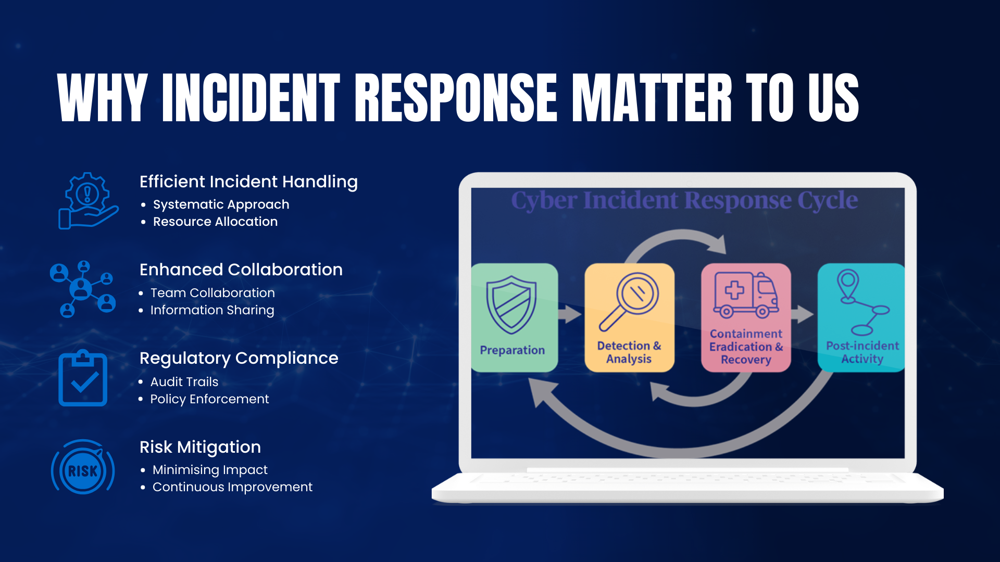
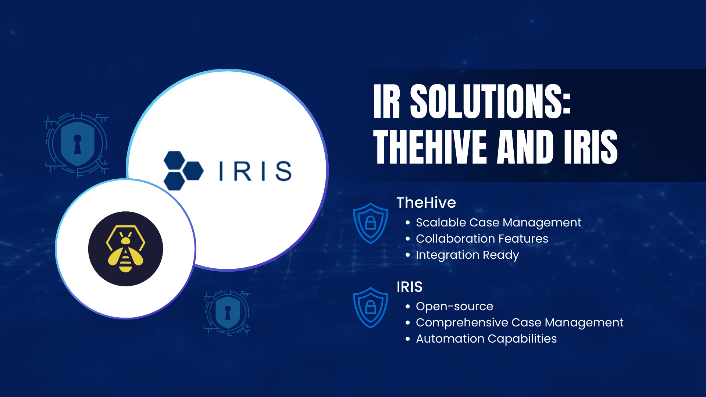

# Understanding IR

## Introduction

In an era where cyber threats are increasingly sophisticated and prevalent, we must be prepared not just to prevent attacks, but also to respond effectively when they occur. Incident Response (IR) tools are essential components of our cybersecurity strategy. They enable us to manage security incidents systematically, ensuring quick resolution and minimal impact on our operations, reputation, and stakeholder trust.

This document provides an overview of Incident Response tools, their significance, and how they affect various members of our organisation.

## What are Incident Response Tools?

Incident Response tools are specialised software solutions designed to help organisations manage cybersecurity incidents from detection to resolution.

- Incident Response: Assist in identifying, containing, eradicating, and recovering from security incidents.
- Case Management: Provide a structured framework for documenting, tracking, and managing incidents and investigations.

Together, these tools streamline the incident management process, improve communication among teams, and ensure that incidents are handled efficiently and effectively.

## Why Incident Response Matter to Us

Efficient Incident Handling

- Systematic Approach: Enables a coordinated response to security incidents, reducing confusion and delays.
- Resource Allocation: Helps prioritise incidents based on severity, ensuring critical issues receive immediate attention.

Enhanced Collaboration

- Team Coordination: Facilitates communication between IT, security teams, and other stakeholders involved in incident resolution.
- Information Sharing: Centralises data and findings, making it easier for teams to access and contribute relevant information.

Regulatory Compliance

- Audit Trails: Maintains detailed records of incident handling, which are essential for compliance with cybersecurity regulations and standards.
- Policy Enforcement: Ensures that incident response procedures adhere to organisational policies and legal requirements.

Risk Mitigation

- Minimising Impact: Swift and effective response reduces the potential damage from security incidents.
- Continuous Improvement: Lessons learned from incidents inform future security strategies and incident response plans.

## Benefits of Implementing Incident Response Tools

- Improved Response Times: Automates routine tasks, allowing teams to focus on critical analysis and decision-making.
- Consistent Processes: Standardises incident handling procedures across the organisation.
- Increased Visibility: Provides real-time insights into the status of incidents and the effectiveness of response efforts.
- Stakeholder Confidence: Demonstrates our commitment to robust security practices, enhancing trust with clients, partners, and regulators.
- Cost Savings: Reduces the financial impact of security incidents by enabling quicker containment and recovery.

## How Incident Response Tools Work

1. Detection and Alerting: Integrates with security systems to receive alerts about potential security incidents.
2. Incident Logging: Creates a case for each incident, capturing all relevant details.
3. Assessment and Prioritisation: Evaluates the severity and impact of the incident to prioritise response efforts.
4. Response Coordination: Assigns tasks to team members, sets deadlines, and facilitates communication.
5. Documentation: Records all actions taken, decisions made, and evidence collected during the incident response.
6. Resolution and Closure: Concludes the case once the incident is resolved, ensuring all loose ends are tied up.
7. Reporting and Analysis: Generates reports for internal review and compliance purposes, and analyses incidents to improve future responses.

## Our Incident Response Solutions

TheHive

- Scalable Case Management: An open-source solution that facilitates efficient handling of multiple security incidents.
- Collaboration Features: Enhances teamwork through shared dashboards and real-time updates.
- Integration Ready: Easily connects with other security tools to provide a unified incident response ecosystem.

IRIS

- Open-Source: An open-source platform designed for managing and automating incident response processes.
- Comprehensive Case Management: Offers modules for case tracking, evidence management, and reporting.
- Automation Capabilities: Streamlines workflows through automation, reducing manual efforts and the potential for human error.

IRIS proof of concept and documentation will be released later. We will provide more information on this tool once it's available.

## Support Available

- Resources: We will supply comprehensive guides and tutorials to help you understand and utilise these tools effectively.
- Assistance: Our cybersecurity and IT teams are available to support you with any questions or issues you may encounter.

## Summary

Incident Response tools are vital for safeguarding our organisation against the adverse effects of cybersecurity incidents. By implementing these solutions, we enhance our ability to respond to threats swiftly and efficiently, maintain compliance with regulatory requirements, and uphold the trust placed in us by our clients and partners. Your engagement and adherence to incident response protocols are crucial for the success of our security initiatives.

## Frequently Asked Questions

1. Will using these tools change how I report security incidents?
    
    Yes, moving forward, all security incidents should be reported and managed through the designated Incident Response tools to ensure a consistent and efficient process.
    
2. Do I need technical expertise to use these tools?
    
    No extensive technical expertise is required. The tools are designed to be user-friendly, and training will be provided to help you become comfortable with their features.
    
3. How do these tools help with compliance?
    
    They automatically document all aspects of incident management, creating detailed logs and reports necessary for demonstrating compliance with various cybersecurity regulations and standards.
    
4. Can these tools integrate with our existing security systems?
    
    Yes, solutions like TheHive are designed to integrate seamlessly with other security tools, enhancing our overall security infrastructure.
    
5. What should I do if I identify a potential security incident?
    
    Immediately report the incident using the Incident Response tool as per the provided guidelines. This ensures that the appropriate teams are alerted, and the incident is handled promptly.