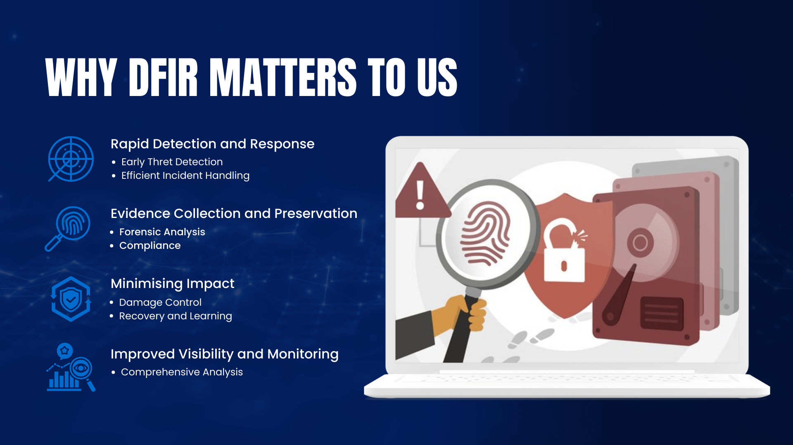
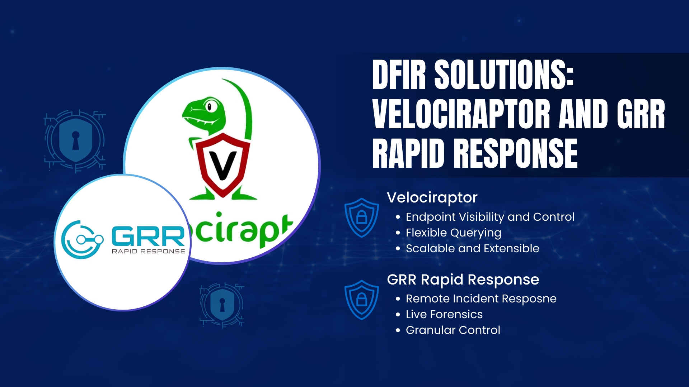

# **Understanding DFIR**

## **Introduction**

In the ever-evolving digital landscape, protecting our systems from cyber threats is more critical than ever. To effectively respond to potential incidents, understanding Digital Forensics and Incident Response (DFIR) becomes paramount. DFIR enables us to swiftly detect, analyse, and respond to security incidents, minimising damage and ensuring quick recovery. For our DFIR needs, we are implementing Velociraptor and GRR Rapid Response as our primary solutions.

This document explains what DFIR is, why it matters, and how Velociraptor and GRR Rapid Response support us in incident detection and management.

## **What is Digital Forensics and Incident Response (DFIR)?**

**Digital Forensics and Incident Response (DFIR)** refers to the combined processes of gathering and analysing digital evidence to detect, investigate, and respond to cyber incidents.

- **Digital Forensics**: The process of identifying, collecting, preserving, and analysing evidence from digital devices.
- **Incident Response**: The structured approach to managing the aftermath of a security breach or attack, with the goal of limiting damage and reducing recovery time and costs.

## **Why DFIR Matters to Us**

1. **Rapid Detection and Response**
    - **Early Threat Detection**: Identifies potential threats before they can escalate into significant incidents.
    - **Efficient Incident Handling**: Enables swift and structured response to mitigate damage.
2. **Evidence Collection and Preservation**
    - **Forensic Analysis**: Collects detailed evidence, ensuring it can be used to understand incidents or support legal investigations.
    - **Compliance**: Helps meet regulatory requirements for incident reporting and evidence preservation.
3. **Minimising Impact**
    - **Damage Control**: Ensures that the impact of any incident is limited by taking rapid response measures.
    - **Recovery and Learning**: Facilitates prompt system recovery and helps learn from incidents to improve defenses.
4. **Improved Visibility and Monitoring**
    - **Comprehensive Analysis**: Provides deep insights into endpoints and activities, ensuring comprehensive monitoring and forensic analysis.

## **Benefits of Implementing DFIR**

- **Proactive Threat Management**: Identifies and responds to potential threats before they become major incidents.
- **Streamlined Investigations**: Enables effective evidence collection and forensic analysis.
- **Operational Continuity**: Minimises downtime by responding rapidly to incidents.
- **Compliance Support**: Ensures regulatory requirements for incident management and digital evidence are met.
- **Cost Efficiency**: Reduces the costs associated with long recovery times and system outages.

## **Our DFIR Solutions**

### **Velociraptor**

- **Endpoint Visibility and Control**: Velociraptor provides deep visibility into endpoints, allowing us to hunt for indicators of compromise (IoCs) across the network.
- **Flexible Querying**: Utilises Velociraptor Query Language (VQL) to perform detailed investigations on endpoint activity.
- **Rapid Data Collection**: Gathers information quickly from multiple endpoints for analysis.
- **Scalable and Extensible**: Designed to scale across large environments, with community-contributed plugins and scripts to enhance capabilities.

### **GRR Rapid Response**

- **Remote Incident Response**: GRR Rapid Response enables remote access to endpoints, allowing for detailed examination of systems without physical access.
- **Live Forensics**: Provides live forensic capabilities, collecting volatile data like memory and process information to help understand incidents.
- **Granular Control**: Allows detailed investigations, with capabilities to run pre-configured flows for common incident response activities.
- **Community Backing**: Developed by Google, GRR has a strong community that contributes to the tool's continuous improvement.

*Note: GRR Rapid Response proof of concept and documentation will be released later. We will provide more information on this tool once it is available.*

## **How DFIR Works with Velociraptor and GRR**

1. **Detection**
    - **Monitoring and Alerts**: Detects suspicious activities and alerts the response team.
2. **Investigation**
    - **Data Collection**: Collects data from endpoints using Velociraptor or GRR for forensic analysis.
    - **Analysis**: analyses the collected data to identify the root cause and understand the scope of the incident.
3. **Containment and Eradication**
    - **Containment Measures**: Limits the spread of an incident by isolating affected systems.
    - **Eradication**: Removes the malicious artifacts from systems to prevent recurrence.
4. **Recovery**
    - **Restoration**: Restores systems to normal operation, ensuring no remnants of the threat remain.
5. **Lessons Learned**
    - **Review**: analyses what went wrong, what worked, and what can be improved in the incident response process.

## **Support Available**

- **Resources**: Comprehensive documentation, user guides, and FAQs to help you understand and utilise Velociraptor and GRR effectively.

## **Summary**

Implementing Velociraptor and GRR Rapid Response as part of our DFIR strategy provides us with robust capabilities to detect, investigate, and respond to security incidents. Together, these tools enable us to minimise the impact of incidents, enhance endpoint visibility, and maintain operational resilience. 

## **Frequently Asked Questions**

### **1. Will using Velociraptor and GRR affect my daily work?**

- **Minimal Impact**: Both tools are designed to operate in the background, ensuring that day-to-day activities remain unaffected.

### **2. How do Velociraptor and GRR differ?**

- **Velociraptor**: Focuses on endpoint visibility and rapid data collection using flexible queries.
- **GRR**: Emphasises remote live forensics, allowing detailed analysis and response to incidents.

### **3. Are Velociraptor and GRR only for security purposes?**

- **Multi-Purpose Tools**: While primarily used for security, they also help in troubleshooting system issues and gaining operational insights.

### **4. Can Velociraptor and GRR be deployed in an air-gapped environment?**

- **Yes**: Both tools can be installed and used in environments without internet connectivity, with the necessary setup provided by our support team.

### **5. Is there any cost associated with using Velociraptor and GRR?**

- **Open-Source**: Both tools are open-source, with no licensing costs involved. Any costs would relate to resources required for deployment and maintenance.