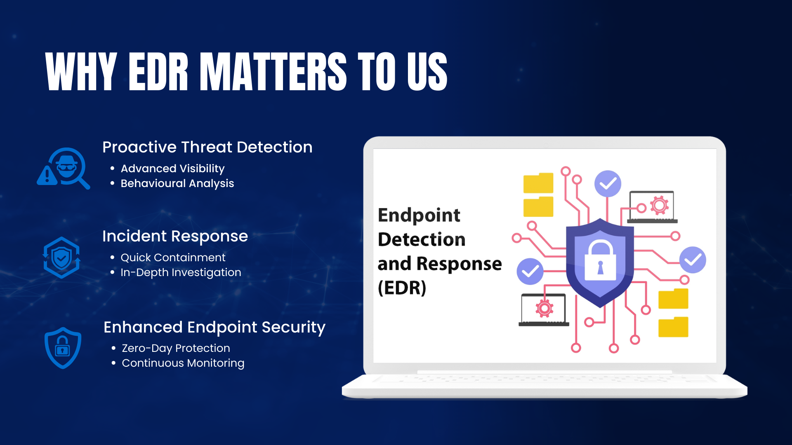
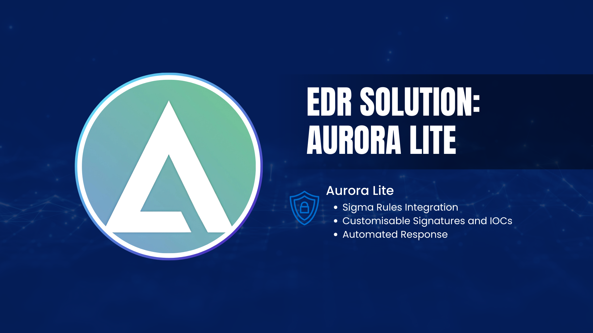

# **Understanding EDR**

# **What is EDR?**

**Endpoint Detection and Response (EDR)** is a cybersecurity technology that focuses on identifying, investigating, and responding to threats targeting endpoint devices such as laptops, desktops, and servers. EDR systems continuously monitor endpoint activity, detect suspicious behaviour, and provide tools for analysing and mitigating potential threats, ensuring endpoint devices remain secure.

### **Why EDR Matters to Us**

1. **Proactive Threat Detection**
    - **Advanced Visibility**: Monitors endpoint activity to detect potential threats and vulnerabilities.
    - **Behavioural Analysis**: Identifies patterns of malicious behaviour that may evade traditional antivirus solutions.
2. **Incident Response**
    - **Quick Containment**: EDR enables the isolation of compromised endpoints to prevent further spread.
    - **In-Depth Investigation**: Offers detailed tools for understanding the scope and root cause of incidents.
3. **Enhanced Endpoint Security**
    - **Zero-Day Protection**: Detects and blocks threats from unknown vulnerabilities through behaviour-based analysis.
    - **Continuous Monitoring**: Provides real-time protection against evolving threats.

### **Benefits of Implementing EDR**

- **Rapid Response**: Neutralises threats quickly to minimise impact.
- **Comprehensive Visibility**: Provides a clear understanding of endpoint activities.
- **Reduced Downtime**: Minimises operational disruptions caused by incidents.
- **Improved Resilience**: Enhances the ability to prevent, detect, and recover from cyberattacks.

### **How EDR Works**

1. **Data Collection:** Gathers and stores activity data from endpoint devices, including processes, files, and network connections.
2. **Threat Detection:** Uses AI, machine learning, and behavioural analytics to identify potential security threats in real time.
3. **Investigation:** Provides forensic tools to analyse the nature, scope, and impact of detected incidents.
4. **Response:** Enables automated and manual actions, such as isolating endpoints, terminating malicious processes, and restoring affected systems.

### **EDR Solution**

- **Aurora Lite** is an efficient and lightweight EDR solution tailored to provide robust protection for endpoint devices without overwhelming system resources. Its key features include:
    - **Sigma Rules Integration:** Detects threats by applying Sigma rules, a widely recognised standard for creating and sharing detection rules.
    - **Customisable Signatures and IOCs:** Allows flexibility to adapt detection capabilities to meet specific security needs.
    - **Automated Response:** Includes preconfigured actions to immediately contain and mitigate threats.
    - **Ease of Deployment:** Simplifies the installation process for fast implementation across endpoints.
    - **Low Resource Usage:** Optimised to run efficiently without impacting device performance.

