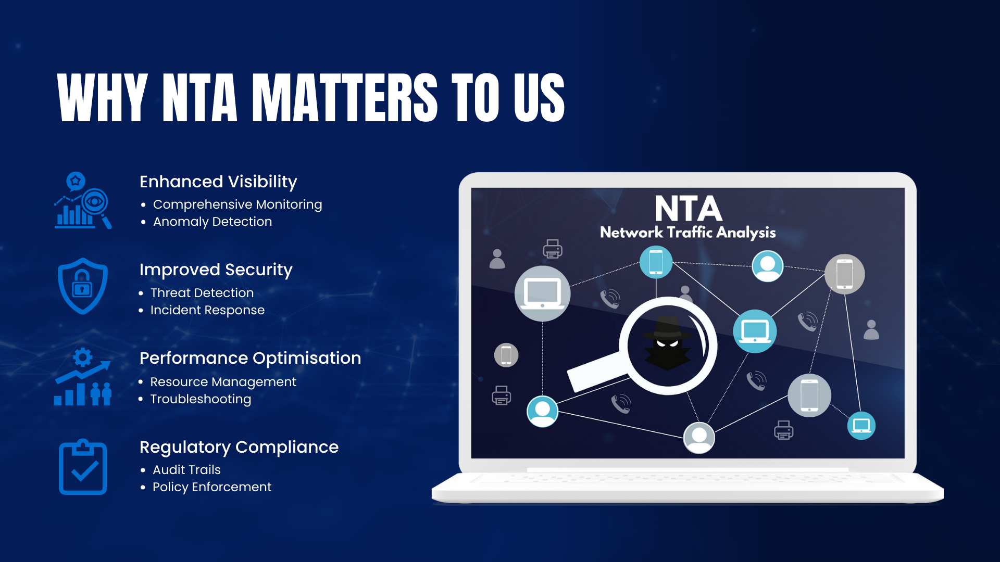
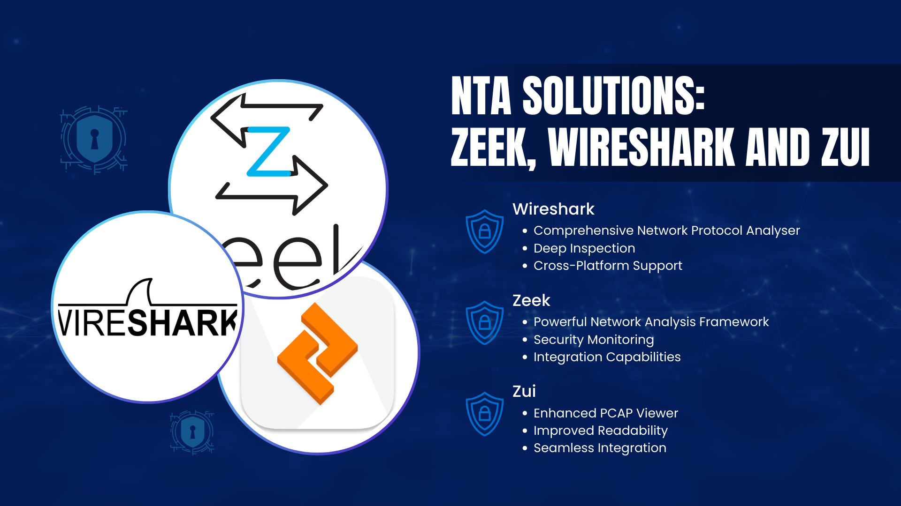

# Understanding NTA

## **Introduction**

In today's interconnected digital environment, understanding our network traffic is crucial. Monitoring and analysing network activities not only enhances our security posture but also improves operational efficiency. To achieve this, we are implementing Network Traffic Analysers.

This document explains what Network Traffic Analysis (NTA) is, why it's important, and how it affects different members of our organisation.

## **What is Network Traffic Analysis?**

A **Network Traffic Analyser** is a tool that monitors, captures, and analyses network data to provide insights into network performance and security.

- **Network Traffic Analysis**: Involves examining network traffic patterns to detect anomalies, understand usage, and identify potential threats.

## **Why Network Traffic Analysis Matters to Us**

1. **Enhanced Visibility**
    - **Comprehensive Monitoring**: Provides a detailed view of all activities on our network.
    - **Anomaly Detection**: Identifies unusual patterns that may indicate security threats or performance issues.
2. **Improved Security**
    - **Threat Detection**: Helps in identifying malicious activities such as malware, unauthorised access, or data exfiltration.
    - **Incident Response**: Aids in investigating and responding to security incidents promptly.
3. **Performance Optimisation**
    - **Resource Management**: Monitors bandwidth usage to optimise network performance.
    - **Troubleshooting**: Assists in quickly identifying and resolving network issues affecting productivity.
4. **Regulatory Compliance**
    - **Audit Trails**: Maintains detailed logs required for compliance with industry regulations.
    - **Policy Enforcement**: Ensures adherence to organisational network usage policies.

## **Benefits of Implementing Network Traffic Analysers**

- **Proactive Threat Management**: Early detection of security threats before they escalate.
- **Operational Efficiency**: Reduces downtime by swiftly addressing network issues.
- **Cost Savings**: Optimises resource utilisation, reducing unnecessary expenses.
- **Informed Decision-Making**: Provides data-driven insights for strategic planning and policy development.
- **Stakeholder Confidence**: Demonstrates our commitment to maintaining a secure and efficient network environment.

## **How Network Traffic Analysis Works**

1. **Data Capture**
    - Continuously collects network packets and flow data in real-time.
2. **Data Processing**
    - Analyses the captured data to identify patterns, anomalies, and trends.
3. **Alerting and Reporting**
    - Generates alerts for suspicious activities and comprehensive reports on network performance.
4. **Actionable Insights**
    - Provides recommendations for enhancing network security and efficiency.

## **Our Network Traffic Analyser Solutions**

### **Wireshark**

- **Comprehensive Network Protocol Analyser**: Wireshark is a widely-used open-source tool for network troubleshooting, analysis, and education.
- **Deep Inspection**: Captures live network traffic and allows detailed examination of hundreds of protocols.
- **User-Friendly Interface**: Provides a graphical interface with powerful filtering capabilities for easy analysis.
- **Cross-Platform Support**: Available on multiple operating systems including Windows, macOS, and Linux.
- **Educational Resource**: Great for learning about network protocols and how data traverses the network.

*Note: Wireshark proof of concept and documentation will be released later. We will provide more information on this tool once it is available.*

### **Zeek**

- **Powerful Network Analysis Framework**: Zeek (formerly known as Bro) is an open-source platform that offers deep network traffic analysis.
- **Security Monitoring**: Detects a wide range of malicious activities by analysing network protocols and behaviours.
- **Flexibility and Extensibility**: Features a powerful scripting language for custom policy creation and event handling.
- **Integration Capabilities**: Easily integrates with other security tools, enhancing our overall cybersecurity infrastructure.
- **Community Support**: Backed by an active community contributing scripts, plugins, and support.

### **Zui**

- **Enhanced PCAP Viewer**: Zui is a modern network analysis tool designed to simplify the analysis of pcap files and Zeek logs.
- **Improved Readability**: Offers a clear and intuitive interface that makes complex network data more accessible.
- **Fast Search Capabilities**: Allows quick searching through large datasets, facilitating efficient investigation of network events.
- **Collaborative Analysis**: Supports workflows where multiple users can analyse the same network data, promoting teamwork in incident response and forensic analysis.
- **Seamless Integration**: Works effectively with both Zeek and Wireshark, complementing their deep network inspection capabilities with user-friendly data presentation.

## **Support Available**

- **Resources**: We will provide user-friendly guides and documentation to help you understand and utilise Zeek, Wireshark, and Zui effectively.
- **Training Sessions**: Scheduled training to familiarise you with these tools and their features.
- **Assistance**: Our IT and cybersecurity teams are available to support you with any questions or issues.

## **Summary**

Implementing Zeek, Wireshark, and Zui as our Network Traffic Analysers enhances our ability to monitor network activities comprehensively. Together, these tools empower us to detect and respond to security threats proactively, optimise network performance, and ensure compliance with regulations. Your cooperation and participation are vital for the successful deployment and management of these solutions.

## **Frequently Asked Questions**

### **1. Will using Zeek, Wireshark, and Zui affect my daily work?**

- **Minimal Impact**: All three tools operate passively on the network and do not interfere with normal operations, ensuring that your daily activities remain unaffected.

### **2. How do Zeek, Wireshark, and Zui differ?**

- **Zeek**: Focuses on network security monitoring by analysing network behaviours and protocols, providing high-level summaries and logs.
- **Wireshark**: Offers detailed packet-level analysis, allowing for deep inspection of individual packets and protocols.
- **Zui**: Provides an easy-to-use interface for viewing pcap files and Zeek logs, enhancing readability and simplifying the analysis process.

### **3. Are Zeek, Wireshark, and Zui only for security purposes?**

- **Multi-Purpose Tools**: While they are powerful for security monitoring, they also provide valuable insights into network performance, usage patterns, and support troubleshooting efforts.

### **4. How do these tools help with compliance?**

- **Detailed Logging**: Zeek, Wireshark, and Zui maintain comprehensive logs of network activities, essential for compliance reporting and audits.
- **Policy Enforcement**: Assist in enforcing organisational policies by monitoring network usage and detecting violations.

### **5. Can Zeek, Wireshark, and Zui be deployed in an air-gapped environment?**

- **Yes**: All three tools can be installed and operated in air-gapped networks without internet connectivity. We will provide the necessary documentation and support for deployment in such environments.

### **6. What kind of training will be provided?**

- **Introductory Training Sessions**: We will conduct sessions to help you understand the functionalities of Zeek, Wireshark, and Zui, and how to interpret their data.
- **Training Resources**: Access to tutorials, user manuals, and best practices will be provided for ongoing learning.
- **Hands-On Workshops**: Interactive workshops to practise using the tools and analysing network traffic data.

### **7. Who do I contact if I have questions or notice a network issue?**

- **Support Channels**: Please reach out to the IT or cybersecurity team through our internal support system for assistance or to report any concerns.

### **8. How do Zeek, Wireshark, and Zui complement each other?**

- **Combined Strengths**: Using these tools together provides a comprehensive analysis of network traffic. Zeek offers high-level behavioural insights, Wireshark allows for deep packet inspection, and Zui enhances readability of network data.
- **Enhanced Troubleshooting**: Zeek can identify issues at a high level, Wireshark can dive into packet specifics, and Zui makes navigating large datasets more manageable.

### **9. Is there any cost associated with using Zeek, Wireshark, and Zui?**

- **Open-Source**: All three tools are open-source, meaning there are no licensing costs. Any associated expenses would relate to hardware or resources needed to run the analysers