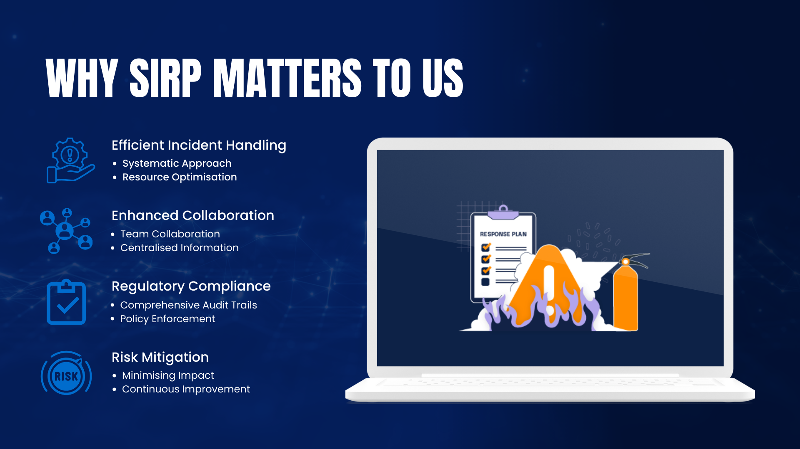

# **Understanding SIRP**

## **What is a SIRP?**

A Security Incident Response Platform is an integrated suite of tools designed to streamline and automate the process of managing cybersecurity incidents from detection to resolution.

- **Incident Management**: Facilitates the identification, containment, eradication, and recovery from security incidents.
- **Case Management**: Offers a structured framework for documenting, tracking, and managing incidents and investigations.
- **Automation and Orchestration**: Automates routine tasks and orchestrates workflows across different security tools.

By consolidating these functionalities, a SIRP enhances the efficiency of incident response, improves team collaboration, and ensures that incidents are handled in a consistent and effective manner.

## **Why SIRP Matters to Us**

**Efficient Incident Handling**

- **Systematic Approach**: Provides a coordinated and methodical response to security incidents, reducing confusion and delays.
- **Resource Optimisation**: Helps prioritise incidents based on severity, ensuring that critical issues receive immediate attention.

**Enhanced Collaboration**

- **Team Coordination**: Improves communication among IT, security teams, and other stakeholders involved in incident resolution.
- **Centralised Information**: Stores all incident-related data in one place, making it easier for teams to access and contribute relevant information.

**Regulatory Compliance**

- **Comprehensive Audit Trails**: Maintains detailed records of incident handling, essential for compliance with cybersecurity regulations and standards.
- **Policy Enforcement**: Ensures that incident response procedures adhere to organisational policies and legal requirements.

**Risk Mitigation**

- **Minimising Impact**: Enables swift and effective responses, reducing the potential damage from security incidents.
- **Continuous Improvement**: Analyses incidents to inform future security strategies and enhance incident response plans.

## **Benefits of Implementing a SIRP**

- **Improved Response Times**: Automates repetitive tasks, allowing teams to focus on critical analysis and decision-making.
- **Consistency**: Standardises incident handling procedures across the organisation.
- **Greater Visibility**: Provides real-time insights into the status of incidents and the effectiveness of response efforts.
- **Stakeholder Confidence**: Demonstrates our commitment to robust security practices, enhancing trust with clients, partners, and regulators.
- **Cost Efficiency**: Reduces the financial impact of security incidents through quicker containment and recovery.

## **How a SIRP Works**

1. **Detection and Alerting**: Integrates with security systems to receive alerts about potential security incidents.
2. **Incident Logging**: Automatically creates a case for each incident, capturing all relevant details.
3. **Assessment and Prioritisation**: Evaluates the severity and impact of the incident to prioritise response efforts.
4. **Response Coordination**: Assigns tasks to team members, sets deadlines, and facilitates communication.
5. **Automation and Orchestration**: Automates routine actions and coordinates workflows across various security tools.
6. **Documentation**: Records all actions taken, decisions made, and evidence collected during the incident response.
7. **Resolution and Closure**: Concludes the case once the incident is resolved, ensuring all loose ends are tied up.
8. **Reporting and Analysis**: Generates reports for internal review and compliance purposes, and analyses incidents to improve future responses.

## **SIRP Solutions**

**TheHive**

- **Scalable Case Management**: An open-source SIRP that enables efficient handling of multiple security incidents.
- **Collaboration Features**: Enhances teamwork through shared dashboards and real-time updates.
- **Integration Capabilities**: Easily connects with other security tools to provide a unified incident response ecosystem.

**IRIS**

- **Open-Source Platform**: A robust SIRP designed for managing and automating incident response processes.
- **Comprehensive Case Management**: Offers modules for case tracking, evidence management, and detailed reporting.
- **Customisable Workflows**: Allows tailoring of incident response procedures to fit organisational needs.

