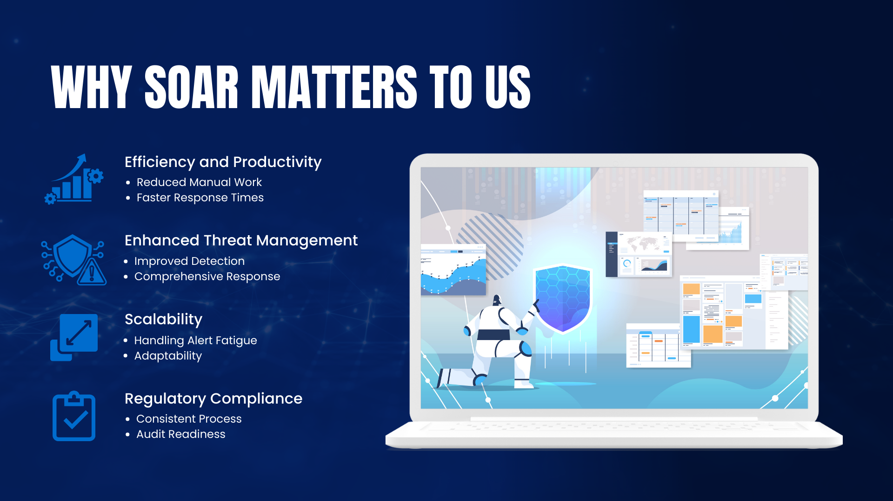
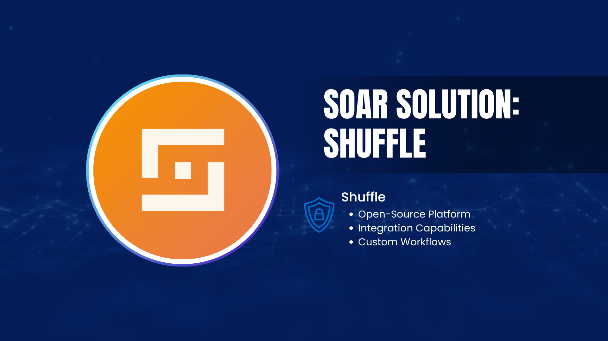

# **Understanding SOAR**

## **Introduction**

In the ever-evolving landscape of cybersecurity, the volume and complexity of cyber threats are increasing rapidly. Traditional security measures are often insufficient to handle the sheer amount of data and alerts generated daily. To enhance our cybersecurity posture and streamline our response to threats, we are implementing **Security Orchestration, Automation, and Response (SOAR)** solutions.

This document aims to explain what SOAR is, why it's crucial for our organisation, and how it impacts various stakeholders.

## **What is SOAR?**

**Security Orchestration, Automation, and Response (SOAR)** is a set of technologies that enable organisations to collect security threat data and alerts from multiple sources. SOAR solutions allow for the automation of responses to low-level threats and the orchestration of complex processes involving multiple tools and teams.

- **Security Orchestration**: Integrates different security tools and systems to work together seamlessly.
- **Automation**: Automates routine and repetitive security tasks to improve efficiency.
- **Response**: Facilitates swift and effective responses to security incidents.

## **Why SOAR Matters to Us**

1. **Efficiency and Productivity**
    - **Reduced Manual Work**: Automates repetitive tasks, freeing up our security team to focus on more critical issues.
    - **Faster Response Times**: Automates incident responses to mitigate threats more quickly.
2. **Enhanced Threat Management**
    - **Improved Detection**: Correlates data from various sources for better threat detection.
    - **Comprehensive Response**: Coordinates actions across different security tools for effective threat mitigation.
3. **Scalability**
    - **Handling Alert Fatigue**: Manages the growing number of security alerts without overburdening the team.
    - **Adaptability**: Scales with our organisation's growth and evolving security needs.
4. **Regulatory Compliance**
    - **Consistent Processes**: Ensures compliance through standardized and documented response procedures.
    - **Audit Readiness**: Maintains logs and reports necessary for audits and compliance checks.

## **Benefits of Implementing SOAR**

- **Improved Security Posture**: Enhances our ability to detect and respond to threats effectively.
- **Operational Efficiency**: Streamlines security operations through automation and integration.
- **Cost Reduction**: Lowers operational costs by reducing the need for manual intervention.
- **Stakeholder Confidence**: Demonstrates our commitment to robust cybersecurity practices.

## **How SOAR Works**

1. **Data Collection**: Aggregates security data from various sources such as firewalls, IDS/IPS, and endpoint protection systems.
2. **Analysis**: Uses advanced analytics to identify and prioritize security threats.
3. **Automation**: Executes predefined workflows to respond to specific types of threats automatically.
4. **Orchestration**: Coordinates actions across multiple security tools and teams for a unified response.
5. **Reporting**: Generates reports and dashboards for continuous monitoring and improvement.

## **Our SOAR Solutions**

- **Shuffle**
    - **Open-Source SOAR Platform**: Provides a user-friendly interface for building and automating security workflows.
    - **Integration Capabilities**: Easily connects with various security tools through built-in integrations.
    - **Custom Workflows**: Allows us to create tailored automation workflows specific to our security needs.
- **StackStorm**
    - **Event-Driven Automation**: Enables automated responses to events based on predefined rules and triggers.
    - **Flexibility**: Supports complex automation tasks across different systems and applications.
    - **Community Support**: Backed by an active community offering plugins and integrations for extended functionality.

*Note: StackStorm proof of concept and documentation will be released later. We will provide more information on this tool once it is available.*

## **Support Available**

- **Resources**: We will provide comprehensive guides and documentation to help you understand and utilize SOAR tools effectively.
- **Assistance**: Our cybersecurity team is available to assist with any questions or issues you may encounter.

## **Summary**

Implementing SOAR solutions like Shuffle and StackStorm is a strategic move to enhance our cybersecurity capabilities. These tools will help us automate routine tasks, orchestrate complex workflows, and respond to threats more efficiently. Your collaboration is vital for the successful deployment and management of these systems, contributing to the overall security and resilience of our organisation.

## **Frequently Asked Questions**

### **1. Will implementing SOAR affect my daily work?**

- **Minimal Impact**: SOAR solutions are designed to streamline security operations with little to no disruption to your daily activities.

### **2. How does SOAR differ from traditional security tools?**

- **Integration and Automation**: Unlike standalone security tools, SOAR integrates multiple systems and automates responses, enhancing efficiency and effectiveness.

### **3. How does SOAR help with compliance?**

- **Standardisation**: Automates compliance-related tasks and maintains detailed logs, making it easier to adhere to regulatory requirements and prepare for audits.

### **4. Can SOAR be used in an air-gapped environment?**

- **Yes**: Both Shuffle and StackStorm can be deployed in air-gapped networks. We will provide specific guidelines on implementing these solutions without internet connectivity to ensure your environment remains secure and isolated.

### **5. How customisable are the SOAR workflows?**

- **Highly Customisable**: Both Shuffle and StackStorm allow for extensive customization to tailor automation workflows to our specific security policies and procedures.