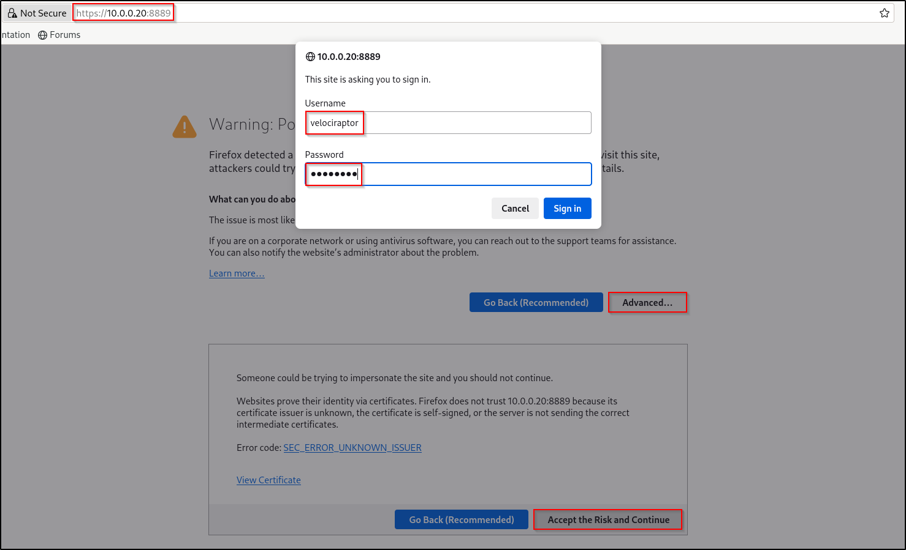

# **Velociraptor**

Velociraptor is an advanced digital forensic and incident response tool that enhances your visibility into your endpoints.

## **Lab Setup for Proof of Concept**

In this proof of concept, the Velociraptor server was configured on an Ubuntu virtual machine (VM), and the Velociraptor client was configured on a Windows VM. An attack simulation was conducted on the Windows hosts using a Kali machine in a safe and controlled setting.

**Note: Do not attempt to replicate the attack emulation demonstrated here unless you are properly trained and it is safe to do so. Unauthorised attack emulation can lead to legal consequences and unintended damage to systems. Always ensure that such activities are conducted by qualified professionals in a secure, isolated environment.**

| **Host** | **OS** | **Role** | **IP Address** |
| --- | --- | --- | --- |
| Fortigate | Fortios 7.6.0 | Firewall/Router | 192.168.1.111 (WAN) / 10.0.0.1 (LAN) |
| WazuhServer | Ubuntu 22.04 LTS | Velociraptor Server | 10.0.0.20 |
| WS2019 | Windows Server 2019 | Velociraptor Client | 10.0.0.40 |
| Kali | Kali Linux 2024.2 | Attacker machine | 10.0.0.22 |


## **Deploy Velociraptor Server using Self-Signed SSL**

### **Self-Signed SSL**

Velociraptor deployments are secured using a self-signed Certificate Authority (CA) that is generated during the initial configuration generation step. The client’s configuration contains the signed CA, which is used to verify all certificates needed during communications.

In `self-signed SSL` mode, Velociraptor issues its own server certificate using its internal CA. This means the Admin GUI and front end also use a self-signed server certificate.

### **When to use this method**

This type of deployment is most appropriate for on-premises scenarios where internet access is not available or egress is blocked.

### **Self-Signed Certificates**

Self-signed SSL certificates trigger SSL warnings in all web browsers. When accessing the Admin GUI you will receive a certificate warning about the possibility of a MITM attack.

As a precaution, Velociraptor only exports the GUI port on the loopback interface. You may change the `GUI.bind_address` setting to “0.0.0.0” to receive external connections on this port, but this is not recommended. Instead, you should use SSH tunneling to connect to the local loopback interface.

Velociraptor doesn’t support other self-signed SSL certificates, and we don’t recommend attempting to create and upload your own internal self-signed certificate to Velociraptor.

### **Generate config files for the server and client**

Download the latest Velociraptor binary that is compatible for your host architecture from [https://github.com/Velocidex/velociraptor/releases](https://github.com/Velocidex/velociraptor/releases).

Change the permission of the Velociraptor binary.

```bash
sudo chmod 764 velociraptor-v0.72.0-linux-amd64
```

Make the directory `/opt/velociraptor` 

```bash
sudo mkdir /opt/velociraptor
```

Generate a new config file by running velociraptor in interactive mode

Select `linux` for OS

Set Path to the datastore directory as default `/opt/velociraptor` (hit `enter`)

Select `Self Signed SSL`

For the public DNS name of the Master Frontend, enter your IP address (e.g. `10.0.0.20`)

For the frontend port, select default port of `8000` (hit `enter`)

**Note:** If you are installing Velociraptor server on same machine as where the Splunk Enterprise is installed, set your frontend port to something else (e.g. `7000`) to avoid conflict.

For the GUI port, select default port of `8889` (hit `enter`)

For WebSocket, answer `N` (hit `enter`)

For the registry to store the writeback files, answer `N` (hit `enter`)

For DynDns provider, answer `none` (hit `enter`)

Create GUI username and password

When prompted to create GUI username again, hit `enter` to end

Set Path to the logs directory as default `/opt/velociraptor/logs` (hit `enter`)

For restricting VQL functionality on the server, answer `N` (hit `enter`)

For where should I write the server config file, hit `enter` to set it to `server.config.yaml`

For where should I write the client config file, hit `enter` to set it to `client.config.yaml`

Note the question is actually asking for file name instead of file path. 

```bash
sudo ./velociraptor-v0.72.0-linux-amd64 config generate -i
```

```bash
#Example output
Welcome to the Velociraptor configuration generator
---------------------------------------------------

I will be creating a new deployment configuration for you. I will
begin by identifying what type of deployment you need.

What OS will the server be deployed on?
 linux
? Path to the datastore directory. /opt/velociraptor
?  Self Signed SSL
? What is the public DNS name of the Master Frontend (e.g. www.example.com): 10.0.0.20
? Enter the frontend port to listen on. 8000
? Enter the port for the GUI to listen on. 8889
? Would you like to try the new experimental websocket comms?

Websocket is a bidirectional low latency communication protocol supported by
most modern proxies and load balancers. This method is more efficient and
portable than plain HTTP. Be sure to test this in your environment.
 No
? Would you like to use the registry to store the writeback files? (Experimental) No
? Which DynDns provider do you use? none
? GUI Username or email address to authorize (empty to end): cyber
? GUI Username or email address to authorize (empty to end): 
[INFO] 2024-09-18T20:53:27Z  _    __     __           _                  __ 
[INFO] 2024-09-18T20:53:27Z | |  / /__  / /___  _____(_)________ _____  / /_____  _____ 
[INFO] 2024-09-18T20:53:27Z | | / / _ \/ / __ \/ ___/ / ___/ __ `/ __ \/ __/ __ \/ ___/ 
[INFO] 2024-09-18T20:53:27Z | |/ /  __/ / /_/ / /__/ / /  / /_/ / /_/ / /_/ /_/ / / 
[INFO] 2024-09-18T20:53:27Z |___/\___/_/\____/\___/_/_/   \__,_/ .___/\__/\____/_/ 
[INFO] 2024-09-18T20:53:27Z                                   /_/ 
[INFO] 2024-09-18T20:53:27Z Digging deeper!                  https://www.velocidex.com 
[INFO] 2024-09-18T20:53:27Z This is Velociraptor 0.72.0 built on 2024-04-25T16:09:17Z (7e4da7a) 
[INFO] 2024-09-18T20:53:27Z Generating keys please wait.... 
? Path to the logs directory. /opt/velociraptor/logs
? Do you want to restrict VQL functionality on the server?

This is useful for a shared server where users are not fully trusted.
It removes potentially dangerous plugins like execve(), filesystem access etc.

NOTE: This is an experimental feature only useful in limited situations. If you
do not know you need it select N here!
 No
? Where should I write the server config file? server.config.yaml
? Where should I write the client config file? client.config.yaml
```

Verify that both server and client config files are generated in the present working directory

```bash
ls
```

```bash
#Example output
client.config.yaml  server.config.yaml  velociraptor-v0.72.0-linux-amd64
```

Copy the config files to `/opt/velociraptor`  directory

```bash
sudo cp client.config.yaml /opt/velociraptor
sudo cp server.config.yaml /opt/velociraptor
```

Edit `server.config.yaml` in the `/opt/velociraptor`  directory

```bash
sudo nano server.config.yaml
```

Verify that `Client: server_urls:` is set to `https://<IP address>:8000/`

Edit `GUI: bind address:` to point to your Velociraptor server IP address 

```bash
Client:
  server_urls:
   - https://10.0.0.20:8000/

GUI:
  bind_address: 10.0.0.20
  bind_port: 8889
```

Create the Velociraptor server package for deb that included the generated configuration file:

```bash
sudo ./velociraptor-v0.72.0-linux-amd64 --config /home/cyber/Downloads/server.config.yaml debian server --binary velociraptor-v0.72.0-linux-amd64 
```

```bash
#Example output
Creating amd64 server package at velociraptor_server_0.72.0_amd64.deb
```

Install the server package

```bash
sudo dpkg -i velociraptor_server_0.72.0_amd64.deb
```

This process creates a new user, system user and group called velociraptor

A service is created to automatically start Velociraptor anytime the server is restarted

Verify the /opt/velociraptor is accessible by user and group velociraptor

```bash
ls -la /opt/velociraptor/
```

```bash

total 24
drwxr-xr-x. 9 velociraptor velociraptor   175 Aug 28 09:03 .
drwxr-xr-x. 5 root         root            52 Aug 28 07:09 ..
drwx------. 2 velociraptor velociraptor    68 Aug 28 09:03 acl
-rw-------. 1 velociraptor velociraptor  2725 Aug 28 07:19 client.config.yaml
drwx------. 3 velociraptor velociraptor    20 Aug 28 09:03 clients
drwxr-xr-x. 3 velociraptor velociraptor   168 Aug 28 09:03 config
drwx------. 2 velociraptor velociraptor  4096 Aug 28 09:03 logs
drwx------. 3 velociraptor velociraptor    35 Aug 28 09:03 server_artifact_logs
drwx------. 5 velociraptor velociraptor   104 Aug 28 09:03 server_artifacts
-rw-------. 1 velociraptor velociraptor 13172 Aug 28 08:54 server.config.yaml
drwx------. 2 velociraptor velociraptor    29 Aug 28 09:03 users
---

total 36
drwxr-xr-x 9 velociraptor velociraptor 4096 Sep 19 09:06 .
drwxr-xr-x 5 root         root         4096 Sep 19 08:13 ..
drwx------ 2 velociraptor velociraptor 4096 Sep 19 09:06 acl
drwx------ 3 velociraptor velociraptor 4096 Sep 19 09:06 clients
drwxr-xr-x 3 velociraptor velociraptor 4096 Sep 19 09:06 config
drwx------ 2 velociraptor velociraptor 4096 Sep 19 09:06 logs
drwx------ 3 velociraptor velociraptor 4096 Sep 19 09:06 server_artifact_logs
drwx------ 5 velociraptor velociraptor 4096 Sep 19 09:06 server_artifacts
drwx------ 2 velociraptor velociraptor 4096 Sep 19 09:06 users

```

Verify `velocirpator_server.service` is active and running

```bash
sudo systemctl status velociraptor_server.service 
```

Access the Velociraptor by typing `https://<IP address>:8889`

Sign in with the user you created




### **Configure Firewall**

On CentOS host, run the following command

```python
#Show original state
firewall-cmd --list-all

#Velociraptor ports
firewall-cmd --zone=public --add-port=8000/tcp --permanent # Frontend
firewall-cmd --zone=public --add-port=8889/tcp --permanent # Web GUI
firewall-cmd --reload

#Check applied
firewall-cmd --list-all
```

On Ubuntu, run the following command:

```jsx
sudo ufw allow 8000/tcp  # syslog TCP
sudo ufw allow 8889/udp  # syslog UDP

#Apply changes
sudo ufw reload

#Enable Firewall
#sudo ufw enable

#Apply changes
sudo ufw status numbered
```

## **Configure Velociraptor Client (Windows)**

### **Option 1: Official release MSI**

The recommended way to install Velociraptor as a client on Windows is via the release MSI on the [Github releases](https://github.com/Velocidex/velociraptor/releases) page. Download the Velociraptor MSI ([velociraptor-v0.72.0-windows-amd64.msi](https://github.com/Velocidex/velociraptor/releases/download/v0.72/velociraptor-v0.72.0-windows-amd64.msi)) . On your Windows host, double-click the `msi` or run the following command on Command Prompt:

```bash
msiexec /i [velociraptor-v0.72.0-windows-amd64.msi](https://github.com/Velocidex/velociraptor/releases/download/v0.72/velociraptor-v0.72.0-windows-amd64.msi)
```

Navigate to `C:\Program Files\Velociraptor` and delete the existing `client.config.yaml`

Transfer `client.config.yaml` from Linux host to Windows client using your preferred method. 

From the Linux host in the `/opt/velociraptor` folder, host a HTTP server by running:

```bash
sudo python3 -m http.server 9999
```

From Windows client, open PowerShell as Administrator. Change directory into `C:\Program Files\Velociraptor` and run:

```bash
iwr -uri http://10.0.0.20:9999/client.config.yaml -Outfile client.config.yaml
```

You will see `velociraptor.writeback.yaml` appear. If the writeback YAML file does not appear, restart the computer.

### **Option 2: Configure MSI package via Velociraptor Server**

Since the Velociraptor client requires a unique configuration file to identify the location of the server, we can’t package the configuration file in the official release. Therefore, the official MSI does not include a valid configuration file. You will need to modify the MSI to pack your configuration file (that was generated earlier) into it.

Navigate to Velociraptor web GUI. Click on the server icon. Add new collection by clicking `+` button.


Search for `Server.Utils.CreateMSI` and click launch. The produced MSI will be available in the `Uploaded Files` tab.


Click on the filename to download the MSI


Rename the file as `velociraptor-v0.72.0-windows-amd64.msi` 

Transfer the file to your Windows client using your preferred method. 

From the Linux host in the downloads folder, host a HTTP server by running:

```bash
sudo python3 -m http.server 9999
```

From Windows client, open PowerShell as Administrator and run:

```bash
iwr -uri http://10.0.0.20:9999/velociraptor-v0.72.0-windows-amd64.msi -Outfile velociraptor-v0.72.0-windows-amd64.msi
```

If required, create a new rule in Firewall to temporarily allow access on port 9999. Remember to delete the rule after the file transfer. 

On your Windows client, double-click the `msi` or run the following command on Command Prompt:

```bash
msiexec /i [velociraptor-v0.72.0-windows-amd64.msi](https://github.com/Velocidex/velociraptor/releases/download/v0.72/velociraptor-v0.72.0-windows-amd64.msi)
```

## **Verify client connection**

On the Velociraptor Server web GUI, click on the magnifying glass icon and verify that your client is connected.

Any client that has successfully enrolled will show a green light


## **Introduction to Velociraptor**

### **Creating a Process Hunt**

A Windows reverse shell named `1.exe` was generated and executed on the Windows Server 2019 host, connecting to the Kali machine. The session was then switched from Command Prompt to PowerShell.

```bash
[*] Started reverse TCP handler on 10.0.0.22:4444 
[*] Command shell session 1 opened (10.0.0.22:4444 -> 10.0.0.40:49886) at 2024-09-18 19:56:51 -0400

Shell Banner:
Microsoft Windows [Version 10.0.17763.3650]
-----       

C:\Users\Administrator\Downloads>whoami
whoami
ws2019\administrator

C:\Users\Administrator\Downloads>powershell
powershell
Windows PowerShell 
Copyright (C) Microsoft Corporation. All rights reserved.

```

Create New Hunt by clicking Hunt icon and + icon

In the Configure Hunt tab, add the description Process Hunt


In the Select Artifacts tab, search for pstree. Select `Generic.System.Pstree`

This artifact displays the call chain for every process on the system by traversing the process’s parent ID.


In the same tab, search for pslist and select `Windows.System.Pslist`

This artifact list processes and their running binaries


In the Configure Parameters tab, Edit `Generic.system.Pstree`

Select IncludePstree


Select Review then Launch. Select the Hunt and click Play button to launch it.


Once the Hunt is complete (indicated by Total schedules and Finished clients), click the stop button to stop the Hunt.

Check the results on the Notebook tab on web GUI.

As shown in the screenshot below, the suspicious activity is detected. 


Alternatively, if you prefer to Download Results as a CSV file and view it in an Excel, this can be done in the Results Section > Download Results

### **Adding Client Labels**

To create a label, click the magnifying glass icon, select the target host, then click the label icon. Name the new label (e.g., `windows`).


Verify that the label has been created.


### **Creating a Filename Search Hunt**

A malicious PowerShell script called `justascript.ps1` was created then removed on Windows client. 

Create a new hunt with the description `Filename search`

For Include Condition, select `Match by label`

For Include Labels, select `windows`


On the Select Artifacts tab, type `filename` and select `Windows.Forensics.FilenameSearch`


On the Configure Parameters tab, click spanner icon to configure.

In the yaraRule, replace `my secret fie.txt` with `justascript.ps1` 


Select Review then Launch. Run hunt by clicking the play icon. Once the hunt is finished, stop the hunt by clicking the stop icon. View results in the Notebook tab. Velociraptor detects that the script is in the Recycle bin. 


### **Creating a Hash Hunt**

Mimikatz is a tool used to find and steal passwords from Windows computers. The `mimikatz.exe` was copied over to Windows client and have been renamed as `justanexe.exe`.

Create a new hunt with the description `Hash Hunt`

For Include Condition, select `Match by label`

For Include Labels, select `windows`


On the Select Artifacts tab, type `hash` and select `Generic.Detection.HashHunter`


On the Configure Parameters tab, click spanner icon to configure.

On SHA256List, copy and paste sha256 hash of mimikatz.exe `61c0810a23580cf492a6ba4f7654566108331e7a4134c968c2d6a05261b2d8a1`


Select Launch. Run hunt by clicking the play icon. Once the hunt is finished, stop the hunt by clicking the stop icon. View results in the Notebook tab. Velociraptor matches the SHA256 hash with `justanexe.exe`


## **References**

- https://docs.velociraptor.app/
- https://www.youtube.com/watch?v=p9pQ2g-18o4&t=590s
- https://youtu.be/-bj0c158Wlo?si=Gms_VnVyWe-LufOZ
- https://www.youtube.com/watch?v=S8POUZv7pT8
- https://www.youtube.com/watch?v=M7bMfdmWR7A
- https://github.com/Velocidex/velociraptor/releases/tag/v0.72