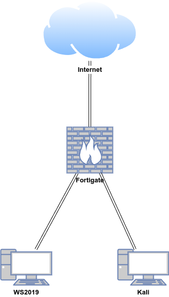
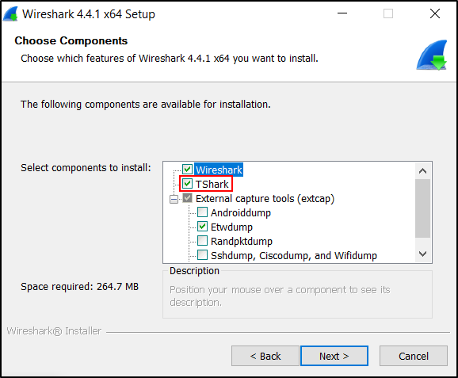

# Wireshark

Wireshark is a free and open-source network protocol analyser widely used for network troubleshooting, analysis, software and protocol development, and education. Essentially, it's a tool that allows you to capture and examine data packets traveling through a network in real-time or from saved capture files.

<iframe width="560" height="315" src="https://www.youtube.com/embed/JBKG9AIy1Lo?si=VKeKe48_0p_B1f7X" title="YouTube video player" frameborder="0" allow="accelerometer; autoplay; clipboard-write; encrypted-media; gyroscope; picture-in-picture; web-share" referrerpolicy="strict-origin-when-cross-origin" allowfullscreen></iframe>

## Lab Setup for Proof of Concept

In this proof of concept, Wireshark was installed on a Windows Virtual Machine (VM),  and malware traffic analysis was conducted using Wireshark. 

| **Host** | **OS** | **Role** | **IP Address** |
| --- | --- | --- | --- |
| Fortigate | Fortios 7.6.0 | Firewall/Router | 192.168.1.111 (WAN) / 10.0.0.1 (LAN) |
| WS2019 | Windows Server 2019 | Wireshark | 10.0.0.40 |
| Kali | Kali Linux 2024.2 | Linux Client  | 10.0.0.22 |



## Install Wireshark on Windows

If you are running Windows or macOS you can download an official release at [https://www.wireshark.org/download.html](https://www.wireshark.org/download.html). For Linux and other OS, download both source and binary distributions from the Wireshark download page. Select the package most appropriate for your system. In this demo, we will focus on installing and running Wireshark on Windows. 

Double-click on the installer file and follow the prompts. Make sure T Shark is selected.



Once install is complete, open Wireshark. You will be presented with network interfaces attacked to your computer.


For demonstration, double-click on the loopback interface. Immediately, Wireshark will start capturing traffic on the loopback interface.

You can stop the traffic capture by clicking the stop button.


From the menu, select Statistics, Capture File Properties. You can see Time for first and last packet as long as elapsed time. 


To view Protocol Hierarchy, select Statistics, Protocol Hierarchy. You will be presented of list of protocols that exist in this packet capture (PCAP). 


You can Apply or Prepare as Filter on any selected value.


To view Conversations, select Statistics, Conversations and click IPv4. This shows conversations between one host and another host. 


To view Endpoints, select Statistics, Endpoints and click IPv4. This will tell us what endpoints exist in this PCAP. 


## Install Wireshark on Linux

**Create a directory for the packages:**
Open a terminal and create a directory to store the Wireshark package and its dependencies.

```bash
mkdir wireshark-offline
cd wireshark-offline
```

**Download the Wireshark package and its dependencies**:
On an Ubuntu machine with internet access, use the following commands to download Wireshark and all its dependencies into the `wireshark-offline` folder.

```python
sudo apt update
apt-get download wireshark
apt-cache depends wireshark | grep Depends | sed "s/.*ends:\ //" | xargs apt-get download
apt-get download libminizip1 libqt5core5a libqt5gui5 libqt5multimedia5 libqt5printsupport5 libqt5widgets5 libwireshark15 libwiretap12 libwsutil13 wireshark-common libqt5svg5 libdouble-conversion3 libmd4c0 libqt5dbus5 libqt5network5 libxcb-xinerama0 libxcb-xinput0 libbcg729-0 libc-ares2 liblua5.2-0 libsmi2ldbl libsnappy1v5 libspandsp2 libwireshark-data libssh-gcrypt-4
```

Transfer the downloaded `.deb` files to your offline Ubuntu VM

**Install the dependencies**:
On your offline Ubuntu VM, navigate to the folder where you transferred the `.deb` files and run the following command:

```python
sudo dpkg -i *.deb
```

Restart the PC and run Wireshark

```python
wireshark
```


## Malware Traffic Analysis

The pcaps used in this tutorial are contained in a password-protected ZIP archive located at our [**GitHub repository**](https://github.com/PaloAltoNetworks/Unit42-Wireshark-tutorials/blob/main/Wireshark-tutorial-extracting-objects-5-pcaps.zip). Download the file named Wireshark-tutorial-extracting-objects-5-pcaps.zip. Use *infected* as the password and extract the five pcaps, as shown below.


The five extracted pcaps are:

- Wireshark-tutorial-extracting-objects-from-a-pcap-1-of-5.pcap
- Wireshark-tutorial-extracting-objects-from-a-pcap-2-of-5.pcap
- Wireshark-tutorial-extracting-objects-from-a-pcap-3-of-5.pcap
- Wireshark-tutorial-extracting-objects-from-a-pcap-4-of-5.pcap
- Wireshark-tutorial-extracting-objects-from-a-pcap-5-of-5.pcap

As a network packet analyser, Wireshark combines data from multiple IP packets and the associated TCP frames to reveal the content of a pcap. We can extract some of these objects revealed by Wireshark.

### **Exporting Files From HTTP Traffic**

Some Windows-based infections involve malware binaries or malicious code sent over unencrypted HTTP traffic. We can extract these objects from the pcap. An example of this is found in our first pcap named Wireshark-tutorial-extracting-objects-from-a-pcap-1-of-5.pcap. Open this pcap in Wireshark and filter on **http.request** as shown below.


After filtering on http.request, find the two GET requests to smart-fax[.]com. The first request ends with .doc, indicating the first request may have returned a Microsoft Word document. The second request ends with .exe, indicating the second request may have returned a Windows executable file. The HTTP GET requests are listed below.

- smart-fax[.]com - GET /Documents/Invoice&MSO-Request.doc
- smart-fax[.]com - GET /knr.exe

We can export these objects from the HTTP object list by using the menu path:

- File → Export Objects → HTTP...

This menu path results in a window titled “Wireshark Export HTTP object list” as shown below. Select the first line with Invoice&MSO-Request.doc as the filename and save it. Select the second line with knr.exe as the filename and save it.


Note, the Content Type column from the HTTP object list shows what the server identified the file as in its HTTP response headers. In some cases, a server hosting malware will intentionally label Windows executables as a different type of file in an effort to avoid detection. Fortunately, the first pcap in this tutorial is a very straight-forward example.

After extracting these files from the pcap, we should confirm the file types. 

In Windows, we can use PowerShell or Command Prompt command to obtain hash

- Get-FileHash *[filename]* -Algorithm SHA256
- certutil -hashfile *[filename]* SHA256

In Linux, we can use a terminal window or command line interface (CLI) for the following commands:

- file *[filename]*
- shasum -a 256 *[filename]*

The file command identifies the type of file. The shasum command returns the file hash, in this case a SHA256 file hash.

```bash
└─$ file 'Invoice&MSO-Request.doc' 
Invoice&MSO-Request.doc: Composite Document File V2 Document, Little Endian, Os: Windows, Version 6.3, Code page: 1252, Template: Normal.dotm, Last Saved By: Administrator, Revision Number: 2, Name of Creating Application: Microsoft Office Word, Create Time/Date: Thu Jun 27 19:24:00 2019, Last Saved Time/Date: Thu Jun 27 19:24:00 2019, Number of Pages: 1, Number of Words: 0, Number of Characters: 1, Security: 0

└─$ shasum -a 256 'Invoice&MSO-Request.doc' 
f808229aa516ba134889f81cd699b8d246d46d796b55e13bee87435889a054fb  Invoice&MSO-Request.doc

└─$ file knr.exe                  
knr.exe: PE32 executable (GUI) Intel 80386, for MS Windows, 5 sections

└─$ shasum -a 256 knr.exe                  
749e161661290e8a2d190b1a66469744127bc25bf46e5d0c6f2e835f4b92db18  knr.exe
```

The information above confirms our suspected Word document is in fact a Microsoft Word document. It also confirms the suspected Windows executable file is indeed a Windows executable. We can check the SHA256 hashes against VirusTotal to see if these files are detected as malware. We can also do an internet search on the SHA256 hashes to possibly find additional information.

In addition to these Windows executables or other malware files, we can also extract webpages from unencrypted HTTP traffic.

Use Wireshark to open our second pcap for this tutorial, Wireshark-tutorial-extracting-objects-from-a-pcap-2-of-5.pcap. This pcap contains traffic of someone entering login credentials on a fake PayPal login page.

When reviewing network traffic from a phishing site, we might want to know what the phishing webpage actually looks like. We can extract the HTML pages, images and other web content using the Export HTTP object menu. In this case, we can extract and view just the initial HTML page. After extracting that initial HTML page, viewing it in a web browser should reveal the page shown below.


Alternatively, your html might also look like below (same content).


Use this method with caution. If you extract malicious HTML code from a pcap and view it in a web browser, the HTML might call out to malicious domains, which is why we recommend doing this in an isolated test environment.

### **Exporting Files from SMB Traffic**

Some malware uses Microsoft's Server Message Block (SMB) protocol to spread across an Active Directory (AD)-based network. A banking Trojan known as Trickbot added a worm module [**as early as July 2017**](https://securityintelligence.com/news/trickbot-learns-from-wannacry-and-petya-by-adding-self-spreading-worm-module/) that uses an exploit based on [**EternalBlue**](https://www.wired.co.uk/article/what-is-eternal-blue-exploit-vulnerability-patch) to spread across a network over SMB. Trickbot is no longer an active malware family, but this section contains a June 2019 Trickbot infection that is ideal for this tutorial.

Use Wireshark to open our third pcap for this tutorial, Wireshark-tutorial-extracting-objects-from-a-pcap-3-of-5.pcap. This pcap contains a Trickbot infection from June 2019 where malware is sent over SMB traffic from an infected client to the domain controller.

This pcap takes place in the following AD environment:

- Domain: cliffstone[.]net
- Network segment: 10.6.26[.]0 through 10.6.26[.]255 (10.6.26[.]0/24)
- Domain controller IP: 10.6.26[.]6
- Domain controller hostname: CLIFFSTONE-DC
- Segment gateway: 10.6.26[.]1
- Broadcast address: 10.6.26[.]255
- Windows client: QUINN-OFFICE-PC at 10.6.26[.]110

In this pcap, a Trickbot infection uses SMB to spread from an infected client at 10.6.26[.]110 to its domain controller at 10.6.26[.]6. To see the associated malware, use the following menu path shown below:

- File → Export Objects → SMB...

This brings up an Export SMB object list, listing the SMB objects we can export from the pcap as shown below.


Two entries near the middle of the list have \\10.6.26[.]6\C$ as the hostname. A closer examination of their respective filename fields indicates these are two Windows executable files. See Table below for details.

| **Packet Number** | **Hostname** | **Content Type** | **Size** | **Filename** |
| --- | --- | --- | --- | --- |
| 7058 | \\10.6.26[.]6\C$ | FILE (712704/712704) W [100.0%] | 712 kB | \WINDOWS\d0p2nc6ka3f_fixhohlycj4ovqfcy_smchzo_ub83urjpphrwahjwhv_o5c0fvf6.exe |
| 7936 | \\10.6.26[.]6\C$ | FILE (115712/115712) W [100.0%] | 115 kB | \WINDOWS\oiku9bu68cxqenfmcsos2aek6t07_guuisgxhllixv8dx2eemqddnhyh46l8n_di.exe |

In the Content Type column, we need [100.00%] to export a correct copy of these files. Any number less than 100 percent indicates there was some data loss in the network traffic, resulting in a corrupt or incomplete copy of the file. These Trickbot-related files from the pcap have SHA256 file hashes as shown in Table.

```bash
PS C:\Users\Administrator\Downloads> Get-FileHash sample1.exe -Algorithm SHA256

Algorithm       Hash                                                                   Path
---------       ----                                                                   ----
SHA256          59896AE5F3EDCB999243C7BFDC0B17EB7FE28F3A66259D797386EA470C010040       C:\Users\Administrator\Downlo...

PS C:\Users\Administrator\Downloads> Get-FileHash sample2.exe -Algorithm SHA256

Algorithm       Hash                                                                   Path
---------       ----                                                                   ----
SHA256          CF99990BEE6C378CBF56239B3CC88276EEC348D82740F84E9D5C343751F82560       C:\Users\Administrator\Downlo...
```

| **SHA256 hash** | **File size** |
| --- | --- |
| 59896ae5f3edcb999243c7bfdc0b17eb7fe28f3a66259d797386ea470c010040 | 712 kB |
| cf99990bee6c378cbf56239b3cc88276eec348d82740f84e9d5c343751f82560 | 115 kB |

### **Exporting Emails from SMTP Traffic**

Certain types of malware are designed to turn an infected Windows host into a spambot. These spambot hosts send hundreds of spam messages or malicious emails every minute. If any of these messages are sent using unencrypted SMTP, we can export these messages from a pcap of the traffic.

One such example is from our next pcap, Wireshark-tutorial-extracting-objects-from-a-pcap-4-of-5.pcap. In this pcap, an infected Windows client sends **sextortion spam**. This pcap contains five seconds of spambot traffic from a single infected Windows host.

Open the pcap in Wireshark and filter on **smtp.data.fragment** as shown below. This should reveal 50 examples of subject lines in the Info column on our Wireshark column display.


We can export these messages using the following menu path as shown in Figure 12:

- File → Export Objects → IMF...

IMF stands for **Internet Message Format**, which is saved as a name with an .eml file extension.


The exported .eml files can be reviewed with a text editor or an email client like Outlook as shown below.


### **Exporting Files from FTP Traffic**

Some malware families use FTP during malware infections. Our next pcap contains malware executables retrieved from an FTP server. It also contains stolen information sent from the infected Windows host back to the same FTP server.

Our final pcap for this tutorial is Wireshark-tutorial-extracting-objects-from-a-pcap-5-of-5.pcap. Open the pcap in Wireshark and use the following filter:

- ftp.request.command or (ftp-data and tcp.seq eq 1)

The results are shown below. We should see USER for the username and PASS for the password. This is followed by RETR statements, which are requests to retrieve files. The filtered results show RETR statements for the following files:

- RETR q.exe
- RETR w.exe
- RETR e.exe
- RETR r.exe
- RETR t.exe


This Wireshark filter also shows the start of files sent over the FTP data channel. After the RETR statements for the .exe files, our column display should reveal STOR statements representing store requests to send HTML-based log files back to the same FTP server approximately every 18 seconds.

In Wireshark version 4.0.0 or newer, we can export files from the FTP data channel using the following menu path as shown in Figure 16:

- File → Export Objects → FTP-DATA...

This brings up a Window listing the FTP data objects we can export as shown below. This lists all of the HTML files sent to the FTP server containing information stolen from the infected Windows host.


We can view the exported files in a text editor or a browser as shown below. These files contain login credentials from the infected host’s email client and web browser.


While this export FTP-DATA function works for the .html files, it did not present us with any of the .exe files retrieved from the FTP server. We must export these using another method.

This method involves finding the start of FTP data streams for each of the .exe files returned from the FTP server. To find these TCP frames, use the following Wireshark filter:

- ftp-data.command contains ".exe" and tcp.seq eq 1

The results are shown below, revealing an FTP data stream for each of the .exe files.


We can follow the TCP stream for each of the frames, and we can export these files from the TCP stream window. First, follow the TCP stream for the first result that shows (SIZE q.exe) in the Info column as shown below (right-click → Follow → TCP Stream)


The TCP stream window shows hints that this is a Windows executable or DLL file. The first two bytes are the ASCII characters MZ. The TCP stream also reveals the string This program cannot be run in DOS mode.

But to confirm this is a Windows executable or DLL file, we must export it from the TCP stream. To do this, select “Raw” in the "Show data as" menu.


The TCP stream now shows the information in hexadecimal text, and we can export this raw data as a file using the "Save as..." button as shown above. This is an FTP data stream for a file named q.exe, and we have to manually type that when saving the file.

When saving the file as q.exe in a Linux or similar CLI environment, we can confirm this is a Windows executable file and get the SHA256 hash using the commands shown below.

```bash
└─$ file q.exe  
q.exe: PE32 executable (GUI) Intel 80386, for MS Windows, 4 sections

└─$ shasum -a 256 q.exe  
ca34b0926cdc3242bbfad1c4a0b42cc2750d90db9a272d92cfb6cb7034d2a3bd  q.exe
```

This SHA256 hash shows a high detection rate as malware on VirusTotal. 


Follow the same process to export the other .exe files in the pcap.

```bash
└─$ file w.exe
w.exe: PE32 executable (GUI) Intel 80386, for MS Windows, 5 sections
                                                                                                                                                                                                                                            
└─$ file e.exe                    
e.exe: PE32+ executable (GUI) x86-64, for MS Windows, 6 sections
                                                                                                                                                                                                                                            
└─$ file r.exe
r.exe: PE32+ executable (GUI) x86-64, for MS Windows, 6 sections
                                                                                                                                                                                                                                            
└─$ file t.exe
t.exe: PE32 executable (GUI) Intel 80386, for MS Windows, 4 sections

└─$ shasum -a 256 w.exe
08eb941447078ef2c6ad8d91bb2f52256c09657ecd3d5344023edccf7291e9fc  w.exe
                                                                                                                                                                                                                                            
└─$ shasum -a 256 e.exe      
32e1b3732cd779af1bf7730d0ec8a7a87a084319f6a0870dc7362a15ddbd3199  e.exe
                                                                                                                                                                                                                                            
└─$ shasum -a 256 r.exe
4ebd58007ee933a0a8348aee2922904a7110b7fb6a316b1c7fb2c6677e613884  r.exe
                                                                                                                                                                                                                                            
└─$ shasum -a 256 t.exe
10ce4b79180a2ddd924fdc95951d968191af2ee3b7dfc96dd6a5714dbeae613a  t.exe
```

This should give you the following files as shown below in Table

| **SHA256 hash** | **Filename** |
| --- | --- |
| ca34b0926cdc3242bbfad1c4a0b42cc2750d90db9a272d92cfb6cb7034d2a3bd | q.exe |
| 08eb941447078ef2c6ad8d91bb2f52256c09657ecd3d5344023edccf7291e9fc | w.exe |
| 32e1b3732cd779af1bf7730d0ec8a7a87a084319f6a0870dc7362a15ddbd3199 | e.exe |
| 4ebd58007ee933a0a8348aee2922904a7110b7fb6a316b1c7fb2c6677e613884 | r.exe |
| 10ce4b79180a2ddd924fdc95951d968191af2ee3b7dfc96dd6a5714dbeae613a | t.exe |

These five .exe files are all Windows executables, and they all have a high detection rate as malware on VirusTotal.

Wireshark does an excellent job of combining data from multiple IP packets and the associated TCP frames to show objects sent over unencrypted network traffic. Using the methods outlined in this tutorial, we can also use Wireshark to extract these objects from a pcap. This can be extremely helpful if you need to examine items during an investigation of suspicious activity.

## TShark

TShark is a terminal oriented version of Wireshark designed for capturing and displaying packets when an interactive user interface isn’t necessary or available.

If a PCAP is larger than 500 MB, Wireshark will struggle to analyse. For example, if we are interested in the IP address 23.63.254.163, we can run a filter on Tshark and output it into another PCAP. We can then use Wireshark to read this new PCAP, which should be a manageable size.

Open PowerShell and navigate to the directory where Wireshark is installed.

Run `tshark.exe`, use the `-r` flag to point it to your PCAP of interest, use the `-w` flag to point to your output path including the new PCAP name, and specify the filter (e.g., `ip.addr == (value)`).

```bash
PS C:\program files\wireshark> .\tshark.exe -r C:\Users\Administrator\Downloads\Wireshark-tutorial-extracting-objects-5-pcaps\Wireshark-tutorial-extracting-objects-from-a-pcap-1-of-5.pcap -w C:\Users\Administrator\Downloads\Wireshark-tutorial-extracting-objects-5-pcaps\newdata.pcap ip.addr == 23.63.254.163
```


This produces a new PCAP file of manageable size, filtering on the IP address 23.63.254.163.

## References

- https://unit42.paloaltonetworks.com/using-wireshark-exporting-objects-from-a-pcap/
- https://youtu.be/XZlasFStzqM?si=L0LHw4RODO8tgku8
- https://www.wireshark.org/docs/