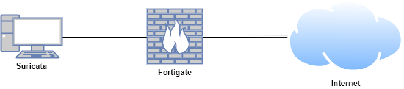

# **Zeek**

Zeek is an open-source network analysis framework and security monitoring tool. Zeek provides deep visibility into network traffic and enables organisations to detect and respond to security threats in real-time. Unlike traditional intrusion detection systems (IDS) that rely primarily on signature matching, Zeek offers a more flexible and comprehensive approach by analysing network behaviors and events.

<iframe width="560" height="315" src="https://www.youtube.com/embed/B1p_SGjQCzw?si=yhcOb56BBHp_sZxX" title="YouTube video player" frameborder="0" allow="accelerometer; autoplay; clipboard-write; encrypted-media; gyroscope; picture-in-picture; web-share" referrerpolicy="strict-origin-when-cross-origin" allowfullscreen></iframe>

## **Lab Setup for Proof of Concept**

In this proof of concept, the Ubuntu host simulated a compromised machine by visiting non-malicious websites, such as testmyids.org and Reddit, with Reddit being treated as malicious to trigger alerts in a safe and controlled environment. To demonstrate Zeek to Suricata integration via PCAP files, Zeek was installed on the same host as Suricata.

| **Host** | **OS** | **Role** | **IP Address** |
| --- | --- | --- | --- |
| Fortigate | Fortios 7.6.0 | Firewall/Router | 192.168.1.111 (WAN) / 10.0.0.1 (LAN) |
| Suricata | Ubuntu 22.04 LTS | Suricata and Zeek | 10.0.0.27 |



## **Install Zeek offline**

On an Ubuntu machine with internet connection:

Make a folder called zeek-offline and change permission of the directory. 

```bash
mkdir zeek-offline
cd zeek-offline
sudo chmod 755 ~/zeek-offline/
```

Add the Zeek repository and download the Zeek package and its dependencies:

```python
echo 'deb http://download.opensuse.org/repositories/security:/zeek/xUbuntu_22.04/ /' | sudo tee /etc/apt/sources.list.d/security:zeek.list
curl -fsSL https://download.opensuse.org/repositories/security:zeek/xUbuntu_22.04/Release.key | gpg --dearmor | sudo tee /etc/apt/trusted.gpg.d/security_zeek.gpg > /dev/null
sudo apt update
sudo apt-get install --download-only zeek 
sudo apt-get download zeek-core zeekctl zeek-core-dev zeek-spicy-dev zeek-zkg zeek-client \
libbroker-dev libpcap-dev libssl-dev zlib1g-dev libmaxminddb-dev python3-semantic-version python3-git zeek-btest zeek-btest-data \
libpcap0.8-dev libssl3=3.0.2-0ubuntu1.18 git python3-gitdb libc6-dev \
liberror-perl git-man libdbus-1-dev python3-smmap rpcsvc-proto libtirpc-dev \
libc-dev-bin linux-libc-dev libcrypt-dev libnsl-dev pkg-config libdpkg-perl \
zeek-aux
```

**Note**: if you get a permission denied error, run the command again. 

Make a directory called curl and change permission of the directory. 

```bash
mkdir curl
cd curl
sudo chmod 755 ~/curl/
```

Download curl and its dependencies.

```python
sudo apt-get download curl libc6 libcurl4 zlib1g
```

Transferzeek-offline and curl to an Ubuntu host without internet access.

Install curl:

```python
cd curl-packages
sudo dpkg -i *
```

Install Zeek:

```python
cd zeek-offline
sudo dpkg -i *
```

## **Introduction to Zeek**

### **Managing Zeek with ZeekControl**

ZeekControl is an interactive shell for easily operating/managing Zeek installations on a single system or even across multiple systems in a traffic-monitoring cluster.

In `/opt/zeek/etc/node.cfg`, set the right interface to monitor.

For example:

```python
nano /opt/zeek/etc/node.cfg
```

```python
[zeek]
type=standalone
host=localhost
interface=ens32   # change this according to your listening interface in ifconfig
```

[Optional but recommended]: In `/opt/zeek/etc/networks.cfg`, add networks that Zeek will consider local to the monitored environment. More on this [below](https://docs.zeek.org/en/v7.0.1/quickstart.html#local-site-customization).

[Optional]: In `/opt/zeek/etc/zeekctl.cfg`, change the `MailTo` email address to a desired recipient and the `LogRotationInterval` to a desired log archival frequency.

Now start the ZeekControl shell like:

```python
cd /opt/zeek/bin
sudo ./zeekctl
```

Since this is the first-time use of the shell, perform an initial installation of the ZeekControl configuration:

```python
[ZeekControl] > install
```

Then start up a Zeek instance:

```python
[ZeekControl] > start
```

There is another ZeekControl command, `deploy`, that combines the above two steps and can be run after any changes to Zeek policy scripts or the ZeekControl configuration. Note that the `check` command is available to validate a modified configuration before installing it.

```python
[ZeekControl] > deploy
```

If there are errors while trying to start the Zeek instance, you can view the details with the `diag` command. If started successfully, the Zeek instance will begin analyzing traffic according to a default policy and output the results in `/opt/zeek/logs/current` directory.

You can leave it running for now, but to stop this Zeek instance you would do:

```python
[ZeekControl] > stop
```

Once Zeek is stopped, the log files in the `/opt/zeek/logs/current` directory are compressed and moved into the current day named folder inside the `/opt/zeek/logs` directory.

### **Browsing Log Files**

By default, logs are written out in human-readable (ASCII) format and data is organized into columns (tab-delimited). Logs that are part of the current rotation interval are accumulated in `/opt/zeek/logs/current/` (if Zeek is not running, the directory will be empty). For example, the `http.log` contains the results of Zeek HTTP protocol analysis. Here are the first few columns of `http.log`:

```bash
# ts              uid              orig_h     orig_p   resp_h         resp_p
1726175258.283795	ClWVdk6JZxaBGiba1	10.0.0.25	 36768	  91.189.91.48	 80
```

Logs that deal with analysis of a network protocol will often start like this: a timestamp, a unique connection identifier (UID), and a connection 4-tuple (originator host/port and responder host/port). The UID can be used to identify and correlate all logged activity (possibly across multiple log files) associated with a given connection 4-tuple over its lifetime.

The remaining columns of protocol-specific logs then detail the protocol-dependent activity that’s occurring. E.g. `http.log`’s next few columns (shortened for brevity) show a request to the root of Zeek website:

```bash
# method   host         uri  referrer  user_agent
GET        zeek.org  /    -         <...>Chrome/12.0.742.122<...>
```

Apart from the conventional network protocol specific log files, Zeek also generates other important log files based on the network traffic statistics, interesting activity captured in the traffic, and detection focused log files. Some logs that are worth explicit mention:

- `conn.log`
    
    Contains an entry for every connection seen on the wire, with basic properties such as time and duration, originator and responder IP addresses, services and ports, payload size, and much more. This log provides a comprehensive record of the network’s activity.
    
- `notice.log`
    
    Identifies specific activity that Zeek recognises as potentially interesting, odd, or bad. In Zeek-speak, such activity is called a “notice”.
    
- `known_services.log`
    
    This log file contains the services detected on the local network and are known to be actively used by the clients on the network. It helps in enumerating what all services are observed on a local network and if they all are intentional and known to the network administrator.
    
- `weird.log`
    
    Contains unusual or exceptional activity that can indicate malformed connections, traffic that doesn’t conform to a particular protocol, malfunctioning or misconfigured hardware/services, or even an attacker attempting to avoid/confuse a sensor.
    

By default, ZeekControl regularly takes all the logs from `/opt/zeek/logs/current` and archives/compresses them to a directory named by date, e.g. `/opt/zeek/logs/2021-01-01`. The frequency at which this is done can be configured via the `LogRotationInterval` option in `/opt/zeek/etc/zeekctl.cfg`. The default is every hour.

### **Zeek as a Command-Line Utility**

If you prefer not to use ZeekControl (e.g., you don’t need its automation and management features), here’s how to directly control Zeek for your analysis activities from the command line for both live traffic and offline working from traces.

### **Monitoring Live Traffic**

Analysing live traffic from an interface is simple:

```bash
zeek -i ens32 <list of scripts to load>
```

`ens32` should be replaced by the interface on which you want to monitor the traffic. The standard base scripts will be loaded and enabled by default. A list of additional scripts can be provided in the command as indicated above by `<list of scripts to load>`. Any such scripts supplied as space-separated files or paths will be loaded by Zeek in addition to the standard base scripts.

Zeek will output log files into the current working directory.

### **Reading Packet Capture (pcap) Files**

When you want to do offline analysis of already captured pcap files, Zeek is a very handy tool to analyse the pcap and gives a high level holistic view of the traffic captured in the pcap.

If you want to capture packets from an interface and write them to a file to later analyse it with Zeek, then it can be done like this:

```bash
sudo tcpdump -i ens32 -s 0 -w sample.pcap
```

Where `ens32` should be replaced by the correct interface for your system, for example as shown by the **ifconfig** command. (The `-s 0` argument tells it to capture whole packets; in cases where it is not supported, use `-s 65535` instead).

After capturing traffic for a while, kill the tcpdump (with *ctrl-c*), and tell Zeek to perform all the default analysis on the capture:

```bash
/opt/zeek/bin/zeek -r sample.pcap
```

Zeek will output log files into the current working directory. 

To specify the output directory for logs, you can set `Log::default_logdir` on the command line:

```bash
mkdir output_directory
/opt/zeek/bin/zeek -r sample.pcap Log::default_logdir=output_directory
```

If no logs are generated for a pcap, try to run the pcap with `-C` to tell Zeek to ignore invalid IP Checksums:

```bash
/opt/zeek/bin/zeek –C –r sample.pcap
```

If you are interested in more detection, you can load the `local.zeek` script that is included as a suggested configuration:

```bash
zeek -r sample.pcap local
```

If you want to run a custom or an extra script (assuming it’s in the default search path, more on this in the next section) to detect any particular behavior in the pcap, run Zeek with following command:

```bash
zeek –r sample.pcap my-script.zeek
```

## **Zeek Log Formats and Inspection**

Zeek creates a variety of logs when run in its default configuration. This data can be intimidating for a first-time user. In this section, we will process a sample packet trace with Zeek, and take a brief look at the sorts of logs Zeek creates. We will look at logs created in the traditional format, as well as logs in JSON format. We will also introduce a few command-line tools to examine Zeek logs.

### **Working with a Sample Trace**

For the examples that follow, we will use Zeek on a Linux system to process network traffic captured and stored to disk. We saved this trace file earlier in packet capture (PCAP) format as `sample.pcap`. The command line protocol analyser Tcpdump, which ships with most Unix-like distributions, summarises the contents of this file.

```bash
tcpdump -n -r sample.pcap
```

```bash
reading from file sample.pcap, link-type EN10MB (Ethernet), snapshot length 262144
16:29:30.278903 IP6 fe80::11bb:1eb2:4e66:8cb2.5353 > ff02::fb.5353: 0 [2q] PTR (QM)? _ipp._tcp.local. PTR (QM)? _ipps._tcp.local. (45)
16:29:30.279490 IP 10.0.0.20.5353 > 224.0.0.251.5353: 0 [2q] PTR (QM)? _ipp._tcp.local. PTR (QM)? _ipps._tcp.local. (45)
16:29:30.739547 IP 10.0.0.25.38596 > 10.0.0.20.1514: Flags [.], seq 3895547640:3895549088, ack 1070210661, win 502, options [nop,nop,TS val 3662342600 ecr 1031616358], length 1448
16:29:30.739583 IP 10.0.0.25.38596 > 10.0.0.20.1514: Flags [P.], seq 1448:2350, ack 1, win 502, options [nop,nop,TS val 3662342600 ecr 1031616358], length 902
16:29:30.740370 IP 10.0.0.20.1514 > 10.0.0.25.38596: Flags [.], ack 2350, win 7056, options [nop,nop,TS val 1031618362 ecr 3662342600], length 0
16:29:32.741070 IP 10.0.0.25.38596 > 10.0.0.20.1514: Flags [P.], seq 2350:2652, ack 1, win 502, options [nop,nop,TS val 3662344602 ecr 1031618362], length 302
16:29:32.742172 IP 10.0.0.20.1514 > 10.0.0.25.38596: Flags [.], ack 2652, win 7056, options [nop,nop,TS val 1031620364 ecr 3662344602], length 0
16:29:32.744648 IP 10.0.0.20.1514 > 10.0.0.25.38596: Flags [P.], seq 1:90, ack 2652, win 7056, options [nop,nop,TS val 1031620366 ecr 3662344602], length 89
...
```

Rather than run Zeek against a live interface, we will ask Zeek to digest this trace. This process allows us to vary Zeek’s run-time operation, keeping the traffic constant.

First we make two directories to store the log files that Zeek will produce. Then we will move into the “default” directory.

```bash
mkdir default
mkdir json
cd default/
```

### **Zeek TSV Format Logs**

From this location on disk, we tell Zeek to digest the `sample.pcap` file.

```bash
zeek -C -r ../sample.pcap
```

The `-r` flag tells Zeek where to find the trace of interest.

The `-C` flag tells Zeek to ignore any TCP checksum errors. This happens on many systems due to a feature called “checksum offloading,” but it does not affect our analysis.

Zeek completes its task without reporting anything to the command line. This is standard Unix-like behavior. Using the **ls** command we see what files Zeek created when processing the trace.

```bash
root@Suricata:/home/cyber/test_pcap/default# ls -al
total 36
drwxr-xr-x 2 root root 4096 Sep 13 16:38 .
drwxr-xr-x 5 root root 4096 Sep 13 16:37 ..
-rw-r--r-- 1 root root 1673 Sep 13 16:38 conn.log
-rw-r--r-- 1 root root 1499 Sep 13 16:38 dns.log
-rw-r--r-- 1 root root 1037 Sep 13 16:38 files.log
-rw-r--r-- 1 root root 1281 Sep 13 16:38 http.log
-rw-r--r-- 1 root root  802 Sep 13 16:38 ntp.log
-rw-r--r-- 1 root root  278 Sep 13 16:38 packet_filter.log
-rw-r--r-- 1 root root 2919 Sep 13 16:38 syslog.log
```

Zeek created five files. We will look at the contents of Zeek log data in detail in later sections. For now, we will take a quick look at each file, beginning with the `conn.log`.

We use the **cat** command to show the contents of each log.

```bash
cat conn.log
```

```bash
#separator \x09
#set_separator	,
#empty_field	(empty)
#unset_field	-
#path	conn
#open	2024-09-13-16-38-11
#fields	ts	uid	id.orig_h	id.orig_p	id.resp_h	id.resp_p	proto	service	duration	orig_bytes	resp_bytes	conn_state	local_orig	local_resp	missed_bytes	history	orig_pkts	orig_ip_bytes	resp_pkts	resp_ip_bytes	tunnel_parents
#types	time	string	addr	port	addr	port	enum	string	interval	count	count	string	bool	bool	count	string	count	count	count	count	set[string]
1726201770.278903	CTJy3z1weA4svLHlMi	fe80::11bb:1eb2:4e66:8cb2	5353	ff02::fb	5353	udp	dns	-	-	-	S0	T	F	0	D	1	9300	-
1726201770.279490	C7y3kf3wLnGC8eMFoj	10.0.0.20	5353	224.0.0.251	5353	udp	dns	-	-	-	S0	T	F	0	D	1	73	0	0	-
1726201774.886295	CXetZefExG72gUZBg	10.0.0.25	37842	8.8.8.8	53	udp	dns	0.071811	43	107	SF	T	F	0	Dd	1	71	1	135-
1726201774.886782	Cw9GHy49hDbEZja5N4	10.0.0.25	54819	8.8.8.8	53	udp	dns	0.105430	43	267	SF	T	F	0	Dd	1	71	1	295-
1726201776.494923	CoOFuY2lG5sn40Cx4h	10.0.0.25	51716	65.9.141.86	80	tcp	http	0.095743	92	538	SF	T	F	0	ShADadFf	7	4645	806	-
1726201776.229030	CSHUEK1r1ZslFXj9Ea	10.0.0.1	19274	10.0.0.25	514	udp	syslog	1.999178	2392	0	S0	T	T	0	D	3	2476	0	0-
1726201776.995145	CY5BY43UhmmrHShwJg	10.0.0.20	34602	185.125.190.58	123	udp	ntp	0.282631	48	48	SF	T	F	0	Dd	1	76	1	76	-
1726201774.994946	Cf7ViS38Dir6S2Sp24	10.0.0.25	37652	65.9.141.86	80	tcp	http	0.108029	92	538	SF	T	F	0	ShADadFf	6	4124	754	-
1726201775.764476	CFRepo2KqxbrWWYUr1	10.0.0.25	54034	65.9.141.117	80	tcp	http	0.079561	92	538	SF	T	F	0	ShADadFf	7	4645	806	-
1726201770.739547	CXYKK42G1Ga2LvFmh3	10.0.0.25	38596	10.0.0.20	1514	tcp	-	8.024697	13178	89	OTH	T	T	0	DadA	16	14010	11661	-
#close	2024-09-13-16-38-11
```

Next we look at Zeek’s `dns.log`.

```bash
cat dns.log
```

```bash
#separator \x09
#set_separator	,
#empty_field	(empty)
#unset_field	-
#path	dns
#open	2024-09-13-16-38-11
#fields	ts	uid	id.orig_h	id.orig_p	id.resp_h	id.resp_p	proto	trans_id	rtt	query	qclass	qclass_name	qtype	qtype_name	rcode	rcode_name	AATC	RD	RA	Z	answers	TTLs	rejected
#types	time	string	addr	port	addr	port	enum	count	interval	string	count	string	count	string	count	string	bool	bool	bool	bool	count	vector[string]	vector[interval]	bool
1726201774.886295	CXetZefExG72gUZBg	10.0.0.25	37842	8.8.8.8	53	udp	27806	0.071811	testmynids.org	1	C_INTERNET	1	A	0	NOERROR	F	F	TT	0	65.9.141.86,65.9.141.96,65.9.141.53,65.9.141.117	60.000000,60.000000,60.000000,60.000000	F
1726201774.886782	Cw9GHy49hDbEZja5N4	10.0.0.25	54819	8.8.8.8	53	udp	60281	0.105430	testmynids.org	1	C_INTERNET	28	AAAA	0	NOERROR	F	F	TT	0	2600:9000:204b:f000:18:30b3:e400:93a1,2600:9000:204b:4400:18:30b3:e400:93a1,2600:9000:204b:ea00:18:30b3:e400:93a1,2600:9000:204b:a00:18:30b3:e400:93a1,2600:9000:204b:2e00:18:30b3:e400:93a1,2600:9000:204b:6000:18:30b3:e400:93a1,2600:9000:204b:7a00:18:30b3:e400:93a1,2600:9000:204b:ee00:18:30b3:e400:93a1	60.000000,60.000000,60.000000,60.000000,60.000000,60.000000,60.000000,60.000000	F
1726201770.278903	CTJy3z1weA4svLHlMi	fe80::11bb:1eb2:4e66:8cb2	5353	ff02::fb	5353	udp	0	-	_ipps._tcp.local	1	C_INTERNET	12	PTR	-	-F	F	F	F	0	-	-	F
1726201770.279490	C7y3kf3wLnGC8eMFoj	10.0.0.20	5353	224.0.0.251	5353	udp	0	-	_ipps._tcp.local	1	C_INTERNET	12	PTR	-	-	F	FF	F	0	-	-	F
#close	2024-09-13-16-38-11
```

Next we look at Zeek’s `files.log`.

```bash
cat files.log
```

```bash
#separator \x09
#set_separator	,
#empty_field	(empty)
#unset_field	-
#path	files
#open	2024-09-13-16-38-11
#fields	ts	fuid	uid	id.orig_h	id.orig_p	id.resp_h	id.resp_p	source	depth	analyzers	mime_type	filename	duration	local_orig	is_orig	seen_bytes	total_bytes	missing_bytes	overflow_bytes	timedout	parent_fuid	md5	sha1	sha256	extracted	extracted_cutoff	extracted_size
#types	time	string	string	addr	port	addr	port	string	count	set[string]	string	string	interval	bool	bool	count	count	count	count	bool	string	string	string	string	string	bool	count
1726201775.068874	FQzmmA4txLAELVk6ug	Cf7ViS38Dir6S2Sp24	10.0.0.25	37652	65.9.141.86	80	HTTP	0	(empty)	text/plain	-	0.000000	F	F	3939	0	0	F	-	-	-	-	-	-	-
1726201775.817226	FrH7ji2KqzLDHybjXe	CFRepo2KqxbrWWYUr1	10.0.0.25	54034	65.9.141.117	80	HTTP	0	(empty)	text/plain	-	0.000000	F	F	3939	0	0	F	-	-	-	-	-	-	-
1726201776.568082	FEyCzJ3xbrSmbOSCN9	CoOFuY2lG5sn40Cx4h	10.0.0.25	51716	65.9.141.86	80	HTTP	0	(empty)	text/plain	-	0.000000	F	F	3939	0	0	F	-	-	-	-	-	-	-
#close	2024-09-13-16-38-11
```

Next we look at Zeek’s `http.log`.

```bash
cat http.log
```

```bash
#separator \x09
#set_separator	,
#empty_field	(empty)
#unset_field	-
#path	http
#open	2024-09-13-16-38-11
#fields	ts	uid	id.orig_h	id.orig_p	id.resp_h	id.resp_p	trans_depth	method	host	uri	referrer	version	user_agent	origin	request_body_len	response_body_len	status_code	status_msg	info_code	info_msg	tags	username	password	proxied	orig_fuids	orig_filenames	orig_mime_types	resp_fuids	resp_filenames	resp_mime_types
#types	time	string	addr	port	addr	port	count	string	string	string	string	string	string	string	count	count	count	string	count	string	set[enum]	string	string	set[string]	vector[string]	vector[string]	vector[string]	vector[string]	vector[string]	vector[string]
1726201775.010870	Cf7ViS38Dir6S2Sp24	10.0.0.25	37652	65.9.141.86	80	1	GET	testmynids.org	/uid/index.html	-	1.1	curl/7.81.0	-	0	39	200OK	-	-	(empty)	-	-	-	-	-	-	FQzmmA4txLAELVk6ug	-	text/plain
1726201775.794614	CFRepo2KqxbrWWYUr1	10.0.0.25	54034	65.9.141.117	80	1	GET	testmynids.org	/uid/index.html	-	1.1	curl/7.81.0	-	0	39	200OK	-	-	(empty)	-	-	-	-	-	-	FrH7ji2KqzLDHybjXe	-	text/plain
1726201776.528222	CoOFuY2lG5sn40Cx4h	10.0.0.25	51716	65.9.141.86	80	1	GET	testmynids.org	/uid/index.html	-	1.1	curl/7.81.0	-	0	39	200OK	-	-	(empty)	-	-	-	-	-	-	FEyCzJ3xbrSmbOSCN9	-	text/plain
#close	2024-09-13-16-38-11
```

Finally, we look at Zeek’s `packet_filter.log`. This log shows any filters that Zeek applied when processing the trace.

```bash
cat packet_filter.log
```

```bash
#separator \x09
#set_separator	,
#empty_field	(empty)
#unset_field	-
#path	packet_filter
#open	2024-09-13-16-38-11
#fields	ts	node	filter	init	success	failure_reason
#types	time	string	string	bool	bool	string
1726202291.728926	zeek	ip or not ip	T	T	-
#close	2024-09-13-16-38-11
```

As we can see with each log file, there is a set of headers beginning with the hash character (`#`) followed by metadata about the trace. This format is the standard version of Zeek data, represented as tab separated values (TSV).

Interpreting this data as shown requires remembering which “column” applies to which “value.” For example, in the `dns.log`, the third field is `id.orig_h`, so when we see data in that field, such as `10.0.0.25`, we know that `10.0.0.25` is `id.orig_h`.

One of the common use cases for interacting with Zeek log files requires analysing specific fields. Investigators may not need to see all of the fields produced by Zeek when solving a certain problem. The following sections offer a few ways to address this concern when processing Zeek logs in text format.

### **Zeek TSV Format and zeek-cut**

The Zeek project provides a tool called **zeek-cut** to make it easier for analysts to interact with Zeek logs in TSV format. It parses the header in each file and allows the user to refer to the specific columnar data available. This is in contrast to tools like **awk** that require the user to refer to fields referenced by their position.

If we pass zeek-cut the fields we wish to see, the output looks like this:

```bash
cat dns.log | zeek-cut id.orig_h query answers
```

```bash
10.0.0.25	testmynids.org	65.9.141.86,65.9.141.96,65.9.141.53,65.9.141.117
...
```

The sequence of field names given to zeek-cut determines the output order. This means you can also use zeek-cut to reorder fields.

Note that in its default setup using ZeekControl (but not with a simple command-line invocation like `zeek -i eth0`), watching a live interface and writing logs to disk, Zeek will rotate log files on an hourly basis. Zeek will move the current log file into a directory named using the format `YYYY-MM-DD`. Zeek will use **gzip** to compress the file with a naming convention that includes the log file type and time range of the file.

When processing a compressed log file, use the **zcat** tool instead of **cat** to read the file. Consider working with the gzip-encoding file created in the following example. For demonstration purposes, we create a copy of the `dns.log` file as `dns1.log`, **gzip** it, and then read it with **zcat** instead of **cat**.

```bash
cp dns.log dns1.log
gzip dns1.log
zcat dns1.log.gz
```

```bash
#separator \x09
#set_separator	,
#empty_field	(empty)
#unset_field	-
#path	dns
#open	2024-09-13-16-38-11
#fields	ts	uid	id.orig_h	id.orig_p	id.resp_h	id.resp_p	proto	trans_id	rtt	query	qclass	qclass_name	qtype	qtype_name	rcode	rcode_name	AATC	RD	RA	Z	answers	TTLs	rejected
#types	time	string	addr	port	addr	port	enum	count	interval	string	count	string	count	string	count	string	bool	bool	bool	bool	count	vector[string]	vector[interval]	bool
1726201774.886295	CXetZefExG72gUZBg	10.0.0.25	37842	8.8.8.8	53	udp	27806	0.071811	testmynids.org	1	C_INTERNET	1	A	0	NOERROR	F	F	TT	0	65.9.141.86,65.9.141.96,65.9.141.53,65.9.141.117	60.000000,60.000000,60.000000,60.000000	F
1726201774.886782	Cw9GHy49hDbEZja5N4	10.0.0.25	54819	8.8.8.8	53	udp	60281	0.105430	testmynids.org	1	C_INTERNET	28	AAAA	0	NOERROR	F	F	TT	0	2600:9000:204b:f000:18:30b3:e400:93a1,2600:9000:204b:4400:18:30b3:e400:93a1,2600:9000:204b:ea00:18:30b3:e400:93a1,2600:9000:204b:a00:18:30b3:e400:93a1,2600:9000:204b:2e00:18:30b3:e400:93a1,2600:9000:204b:6000:18:30b3:e400:93a1,2600:9000:204b:7a00:18:30b3:e400:93a1,2600:9000:204b:ee00:18:30b3:e400:93a1	60.000000,60.000000,60.000000,60.000000,60.000000,60.000000,60.000000,60.000000	F
1726201770.278903	CTJy3z1weA4svLHlMi	fe80::11bb:1eb2:4e66:8cb2	5353	ff02::fb	5353	udp	0	-	_ipps._tcp.local	1	C_INTERNET	12	PTR	-	-F	F	F	F	0	-	-	F
1726201770.279490	C7y3kf3wLnGC8eMFoj	10.0.0.20	5353	224.0.0.251	5353	udp	0	-	_ipps._tcp.local	1	C_INTERNET	12	PTR	-	-	F	FF	F	0	-	-	F
#close	2024-09-13-16-38-11
```

**zeek-cut** accepts the flag `-d` to convert the epoch time values in the log files to human-readable format. For example, observe the default timestamp value:

```bash
zcat dns1.log.gz | zeek-cut ts id.orig_h query answers
```

```bash
1726201774.886295	10.0.0.25	testmynids.org	65.9.141.86,65.9.141.96,65.9.141.53,65.9.141.117
...
```

Now see the effect of using the `-d` flag:

```bash
cat dns.log | zeek-cut -d ts id.orig_h query answers
```

```bash
2024-09-13T16:29:34+1200	10.0.0.25	testmynids.org	65.9.141.86,65.9.141.96,65.9.141.53,65.9.141.117
...
```

Converting the timestamp from a log file to UTC can be accomplished with the `-u` option.

The default time format when using the `-d` or `-u` is the `strftime` format string `%Y-%m-%dT%H:%M:%S%z` which results in a string with year, month, day of month, followed by hour, minutes, seconds and the timezone offset.

The default format can be altered by using the `-D` and `-U` flags, using the standard `strftime` syntax. For example, to format the timestamp in the US-typical “Middle Endian” you could use a format string of: `%m-%d-%YT%H:%M:%S%z`

```bash
13-09-2024T16:29:34+1200	10.0.0.25	testmynids.org	65.9.141.86,65.9.141.96,65.9.141.53,65.9.141.117
...
```

### **Zeek JSON Format Logs**

During the last decade, the JavaScript Object Notation (JSON) format has become a standard way to label and store many types of data. Zeek offers support for this format. In the following example we will re-run the `sample.pcap` trace through Zeek, but request that it output logs in JSON format.

First we change into the json directory to avoid overwriting our existing log files.

```bash
cd ../json/
```

Next we tell Zeek to output logs in JSON format using the command as shown.

```bash
/opt/zeek/bin/zeek -C -r ../sample.pcap LogAscii::use_json=T
```

When we look at the directory contents, we see the same five output files.

```bash
root@Suricata:/home/cyber/test_pcap/json# ls -al
total 36
drwxr-xr-x 2 root root 4096 Sep 13 16:56 .
drwxr-xr-x 5 root root 4096 Sep 13 16:37 ..
-rw-r--r-- 1 root root 3714 Sep 13 16:56 conn.log
-rw-r--r-- 1 root root 1895 Sep 13 16:56 dns.log
-rw-r--r-- 1 root root 1098 Sep 13 16:56 files.log
-rw-r--r-- 1 root root 1247 Sep 13 16:56 http.log
-rw-r--r-- 1 root root  780 Sep 13 16:56 ntp.log
-rw-r--r-- 1 root root   90 Sep 13 16:56 packet_filter.log
-rw-r--r-- 1 root root 3138 Sep 13 16:56 syslog.log
```

However, if we look at the file contents, the format is much different.

First we look at `packet_filter.log`.

```bash
cat packet_filter.log
```

```bash
{"ts":1726203404.305186,"node":"zeek","filter":"ip or not ip","init":true,"success":true}
```

Next we look at `dns.log`.

```bash
cat dns.log
```

```bash
{"ts":1726201774.886295,"uid":"CboAKi44MALjum3o2k","id.orig_h":"10.0.0.25","id.orig_p":37842,"id.resp_h":"8.8.8.8","id.resp_p":53,"proto":"udp","trans_id":27806,"rtt":0.07181096076965332,"query":"testmynids.org","qclass":1,"qclass_name":"C_INTERNET","qtype":1,"qtype_name":"A","rcode":0,"rcode_name":"NOERROR","AA":false,"TC":false,"RD":true,"RA":true,"Z":0,"answers":["65.9.141.86","65.9.141.96","65.9.141.53","65.9.141.117"],"TTLs":[60.0,60.0,60.0,60.0],"rejected":false}
...
```

Next we look at `files.log`.

```bash
cat files.log
```

```bash
{"ts":1726201775.068874,"fuid":"FQzmmA4txLAELVk6ug","uid":"CQcULU2VXecTtcygwa","id.orig_h":"10.0.0.25","id.orig_p":37652,"id.resp_h":"65.9.141.86","id.resp_p":80,"source":"HTTP","depth":0,"analyzers":[],"mime_type":"text/plain","duration":0.0,"local_orig":false,"is_orig":false,"seen_bytes":39,"total_bytes":39,"missing_bytes":0,"overflow_bytes":0,"timedout":false}
...
```

Next we look at the `http.log`.

```bash
cat http.log
```

```bash
{"ts":1726201775.01087,"uid":"CQcULU2VXecTtcygwa","id.orig_h":"10.0.0.25","id.orig_p":37652,"id.resp_h":"65.9.141.86","id.resp_p":80,"trans_depth":1,"method":"GET","host":"testmynids.org","uri":"/uid/index.html","version":"1.1","user_agent":"curl/7.81.0","request_body_len":0,"response_body_len":39,"status_code":200,"status_msg":"OK","tags":[],"resp_fuids":["FQzmmA4txLAELVk6ug"],"resp_mime_types":["text/plain"]}
...
```

Comparing the two log styles, we see strengths and weaknesses for each. For example, the TSV format shows the Zeek types associated with each entry, such as `string`, `addr`, `port`, and so on. The JSON format does not include that data. However, the JSON format associates each field “key” with a “value,” such as `"id.orig_p":37652`. While this necessarily increases the amount of disk space used to store the raw logs, it makes it easier for analysts and software to interpret the data, as the key is directly associated with the value that follows. For this reason, most developers and analysts have adopted the JSON output format for Zeek logs. That is the format we will use for the log analysis sections of the documentation.

### **Zeek JSON Format and jq**

Analysts sometimes choose to inspect JSON-formatted Zeek files using applications that recognise JSON format, such as **jq**, which is a JSON parser by Stephen Dolan, available at GitHub ([https://stedolan.github.io/jq/](https://stedolan.github.io/jq/)). It may already be installed on your Unix-like system.

In the following example we process the `dns.log` file with the `.` filter, which tells **jq** to simply output what it finds in the file. By default **jq** outputs JSON formatted data in its “pretty-print” style, which puts one key:value pair on each line as shown.

```bash
jq . dns.log
```

```bash
{
  "ts": 1726201774.886295,
  "uid": "CboAKi44MALjum3o2k",
  "id.orig_h": "10.0.0.25",
  "id.orig_p": 37842,
  "id.resp_h": "8.8.8.8",
  "id.resp_p": 53,
  "proto": "udp",
  "trans_id": 27806,
  "rtt": 0.07181096076965332,
  "query": "testmynids.org",
  "qclass": 1,
  "qclass_name": "C_INTERNET",
  "qtype": 1,
  "qtype_name": "A",
  "rcode": 0,
  "rcode_name": "NOERROR",
  "AA": false,
  "TC": false,
  "RD": true,
  "RA": true,
  "Z": 0,
  "answers": [
    "65.9.141.86",
    "65.9.141.96",
    "65.9.141.53",
    "65.9.141.117"
  ],
  "TTLs": [
    60,
    60,
    60,
    60
  ],
  "rejected": false
}
...
```

We can tell **jq** to output what it sees in “compact” format using the `-c` switch.

```bash
jq . -c dns.log
```

```bash
{"ts":1726201774.886295,"uid":"CboAKi44MALjum3o2k","id.orig_h":"10.0.0.25","id.orig_p":37842,"id.resp_h":"8.8.8.8","id.resp_p":53,"proto":"udp","trans_id":27806,"rtt":0.07181096076965332,"query":"testmynids.org","qclass":1,"qclass_name":"C_INTERNET","qtype":1,"qtype_name":"A","rcode":0,"rcode_name":"NOERROR","AA":false,"TC":false,"RD":true,"RA":true,"Z":0,"answers":["65.9.141.86","65.9.141.96","65.9.141.53","65.9.141.117"],"TTLs":[60,60,60,60],"rejected":false}
...
```

The power of **jq** becomes evident when we decide we only want to see specific values. For example, the following tells **jq** to look at the `dns.log` and report the source IP of systems doing DNS queries, followed by the query, and any answer to the query.

```bash
jq -c '[."id.orig_h", ."query", ."answers"]' dns.log
```

```bash
["192.168.4.76","testmyids.com",null]
["192.168.4.76","testmyids.com",["31.3.245.133"]]
```

For a more comprehensive description of the capabilities of **jq**, see the [jq manual](https://stedolan.github.io/jq/manual/).

With this basic understanding of how to interact with Zeek logs, we can now turn to specific logs and interpret their values.

## Zeek to Suricata Integration via PCAP Files

You can use Zeek to capture network traffic and save it as PCAP files, which can then be processed by Suricata for further signature-based analysis.

Run the following command to capture packets from an interface and write them to a file named sample3.pcap

```bash
sudo tcpdump -i ens32 -s 0 -w sample3.pcap
```

For demonstration purposes, a curl command to `http://testmyids.org/uid/index.html` was run few times to trigger Suricata alerts. 

```python
curl http://testmyids.org/uid/index.html
```

After capturing traffic, kill the tcpdump (with *ctrl-c*).

Analyse `sample3.pcap` with Suricata:

```bash
#/home/cyber/test directory
sudo suricata -r sample3.pcap -c /etc/suricata/suricata.yaml
```

Check summary of Suricata alerts

```bash
#/home/cyber/test directory
cat fast.log
```

```bash
09/13/2024-15:57:41.930330  [**] [1:2022973:1] ET INFO Possible Kali Linux hostname in DHCP Request Packet [**] [Classification: Potential Corporate Privacy Violation] [Priority: 1] {UDP} 0.0.0.0:68 -> 255.255.255.255:67
09/13/2024-16:12:26.419561  [**] [1:2100498:7] GPL ATTACK_RESPONSE id check returned root [**] [Classification: Potentially Bad Traffic] [Priority: 2] {TCP} 65.9.141.117:80 -> 10.0.0.25:35302
09/13/2024-16:12:28.115791  [**] [1:2100498:7] GPL ATTACK_RESPONSE id check returned root [**] [Classification: Potentially Bad Traffic] [Priority: 2] {TCP} 65.9.141.53:80 -> 10.0.0.25:34888
09/13/2024-16:12:29.725875  [**] [1:2100498:7] GPL ATTACK_RESPONSE id check returned root [**] [Classification: Potentially Bad Traffic] [Priority: 2] {TCP} 65.9.141.117:80 -> 10.0.0.25:35310
09/13/2024-16:12:31.507368  [**] [1:2100498:7] GPL ATTACK_RESPONSE id check returned root [**] [Classification: Potentially Bad Traffic] [Priority: 2] {TCP} 65.9.141.53:80 -> 10.0.0.25:34894
09/13/2024-16:12:32.574700  [**] [1:2100498:7] GPL ATTACK_RESPONSE id check returned root [**] [Classification: Potentially Bad Traffic] [Priority: 2] {TCP} 65.9.141.117:80 -> 10.0.0.25:35312
09/13/2024-16:22:41.951177  [**] [1:2100498:7] GPL ATTACK_RESPONSE id check returned root [**] [Classification: Potentially Bad Traffic] [Priority: 2] {TCP} 65.9.141.53:80 -> 10.0.0.25:43742
09/13/2024-16:29:35.102985  [**] [1:2100498:7] GPL ATTACK_RESPONSE id check returned root [**] [Classification: Potentially Bad Traffic] [Priority: 2] {TCP} 65.9.141.86:80 -> 10.0.0.25:37652
09/13/2024-16:29:35.844047  [**] [1:2100498:7] GPL ATTACK_RESPONSE id check returned root [**] [Classification: Potentially Bad Traffic] [Priority: 2] {TCP} 65.9.141.117:80 -> 10.0.0.25:54034
09/13/2024-16:29:36.590678  [**] [1:2100498:7] GPL ATTACK_RESPONSE id check returned root [**] [Classification: Potentially Bad Traffic] [Priority: 2] {TCP} 65.9.141.86:80 -> 10.0.0.25:51716
```

## **Zeek’s Intelligence Framework**

### **Introduction**

The goals of Zeek’s Intelligence Framework are to consume intelligence data, make it available for matching, and provide infrastructure to improve performance and memory utilization.

Data in the Intelligence Framework is an atomic piece of intelligence such as an IP address or an e-mail address. This atomic data will be packed with metadata such as a freeform source field, a freeform descriptive field, and a URL which might lead to more information about the specific item. The metadata in the default scripts has been deliberately kept to a minimum.

### **Quick Start**

Verify that there is no file named `intel.log` in the `/opt/zeek/logs/current/`

```bash
ls -la /opt/zeek/logs/current
```

First we need to define the intelligence data to match. Let’s look for the domain `www.reddit.com`. For the details of the file format see the [Loading Intelligence](https://docs.zeek.org/en/master/frameworks/intel.html#loading-intelligence) section below.

```bash
nano /home/cyber/intel_test/data.txt
```

```bash
#fields       indicator       indicator_type  meta.source
www.reddit.com        Intel::DOMAIN   my_special_source
```

The file should look like this (**with tabs instead of spaces**):

```bash
#fields<TAB>indicator<TAB>indicator_type<TAB>meta.source
www.reddit.com<TAB>Intel::DOMAIN<TAB>my_special_source
```

Now we need to tell Zeek about the data. Add this line to your `opt/zeek/share/zeek/site/local.zeek` to load an intelligence file:

```bash
redef Intel::read_files += { "/home/cyber/intel_test/data.txt" };
```

Add the following line to `local.zeek` to load the scripts that send “seen” data into the Intelligence Framework to be checked against the loaded intelligence data:

```bash
@load frameworks/intel/seen
```

If you want your logs to be generated in JSON format, add the following line to `local.zeek`

```bash
@load policy/tuning/json-logs.zeek
```

Save `local.zeek` and redeploy Zeek via Zeekctl

```bash
/opt/zeek/bin/zeekctl
[ZeekControl] > deploy
```

Navigate to `www.reddit.com` on a web browser or run `curl https://www.reddit.com`

Verify that `intel.log` is generated in the `/opt/zeek/logs/current/` directory.

```bash
ls -la /opt/zeek/logs/current/intel.log 
-rw-r--r-- 1 root zeek 1003 Sep 13 17:34 /opt/zeek/logs/current/intel.log
```

Intelligence data matches will be logged to the `intel.log` file. A match on `www.reddit.com` might look like this:

TSV Format:

```bash
#separator \x09
#set_separator	,
#empty_field	(empty)
#unset_field	-
#path	intel
#open	2024-09-13-17-34-18
#fields	ts	uid	id.orig_h	id.orig_p	id.resp_h	id.resp_p	seen.indicator	seen.indicator_type	seen.where	seen.node	matched	sources	fuid	file_mime_type	file_desc
#types	time	string	addr	port	addr	port	string	enum	enum	string	set[enum]	set[string]	string	string	string
1726205657.998538	CqUrI04Y7fFPsytdRe	10.0.0.25	47594	8.8.8.8	53	www.reddit.com	Intel::DOMAIN	DNS::IN_REQUEST	zeek	Intel::DOMAIN	my_special_source	-	-	-
1726205657.999634	Cifoa91ikOBbh89gn6	10.0.0.25	39683	8.8.8.8	53	www.reddit.com	Intel::DOMAIN	DNS::IN_REQUEST	zeek	Intel::DOMAIN	my_special_source	-	-	-
1726205658.134483	CDfw3o3w2dyFyCK4J1	10.0.0.25	49050	151.101.65.140	80	www.reddit.com	Intel::DOMAIN	HTTP::IN_HOST_HEADER	zeek	Intel::DOMAIN	my_special_source	-	--
1726205661.327155	Cgj6iV1JWK1QPFoE5d	10.0.0.25	51836	151.101.193.140	80	www.reddit.com	Intel::DOMAIN	HTTP::IN_HOST_HEADER	zeek	Intel::DOMAIN	my_special_source	-	--

```

JSON format:

```bash
jq . intel.log
```

```bash
{
  "ts": 1726206423.770539,
  "uid": "CGLHKn3xKB169eRyuc",
  "id.orig_h": "10.0.0.25",
  "id.orig_p": 54142,
  "id.resp_h": "151.101.65.140",
  "id.resp_p": 80,
  "seen.indicator": "www.reddit.com",
  "seen.indicator_type": "Intel::DOMAIN",
  "seen.where": "HTTP::IN_HOST_HEADER",
  "seen.node": "zeek",
  "matched": [
    "Intel::DOMAIN"
  ],
  "sources": [
    "my_special_source"
  ]
}
```

## **References**

- https://youtu.be/WBid7AZ5w4A?si=YvWCA8kIJXT1jItY
- https://docs.zeek.org/en/master/index.html