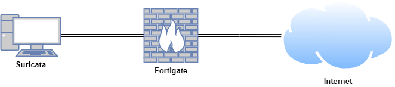
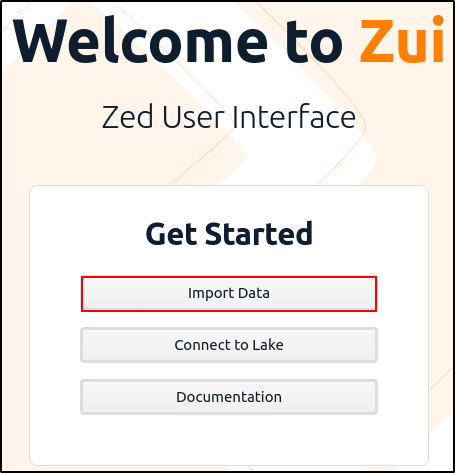

# Zui

Zui is an open-source desktop application designed for efficient data exploration and analysis, particularly in network security. Zui has built-in support for both Zeek and Suricata, allowing users to import PCAP files, automatically run analyses, and explore logs generated by these tools. Additionally, Zui provides visualisation features to help users better understand complex network behaviors and security incidents.

<iframe width="560" height="315" src="https://www.youtube.com/embed/PIAg7b2Jnag?si=-ogFAR4xwcgVGQEk" title="YouTube video player" frameborder="0" allow="accelerometer; autoplay; clipboard-write; encrypted-media; gyroscope; picture-in-picture; web-share" referrerpolicy="strict-origin-when-cross-origin" allowfullscreen></iframe>

## Lab Setup for Proof of Concept

In this proof of concept, Zui and Wireshark were installed on an Ubuntu virtual machine (VM). Malware traffic analysis was conducted using Zui and Wireshark in a safe and controlled environment.

| **Host** | **OS** | **Role** | **IP Address** |
| --- | --- | --- | --- |
| Fortigate | Fortios 7.6.0 | Firewall/Router | 192.168.1.111 (WAN) / 10.0.0.1 (LAN) |
| Suricata | Ubuntu 22.04 LTS | Zui and Wireshark | 10.0.0.27 |



## Install Zui Desktop Application

Download the installer at the [**Zui download**](https://www.brimdata.io/download/) page, as appropriate for your Linux distribution.

Install Zui by running:

```python
sudo dpkg -i zui_1.17.0_amd64.deb
```

Run zui by typing `zui` or clicking zui icon in the applications.

Brimcap is a command line utility for converting pcaps into the flexible, searchable [Zed data formats](https://zed.brimdata.io/docs/formats/). Brimcap is bundles with Zui Desktop Application. By default Brimcap uses both Zeek and Suricata for analysis. 

## Malware Traffic Analysis

Download a sample PCAP file from [https://www.malware-traffic-analysis.net/](https://www.malware-traffic-analysis.net/)

(e.g. [https://www.malware-traffic-analysis.net/2021/06/03/index.html](https://www.malware-traffic-analysis.net/2021/06/03/index.html))

Unzip the archive with the password `infectedYYYYMMDD`

On Zui, click `import data` and select the downloaded PCAP.

Alternatively you can drag and drop the PCAP into Zui. 



Once the PCAP is loaded, click `Query Pool` icon.


As shown below different coloured tiles are present. Different categories of Zeek events are visible in the `_path` field while the Suricata events are visible in the `event_type` field with the values `alerts` 


By clicking on the Toggle Right Side Bar icon and Details, we can view more details on individual logs on the detail pane. Zeek generates a valued called unique identifier `uid` . `uid` is shared between the underlying connection record `conn.log` and the records that summarise the application layer transactions that occurred over that connection. By automatically joining the data by this `uid` field, Zui presents a correlation view that shows all the events with a single connection.


The tiles can be clicked to jump directly to the related records in the details pane. 

The Zeek connection record also contains a community ID value that is joined with the community ID value of any Suricata alerts that were generated from the same connection. That is why the associated alerts are shown in the correlation view.


Zeek file records include hashes that were calculated based on the observed file payloads. When a file record is clicked, the detail pane includes tables that use these hashes to summarise whether this same file payload has appeared in the captured data, potentially under different names or transmitted from multiple hosts. 


Filter on `filename!=null` to view file records


The hash value can be lookup in the VirusTotal and it confirms that this is a malicious DLL.


Another handy feature in Zui is extracting individual flows. At the same time our pcap was being analysed by Zeek and Suricata, an index of its contents was also being generated. Whenever we click on a particular Zeek record, Zui uses the same correlation logic we saw earlier in the detail panel to determine the timestamp and duration of the underlying flow. When we click on the Download Packets button, packet index is used to extract just that flow from the original pcap file. This can be a great timesaver instead of opening a large pcap file on Wireshark. 


Right-click on one of the alerts and click `Filter == value` to focus on the alerts. By default, the Suricata software that ships with Zui applies the [**Emerging Threats Open**](https://community.emergingthreats.net/) rule set when generating alert events from imported pcap data. This rule set is updated each time Zui is launched and connected to the Internet.


If you scroll across, you can see the alert for `BazaLoader CnC` and `Bazr Backdoor` have been triggered.


Click on each alert to examine more details. You will be able to find `community id` which you can use to correlate with Zeek and Suricata logs.


Filter on the `community id` by right-clicking it and selecting `Filter == value`

Delete `event type` on the search bar to focus on `community id`


## References

- https://youtu.be/eMzljqxASVA?si=ph2fV-LK7amul5SH
- https://youtu.be/bba9l4Ianbs?si=VzSKPUHI23ohdmdZ